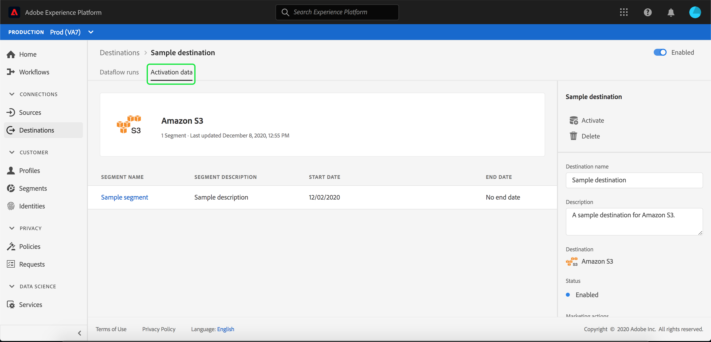

# Détails de la destination de la vue

## Présentation {#overview}

Dans l’interface utilisateur de Adobe Experience Platform, vous pouvez vue et surveiller les attributs et les activités de vos destinations. Ces détails comprennent le nom et l’ID de la destination, les contrôles permettant d’activer ou de désactiver les destinations, etc. Les détails des destinations par lot incluent également des mesures pour les enregistrements de profil activés et un historique des exécutions de flux de données.

>[!NOTE]
>
>La page Détails des destinations fait partie de l&#39;espace de travail [!UICONTROL Destinations] dans [!DNL Platform] [!DNL UI]. Pour plus d&#39;informations, consultez la présentation de l&#39;espace de travail [[!UICONTROL Destinations]](./destinations-workspace.md).

## Détails de la destination de la vue {#view-details}

Suivez les étapes ci-dessous pour vue plus de détails sur une destination existante.

1. Connectez-vous à l&#39;[interface utilisateur Experience Platform](https://platform.adobe.com/) et sélectionnez **[!UICONTROL Destinations]** dans la barre de navigation de gauche. Sélectionnez **[!UICONTROL Parcourir]** dans l’en-tête supérieur pour vue de vos destinations existantes.

   

1. Sélectionnez l’icône de filtre  en haut à gauche pour lancer le panneau de tri. Le panneau de tri fournit une liste de toutes vos destinations. Vous pouvez sélectionner plusieurs destinations dans la liste pour afficher une sélection filtrée de flux de données associés à la destination sélectionnée.

   

1. Sélectionnez le nom de la destination à vue.

   

1. La page de détails de la destination s’affiche, avec les commandes disponibles. Si vous visualisez les détails d’une destination par lot, un tableau de bord de contrôle s’affiche également.

   

## Rail droit

Le rail droit affiche les informations de base sur la destination sélectionnée.

Le tableau suivant couvre les contrôles et les détails fournis par le rail droit :

| Élément de rail droit | Description |
| --- | --- |
| [!UICONTROL Activer] | Sélectionnez ce contrôle pour modifier les segments mappés à la destination. Pour plus d&#39;informations, consultez le guide sur l&#39;[activation de segments vers une destination](./activate-destinations.md). |
| [!UICONTROL Supprimer] | Vous permet de supprimer ce flux de données et de démapper les segments précédemment activés, le cas échéant. |
| [!UICONTROL Nom de destination] | Ce champ peut être modifié afin de mettre à jour le nom de la destination. |
| [!UICONTROL Description] | Ce champ peut être modifié pour mettre à jour ou ajouter une description facultative à la destination. |
| [!UICONTROL Destination] | Représente la plateforme de destination vers laquelle les audiences sont envoyées. Pour plus d&#39;informations, consultez le [catalogue de destinations](../catalog/overview.md). |
| [!UICONTROL État] | Indique si la destination est activée ou désactivée. |
| [!UICONTROL Actions marketing] | Indique les actions marketing (cas d’utilisation) qui s’appliquent à cette destination à des fins de gouvernance des données. |
| [!UICONTROL Catégorie] | Indique le type de destination. Pour plus d&#39;informations, consultez le [catalogue de destinations](../catalog/overview.md). |
| [!UICONTROL Type de connexion] | Indique le formulaire sous lequel vos audiences sont envoyées à la destination. Les valeurs possibles sont [!UICONTROL Cookie] et [!UICONTROL basés sur le Profil]. |
| [!UICONTROL Fréquence] | Indique la fréquence d’envoi des audiences vers la destination. Les valeurs possibles sont [!UICONTROL Streaming] et [!UICONTROL Batch]. |
| [!UICONTROL Identité] | Représente l’espace de nommage d’identité accepté par la destination, par exemple `GAID`, `IDFA` ou `email`. Pour plus d&#39;informations sur les espaces de nommage d&#39;identité acceptés, consultez la [présentation de l&#39;espace de nommage d&#39;identité](../../identity-service/namespaces.md). |
| [!UICONTROL Créé par] | Indique l’utilisateur qui a créé cette destination. |
| [!UICONTROL Créé] | Indique la date UTC au moment de la création de cette destination. |

{style=&quot;table-layout:auto&quot;}

## [!UICONTROL Activé]/ Désactivé

Vous pouvez utiliser la bascule **[!UICONTROL Activé]/[!UICONTROL Désactivé]** pour début et suspendre toutes les exportations de données vers la destination.

## [!UICONTROL Exécutions de flux de données]

L&#39;onglet [!UICONTROL Flux de données] fournit des données de mesure sur vos flux de données s&#39;exécutant vers des destinations de lot. Consultez [Surveiller les flux de données](monitor-dataflows.md) pour plus de détails.

## [!UICONTROL Données d’Activation] {#activation-data}

L&#39;onglet [!UICONTROL Données d&#39;Activation] affiche une liste de segments qui ont été mappés à la destination, y compris leur date de début et leur date de fin (le cas échéant). Pour vue les détails d’un segment particulier, sélectionnez son nom dans la liste.

>[!NOTE]
>
>Pour plus d&#39;informations sur l&#39;exploration de la page de détails d&#39;un segment, consultez la [Présentation de l&#39;interface utilisateur de segmentation](../../segmentation/ui/overview.md#segment-details).
