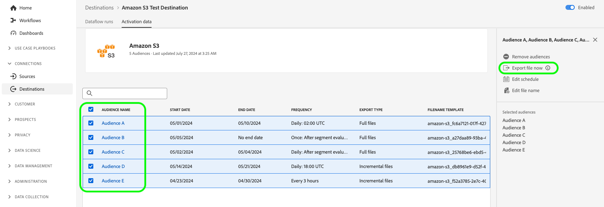

# Afficher les détails de la destination

## Vue d’ensemble {#overview}

Dans l’interface utilisateur de Adobe Experience Platform, vous pouvez afficher et surveiller les attributs et les activités de vos destinations. Ces détails incluent le nom et l’identifiant de la destination, des commandes pour activer ou désactiver les destinations, etc. Les détails incluent également des mesures pour les enregistrements de profil activés, les identités activées, en échec et exclues, ainsi qu’un historique des exécutions de flux de données.

>[!NOTE]
>
>La page des détails des destinations fait partie de l’espace de travail [!UICONTROL Destinations] dans [!DNL Platform] [!DNL UI]. Pour plus d’informations, consultez la [[!UICONTROL présentation de l’espace de travail des destinations].](./destinations-workspace.md)

## Afficher les détails de la destination {#view-details}

Suivez les étapes ci-dessous pour afficher plus de détails sur une destination existante. Vous pouvez trouver l’identifiant de destination d’une destination, l’utilisateur qui a créé la destination, la date de création et d’autres informations.

1. Connectez-vous à l’[interface utilisateur Experience Platform](https://platform.adobe.com/) et sélectionnez **[!UICONTROL Destinations]** dans la barre de navigation de gauche. Sélectionnez **[!UICONTROL Parcourir]** dans l’en-tête supérieur pour afficher vos destinations existantes.

   

2. Sélectionnez l’icône filtre  en haut à gauche pour lancer le panneau de tri. Le panneau de tri fournit une liste de toutes vos destinations. Vous pouvez sélectionner plusieurs destinations dans la liste pour afficher une sélection filtrée de flux de données associés à la destination sélectionnée.

   

3. Sélectionnez la ligne de la destination pour laquelle vous souhaitez afficher plus d’informations. Un rail de droite s’affiche avec des informations sur la destination, y compris l’ID de destination, l’utilisateur qui a créé la connexion de destination et d’autres informations.

   

4. Vous pouvez également afficher d’autres informations sur la destination en sélectionnant *le nom de la destination* que vous souhaitez afficher.

   

5. La page de détails de la destination apparaît dans le rail de droite, affichant ses commandes disponibles.

   

## Rail de droite {#right-rail}

Le rail de droite affiche les informations de base sur la destination sélectionnée.

Le tableau suivant couvre les contrôles et les détails fournis par le rail de droite :

| Élément de rail de droite | Description |
| --- | --- |
| [!UICONTROL Activer les audiences] | Sélectionnez ce contrôle pour modifier les audiences qui sont mappées à la destination, mettre à jour les plannings d’exportation ou ajouter et supprimer des attributs et des identités mappés. Pour plus d’informations, consultez les guides sur l’ [ activation des données d’audience vers des destinations de diffusion en continu d’audience ](./activate-segment-streaming-destinations.md), l’ [ activation des données d’audience vers des destinations basées sur un profil de lot ](./activate-batch-profile-destinations.md) et l’ [ activation des données d’audience vers des destinations basées sur un profil de diffusion en continu ](./activate-streaming-profile-destinations.md). |
| [!UICONTROL Supprimer] | Permet de supprimer ce flux de données et annule la correspondance des audiences qui ont été activées auparavant, le cas échéant. |
| [!UICONTROL Nom de la destination] | Ce champ peut être modifié afin de mettre à jour le nom de la destination. |
| [!UICONTROL Description] | Ce champ peut être modifié pour mettre à jour ou ajouter une description facultative à la destination. |
| [!UICONTROL Destination] | Représente la plateforme de destination vers laquelle les audiences sont envoyées. Pour plus d’informations, consultez le [catalogue des destinations](../catalog/overview.md) . |
| [!UICONTROL Statut] | Indique si la destination est activée ou désactivée. |
| [!UICONTROL Actions marketing] | Indique les actions marketing (cas d’utilisation) qui s’appliquent à cette destination à des fins de gouvernance des données. |
| [!UICONTROL Catégorie] | Indique le type de destination. Pour plus d’informations, consultez le [catalogue des destinations](../catalog/overview.md) . |
| [!UICONTROL Type de connexion] | Indique le formulaire par lequel vos audiences sont envoyées vers la destination. Les valeurs possibles sont [!UICONTROL Cookie] et [!UICONTROL Basé sur un profil]. |
| [!UICONTROL Fréquence] | Indique la fréquence d’envoi des audiences vers la destination. Les valeurs possibles sont [!UICONTROL Streaming] et [!UICONTROL Batch]. |
| [!UICONTROL Identité] | Représente l’espace de noms d’identité accepté par la destination, par exemple `GAID`, `IDFA` ou `email`. Pour plus d’informations sur les espaces de noms d’identité acceptés, consultez la [présentation des espaces de noms d’identité](../../identity-service/features/namespaces.md). |
| [!UICONTROL Créé par] | Indique l’utilisateur qui a créé cette destination. |
| [!UICONTROL Créé] | Indique la date et l’heure (UTC) de création de cette destination. |

{style="table-layout:auto"}

## Bascule [!UICONTROL activé]/[!UICONTROL désactivé] {#enabled-disabled-toggle}

Vous pouvez utiliser la bascule **[!UICONTROL Activé]/[!UICONTROL Désactivé]** pour démarrer et suspendre toutes les exportations de données vers la destination.

## [!UICONTROL  Exécutions de flux de données ] {#dataflow-runs}

L’onglet [!UICONTROL  Exécutions de flux de données] fournit des données de mesure sur vos exécutions de flux de données vers des destinations par lot et par flux. Pour plus d’informations et de définitions de mesures, reportez-vous à la section [Flux de données de surveillance](monitor-dataflows.md) .

>[!NOTE]
>
>* La fonctionnalité de surveillance des destinations est actuellement prise en charge pour toutes les destinations dans les destinations Experience Platform *à l’exception* des destinations [Adobe Target](/help/destinations/catalog/personalization/adobe-target-connection.md), [Personnalisation personnalisée](/help/destinations/catalog/personalization/custom-personalization.md) et [Audiences Experience Cloud](/help/destinations/catalog/adobe/experience-cloud-audiences.md).
>* Pour les destinations [Amazon Kinesis](/help/destinations/catalog/cloud-storage/amazon-kinesis.md), [Azure Event Hubs](/help/destinations/catalog/cloud-storage/azure-event-hubs.md) et [API HTTP](/help/destinations/catalog/streaming/http-destination.md), les mesures liées aux identités exclues, en échec et activées sont estimées. Des volumes plus importants de données d’activation augmentent la précision des mesures.

### Durée des exécutions du flux de données {#dataflow-runs-duration}

Il existe une différence dans la durée affichée des exécutions de flux de données entre les destinations en flux continu et celles basées sur des fichiers.

### Destinations de diffusion en continu {#streaming}

Bien que la **[!UICONTROL durée de traitement]** indiquée pour la plupart des exécutions de flux de données en continu soit d’environ quatre heures, comme illustré dans l’image ci-dessous, le temps de traitement réel pour toute exécution de flux de données est beaucoup plus court. Les fenêtres d’exécution du flux de données restent ouvertes pendant plus longtemps si l’Experience Platform doit réessayer d’effectuer des appels vers la destination et s’assurer qu’il ne manque pas de données arrivées tardivement pendant la même période.

Pour plus d’informations, consultez la documentation de surveillance sur les [exécutions de flux de données vers les destinations de diffusion en continu](/help/dataflows/ui/monitor-destinations.md#dataflow-runs-for-streaming-destinations).

### Destinations basées sur des fichiers {#file-based}

Pour les exécutions de flux de données vers des destinations basées sur des fichiers, la **[!UICONTROL durée de traitement]** dépend de la taille des données exportées et de la charge du système. Notez également que le flux de données s’exécute vers des destinations basées sur des fichiers sont ventilés par audience.

Pour plus d’informations, reportez-vous à la section [Exécution de flux de données vers les destinations par lot (basées sur des fichiers)](/help/dataflows/ui/monitor-destinations.md#dataflow-runs-for-batch-destinations) de la documentation de surveillance.

## [!UICONTROL Données d’activation] {#activation-data}

L’onglet **[!UICONTROL Données d’activation]** affiche une liste des audiences qui ont été mappées à la destination, y compris leur date de début et de fin (le cas échéant), ainsi que d’autres informations pertinentes pour l’exportation des données, telles que le type d’exportation, la planification et la fréquence. Pour afficher les détails d’une audience spécifique, sélectionnez son nom dans la liste.

>[!TIP]
>
>Pour afficher et modifier des détails sur les attributs et les identités mappés à une destination, sélectionnez **[!UICONTROL Activer les audiences]** dans le [rail droit](#right-rail).

>[!BEGINSHADEBOX]

Onglet **[!UICONTROL Données d’activation]** pour une destination basée sur des fichiers.

>[!ENDSHADEBOX]

>[!BEGINSHADEBOX]

Onglet **[!UICONTROL Données d’activation]** pour une destination de diffusion en continu.

>[!ENDSHADEBOX]

### Filtrage des audiences activées {#filter-audiences}

Pour filtrer dans la liste des audiences activées vers une destination, saisissez un nom d’audience dans la zone de recherche. La liste des audiences se met automatiquement à jour avec les résultats de la recherche.

### Suppression de plusieurs audiences des flux d’activation {#bulk-remove}

Pour supprimer plusieurs audiences des flux d’activation existants, sélectionnez les audiences, puis sélectionnez **[!UICONTROL Supprimer les audiences]**.

### Exportation de plusieurs fichiers à la demande vers des destinations par lot {#bulk-export}

Vous pouvez [ exporter plusieurs fichiers à la demande ](../ui/export-file-now.md) à partir de la page **[!UICONTROL Données d’activation]**. Pour ce faire, sélectionnez les audiences pour lesquelles vous souhaitez exporter des fichiers à la demande et sélectionnez le contrôle **[!UICONTROL Exporter le fichier maintenant]** afin de déclencher une exportation ponctuelle qui diffusera un fichier pour chaque audience sélectionnée vers votre destination de lot.

### Modification des plannings d’activation pour plusieurs audiences exportées vers des destinations par lots {#bulk-edit-schedule}

Pour modifier le planning d’activation existant de plusieurs audiences en même temps, sélectionnez les audiences de votre choix, puis sélectionnez **[!UICONTROL Modifier le planning]**. Pour plus d&#39;informations sur la définition ou la modification d&#39;un planning d&#39;export, consultez la section [planifier l&#39;export d&#39;audience](../ui/activate-batch-profile-destinations.md#scheduling) .

>[!NOTE]
>
>Pour plus d’informations sur l’exploration de la page de détails d’une audience, reportez-vous à la [présentation d’Audience Portal](../../segmentation/ui/audience-portal.md#segment-details).

### Modification des noms de fichier pour plusieurs audiences exportées vers des destinations par lot {#bulk-edit-file-names}

Pour modifier les noms de fichiers exportés de plusieurs audiences en même temps, sélectionnez les audiences souhaitées, puis sélectionnez **[!UICONTROL Modifier le nom du fichier]**. Pour plus d&#39;informations sur la définition ou la modification d&#39;un nom de fichier, consultez la section sur la façon de [configurer les noms de fichier](../ui/activate-batch-profile-destinations.md#configure-file-names) .

