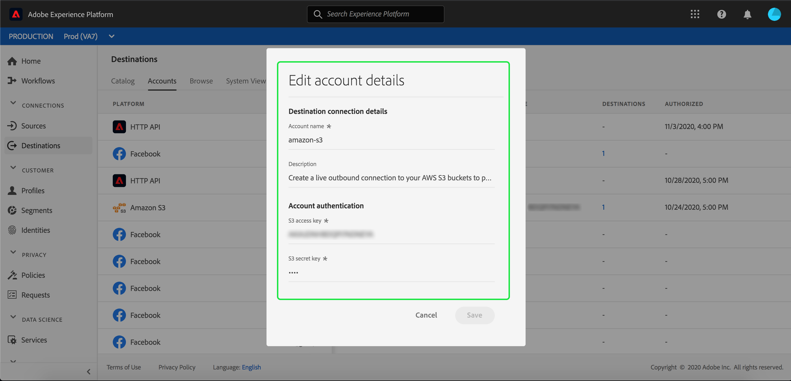

# Présentation de l&#39;espace de travail Destinations {#destinations-workspace}

Dans Adobe Experience Platform, sélectionnez **[!UICONTROL Destinations]** dans la barre de navigation de gauche pour accéder à l&#39;espace de travail [!UICONTROL Destinations].

L’espace de travail [!UICONTROL Destinations] se compose de quatre sections : [!UICONTROL Catalogue], [!UICONTROL Parcourir], [!UICONTROL Comptes] et [!UICONTROL Vue du système], décrites dans les sections ci-dessous.

## [!UICONTROL Catalogue] {#catalog}

L&#39;onglet **[!UICONTROL Catalogue]** affiche une liste de toutes les destinations disponibles dans Plateforme, à laquelle vous pouvez envoyer des données.

L’interface utilisateur de la plate-forme fournit un certain nombre d’options de recherche et de filtrage sur la page de catalogue des destinations :

* Utilisez la fonctionnalité de recherche de la page pour localiser une destination spécifique.
* Filtrez les destinations à l&#39;aide du contrôle [!UICONTROL Catégories].
* Basculez entre [!UICONTROL Toutes les destinations] et [!UICONTROL Mes destinations]. Lorsque **[!UICONTROL Toutes les destinations]** est sélectionné, toutes les destinations de plateforme disponibles s&#39;affichent. Lorsque **[!UICONTROL Mes destinations]** est sélectionné, vous ne pouvez voir que les destinations avec lesquelles vous avez établi une connexion.
* Sélectionnez **[!UICONTROL Connexions]** et/ou **[!UICONTROL Extensions]** pour la vue. Pour comprendre la différence entre les deux catégories, voir [Types et Catégories de destination](../destination-types.md).

Les cartes de destination contiennent soit un contrôle **[!UICONTROL Configurer]**, soit un contrôle **[!UICONTROL Activer]** et un contrôle secondaire qui affiche plus d&#39;options. Ils sont tous décrits ci-dessous :

| Contrôle | Description |
---------|----------
| [!UICONTROL Configuration] | Permet de créer une connexion à la destination. |
| [!UICONTROL Activer] | Une fois que vous avez établi une connexion à la destination, vous pouvez activer des segments. |
| [!UICONTROL Compte vue] | Vue des comptes que vous avez connectés pour une destination. |
| [!UICONTROL Flux de données de vue] | Vue des flux d’activation de données qui existent pour une destination. |
| [!UICONTROL Documentation sur la vue] | Ouvre un lien vers la page de documentation de cette destination spécifique, pour plus d’informations et pour vous aider à la configurer. |

Sélectionnez une carte de destination dans le catalogue pour ouvrir le rail de droite.  Vous pouvez voir ici une description de la destination. Le rail droit fournit les mêmes commandes que celles décrites dans le tableau ci-dessus, ainsi qu&#39;une description de la destination et une indication de la catégorie et du type de destination.

Pour plus d&#39;informations sur les catégories de destination et les informations sur chaque destination, consultez les [Catalogue de destination](../catalog/overview.md) et [Types et Catégories de destination](../destination-types.md).

## [!UICONTROL Comptes] {#accounts}

Dans l’onglet **[!UICONTROL Comptes]**, vous pouvez en savoir plus sur les connexions que vous avez établies avec différentes destinations. Consultez le tableau ci-dessous pour obtenir toutes les informations disponibles sur chaque destination :

>[!TIP]
>
>Utilisez le bouton  de la colonne **[!UICONTROL Plateforme]** pour créer une nouvelle connexion de destination pour ce compte.

| Élément | Description |
---------|----------
| [!UICONTROL Plateforme] | La destination pour laquelle vous avez configuré la connexion. |
| [!UICONTROL Type de connexion] | Représente le type de connexion à votre compartiment de stockage ou à votre destination. <ul><li>Pour les destinations de marketing par e-mail : peut être S3 ou FTP.</li><li>Pour les destinations publicitaires en temps réel : serveur à serveur</li><li>Pour les destinations de stockage dans le cloud Amazon S3 : clé d’accès </li><li>Pour les destinations de stockage dans le cloud SFTP : authentification de base pour SFTP</li></ul> |
| [!UICONTROL Nom d’utilisateur] | Le nom d’utilisateur que vous avez sélectionné dans l’[assistant de connexion à la destination](../catalog/email-marketing/overview.md#connect-destination). |
| [!UICONTROL Destinations] | Représente le nombre de flux de destination réussis uniques et connectés avec des informations de base créées pour une destination. |
| [!UICONTROL Autorisé] | La date à laquelle la connexion à cette destination a été autorisée. |

De plus, vous pouvez modifier ou mettre à jour les informations de votre compte. Sélectionnez le bouton  dans la colonne **[!UICONTROL Plateforme]** pour modifier les informations du compte.

Pour les comptes qui utilisent un type de connexion `OAuth2`, vous pouvez sélectionner **[!UICONTROL Reconnecter OAuth]** pour renouveler les informations d&#39;identification de votre compte.

Pour les comptes qui utilisent un type de connexion `Access Key` ou `ConnectionString`, vous pouvez modifier les informations d&#39;authentification de votre compte, y compris les informations telles que l&#39;ID d&#39;accès, les clés secrètes ou les chaînes de connexion.

Une fois que vous avez terminé de modifier les détails de votre compte, sélectionnez **[!UICONTROL Enregistrer]** pour terminer la mise à jour.

## [!UICONTROL Parcourir] {#browse}

L’onglet **[!UICONTROL Parcourir]** affiche les destinations avec lesquelles vous avez établi une connexion. Les destinations avec la bascule **[!UICONTROL Activé]** activée permettent de définir la destination sur principal et vice versa. Vous pouvez également vue les destinations vers lesquelles vos données circulent en sélectionnant **[!UICONTROL Segments]** > **[!UICONTROL Parcourir]** et en sélectionnant un segment à inspecter. Consultez le tableau ci-dessous pour toutes les informations fournies pour chaque destination dans l’onglet Parcourir :

>[!TIP]
>
>Utilisez le bouton  de la colonne **[!UICONTROL Nom]** pour activer des segments supplémentaires vers cette destination.

| Élément | Description |
---------|----------
| Nom | Le nom que vous avez fourni pour votre flux d’activation vers cette destination. |
| [!UICONTROL Destination] | La plateforme de destination que vous avez sélectionnée pour votre flux d’activation. |
| [!UICONTROL Type de connexion] | Représente le type de connexion à votre compartiment de stockage ou à votre destination. <ul><li>Pour les destinations de marketing par e-mail : peut être S3 ou FTP.</li><li>Pour les destinations publicitaires en temps réel : serveur à serveur</li></ul> |
| [!UICONTROL Nom d’utilisateur] | Les informations d’identification de compte que vous avez sélectionnées pour le flux de destination. |
| [!UICONTROL Données d’Activation] | Indique le nombre de segments activés pour cette destination. Sélectionnez ce contrôle pour en savoir plus sur les segments activés. Pour plus d’informations sur les segments activés, voir [Données d’Activation](/help/destinations/ui/destination-details-page.md#activation-data) dans la page des détails de destination. |
| [!UICONTROL Créé] | La date et l’heure (UTC) de création du flux d’activation vers la destination. |
| [!UICONTROL État] | `Active` ou `Inactive`. Indique si les données sont actuellement activées vers cette destination. Pour modifier le statut, consultez [Désactiver l’activation](./activate-destinations.md#disable-activation). |

Cliquez sur une ligne de destination pour afficher plus d’informations sur la destination dans le rail de droite.

Sélectionnez le nom de la destination pour afficher des informations sur les segments activés vers cette destination. Cliquez sur **[!UICONTROL Modifier l’activation]** pour modifier ou ajouter les segments envoyés vers cette destination.

## [!UICONTROL Vue du système] {#system-view}

L&#39;onglet **[!UICONTROL Vue système]** affiche une représentation graphique des flux d&#39;activation que vous avez configurés dans le Adobe Experience Platform.

Sélectionnez l’une des destinations affichées sur la page et appuyez sur **[!UICONTROL Afficher les flux]** pour afficher les informations sur toutes les connexions que vous avez configurées pour chaque destination.

