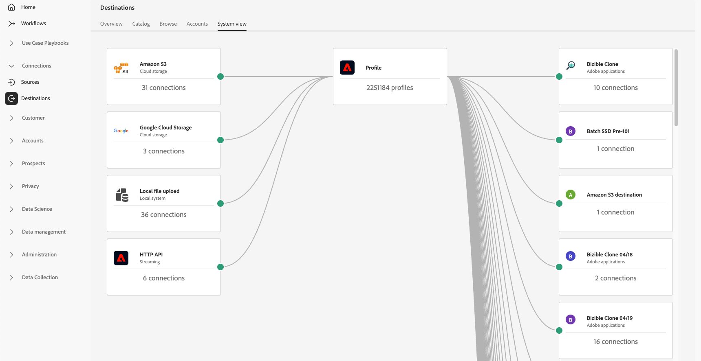

# Espace de travail des destinations {#destinations-workspace}

Dans Adobe Experience Platform, sélectionnez **[!UICONTROL Destinations]** dans la barre de navigation de gauche pour accéder à l’espace de travail [!UICONTROL Destinations].

L’espace de travail [!UICONTROL Destinations] se compose de cinq sections, [!UICONTROL Overview], [!UICONTROL Catalog], [!UICONTROL Browse], [!UICONTROL Accounts] et [!UICONTROL System View], décrites dans les sections ci-dessous.

## [!UICONTROL Overview] {#overview}

L’onglet **[!UICONTROL Overview]** affiche le tableau de bord [!UICONTROL Destinations], fournissant des mesures clés liées aux données de destination de votre organisation. Pour en savoir plus, consultez le guide du tableau de bord de l’[[!UICONTROL Destinations]](../../dashboards/guides/destinations.md).

>[!NOTE]
>
>Si votre organisation débute dans l’utilisation d’Experience Platform et n’a pas encore de destinations actives, le tableau de bord [!UICONTROL Destinations] et l’onglet [!UICONTROL Overview] ne sont pas visibles. À la place, sélectionnez [!UICONTROL Destinations] dans le volet de navigation de gauche pour afficher l’onglet [[!UICONTROL Catalog] ](#catalog).

## [!UICONTROL Catalog] {#catalog}

L’onglet **[!UICONTROL Catalog]** affiche une liste de toutes les destinations disponibles dans [!DNL Experience Platform], auxquelles vous pouvez envoyer des données.

L’interface utilisateur de [!DNL Experience Platform] offre plusieurs options de recherche et de filtrage sur la page du catalogue des destinations :

* Utilisez la fonctionnalité de recherche de la page pour localiser une destination spécifique.
* Filtrez les destinations à l’aide de la commande **[!UICONTROL Categories]**.
* Basculez entre **[!UICONTROL All destinations]** et **[!UICONTROL My destinations]**. Lorsque vous sélectionnez **[!UICONTROL All destinations]**, toutes les destinations de [!DNL Experience Platform] disponibles s’affichent. Lorsque vous sélectionnez **[!UICONTROL My destinations]**, vous pouvez uniquement afficher les destinations avec lesquelles vous avez établi une connexion.
* Sélectionnez pour afficher les types de **[!UICONTROL Connections]** et/ou de **[!UICONTROL Extensions]**. Pour comprendre la différence entre ces deux catégories, lisez [Types et catégories de destinations](../destination-types.md).
* Filtrez les destinations disponibles en fonction de leur [type de données](/help/destinations/destination-sdk/functionality/destination-configuration/audience-data-type.md) pris en charge. Choisissez entre les audiences de personnes, les audiences de compte, les audiences de prospects ou les exportations de jeux de données.

Les cartes de destination contiennent des options de commande principales et secondaires. Les commandes principales comprennent [!UICONTROL Set up], [!UICONTROL Activate], [!UICONTROL Activate audiences] ou [!UICONTROL Export datasets]. Les commandes secondaires permettent d’afficher des options. Ces commandes sont décrites ci-dessous :

| Commande | Description |
|---------|----------|
| [!UICONTROL Set up] | Permet de créer une connexion à la destination. |
| [!UICONTROL Activate] | Une fois que vous avez établi une connexion à la destination, vous pouvez activer des audiences ou exporter des jeux de données vers cette destination. |
| [!UICONTROL Activate audiences] | Une fois que vous avez établi une connexion avec la destination, vous pouvez activer les audiences vers cette destination. |
| [!UICONTROL Export datasets] | Une fois que vous avez établi une connexion à la destination, vous pouvez exporter des jeux de données vers cette destination. |
| [!UICONTROL View account] | Affichez les comptes que vous avez connectés pour une destination. |
| [!UICONTROL View dataflows] | Affichez les flux d’activation de données qui existent pour une destination. |
| [!UICONTROL View documentation] | Ouvre un lien vers la page de documentation de cette destination spécifique, pour plus d’informations et pour vous aider à la configurer. |

{style="table-layout:auto"}

Sélectionnez une carte de destination dans le catalogue pour ouvrir le rail de droite. Vous pouvez voir ici une description de la destination. Le rail de droite fournit les mêmes commandes que ceux décrits dans le tableau ci-dessus, y compris une description de la destination, ainsi qu’une indication de la catégorie et du type de destination.

Pour plus d’informations sur les catégories de destination et les informations sur chaque destination, consultez le [Catalogue des destinations](../catalog/overview.md) et les [Types et catégories de destination](../destination-types.md).

## [!UICONTROL Browse] {#browse}

>[!NOTE]
>
>En raison des configurations des libellés d’accès, les flux de données de destination auxquels un utilisateur n’a pas accès peuvent apparaître dans l’interface utilisateur en grisé. Pour plus d’informations, consultez la documentation sur l’[utilisation de libellés d’accès pour gérer l’accès des utilisateurs aux flux de données de destination](../../access-control/abac/apply-access-labels-destinations.md#important-callouts-and-items-to-know).

L’onglet **[!UICONTROL Browse]** affiche les destinations avec lesquelles vous avez établi une connexion.

>[!TIP]
>
> Commencez par la [barre de recherche](#search-browse) pour trouver des flux de données spécifiques, puis utilisez les [filtres de la barre latérale](#filter-options-browse) pour affiner davantage vos résultats.

Les destinations dont le bouton (bascule) **[!UICONTROL Enabled/Disabled]** est activé définissent la destination sur **[!UICONTROL Enabled]** ou **[!UICONTROL Disabled]**, respectivement. Vous pouvez également afficher les destinations où les données circulent en sélectionnant **[!UICONTROL Audiences]** > **[!UICONTROL Browse]** et en sélectionnant une audience à inspecter.

>[!TIP]
>
> 
> 
> * Sélectionnez les points de suspension (`...`) dans la colonne [!UICONTROL Name] et utilisez la commande  Activer les audiences **[!UICONTROL Activate audiences]** pour exporter des audiences ou des jeux de données vers cette destination.
> * Sélectionnez les points de suspension (`...`) dans la colonne [!UICONTROL Name] et utilisez la commande **[!UICONTROL Edit destination]**pour modifier les connexions de destination existantes. Pour plus d’informations, consultez le tutoriel sur la [modification des destinations](/help/destinations/ui/edit-destination.md).
> * Sélectionnez les points de suspension (`...`) dans la colonne [!UICONTROL Name] et utilisez la commande Modifier les actions marketing **[!UICONTROL Edit marketing actions]** pour [modifier les actions marketing](/help/destinations/ui/edit-activation.md#edit-marketing-actions) pour la destination sélectionnée.
> * Sélectionnez les points de suspension (`...`) dans la colonne [!UICONTROL Name] et utilisez la commande de Supprimer **[!UICONTROL Delete]** pour [supprimer](delete-destinations.md) une connexion existante à une destination.
> * Sélectionnez les points de suspension (`...`) dans la colonne [!UICONTROL Name] et utilisez la commande de Affichage dans la surveillance **[!UICONTROL View in monitoring]** pour afficher les informations d’activation de cette destination dans le [tableau de bord de surveillance](/help/dataflows/ui/monitor-destinations.md#monitoring-destinations-dashboard).
> * Sélectionnez les points de suspension (`...`) dans la colonne [!UICONTROL Name] et utilisez la commande de S’abonner aux alertes **[!UICONTROL Subscribe to alerts]** pour vous abonner aux alertes de flux de données de destination. Vous pouvez vous abonner à des alertes pour recevoir des messages concernant l’état, la réussite ou l’échec de votre exécution de flux. Consultez [S’abonner aux alertes de destination contextuelles](alerts.md) pour des informations détaillées sur les alertes de flux de données de destination.
> * Sélectionnez les points de suspension (`...`) dans la colonne [!UICONTROL Name] et utilisez la commande de Gérer les balises **[!UICONTROL Manage tags]** pour ajouter ou supprimer des balises d’une destination. Consultez la section [ Gérer les balises de destination ](#manage-tags) pour plus d’informations sur l’utilisation des balises.

Consultez le tableau ci-dessous pour toutes les informations fournies pour chaque destination dans l’onglet [!UICONTROL Browse] .

| Élément | Description |
|---------|----------|
| Nom | Le nom que vous avez fourni pour votre flux d’activation vers cette destination. |
| Type de données | Type de données pris en charge par la connexion de destination. Types de données pris en charge : <ul><li>**[!UICONTROL Customers]**</li><li>**[!UICONTROL Prospects]**</li><li>**[!UICONTROL Accounts]**</li><li>**[!UICONTROL Datasets]**</li></ul> |
| [!UICONTROL Last Dataflow Run Status] | Statut de la dernière exécution du flux de données. Consultez [Afficher les détails de la destination](destination-details-page.md) pour plus d’informations sur les exécutions de flux de données. |
| [!UICONTROL Last Dataflow Run Date] | Date et heure de la dernière exécution du flux de données. Sélectionnez l’en-tête de colonne pour accéder aux options de tri (**[!UICONTROL Sort Ascending]**, **[!UICONTROL Sort Descending]**). Consultez [Afficher les détails de la destination](destination-details-page.md) pour plus d’informations sur les exécutions de flux de données. |
| [!UICONTROL Destination] | La plateforme de destination que vous avez sélectionnée pour votre flux d’activation. |
| [!UICONTROL Account Expiration Date] | Date d’expiration de l’autorisation de connexion à cette destination.   Une icône d’avertissement  s’affiche avant la date d’expiration pour vous avertir que la connexion va expirer et peut nécessiter un renouvellement. Les flux de données vers les connexions expirées sont arrêtés et vous devez vous réauthentifier pour reprendre vos workflows d’activation.  **Important** : cette colonne est actuellement disponible uniquement pour les connexions [Pinterest](../catalog/advertising/pinterest.md), [LinkedIn](../catalog/social/linkedin.md) et [LinkedIn Matched Audiences](../catalog/social/linkedin-b2b.md).   {width="100" zoomable="yes" alt="Screenshot showing the account expiration warning icon and expiration date in the Browse tab."} |
| [!UICONTROL Username] | Les informations d’identification de compte que vous avez sélectionnées pour le flux de destination. |
| [!UICONTROL Activation Data] | Indique le nombre d’audiences activées vers cette destination. Sélectionnez cette commande pour en savoir plus sur les audiences activées. Pour plus d’informations sur les audiences activées[ reportez-vous à la section ](/help/destinations/ui/destination-details-page.md#activation-data)Données d’activation de la page de détails de la destination. |
| [!UICONTROL Created] | Date et heure de création du flux d’activation vers la destination. Sélectionnez les flèches haut/bas pour trier les flux d’activation en fonction du plus récent ou du plus ancien. |
| [!UICONTROL Modified] | Date et heure de la dernière modification du flux d’activation vers la destination. |
| [!UICONTROL Status] | `Enabled` ou `Disabled`. Indique si les données sont activées vers cette destination. |
| [!UICONTROL Access labels] | Affiche les libellés d’accès qui ont été ajoutés à ce flux de données de destination. En savoir plus sur [l’application de libellés d’accès aux flux de données de destination](/help/access-control/abac/apply-access-labels-destinations.md). |
| [!UICONTROL Tags] | Affiche toutes les balises qui ont été ajoutées à ce flux de données de destination. Utilisez des balises pour organiser et classer vos flux de données pour une gestion plus facile. |

Cliquez sur une ligne de destination pour afficher plus d’informations sur la destination dans le rail de droite, telles que l’identifiant de destination, la description, le nombre d’audiences activées, etc.

Sélectionnez le nom de la destination pour afficher des informations sur les audiences activées vers cette destination. Cliquez sur **[!UICONTROL Edit destination]** pour [modifier les paramètres de destination](/help/destinations/ui/edit-destination.md) ou **[!UICONTROL Activate audiences]** pour ajouter de nouvelles audiences au flux de données.

### Filtrer les flux de données dans l’onglet Parcourir {#filter-browse}

L’onglet **[!UICONTROL Browse]** comprend des fonctionnalités améliorées de filtrage et de recherche pour vous aider à trouver et à gérer rapidement vos flux de données de destination. Utilisez la barre latérale gauche pour appliquer des filtres et la barre de recherche pour rechercher des flux de données spécifiques par nom.

### Fonctionnalité de recherche {#search-browse}

Utilisez la barre de recherche située en haut du tableau pour rechercher rapidement des flux de données par nom. Au fur et à mesure que vous tapez, les résultats sont automatiquement filtrés pour n’afficher que les flux de données correspondants.

### Options de filtre {#filter-options-browse}

Utilisez les filtres de la barre latérale gauche pour affiner votre recherche.

* **[!UICONTROL Destination platform]** : filtrez les flux de données selon des plateformes de destination spécifiques (par exemple, [!DNL Amazon S3], [!DNL Facebook Custom Audience], [!DNL LinkedIn Matched Audience], etc.). Vous pouvez sélectionner plusieurs plateformes simultanément.
* **[!UICONTROL Has any tag]** : filtrez les flux de données associés à des balises spécifiques. Cela vous permet d’organiser et de trouver les flux de données en fonction de votre balisage personnalisé.
* **[!UICONTROL Status]** : filtrez les flux de données selon leur statut opérationnel :
   * **[!UICONTROL Enabled]** : affiche uniquement les flux de données actifs
   * **[!UICONTROL Disabled]** : affiche uniquement les flux de données inactifs
* **[!UICONTROL Account name]** : filtrez les flux de données selon le nom de compte associé. Cela vous permet de trouver tous les flux de données connectés à un compte de destination spécifique.
* **[!UICONTROL Created]** : filtrez les flux de données selon l’utilisateur ou l’utilisatrice qui les a créés. Utilisez ce filtre pour rechercher les flux de données créés par des membres de l’équipe spécifiques.
* **[!UICONTROL Modified by]** : filtrez les flux de données par l’utilisateur qui les a modifiés pour la dernière fois. Utilisez ce filtre pour identifier les modifications récentes effectuées par des utilisateurs spécifiques.
* **[!UICONTROL Creation date]** : filtrez les flux de données selon leur date de création à l’aide d’une période :
   * **[!UICONTROL Start date]** : définir le début de la période
   * **[!UICONTROL End date]** : définir la fin de la période
* **[!UICONTROL Modified date]** : filtrez les flux de données selon leur date de modification à l’aide d’une période :
   * **[!UICONTROL Start date]** : définir le début de la période
   * **[!UICONTROL End date]** : définir la fin de la période

### Filtres actifs {#active-filters-browse}

Lorsque vous appliquez des filtres, ils s’affichent sous la forme de balises sous la barre de recherche.

Vous pouvez :

* Afficher tous les filtres actuellement actifs
* Supprimez des filtres individuels en cliquant sur l’icône `X` de chaque balise de filtre
* Effacez tous les filtres à la fois à l’aide de l’option **[!UICONTROL Clear all]**

### Gérer les balises de destination {#manage-tags}

Les balises vous aident à organiser et à classer vos flux de données de destination pour une gestion plus facile. Vous pouvez ajouter et supprimer des balises de flux de données individuels pour les regrouper en fonction des besoins de votre entreprise.

Pour ajouter une balise à un flux de données, sélectionnez les points de suspension (`...`) dans la colonne **[!UICONTROL Name]** et sélectionnez **[!UICONTROL Manage tags]** dans le menu contextuel.
Saisissez le nom d’une nouvelle balise dans le champ **[!UICONTROL Tags]** et sélectionnez **[!UICONTROL Save]** pour appliquer vos modifications.

Pour supprimer une balise d’un flux de données, sélectionnez les points de suspension (`...`) dans la colonne **[!UICONTROL Name]** et sélectionnez **[!UICONTROL Manage tags]** dans le menu contextuel, puis sélectionnez l’icône `X` sur la balise à supprimer.

### Bonnes pratiques de balisage {#tag-best-practices}

Veillez à ce que vos flux de données de destination restent organisés, faciles à trouver et gérables en suivant les instructions de balisage ci-dessous.

* **Utiliser des noms descriptifs** : créez des balises qui indiquent clairement l’objectif ou la catégorie du flux de données (par exemple, « Campagnes marketing », « Rétention des clients », « Promotions saisonnières »)
* **Soyez cohérent** : utilisez une convention de nommage cohérente dans l’ensemble de votre organisation
* **Restez simple** : évitez de créer trop de balises, car cela peut rendre le filtrage moins efficace
* **Utiliser des balises hiérarchiques** : envisagez d’utiliser des préfixes pour regrouper les balises associées (par exemple, « Campaign-Q4 », « Campaign-Q1 »)

## [!UICONTROL Accounts] {#accounts}

L’onglet **[!UICONTROL Accounts]** vous montre les détails des connexions que vous avez établies avec diverses destinations, et vous permet de mettre à jour ou de supprimer les détails des comptes existants. Consultez le tableau ci-dessous pour obtenir toutes les informations disponibles sur chaque compte de destination.

>[!TIP]
>
> * Sélectionnez les points de suspension (`...`) dans la colonne [!UICONTROL Platform] et utilisez la commande **[!UICONTROL Activate]**/**[!UICONTROL Activate audiences]**/**[!UICONTROL Export datasets]**pour exporter des audiences ou des jeux de données vers cette destination.
> * Sélectionnez les points de suspension (`...`) dans la colonne [!UICONTROL Platform] et utilisez la commande **[!UICONTROL Edit details]**pour [mettre à jour](update-accounts.md) les détails d’un compte de destination existant.
> * Sélectionnez les points de suspension (`...`) dans la colonne [!UICONTROL Platform] et utilisez la commande **[!UICONTROL Delete]**pour [supprimer](delete-destination-account.md) un compte de destination existant.

| Élément | Description |
|---|---|
| [!UICONTROL Name] | Nom attribué au compte de destination lors de la [ configuration ](connect-destination.md#authenticate) la destination. Sélectionnez l’en-tête de colonne pour accéder aux options de tri (**[!UICONTROL Sort Ascending]**, **[!UICONTROL Sort Descending]**). |
| [!UICONTROL Destination] | Connecteur de destination pour lequel vous avez configuré la connexion. |
| [!UICONTROL Connection Type] | Représente le type de connexion de compte à votre compartiment de stockage ou à votre destination. Selon la destination, les options d’authentification sont les suivantes : <ul><li>Pour les destinations de marketing par e-mail : il peut s’agir de S3, FTP ou Azure Blob.</li><li>Pour les destinations publicitaires en temps réel : serveur à serveur</li><li>Pour les destinations de stockage dans le cloud Amazon S3 : clé d’accès </li><li>Pour les destinations de stockage dans le cloud SFTP : authentification de base pour SFTP</li><li>Authentification OAuth 1 ou OAuth 2</li><li>Authentification par jeton porteur</li></ul> |
| [!UICONTROL Username] | Nom d’utilisateur que vous avez sélectionné dans le [workflow de connexion à la destination](../catalog/email-marketing/overview.md#connect-destination). |
| [!UICONTROL Connections] | Représente le nombre de flux de données de destination uniques réussis et connectés avec des informations de base créées pour une destination. |
| [!UICONTROL Authorization date] | La date à laquelle la connexion à cette destination a été autorisée. |
| [!UICONTROL Expiration date] | Date d’expiration de l’autorisation de connexion à cette destination.   Icône d’avertissement  s’affiche avant la date d’expiration pour vous avertir que la connexion va expirer et peut nécessiter un renouvellement. Les flux de données vers les connexions expirées sont arrêtés et vous devez vous réauthentifier pour reprendre vos workflows d’activation.  **Important** : cette colonne est actuellement disponible uniquement pour les connexions [Pinterest](../catalog/advertising/pinterest.md), [LinkedIn](../catalog/social/linkedin.md) et [LinkedIn Matched Audiences](../catalog/social/linkedin-b2b.md).   {width="100" zoomable="yes"} |

{style="table-layout:auto"}

### Filtrer les comptes {#filter-accounts}

L’onglet **[!UICONTROL Accounts]** comprend des fonctionnalités améliorées de filtrage et de recherche pour vous aider à trouver et gérer rapidement vos comptes de destination. Utilisez la barre latérale gauche pour appliquer des filtres et la barre de recherche pour rechercher des comptes spécifiques par nom.

#### Rechercher des comptes {#search-accounts}

Utilisez la barre de recherche située en haut du tableau pour rechercher rapidement des comptes par nom. Au fur et à mesure que vous tapez, les résultats sont automatiquement filtrés pour n’afficher que les comptes correspondants.

#### Options de filtre {#filter-options-accounts}

Utilisez les filtres de la barre latérale gauche pour affiner votre recherche.

* **[!UICONTROL Destination platform]** : filtrez les comptes en fonction de plateformes de destination spécifiques (par exemple : [!DNL Microsoft Bing], [!DNL Amazon S3], [!DNL Facebook Custom Audiences], [!DNL LinkedIn Matched Audiences], etc.). Vous pouvez sélectionner plusieurs plateformes simultanément.
* **[!UICONTROL Created by]** : filtrez les comptes selon l’utilisateur ou l’utilisatrice qui les a créés. Utilisez ce filtre pour rechercher les comptes créés par des membres de l’équipe spécifiques.

#### Filtres actifs {#active-filters-accounts}

Lorsque vous appliquez des filtres, ils s’affichent sous la forme de balises sous la barre de recherche.

Vous pouvez :

* Afficher tous les filtres actuellement actifs
* Supprimez des filtres individuels en cliquant sur l’icône `X` de chaque balise de filtre
* Effacez tous les filtres à la fois à l’aide de l’option **[!UICONTROL Clear all]**

## [!UICONTROL System View] {#system-view}

L’onglet **[!UICONTROL System View]** affiche une représentation graphique des flux d’activation que vous avez configurés dans le Adobe Experience Platform.

Sélectionnez l’une des destinations affichées sur la page et cliquez sur **[!UICONTROL View dataflows]** pour afficher les informations sur toutes les connexions que vous avez configurées pour chaque destination.

