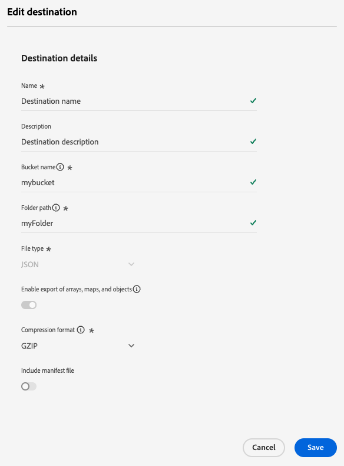

# Modifier les destinations

Découvrez comment modifier différents composants d’une connexion de destination existante, notamment comment mettre à jour les informations d’authentification, l’emplacement d’exportation, etc. à l’aide de l’interface utilisateur d’Experience Platform.

>[!IMPORTANT]
>
>Cette fonctionnalité est en version bêta et disponible uniquement pour certains clients et clientes. Pour obtenir l’accès, contactez votre représentant ou représentante Adobe.

>[!NOTE]
>
> Les opérations de modification décrites dans ce tutoriel sont également prises en charge via les opérations de l’API. Pour plus d’informations, consultez le tutoriel sur la [modification des destinations dans l’API](/help/destinations/api/edit-destination.md).

Pour modifier différents composants d’une connexion de destination existante :

1. Accédez à **[!UICONTROL Destinations]** > **[!UICONTROL Parcourir]**.
2. Sélectionnez la destination que vous souhaitez modifier.
3. Sélectionnez les points de suspension (`...`) dans la colonne [!UICONTROL Nom] et utilisez la commande **[!UICONTROL Modifier la destination ]**pour modifier les connexions de destination existantes.
4. Dans la fenêtre modale, modifiez tous les paramètres souhaités. Sélectionnez **[!UICONTROL Enregistrer]** lorsque vous avez terminé.

Dans la fenêtre Modifier la destination , vous pouvez mettre à jour les paramètres que vous avez configurés lors de la connexion initiale à la destination. Ces paramètres sont différents en fonction de la plateforme de destination que vous mettez à jour.

Selon la configuration de la destination, certains champs peuvent être en lecture seule et ne pas être modifiables. Pour modifier la valeur des champs en lecture seule, vous devez [créer une connexion de destination](../ui/connect-destination.md) avec les nouvelles valeurs de champ.

Vous trouverez ci-dessous quelques exemples de paramètres que vous pouvez mettre à jour pour les destinations [Amazon S3](../catalog/cloud-storage/amazon-s3.md), [Azure Event Hubs](../catalog/cloud-storage/azure-event-hubs.md) et [Google Ads](../catalog/advertising/google-ads-destination.md).

  
  
  

>[!SUCCESS]
>
>Vos paramètres de connexion de destination sont maintenant mis à jour.

## Autres options de modification

À l’aide de l’interface utilisateur d’Experience Platform ou de l’API Flow Service, vous pouvez modifier diverses configurations de destination, comme indiqué dans les liens ci-dessous :

| Utilisation de l’interface utilisateur d’Experience Platform | Utilisation de l’API Flow Service |
|---------|----------|
| Modifier les connexions de destination (cette page) | [Modifier les composants de connexion cible (emplacement de stockage et autres composants)](/help/destinations/api/edit-destination.md#patch-target-connection) |
| [Modifier les comptes](/help/destinations/ui/update-accounts.md) | [Modifier les composants de connexion de base (paramètres d’authentification et autres composants)](/help/destinations/api/edit-destination.md#patch-base-connection) |
| [Modifier les flux de données d’activation](/help/destinations/ui/edit-activation.md) | [Mettre à jour les flux de données de destination](/help/destinations/api/update-destination-dataflows.md) |

## Étapes suivantes

En suivant ce tutoriel, vous avez utilisé l’espace de travail **[!UICONTROL destinations]** pour mettre à jour les connexions de destination existantes.

Pour plus d’informations sur les destinations, consultez la [présentation des destinations](../catalog/overview.md).
