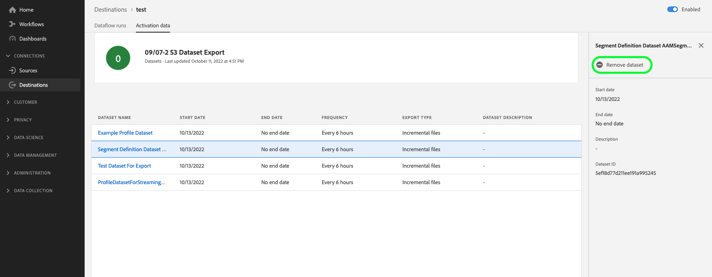

# (Version bêta) Exporter des jeux de données vers des destinations d’espace de stockage

>[!IMPORTANT]
>
>* La fonctionnalité d’exportation des jeux de données est actuellement en version bêta et n’est pas disponible pour tous les utilisateurs. La documentation et les fonctionnalités peuvent changer.
>* Cette fonctionnalité bêta prend en charge l’exportation des données de première génération, comme défini dans la [description du produit](https://helpx.adobe.com/fr/legal/product-descriptions/real-time-customer-data-platform-b2c-edition-prime-and-ultimate-packages.html) de Real-time Customer Data Platform.
>* Cette fonctionnalité est disponible pour les clients qui ont acheté les packages Real-Time CDP Prime et Ultimate. Pour plus d’informations, contactez votre représentant d’Adobe.

Cet article explique le workflow requis pour l’exportation [jeux de données](/help/catalog/datasets/overview.md) de Adobe Experience Platform à l’emplacement de stockage de votre choix dans le cloud, par exemple [!DNL Amazon S3], emplacements SFTP ou [!DNL Google Cloud Storage] en utilisant l’interface utilisateur de l’Experience Platform.

Vous pouvez également utiliser les API Experience Platform pour exporter des jeux de données. Lisez la section [tutoriel sur l’API d’exportation de jeux de données](/help/destinations/api/export-datasets.md) pour plus d’informations.

## Destinations prises en charge {#supported-destinations}

Actuellement, vous pouvez exporter des jeux de données vers les destinations de stockage dans le cloud mises en évidence dans la capture d’écran et répertoriées ci-dessous.

* [[!DNL (Beta) Azure Data Lake Storage Gen2]](../../destinations/catalog/cloud-storage/adls-gen2.md)
* [[!DNL (Beta) Data Landing Zone]](../../destinations/catalog/cloud-storage/data-landing-zone.md)
* [[!DNL (Beta) Google Cloud Storage]](../../destinations/catalog/cloud-storage/google-cloud-storage.md)
* [[!DNL (Beta) Amazon S3]](../../destinations/catalog/cloud-storage/amazon-s3.md#changelog)
* [[!DNL (Beta) Azure Blob]](../../destinations/catalog/cloud-storage/azure-blob.md#changelog)
* [[!DNL (Beta) SFTP]](../../destinations/catalog/cloud-storage/sftp.md#changelog)

## Quand activer des audiences ou exporter des jeux de données {#when-to-activate-audiences-or-activate-datasets}

Certaines destinations basées sur des fichiers du catalogue de l’Experience Platform prennent en charge l’activation de l’audience et l’exportation de jeux de données.

* Envisagez d’activer des audiences lorsque vous souhaitez que vos données soient structurées en profils regroupés par intérêt ou qualification d’audience.
* Vous pouvez également envisager des exportations de jeux de données lorsque vous cherchez à exporter des jeux de données bruts, qui ne sont pas groupés ou structurés par intérêt ou qualification d’audience. Vous pouvez utiliser ces données pour la création de rapports, les workflows de science des données, afin de répondre aux exigences de conformité et à de nombreux autres cas d’utilisation.

Ce document contient toutes les informations nécessaires à l’exportation de jeux de données. Si vous souhaitez activer des audiences vers des destinations de stockage dans le cloud ou de marketing par e-mail, lisez [Activation des données d’audience vers des destinations d’exportation de profils par lots](/help/destinations/ui/activate-batch-profile-destinations.md).

## Conditions préalables {#prerequisites}

Pour exporter des jeux de données vers des destinations d’espace de stockage, vous devez vous être [connecté à une destination](./connect-destination.md). Si vous ne l’avez pas déjà fait, accédez au [catalogue de destinations](../catalog/overview.md), parcourez les destinations prises en charge et configurez la destination que vous souhaitez utiliser.

### Autorisations nécessaires {#permissions}

Pour exporter des jeux de données, vous avez besoin de l’événement **[!UICONTROL Affichage des destinations]** et **[!UICONTROL Gestion et activation des destinations de jeu de données]** [autorisations de contrôle d’accès](/help/access-control/home.md#permissions). Lisez la [présentation du contrôle d’accès](/help/access-control/ui/overview.md) ou contactez votre administrateur de produit pour obtenir les autorisations requises.

Pour vous assurer que vous disposez des autorisations nécessaires pour exporter des jeux de données et que la destination prend en charge l’exportation de jeux de données, parcourez le catalogue des destinations. Si une destination comporte un contrôle **[!UICONTROL Activer]** ou **[!UICONTROL Exporter des jeux de données]**, vous disposez des autorisations appropriées.

## Sélectionner votre destination {#select-destination}

Suivez les instructions pour sélectionner une destination vers laquelle vous pouvez exporter vos jeux de données :

1. Accédez à **[!UICONTROL Connexions > Destinations]**, puis sélectionnez l’onglet **[!UICONTROL Catalogue]**.

   

1. Sélectionnez **[!UICONTROL Activer]** ou **[!UICONTROL Exporter des jeux de données]** sur la vignette correspondant à la destination vers laquelle vous souhaitez exporter des jeux de données.

   

1. Sélectionnez **[!UICONTROL Type de données des jeux de données]** et sélectionnez la connexion de destination vers laquelle vous souhaitez exporter les jeux de données, puis sélectionnez **[!UICONTROL Suivant]**.

>[!TIP]
> 
>Si vous souhaitez configurer une nouvelle destination pour exporter des jeux de données, sélectionnez **[!UICONTROL Configurer une nouvelle destination]** pour déclencher le workflow [Se connecter à la destination](/help/destinations/ui/connect-destination.md).

1. La vue **[!UICONTROL Sélectionner des jeux de données]** apparaît. Passez à la section suivante pour [sélectionner vos jeux de données](#select-datasets) pour l’exportation.

## Sélectionner vos jeux de données {#select-datasets}

Utilisez les cases à cocher situées à gauche des jeux de données pour sélectionner les jeux de données que vous souhaitez exporter vers la destination, puis sélectionnez **[!UICONTROL Suivant]**.

## Planifier l’exportation des jeux de données {#scheduling}

>[!CONTEXTUALHELP]
>id="platform_destinations_activate_datasets_exportoptions"
>title="Options d’exportation de fichiers pour les jeux de données"
>abstract="Sélectionnez **Exporter des fichiers incrémentiels** pour n’exporter que les données ajoutées au jeu de données depuis la dernière exportation.   La première exportation de fichier incrémentiel inclut toutes les données du jeu de données, agissant comme un renvoi. Les futurs fichiers incrémentiels incluent uniquement les données qui ont été ajoutées au jeu de données depuis la première exportation."

Dans le **[!UICONTROL Planification]** vous pouvez définir une date de début et une cadence d’exportation pour vos exportations de jeux de données.

L’option **[!UICONTROL Exporter des fichiers incrémentiels]** est automatiquement sélectionnée. Cela déclenche une exportation où le premier fichier est un instantané complet du jeu de données et les fichiers suivants sont des ajouts incrémentiels du jeu de données depuis l’exportation précédente.

>[!IMPORTANT]
>
>Le premier fichier incrémentiel exporté inclut toutes les données existantes dans le jeu de données, agissant comme un renvoi.

1. Utilisez le sélecteur **[!UICONTROL Fréquence]** pour sélectionner la fréquence d’exportation :

   * **[!UICONTROL Tous les jours]** : planification d’exportations de fichiers incrémentiels une fois par jour, tous les jours, au moment choisi.
   * **[!UICONTROL Par heure]** : planification d’exportations de fichiers incrémentiels toutes les 3, 6, 8 ou 12 heures.

2. Utilisez le sélecteur **[!UICONTROL Heure]** pour choisir l’heure de la journée, au format [!DNL UTC], à laquelle l’exportation doit avoir lieu.

3. Utilisez le sélecteur **[!UICONTROL Date]** pour choisir l’intervalle au cours duquel l’exportation doit avoir lieu. Notez que dans la version bêta de la fonctionnalité, il n’est pas possible de définir une date de fin pour les exportations. Pour plus d’informations, voir la section [limitations connues](#known-limitations).

4. Sélectionnez **[!UICONTROL Suivant]** pour enregistrer la planification et passer à la l’étape **[!UICONTROL Révision]**.

>[!NOTE]
> 
>Pour les exportations de jeu de données, les noms de fichiers ont un paramètre prédéfini, format par défaut, qui ne peut être modifié. Voir la section [Vérification de l’exportation réussie d’un jeu de données](#verify) pour plus d’informations et d’exemples de fichiers exportés.

## Révision {#review}

Sur la page **[!UICONTROL Vérifier]**, vous pouvez voir un résumé de votre sélection. Sélectionnez **[!UICONTROL Annuler]** pour interrompre le flux, **[!UICONTROL Précédent]** pour modifier vos paramètres ou **[!UICONTROL Terminer]** pour confirmer votre sélection et commencer à envoyer les jeux de données à la destination.

## Vérifier l’exportation réussie d’un jeu de données {#verify}

Lors de l’exportation de jeux de données, Experience Platform crée un fichier `.json` ou `.parquet` dans l’emplacement de stockage que vous avez fourni. Attendez-vous à ce qu’un nouveau fichier soit déposé dans votre emplacement de stockage en fonction du planning d’exportation que vous avez fourni.

Experience Platform crée une structure de dossiers dans l’emplacement de stockage que vous avez spécifié, où il dépose les fichiers de jeu de données exportés. Un nouveau dossier est créé pour chaque heure d’exportation, selon le modèle ci-dessous :

`folder-name-you-provided/datasetID/exportTime=YYYYMMDDHHMM`

Le nom de fichier par défaut est généré de manière aléatoire pour garantir que les noms de fichier exportés soient uniques.

### Exemples de fichiers de jeu de données {#sample-files}

La présence de ces fichiers dans votre emplacement de stockage confirme que l’activation a été réalisée avec succès. Pour comprendre la structure des fichiers exportés, vous pouvez télécharger un exemple de [fichier parquet](../assets/common/part-00000-tid-253136349007858095-a93bcf2e-d8c5-4dd6-8619-5c662e261097-672704-1-c000.parquet) ou de [fichier JSON](../assets/common/part-00000-tid-4172098795867639101-0b8c5520-9999-4cff-bdf5-1f32c8c47cb9-451986-1-c000.json).

#### Fichiers de jeux de données compressés {#compressed-dataset-files}

Dans le [workflow de connexion à la destination](/help/destinations/ui/connect-destination.md#file-formatting-and-compression-options), vous pouvez sélectionner les fichiers de jeu de données exportés à compresser, comme illustré ci-dessous :

Notez la différence de format de fichier entre les deux types de fichiers, lorsqu’ils sont compressés :

* Lors de l’exportation de fichiers JSON compressés, le format de fichier exporté est `json.gz`
* Lors de l’exportation de fichiers parquet compressés, le format de fichier exporté est `gz.parquet`

## Supprimer un jeu de données de la destination {#remove-dataset}

Pour supprimer un jeu de données d’un flux de données existant, procédez comme suit :

1. Connectez-vous à l’[interface utilisateur Experience Platform](https://experience.adobe.com/platform/) et sélectionnez **[!UICONTROL Destinations]** dans la barre de navigation de gauche. Sélectionnez **[!UICONTROL Parcourir]** dans l’en-tête supérieur pour afficher vos flux de données de destination existants.

   

   >[!TIP]
   > 
   >Sélectionnez l’icône filtre  en haut à gauche pour lancer le panneau de tri. Le panneau de tri fournit une liste de toutes vos destinations. Vous pouvez sélectionner plusieurs destinations dans la liste pour afficher une sélection filtrée de flux de données associés à la destination sélectionnée.

1. Dans la colonne **[!UICONTROL Données d’activation]**, sélectionnez le contrôle des jeux de données pour afficher tous les jeux de données mappés à ce flux de données d’exportation.

   

1. La page **[!UICONTROL Données d’activation]** pour la destination s’affiche. Sélectionnez **[!UICONTROL Supprimer un jeu de données]** dans le rail de droite pour déclencher la boîte de dialogue de confirmation de suppression du jeu de données.

   

1. Dans la boîte de dialogue de confirmation, sélectionnez **[!UICONTROL Supprimer]** pour supprimer immédiatement le jeu de données des exportations vers la destination.

   

## Limites connues {#known-limitations}

Gardez à l’esprit les limites suivantes pour la version Beta des exportations de jeux de données :

* Il existe actuellement une seule autorisation (**[!UICONTROL Gestion et activation des destinations de jeu de données]**) qui inclut des autorisations de gestion et d’activation sur les destinations de jeux de données. Ces contrôles seront ultérieurement divisés en autorisations plus granulaires. Consultez la section [autorisations requises](#permissions) pour obtenir la liste complète des autorisations dont vous avez besoin pour exporter des jeux de données.
* Actuellement, vous ne pouvez exporter que des fichiers incrémentiels et il est impossible de sélectionner une date de fin pour vos exportations de jeux de données.
* Les noms des fichiers exportés ne peuvent actuellement pas être personnalisés.
* Actuellement, l’interface utilisateur ne vous empêche pas de supprimer un jeu de données en cours d’exportation vers une destination. Ne supprimez aucun jeu de données en cours d’exportation vers des destinations. [Supprimez le jeu de données](#remove-dataset) d’un flux de données de destination avant de le supprimer.
* Les mesures de surveillance des exportations de jeux de données sont actuellement combinées avec les chiffres des exportations de profils afin qu’elles ne reflètent pas les vrais chiffres d’exportation.
