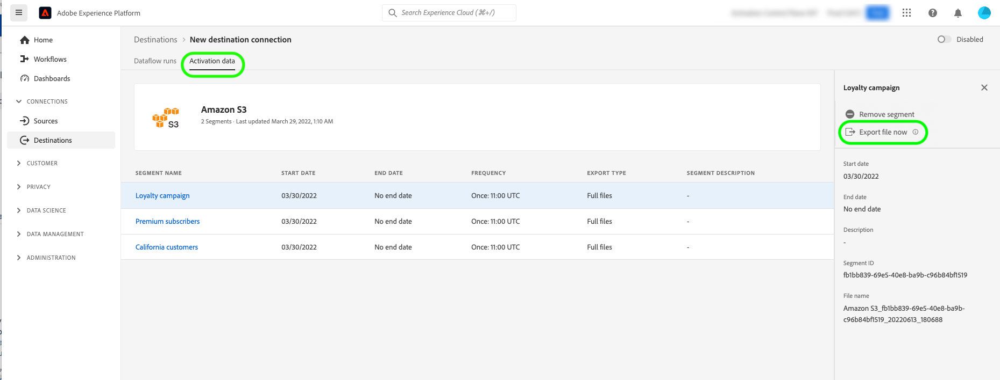

# (Version bêta) Exporter des fichiers à la demande vers des destinations par lots à l’aide de l’interface utilisateur Experience Platform

>[!IMPORTANT]
>
>Le **[!UICONTROL Exporter le fichier maintenant]** dans Adobe Experience Platform est actuellement en version bêta. La documentation et les fonctionnalités peuvent changer.
>Contactez votre représentant Adobe pour accéder à cette fonctionnalité.

>[!IMPORTANT]
> 
>Pour activer les données, vous avez besoin des [autorisations de contrôle d’accès](/help/access-control/home.md#permissions) pour les fonctions **[!UICONTROL Gérer les destinations]**, **[!UICONTROL Activer les destinations]**, **[!UICONTROL Afficher les profils]**, et **[!UICONTROL Afficher les segments]**. Lisez la [présentation du contrôle d’accès](/help/access-control/ui/overview.md) ou contactez votre administrateur de produit pour obtenir les autorisations requises.

## **[!UICONTROL Exporter le fichier maintenant]** aperçu {#overview}

>[!CONTEXTUALHELP]
>id="platform_destinations_activationchaining_activatenow"
>title="Exporter le fichier maintenant"
>abstract="Sélectionnez ce contrôle pour livrer une exportation complète de fichiers en plus des exportations précédemment programmées. L’exportation du fichier est déclenchée immédiatement et récupère les derniers résultats des exécutions de segmentation d’Experience Platform."

Cet article explique comment utiliser l’interface utilisateur de l’Experience Platform pour exporter des fichiers à la demande vers des destinations par lots telles que [espace de stockage](/help/destinations/catalog/cloud-storage/overview.md) et [marketing par e-mail](/help/destinations/catalog/email-marketing/overview.md) destinations.

Le **[!UICONTROL Exporter le fichier maintenant]** Le contrôle permet d&#39;exporter un fichier complet sans interrompre le planning d&#39;export actuel d&#39;une audience précédemment planifiée. Cet export s&#39;effectue en plus des exports précédemment programmés et ne modifie pas la fréquence d&#39;export de l&#39;audience. L’exportation du fichier est déclenchée immédiatement et récupère les derniers résultats des exécutions de segmentation d’Experience Platform.

Vous pouvez également utiliser les API Experience Platform à cet effet. Lire comment [activation d’audiences à la demande vers des destinations par lots via l’API d’activation ad hoc](/help/destinations/api/ad-hoc-activation-api.md).

## Conditions préalables {#prerequisites}

Pour exporter des fichiers à la demande vers des destinations par lot, vous devez avoir réussi [connecté à une destination](./connect-destination.md). Si vous ne l’avez pas déjà fait, accédez au [catalogue de destinations](../catalog/overview.md), parcourez les destinations prises en charge et configurez la destination que vous souhaitez utiliser.

## Comment exporter des fichiers à la demande {#how-to-export-files-on-demand}

1. Accédez à **[!UICONTROL Connexions > Destinations]**, sélectionnez la variable **[!UICONTROL Parcourir]** et le symbole de filtre pour afficher les connexions existantes aux destinations par lots de votre choix.

   

2. Sélectionnez la connexion de destination souhaitée pour inspecter le flux de données existant vers la destination.

   

3. Sélectionnez la **[!UICONTROL Données d’activation]** et sélectionnez l&#39;audience pour laquelle vous souhaitez exporter un fichier à la demande, puis sélectionnez l&#39;option **[!UICONTROL Exporter le fichier maintenant]** pour déclencher une exportation unique qui diffusera un fichier vers votre destination de lot.

   >[!IMPORTANT]
   >
   >La sélection de plusieurs audiences pour exporter des fichiers à la demande en bloc n’est actuellement pas prise en charge dans l’interface utilisateur. Utilisez la variable [API d’activation ad hoc](/help/destinations/api/ad-hoc-activation-api.md) à cette fin.

   

4. Sélectionner **[!UICONTROL Oui]** pour confirmer et déclencher l’exportation du fichier.

   

5. Un message de confirmation s&#39;affiche, vous indiquant que l&#39;export du fichier a démarré.

   

6. Vous pouvez également accéder à la variable **[!UICONTROL Exécutions de flux de données]** pour confirmer que l’exportation du fichier a démarré.

## Considérations {#considerations}

Gardez à l’esprit les points suivants lors de l’utilisation de la variable **[!UICONTROL Exporter le fichier maintenant]** control :

* **[!UICONTROL Exporter le fichier maintenant]** fonctionne uniquement pour les audiences dont le planning dans le flux de données d’activation par lots chevauche la date actuelle. Cela inclut les audiences dont les planifications n’ont pas de date de fin (fréquence d’exportation de **[!UICONTROL Une fois]**) ou lorsque la date de fin n’est pas encore passée.
* Lors de l’ajout d’une audience à un flux de données existant, attendez au moins 15 minutes avant d’utiliser la variable **[!UICONTROL Exporter le fichier maintenant]** contrôle.
* Si vous modifiez la stratégie de fusion d’une audience ou si vous créez une audience qui utilise une nouvelle stratégie de fusion, patientez 24 heures jusqu’à l’utilisation de la variable **[!UICONTROL Exporter le fichier maintenant]** contrôle.

## Messages d’erreur de l’interface utilisateur {#ui-error-messages}

Lors de l’utilisation de la variable **[!UICONTROL Exporter le fichier maintenant]** , vous pouvez rencontrer l’un des messages d’erreur répertoriés ci-dessous. Consultez le tableau pour savoir comment y remédier lorsqu’il s’affiche.

| Message d’erreur | Résolution |
|---------|----------|
| Exécution déjà en cours pour l’audience `segment ID` pour la commande `dataflow ID` avec identifiant d’exécution `flow run ID` | Ce message d’erreur indique qu’un flux d’activation ad hoc est actuellement en cours pour une audience. Attendez que la tâche se termine avant de déclencher à nouveau la tâche d’activation. |
| Audiences `<segment name>` ne font pas partie de ce flux de données ou ne font pas partie de la plage de dates prévue. | Ce message d’erreur indique que les audiences que vous avez sélectionnées pour activer ne sont pas mappées au flux de données ou que le planning d’activation configuré pour les audiences a expiré ou n’a pas encore commencé. Vérifiez si l’audience est bien mappée au flux de données et que le planning d’activation de l’audience chevauche la date actuelle. |

## Informations connexes {#related-information}

* [Activation des audiences vers des destinations par lots à la demande à l’aide des API Experience Platform](/help/destinations/api/ad-hoc-activation-api.md)
* [Activer les données d’audience vers des destinations d’exportation de profils par lots](/help/destinations/ui/activate-batch-profile-destinations.md)
