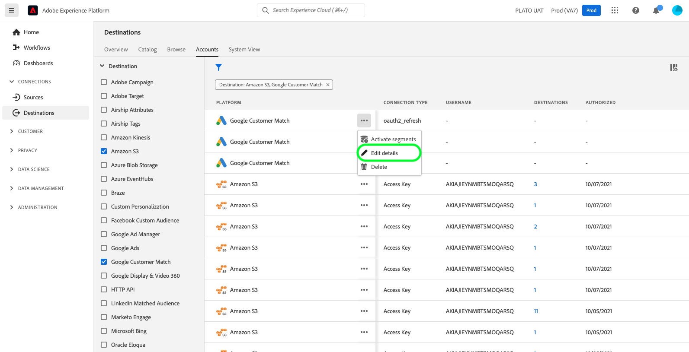

# Mise à jour des comptes de destination

## Présentation {#overview}

Le **[!UICONTROL Comptes]** Cet onglet affiche des détails sur les connexions que vous avez établies avec différentes destinations. Reportez-vous à la section [Présentation des comptes](../ui/destinations-workspace.md#accounts) pour toutes les informations que vous pouvez obtenir sur chaque compte de destination.

Ce tutoriel décrit les étapes à suivre pour mettre à jour les détails du compte de destination à l’aide de l’interface utilisateur de l’Experience Platform.

Vous pouvez mettre à jour les détails du compte de destination afin d’actualiser et de réauthentifier les informations d’identification de vos comptes actuels ou expirés pour les destinations que vous utilisez actuellement. En règle générale, les jetons OAuth et porteur ont une durée de vie limitée, selon la plateforme de destination. Lorsque ces jetons expirent, vous pouvez les actualiser dans le workflow décrit ci-dessous. Ce workflow vous invite à passer par le workflow OAuth ou à réinsérer un jeton. De même, si un mot de passe ou un accès utilisateur a changé sur la plateforme en aval, vous pouvez actualiser les informations d’identification.

Pour les destinations par lot, vous pouvez mettre à jour la clé d’accès ou secrète, si l’une d’elles a été modifiée. En outre, si vous souhaitez chiffrer vos fichiers à partir de maintenant, vous pouvez insérer une clé publique RSA et vos fichiers exportés seront chiffrés à partir de maintenant.

## Mettre à jour les comptes {#update}

Suivez les étapes ci-dessous pour mettre à jour les détails de connexion vers les destinations existantes.

1. Connectez-vous au [Interface utilisateur Experience Platform](https://platform.adobe.com/) et sélectionnez **[!UICONTROL Destinations]** dans la barre de navigation de gauche. Sélectionner **[!UICONTROL Comptes]** dans l’en-tête supérieur pour afficher vos comptes existants.

   

2. Icône Sélectionner le filtre  en haut à gauche pour lancer le panneau de tri. Le panneau de tri fournit une liste de toutes vos destinations. Vous pouvez sélectionner plusieurs destinations dans la liste pour afficher une sélection filtrée de comptes associés aux destinations sélectionnées.

   

3. Sélectionnez les ellipses (`...`) en regard du nom du compte que vous avez l’intention de mettre à jour. Un panneau contextuel s’affiche, fournissant des options pour **[!UICONTROL Activation des segments]**, **[!UICONTROL Modifier les détails]**, et **[!UICONTROL Supprimer]** le compte. Sélectionnez la  **[!UICONTROL Modifier les détails]** pour modifier les informations du compte.

   

4. Entrez vos informations d’identification de compte mises à jour.

   * Pour les comptes qui utilisent une `OAuth1` ou `OAuth2` type de connexion, sélectionnez **[!UICONTROL Reconnecter OAuth]** pour renouveler les informations d’identification de votre compte. Vous pouvez également mettre à jour le nom et la description de votre compte.

   

   * Pour les comptes qui utilisent une `Access Key` ou `ConnectionString` type de connexion, vous pouvez modifier les informations d’authentification de votre compte, y compris les informations telles que l’ID d’accès, les clés secrètes ou les chaînes de connexion. Vous pouvez également mettre à jour le nom et la description de votre compte.

   

   * Pour les comptes qui utilisent une `Bearer token` type de connexion, vous pouvez saisir un nouveau jeton porteur, si nécessaire. Vous pouvez également mettre à jour le nom et la description de votre compte.

   

   * Pour les comptes qui utilisent une `Server to server` type de connexion, vous pouvez mettre à jour le nom et la description de votre compte.

   

5. Sélectionner **[!UICONTROL Enregistrer]** pour terminer la mise à jour des détails du compte.

## Étapes suivantes

En suivant ce tutoriel, vous avez utilisé avec succès la méthode **[!UICONTROL destinations]** espace de travail pour mettre à jour les comptes existants.

Pour plus d’informations sur les destinations, reportez-vous à la section [présentation des destinations](../catalog/overview.md).