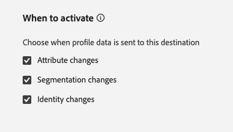
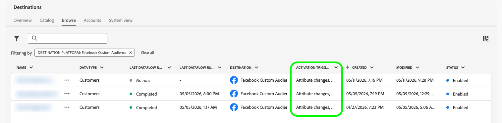

# Quand activer

>[!IMPORTANT]
>
>Cette fonctionnalité est actuellement en version bêta. Les fonctionnalités et la documentation sont susceptibles d’être modifiées. Cette fonctionnalité est également disponible uniquement à la demande. Contactez votre représentant Adobe pour obtenir l’accès.

>[!NOTE]
>
>Pour plus d’informations sur la manière dont chaque type de modification de profil déclenche l’activation, voir [Comportement d’exportation de profil](/help/destinations/how-destinations-work/profile-export-behavior.md).

Par défaut, [!DNL Adobe Experience Platform] exporte des données vers une destination chaque fois qu’une modification se produit sur un profil : une *mise à jour d’attribut*, une *qualification ou disqualification d’audience* ou un *changement d’identité*. Cela peut générer un grand volume d&#39;exportations, dont un grand nombre ne comporte aucun changement significatif pour les systèmes en aval.

Grâce à la fonction **[!UICONTROL Quand activer]**, vous avez un contrôle précis sur les types de modifications de profil qui déclenchent des exportations pour un flux de données de destination donné. Vous pouvez activer ou désactiver chaque type de déclencheur indépendamment. La désactivation d’un type de déclencheur supprime les exportations causées uniquement par ce type de modification.

## Types de destination pris en charge {#supported-destinations}

La fonction **[!UICONTROL Quand activer]** est prise en charge pour les types de destination suivants :

- [Destinations basées sur les API de streaming](/help/destinations/how-destinations-work/profile-export-behavior.md#streaming-api-based-destinations)
- [Destinations d’exportation de profils de streaming (entreprise)](/help/destinations/how-destinations-work/profile-export-behavior.md#streaming-profile-destinations) : [[!DNL HTTP API]](/help/destinations/catalog/streaming/http-destination.md), [[!DNL Amazon Kinesis]](/help/destinations/catalog/cloud-storage/amazon-kinesis.md), [[!DNL Azure Event Hubs]](/help/destinations/catalog/cloud-storage/azure-event-hubs.md) et [[!DNL Snowflake Streaming]](/help/destinations/catalog/warehouses/snowflake.md).

## Types de déclencheurs d’activation {#trigger-types}

>[!CONTEXTUALHELP]
>id="platform_destinations_activation_triggers"
>title="Quand activer"
>abstract="Sélectionnez les types de modifications de profil qui déclenchent des exports vers cette destination. Les trois déclencheurs sont activés par défaut. <ul><li><b>Modifications d’attribut :</b> les attributs de profil sont mis à jour à partir de toute source de données en amont.</li><li><b>Modifications de segmentation :</b> le profil entre ou sort d’une audience évaluée par le service de segmentation d’Experience Platform.</li><li><b>Modifications d’identité :</b> le graphique d’identité de profil est mis à jour, par exemple lorsqu’une nouvelle identité est ajoutée.</li></ul>"

Le tableau ci-dessous décrit chaque type de déclencheur. Les déclencheurs sont répertoriés dans l’ordre du volume d’activation attendu, du plus élevé au plus bas.

>[!NOTE]
>
>Les trois types de déclencheur sont activés par défaut. Si vous disposiez de flux de données existants avant la publication de cette fonctionnalité, leur comportement reste inchangé, sauf si vous mettez explicitement à jour les paramètres.

| Type de déclencheur | Qu’est-ce qui le déclenche ? | Quand le désactiver |
| --- | --- | --- |
| **[!UICONTROL Modifications d’attribut]** | Tous les attributs mappés du profil sont mis à jour. | Vous souhaitez supprimer les mises à jour d’attributs haute fréquence déclenchant des exportations vers une API partenaire. |
| **[!UICONTROL Modifications de segmentation]** | Un profil entre ou sort d’une audience évaluée par [!DNL Experience Platform] Segmentation Service. |  |
| **[!UICONTROL Modifications d’identité]** | Le graphique d’identités d’un profil change, par exemple lorsqu’une nouvelle identité est ajoutée ou qu’une identité existante est mise à jour. | Un utilisateur connu se connecte à partir d’un nouvel appareil en ajoutant un nouvel ECID à son graphique d’identité. Vous ne souhaitez pas que cela déclenche une exécution de courrier électronique, de SMS ou d’autres médias détenus et exploités à partir du système en aval. |

{style="table-layout:auto"}

## Comportement par défaut {#default-behavior}

Les trois types de déclencheur sont activés sur chaque flux de données nouveau et existant. Lorsque vous désactivez un ou plusieurs déclencheurs, les exportations provoquées par ce type de déclencheur sont supprimées. Les exportations qui résultent d’une combinaison de types de déclencheur se déclenchent toujours si au moins un déclencheur activé a provoqué la modification.

## Bonnes pratiques et recommandations {#best-practices}

La meilleure configuration de déclenchement dépend de votre cas d’utilisation. Utilisez les conseils suivants comme point de départ.

**Commencez par modifier les attributs pour obtenir la plus grande réduction de volume.** La désactivation du déclencheur de modifications d’attribut entraîne la réduction la plus importante du volume d’exportation pour la plupart des organisations et résout la source la plus courante d’exportations inutiles. Pour connaître le comportement sous-jacent, consultez ce qui détermine une exportation de données pour les [destinations d’entreprise](/help/destinations/how-destinations-work/profile-export-behavior.md#enterprise-behavior) et pour les [destinations basées sur l’API de streaming](/help/destinations/how-destinations-work/profile-export-behavior.md#streaming-behavior). Le déclencheur se déclenche chaque fois qu’un attribut mappé est mis à jour, y compris lors de l’ingestion quotidienne par lots qui redémarre les valeurs qui n’ont pas été modifiées de manière significative.

Par exemple, si vous synchronisez quotidiennement votre CRM avec [!DNL Experience Platform] ou si vous recalculez quotidiennement un score de propension ou de prédiction de résiliation, la plupart des profils sont retraités avec des valeurs identiques à celles du jour précédent. Lorsque les modifications d’attribut sont activées, chacun de ces retraitements déclenche une exportation. La désactivation du déclencheur supprime ces exportations pilotées par le retraitement tout en préservant les exportations pilotées par les événements de qualification d’audience et d’identité.

**Gardez les modifications de segmentation activées.** Les événements d’entrée et de sortie d’audience sont généralement les signaux les plus significatifs pour les systèmes en aval tels que les CRM et les plateformes publicitaires. La plupart des entreprises gardent ce déclencheur activé.

**Utiliser les modifications d’identité comme correctif chirurgical pour des scénarios spécifiques.** Contrairement aux modifications d’attribut, la désactivation des modifications d’identité n’est pas un levier important de réduction du volume. Vous ne devez l’appliquer que dans des situations précises où de nouvelles identités ajoutées à un profil produisent une activité en aval indésirable.

Un exemple représentatif est un fournisseur de service de messagerie (ESP) réagissant aux mises à jour de profil provenant de l’adresse [!DNL Experience Platform] : un utilisateur connu se connecte à partir d’un nouvel appareil, ce qui ajoute un nouvel ECID à son graphique d’identité, et vous ne souhaitez pas que cette seule mise à jour d’identité déclenche un e-mail ou un SMS. Dans ce cas, la désactivation du déclencheur de changements d’identité supprime l’exportation indésirable.

>[!IMPORTANT]
>
>Les changements d’identité peuvent être un signal de grande valeur dans de nombreux cas d’utilisation de l’activation. Par exemple, lorsqu’un visiteur non authentifié qui parcourt votre site s’authentifie en envoyant son e-mail, la mise à jour du graphique d’identité lie son comportement de navigation précédent à un profil connu. Pour les marchés verticaux tels que les voyages, la vente au détail ou les services financiers, c&#39;est souvent le moment où un visiteur se qualifie en tant que prospect à forte intention et doit être exporté vers des systèmes en aval. Désactivez les modifications d’identité uniquement lorsque vous disposez d’un cas d’utilisation clair, comme l’exemple du fournisseur de service de messagerie décrit précédemment dans cette section, et que vous comprenez le compromis.
>
>La désactivation des modifications d’identité ne supprime pas les modifications de segmentation résultant des mises à jour des graphiques d’identités. Lorsqu’une nouvelle identité est ajoutée à un profil, les comportements associés à cette identité sont également intégrés dans la vue de profil, ce qui peut entraîner l’éligibilité ou la disqualification du profil par rapport aux audiences. Ces modifications de segmentation continuent de déclencher des exportations tant que le déclencheur de modifications de segmentation est activé.

Chaque organisation possède différents cas d’utilisation, de sorte que différentes combinaisons de déclencheurs peuvent s’appliquer. Contactez votre gestionnaire de compte Adobe ou l’assistance clientèle pour obtenir des conseils adaptés à votre configuration d’activation.

## Configurer le moment d’activation {#configure}

Vous pouvez configurer les paramètres **[!UICONTROL Quand activer]** à deux endroits :

- **Lors de la configuration de l’activation :** l’étape **[!UICONTROL Quand activer]** apparaît dans le workflow d’activation lorsque vous configurez une destination basée sur une API de streaming ou une destination d’entreprise. Voir [Activer les audiences vers des destinations de diffusion en continu](/help/destinations/ui/activate-segment-streaming-destinations.md#when-to-activate) et [Activer les audiences vers des destinations d’exportation de profils de diffusion en continu](/help/destinations/ui/activate-streaming-profile-destinations.md#when-to-activate).
- **Sur les flux de données existants :** utilisez le contrôle **[!UICONTROL Modifier la destination]** sur un flux de données pour modifier les paramètres à tout moment. Voir [Modifier les flux de données d’activation](/help/destinations/ui/edit-activation.md#edit-when-to-activate).

## Afficher la configuration du déclencheur dans l’onglet Parcourir {#browse-tab}

L’onglet **[!UICONTROL Parcourir]** de l’espace de travail [Destinations](/help/destinations/ui/destinations-workspace.md#browse) affiche une colonne **[!UICONTROL Déclencheur d’activation]**. La colonne affiche les déclencheurs actuellement configurés pour chaque flux de données. Utilisez cette colonne pour passer rapidement en revue les types de modification de profil qui activent chacune de vos connexions de destination.

