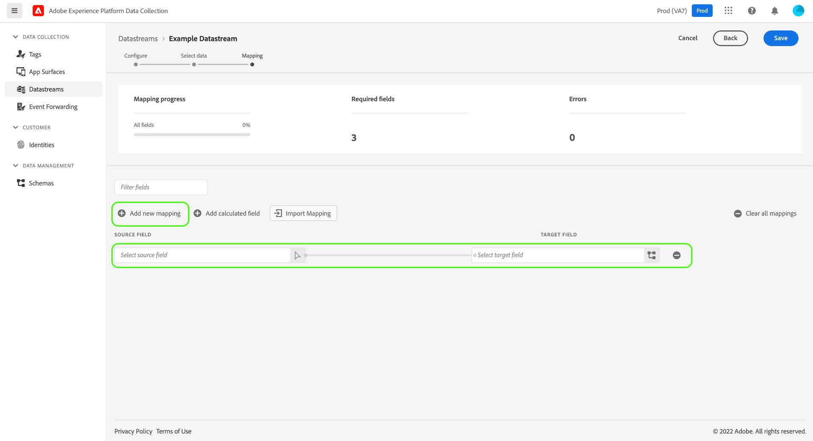
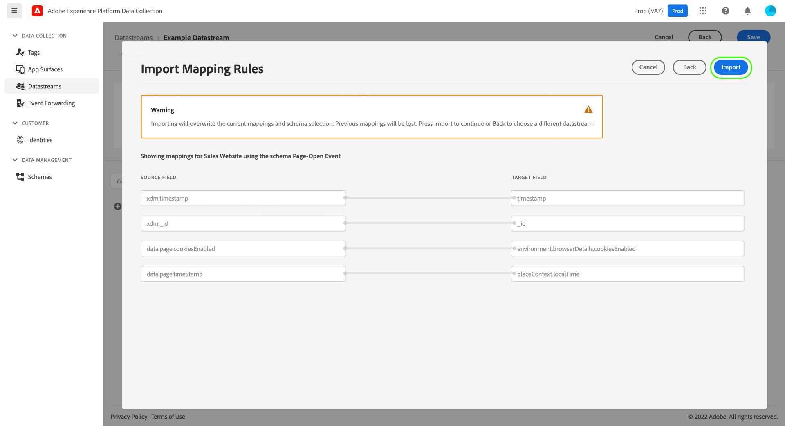

# Préparer des données pour la collecte de données

Data Prep est un service Adobe Experience Platform qui vous permet de mapper, de transformer et de valider des données à partir de et vers . [Modèle de données d’expérience (XDM)](../../xdm/home.md). Lors de la configuration d’une plateforme activée [datastream](./overview.md), vous pouvez utiliser les fonctionnalités de préparation de données pour mapper vos données source à XDM lors de leur envoi au réseau Edge Platform.

>[!NOTE]
>
>Pour obtenir des instructions complètes sur toutes les fonctionnalités de la préparation de données, y compris les fonctions de transformation des champs calculés, consultez la documentation suivante :
>
>* [Présentation de la préparation des données](../../data-prep/home.md)
>* [Fonctions de mappage de la préparation des données](../../data-prep/functions.md)
>* [Gestion des formats de données avec la préparation des données](../../data-prep/data-handling.md)


Ce guide explique comment mapper vos données dans l’interface utilisateur de la collecte de données. Pour suivre les étapes, commencez le processus de création d’un flux de données jusqu’à (et incluez) la variable [étape de configuration de base](./overview.md#create).

Pour une démonstration rapide du processus de préparation des données pour la collecte de données, reportez-vous à la vidéo suivante :

>[!VIDEO](https://video.tv.adobe.com/v/342120?quality=12&enable10seconds=on&speedcontrol=on)

## [!UICONTROL Sélectionner les données ] {#select-data}

Sélectionner **[!UICONTROL Enregistrement et ajout d’un mappage]** après avoir terminé la configuration de base d’un flux de données, et la variable **[!UICONTROL Sélectionner des données]** s’affiche. À partir de là, vous devez fournir un exemple d’objet JSON qui représente la structure des données que vous prévoyez d’envoyer à Platform.

Pour capturer les propriétés directement à partir de votre couche de données, l’objet JSON doit comporter une seule propriété racine. `data`. Les sous-propriétés de la propriété `data` doit ensuite être construit de manière à correspondre aux propriétés de couche de données que vous souhaitez capturer. Sélectionnez la section ci-dessous pour afficher un exemple d’objet JSON correctement formaté avec un `data` root.

+++Exemple de fichier JSON avec `data` root

```json
{
  "data": {
    "eventMergeId": "cce1b53c-571f-4f36-b3c1-153d85be6602",
    "eventType": "view:load",
    "timestamp": "2021-09-30T14:50:09.604Z",
    "web": {
      "webPageDetails": {
        "siteSection": "Product section",
        "server": "example.com",
        "name": "product home",
        "URL": "https://www.example.com"
      },
      "webReferrer": {
        "URL": "https://www.adobe.com/index2.html",
        "type": "external"
      }
    },
    "commerce": {
      "purchase": 1,
      "order": {
        "orderID": "1234"
      }
    },
    "product": [
      {
        "productInfo": {
          "productID": "123"
        }
      },
      {
        "productInfo": {
          "productID": "1234"
        }
      }
    ],
    "reservation": {
      "id": "anc45123xlm",
      "name": "Embassy Suits",
      "SKU": "12345-L",
      "skuVariant": "12345-LG-R",
      "priceTotal": "112.99",
      "currencyCode": "USD",
      "adults": 2,
      "children": 3,
      "productAddMethod": "PDP",
      "_namespace": {
        "test": 1,
        "priceTotal": "112.99",
        "category": "Overnight Stay"
      },
      "freeCancellation": false,
      "cancellationFee": 20,
      "refundable": true
    }
  }
}
```

+++

Pour capturer des propriétés à partir d’un élément de données d’objet XDM, les mêmes règles s’appliquent à l’objet JSON, mais la propriété racine doit être masquée en tant que `xdm` au lieu de . Sélectionnez la section ci-dessous pour afficher un exemple d’objet JSON correctement formaté avec une `xdm` root.

+++Exemple de fichier JSON avec `xdm` root

```json
{
  "xdm": {
    "environment": {
      "type": "browser",
      "browserDetails": {
        "userAgent": "Mozilla/5.0 (Macintosh; Intel Mac OS X 10_7_5) AppleWebkit/537.36 (KHTML, like Gecko) Chrome/49.0.2623.112 Safari/537.36",
        "javaScriptEnabled": true,
        "javaScriptVersion": "1.8.5",
        "cookiesEnabled": true,
        "viewportHeight": 900,
        "viewportWidth": 1680,
        "javaEnabled": true
      },
      "domain": "adobe.com",
      "colorDepth": 24,
      "viewportHeight": 1050,
      "viewportWidth": 1680
    },
    "device": {
      "screenHeight": 1050,
      "screenWidth": 1680
    }
  }
}
```

+++

Vous pouvez sélectionner l’option pour charger l’objet sous forme de fichier ou coller l’objet brut dans la zone de texte fournie à la place. Si le fichier JSON est valide, un schéma d’aperçu s’affiche dans le panneau de droite. Sélectionnez **[!UICONTROL Suivant]** pour continuer.


## [!UICONTROL Mappage]

Le **[!UICONTROL Mappage]** s’affiche, ce qui vous permet de mapper les champs de vos données source à celui du schéma d’événement cible dans Platform. À partir de là, vous pouvez configurer le mappage de deux manières :

* [Création de règles de mappage](#create-mapping) pour ce flux de données via un processus manuel.
* [Règles de mappage d’importation](#import-mapping) d’un flux de données existant.

### Créer un mapping {#create-mapping}

Pour commencer, sélectionnez **[!UICONTROL Ajouter un nouveau mappage]** pour créer une ligne de mappage.



Sélectionnez l’icône source () et dans la boîte de dialogue qui s’affiche, sélectionnez le champ source que vous souhaitez mapper dans la zone de travail fournie. Une fois que vous avez choisi un champ, utilisez le **[!UICONTROL Sélectionner]** pour continuer.


Sélectionnez ensuite l’icône de schéma () pour ouvrir une boîte de dialogue similaire pour le schéma d’événement cible. Sélectionnez le champ vers lequel vous souhaitez mapper les données avant de confirmer avec **[!UICONTROL Sélectionner]**.


La page de mappage réapparaît avec le mappage des champs terminé affiché. Le **[!UICONTROL Mappage de la progression]** mises à jour de section pour refléter le nombre total de champs qui ont été mappés avec succès.


>[!TIP]
>
>Si vous souhaitez mapper un tableau d’objets (dans le champ source) à un tableau d’objets différents (dans le champ cible), ajoutez `[*]` après le nom du tableau dans les chemins d’accès aux champs source et de destination, comme illustré ci-dessous.
>
>

### Importation de règles de mappage existantes {#import-mapping}

Si vous avez déjà créé un flux de données, vous pouvez réutiliser ses règles de mappage configurées pour un nouveau flux de données.

>[!WARNING]
>
>L’importation de règles de mappage à partir d’un autre flux de données remplace les mappages de champs que vous avez peut-être ajoutés avant l’importation.

Pour commencer, sélectionnez **[!UICONTROL Mappage d’importation]**.

![Image montrant le [!UICONTROL Mappage d’importation] bouton sélectionné](../images/datastreams/data-prep/import-mapping-button.png)

Dans la boîte de dialogue qui s’affiche, sélectionnez la banque de données dont vous souhaitez importer les règles de mappage. Une fois le flux de données sélectionné, sélectionnez **[!UICONTROL Aperçu]**.


>[!NOTE]
>
>Les flux de données ne peuvent être importés que dans le même [sandbox](../../sandboxes/home.md). En d’autres termes, vous ne pouvez pas importer un flux de données d’un environnement de test à un autre.

L’écran suivant affiche un aperçu des règles de mappage enregistrées pour le flux de données sélectionné. Assurez-vous que les mappages affichés sont à votre convenance, puis sélectionnez **[!UICONTROL Importer]** pour confirmer et ajouter les mappages au nouveau flux de données.



>[!NOTE]
>
>Si des champs source dans les règles de mappage importées ne sont pas inclus dans les exemples de données JSON que vous [fourni précédemment](#select-data), ces mappages de champs ne seront pas inclus dans l’importation.

### Terminer le mappage

Continuez à suivre les étapes ci-dessus pour mapper le reste des champs au schéma cible. Bien que vous n’ayez pas à mapper tous les champs source disponibles, les champs du schéma cible définis selon les besoins doivent être mappés pour terminer cette étape. Le **[!UICONTROL Champs obligatoires]** Le compteur indique le nombre de champs requis qui ne sont pas encore mappés dans la configuration actuelle.

Une fois que le nombre de champs requis est nul et que vous êtes satisfait de votre mappage, sélectionnez **[!UICONTROL Enregistrer]** pour finaliser vos modifications.


## Étapes suivantes

Ce guide explique comment mapper vos données à XDM lors de la configuration d’un flux de données dans l’interface utilisateur de la collecte de données. Si vous suiviez le tutoriel général sur les flux de données, vous pouvez maintenant revenir à l’étape sur [affichage des détails d’un flux de données](./overview.md).
