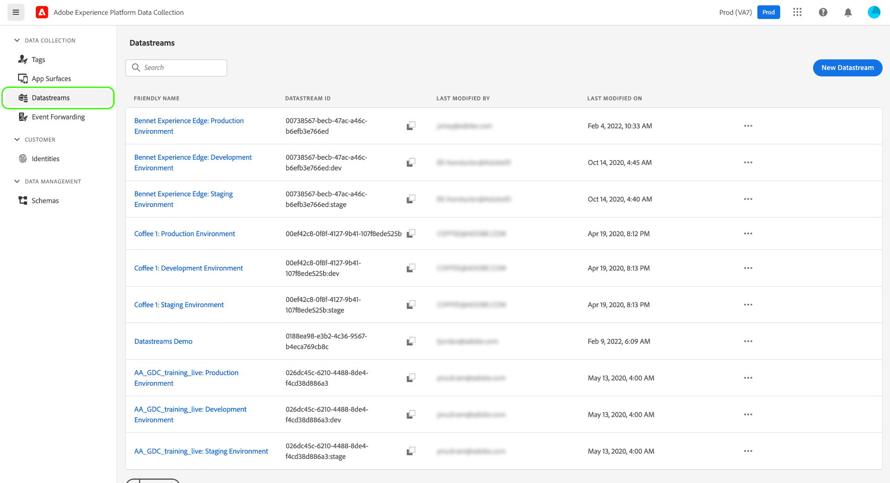
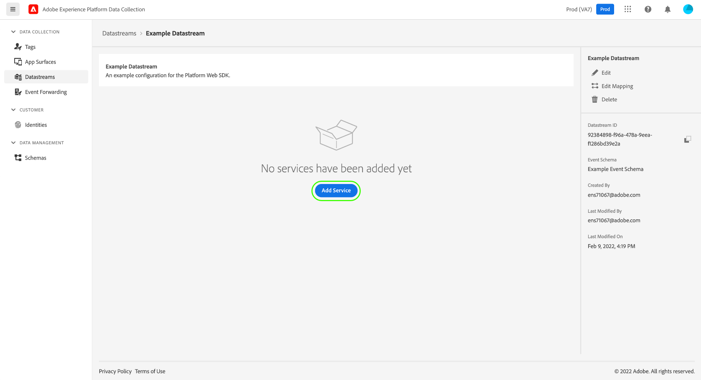
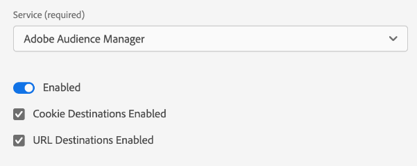

# Configuration d’un flux de données

Un flux de données représente la configuration côté serveur lors de l’implémentation des SDK Web et Mobile Adobe Experience Platform. Lorsque la variable [configuration, commande](configuring-the-sdk.md) dans le SDK contrôle les éléments qui doivent être gérés sur le client (comme la variable `edgeDomain`), les flux de données gèrent toutes les autres configurations pour le SDK. Lorsqu’une demande est envoyée au réseau Edge Adobe Experience Platform, la variable `edgeConfigId` est utilisé pour référencer le flux de données. Cela vous permet de mettre à jour la configuration côté serveur sans avoir à modifier le code de votre site web.

Ce document décrit les étapes de configuration d’un flux de données dans l’interface utilisateur de la collecte de données.

>[!NOTE]
>
>Votre entreprise doit être configurée pour cette fonctionnalité afin d’y accéder dans l’interface utilisateur. Si vous n’y avez pas accès, contactez votre responsable du succès client pour qu’il soit mis en liste autorisée.

## Accédez au [!UICONTROL Datastreams] workspace

Vous pouvez créer et gérer des flux de données dans l’interface utilisateur de la collecte de données en sélectionnant **[!UICONTROL Datastreams]** dans le volet de navigation de gauche.

>[!NOTE]
>
>Lorsque vous pouvez accéder à la variable [!UICONTROL Datastreams] que vous utilisiez ou non les fonctionnalités de gestion des balises de Platform, vous devez disposer des autorisations de développeur pour gérer les flux de données eux-mêmes. Voir [permissions utilisateur](../../tags/ui/administration/user-permissions.md) pour plus d’informations.

Le [!UICONTROL Datastreams] affiche une liste des flux de données existants, y compris leur nom convivial, leur identifiant et leur date de dernière modification. Sélectionnez le nom d’un flux de données sur [afficher ses détails et configurer des services ;](#view-details).

Sélectionnez l’icône &quot;plus&quot; (**...**) pour un flux de données spécifique afin d’afficher plus d’options. Sélectionner **[!UICONTROL Modifier]** pour mettre à jour la variable [configuration de base](#configure) pour le flux de données, ou sélectionnez **[!UICONTROL Supprimer]** pour supprimer le flux de données.

## Création d’un flux de données {#create}

Pour créer un flux de données, commencez par sélectionner **[!UICONTROL Nouvelle structure de données]**.

### [!UICONTROL Configuration] {#configure}

Le workflow de création de la chaîne de données s’affiche, en commençant à l’étape de configuration. À partir de là, vous devez fournir un nom et une description facultative pour le flux de données.

Si vous configurez ce flux de données à utiliser dans Experience Platform et que vous utilisez le SDK Web Platform, vous devez également sélectionner une [schéma XDM (Experience Data Model) basé sur un événement](../../xdm/classes/experienceevent.md) pour représenter les données que vous prévoyez d’ingérer.

Le reste de cette section se concentre sur les étapes de mappage des données à un schéma d’événement Platform sélectionné. Si vous utilisez le SDK Mobile ou si vous ne configurez pas votre flux de données pour Platform, sélectionnez **[!UICONTROL Enregistrer]** avant de passer à la section suivante sur [ajout de services à la banque de données](#add-services).

### Préparation de données pour la collecte de données {#data-prep}

>[!IMPORTANT]
>
>La préparation des données pour la collecte de données n’est actuellement pas prise en charge pour les mises en oeuvre du SDK Mobile.

Data Prep est un service Experience Platform qui vous permet de mapper, de transformer et de valider des données vers et depuis le modèle de données d’expérience (XDM). Lors de la configuration d’un flux de données activé par Platform, vous pouvez utiliser les fonctionnalités de préparation de données pour mapper vos données source à XDM lors de leur envoi à Platform Edge Network.

Les sous-sections ci-dessous décrivent les étapes de base du mappage de vos données dans l’interface utilisateur de la collecte de données. Pour obtenir des instructions complètes sur toutes les fonctionnalités de la préparation de données, y compris les fonctions de transformation des champs calculés, consultez la documentation suivante :

* [Présentation de la préparation des données](../../data-prep/home.md)
* [Fonctions de mappage de la préparation de données](../../data-prep/functions.md)
* [Gestion des formats de données avec la préparation des données](../../data-prep/data-handling.md)

#### [!UICONTROL Choix des données]

Sélectionner **[!UICONTROL Enregistrement et ajout d’un mappage]** après avoir terminé la [étape de configuration de base](#configure), et la variable **[!UICONTROL Sélectionner des données]** s’affiche. À partir de là, vous devez fournir un exemple d’objet JSON qui représente la structure des données que vous prévoyez d’envoyer à Platform. Vous pouvez sélectionner l’option pour charger l’objet sous forme de fichier ou coller l’objet brut dans la zone de texte fournie à la place.

>[!NOTE]
>
>L’objet JSON doit comporter un noeud racine unique. `data` afin de réussir la validation.

Si le fichier JSON est valide, un schéma d’aperçu s’affiche dans le panneau de droite. Sélectionnez **[!UICONTROL Suivant]** pour continuer.

#### [!UICONTROL Mappage]

Le **[!UICONTROL Mappage]** s’affiche, ce qui vous permet de mapper les champs de vos données source à celui du schéma d’événement cible dans Platform. Pour commencer, sélectionnez **[!UICONTROL Ajouter un nouveau mappage]** pour créer une ligne de mappage.

Sélectionnez l’icône source () et dans la boîte de dialogue qui s’affiche, sélectionnez le champ source que vous souhaitez mapper dans la zone de travail fournie. Une fois que vous avez choisi un champ, utilisez le **[!UICONTROL Sélectionner]** pour continuer.

Sélectionnez ensuite l’icône de schéma () pour ouvrir une boîte de dialogue similaire pour le schéma d’événement cible. Sélectionnez le champ vers lequel vous souhaitez mapper les données avant de confirmer avec **[!UICONTROL Sélectionner]**.

La page de mappage réapparaît avec le mappage des champs terminé affiché. Le **[!UICONTROL Mappage de la progression]** mises à jour de section pour refléter le nombre total de champs qui ont été mappés avec succès.

Continuez à suivre les étapes ci-dessus pour mapper le reste des champs au schéma cible. Bien que vous n’ayez pas à mapper tous les champs source disponibles, les champs du schéma cible définis selon les besoins doivent être mappés pour terminer cette étape. Le **[!UICONTROL Champs obligatoires]** Le compteur indique le nombre de champs requis qui ne sont pas encore mappés dans la configuration actuelle.

Une fois que le nombre de champs requis est nul et que vous êtes satisfait de votre mappage, sélectionnez **[!UICONTROL Enregistrer]** pour finaliser vos modifications.

## Affichage des détails d’un flux de données {#view-details}

Après avoir configuré un nouveau flux de données ou sélectionné un flux existant à afficher, la page de détails de ce flux de données s’affiche. Vous trouverez ici des informations supplémentaires sur la banque de données, y compris son identifiant.

Lorsqu’un flux de données est créé, trois environnements associés sont automatiquement créés avec des paramètres identiques. Ces trois environnements : `dev`, `stage`, et `prod`, qui correspondent à la variable [environnements par défaut pour les balises](../../tags/ui/publishing/environments.md). Lorsque vous créez une bibliothèque de balises dans une `dev` , la bibliothèque utilise automatiquement la variable `dev` de la banque de données. Vous pouvez modifier librement les paramètres dans des environnements individuels en fonction de vos besoins.

Dans les implémentations du SDK, une `edgeConfigId` est un identifiant composite qui spécifie le flux de données et l’environnement particulier dans ce flux de données. Par exemple, pour spécifier la variable `stage` environnement pour un flux de données avec un identifiant `1c86778b-cdba-4684-9903-750e52912ad1`, utilisez le `edgeConfigId` `1c86778b-cdba-4684-9903-750e52912ad1:stage`.

>[!IMPORTANT]
>
>Si aucun environnement n’est présent dans l’ID composite, l’environnement de production (`prod`) est utilisée.

À partir de l’écran des détails de la chaîne de données, vous pouvez [ajouter des services](#add-services) pour activer les fonctionnalités des produits Adobe Experience Cloud auxquels vous avez accès.

## Ajout de services à un flux de données {#add-services}

Sur la page de détails d’une banque de données, sélectionnez **[!UICONTROL Ajouter un service]** pour commencer à ajouter les services disponibles pour ce flux de données.

Sur l’écran suivant, utilisez le menu déroulant pour sélectionner un service à configurer pour cette banque de données. Seuls les services auxquels vous avez accès apparaîtront dans cette liste.

Sélectionnez le service souhaité, renseignez les options de configuration qui s’affichent, puis sélectionnez **[!UICONTROL Enregistrer]** pour ajouter le service au flux de données. Tous les services ajoutés s’affichent dans la vue Détails de la banque de données.

Les sous-sections ci-dessous décrivent les options de configuration de chaque service.

>[!NOTE]
>
>Chaque configuration de service contient une **[!UICONTROL Activé]** bascule qui est automatiquement activé lorsque le service est sélectionné. Pour désactiver le service sélectionné pour ce flux de données, sélectionnez l’option **[!UICONTROL Activé]** basculez à nouveau.

### Paramètres Adobe Analytics

Ce service contrôle si et comment les données sont envoyées à Adobe Analytics. Vous trouverez des informations supplémentaires dans le guide sur la [envoi de données à Analytics](../data-collection/adobe-analytics/analytics-overview.md).

| Paramètre | Description |
| --- | --- |
| [!UICONTROL Identifiant de Report Suite] | **(Obligatoire)** Identifiant de la suite de rapports Analytics à laquelle vous souhaitez envoyer des données. Cet identifiant se trouve dans l’interface utilisateur d’Adobe Analytics sous [!UICONTROL Administration] > [!UICONTROL ReportSuites]. Si plusieurs suites de rapports sont spécifiées, les données sont copiées dans chaque suite de rapports. |

### Paramètres Adobe Audience Manager

Ce service contrôle si et comment les données sont envoyées à Adobe Audience Manager. Pour envoyer des données à Audience Manager, il suffit d’activer cette section. Les autres paramètres sont facultatifs, mais encouragés.

| Paramètre | Description |
| --- | --- |
| [!UICONTROL Destinations de cookie activées] | Permet au SDK de partager des informations sur les segments via [destinations de cookie](https://experienceleague.adobe.com/docs/audience-manager/user-guide/features/destinations/custom-destinations/create-cookie-destination.html) de [!DNL Audience Manager]. |
| [!UICONTROL Destinations d’URL activées] | Permet au SDK de partager des informations sur les segments via [Destinations d’URL](https://experienceleague.adobe.com/docs/audience-manager/user-guide/features/destinations/custom-destinations/create-url-destination.html) de [!DNL Audience Manager]. |

### Paramètres d’Adobe Experience Platform

>[!IMPORTANT]
>
>Lors de l’activation d’un flux de données pour Platform, prenez note de l’environnement de test Platform que vous utilisez actuellement, tel qu’affiché dans le ruban supérieur de l’interface utilisateur de la collecte de données.
>
>
>
>Les environnements de test sont des partitions virtuelles dans Adobe Experience Platform qui vous permettent d’isoler vos données et implémentations des autres membres de votre organisation. Une fois un flux de données créé, son environnement de test ne peut plus être modifié. Pour plus d’informations sur le rôle des environnements de test dans Experience Platform, voir [documentation des environnements de test](../../sandboxes/home.md).

Ce service contrôle si et comment les données sont envoyées à Adobe Experience Platform.

| Paramètre | Description |
| --- | --- |
| [!UICONTROL Jeu de données d’événement] | **(Obligatoire)** Sélectionnez le jeu de données Platform vers lequel les données d’événement client seront diffusées. Ce schéma doit utiliser la variable [Classe XDM ExperienceEvent](../../xdm/classes/experienceevent.md). |
| [!UICONTROL Jeu de données de profil] | Sélectionnez le jeu de données Platform auquel les données d’attributs du client seront envoyées. Ce schéma doit utiliser la variable [Classe XDM Individual Profile](../../xdm/classes/individual-profile.md). |
| [!UICONTROL Offer Decisioning] | Cochez cette case pour activer l’Offer decisioning pour une mise en oeuvre du SDK Web Platform. Consultez le guide sur la [utilisation de l’Offer decisioning avec le SDK Web Platform](../personalization/offer-decisioning/offer-decisioning-overview.md) pour plus d’informations sur l’implémentation. Pour plus d’informations sur les fonctionnalités d’Offer decisioning, reportez-vous à la section [Documentation Adobe Journey Optimizer](https://experienceleague.adobe.com/docs/journey-optimizer/using/offer-decisioniong/get-started/starting-offer-decisioning.html?lang=fr). |
| [!UICONTROL Segmentation Edge] | Cochez cette case pour activer [segmentation de périphérie](../../segmentation/ui/edge-segmentation.md) pour ce flux de données. Lorsque le SDK envoie des données par le biais d’un flux de données activé pour la segmentation Edge, toutes les adhésions de segment mises à jour pour le profil en question sont renvoyées dans la réponse.  Cette option peut être utilisée conjointement avec [!UICONTROL Destinations de personnalisation] pour [Cas d’utilisation de la personnalisation de la page suivante](../../destinations/ui/configure-personalization-destinations.md). |
| [!UICONTROL Destinations de personnalisation] | Utilisé en combinaison avec la propriété [!UICONTROL Segmentation Edge] , cette option permet à la banque de données de se connecter à des moteurs de personnalisation tels qu’Adobe Target. Reportez-vous à la documentation des destinations pour obtenir des instructions spécifiques sur [configuration des destinations de personnalisation](../../destinations/ui/configure-personalization-destinations.md). |

### Paramètres Adobe Target

Ce service contrôle si et comment les données sont envoyées à Adobe Target.

| Paramètre | Description |
| --- | --- |
| [!UICONTROL Jeton de propriété] | [!DNL Target] permet aux clients de contrôler les autorisations par l’utilisation des propriétés. Pour plus d’informations sur les propriétés, consultez le guide sur [configuration des autorisations d’entreprise](https://experienceleague.adobe.com/docs/target/using/administer/manage-users/enterprise/properties-overview.html?lang=fr) dans le [!DNL Target] documentation.  Le jeton de propriété se trouve dans l’interface utilisateur d’Adobe Target sous [!UICONTROL Configuration] > [!UICONTROL Propriétés]. |
| [!UICONTROL Identifiant d’environnement de Target] | [Environnements dans Adobe Target](https://experienceleague.adobe.com/docs/target/using/administer/hosts.html) vous aider à gérer votre mise en oeuvre à toutes les étapes de développement. Ce paramètre spécifie l’environnement que vous allez utiliser avec ce flux de données.  La bonne pratique consiste à définir cela différemment pour chacun de vos `dev`, `stage`, et `prod` des environnements de flux de données pour simplifier les choses. Cependant, si des environnements Adobe Target sont déjà définis, vous pouvez les utiliser. |
| [!UICONTROL Espace de noms d’ID tiers de Target] | L’espace de noms d’identité pour la variable `mbox3rdPartyId` vous souhaitez utiliser pour ce flux de données. Consultez le guide sur la [implémentation `mbox3rdPartyId` avec le SDK Web](../personalization/adobe-target/using-mbox-3rdpartyid.md) pour plus d’informations. |

### [!UICONTROL Transfert d’événement] paramètres

Ce service contrôle si et comment les données sont envoyées à [transfert d’événement](../../tags/ui/event-forwarding/overview.md).

| Paramètre | Description |
| --- | --- |
| [!UICONTROL Propriété Launch] | **(Obligatoire)** La propriété de transfert d’événement à laquelle vous souhaitez envoyer des données. |
| [!UICONTROL Environnement de lancement] | **(Obligatoire)** Environnement au sein de la propriété sélectionnée auquel vous souhaitez envoyer des données. |

>[!NOTE]
>
>Vous pouvez sélectionner **[!UICONTROL Saisie manuelle des identifiants]** pour saisir les noms des propriétés et des environnements au lieu d’utiliser les menus déroulants.

### [!UICONTROL Synchronisation des identifiants tiers] paramètres

La section ID tiers est la seule section toujours active. Deux paramètres sont disponibles : &quot;[!UICONTROL Synchronisation des identifiants tiers activée]&quot; et &quot;[!UICONTROL ID de conteneur de synchronisation des identifiants tiers]&quot;.

| Paramètre | Description |
| --- | --- |
| [!UICONTROL ID de conteneur de synchronisation des identifiants tiers] | Les synchronisations des identifiants peuvent être regroupées en conteneurs afin de permettre l’exécution de différentes synchronisations des identifiants à différents moments. Cela contrôle le conteneur des synchronisations des identifiants exécuté pour ce flux de données. |

## Étapes suivantes

Ce guide explique comment configurer un flux de données dans l’interface utilisateur de la collecte de données. Pour plus d’informations sur l’installation et la configuration du SDK Web après la configuration d’un flux de données, reportez-vous à la section [Guide de collecte de données E2E](../../collection/e2e.md#install).
