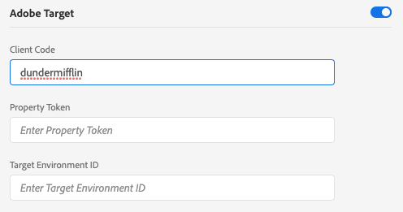

# Création d’une configuration de bord

La configuration du SDK Web Adobe Experience Platform est fractionnée en deux emplacements. La commande [configure](configuring-the-sdk.md) du SDK contrôle les éléments qui doivent être traités sur le client, comme la commande `edgeDomain`. La configuration edge gère toutes les autres configurations pour le SDK. Lorsqu&#39;une requête est envoyée au réseau Edge de Adobe Experience Platform, `edgeConfigId` est utilisé pour référencer la configuration côté serveur. Cela vous permet de mettre à jour la configuration sans avoir à modifier le code de votre site Web.

Votre organisation doit être configurée pour cette fonctionnalité. Veuillez contacter votre responsable de succès client (CSM) pour être mis en liste autorisée.

## Création d’une configuration Edge

Les configurations Edge peuvent être créées dans l&#39;Adobe [!DNL Experience Platform Launch] à l&#39;aide de l&#39;outil de configuration Edge.

>[!NOTE]
>
>L’outil de configuration des arêtes est disponible pour les clients de la liste autorisée, qu’ils utilisent [!DNL Experience Platform Launch] comme gestionnaire de balises. De plus, les utilisateurs ont besoin des autorisations de développement dans [!DNL Experience Platform Launch]. Pour plus d&#39;informations, consultez l&#39;article [Autorisations d&#39;utilisateur](https://docs.adobe.com/content/help/fr-FR/launch/using/reference/admin/user-permissions.html) dans la documentation [!DNL Experience Platform Launch].

Créez une configuration de bord en cliquant sur **[!UICONTROL Nouvelle configuration de bord]** dans la zone supérieure droite de l&#39;écran. Après avoir fourni un nom et une description, vous êtes invité à définir les paramètres par défaut de chaque environnement. Les paramètres disponibles sont détaillés ci-dessous.

Lors de la création d&#39;une configuration de bord, trois environnements sont automatiquement créés avec des paramètres identiques. Ces trois environnements sont *dev*, *stage* et *prod*. Ils correspondent aux trois environnements par défaut dans [!DNL Experience Platform Launch]. Lorsque vous créez une bibliothèque [!DNL Experience Platform Launch] dans un environnement de développement, celle-ci utilise automatiquement l&#39;environnement de développement de votre configuration. Vous pouvez modifier les paramètres d’un environnement à votre convenance.

L’ID utilisé dans le SDK en tant que `edgeConfigId` est un ID composite qui spécifie la configuration et l’environnement (par exemple, `1c86778b-cdba-4684-9903-750e52912ad1:stage`). Si aucun environnement n’est présent dans l’ID composite (par exemple, `stage` dans l’exemple précédent), l’environnement de production est utilisé.

Vous trouverez ci-dessous les paramètres disponibles pour chaque environnement de configuration. La plupart des sections peuvent être activées ou désactivées. Lorsque cette option est désactivée, vos paramètres sont enregistrés mais ne sont pas principaux.

## [!UICONTROL Paramètres ] IDSettings tiers

La section d’identifiant tiers est la seule qui est toujours activée. Deux paramètres sont disponibles : &quot;[!UICONTROL Synchronisation des identifiants tiers activée]&quot; et &quot;[!UICONTROL ID de Conteneur de synchronisation des identifiants tiers]&quot;.

### [!UICONTROL Synchronisation des identifiants tiers activée]

Contrôle si le SDK effectue ou non des synchronisations d’identité avec des partenaires tiers.

### [!UICONTROL ID de Conteneur de synchronisation des identifiants tiers]

Les synchronisations d’identifiants peuvent être regroupées en conteneurs pour permettre l’exécution de différentes synchronisations d’identifiants à des moments différents. Cela contrôle quel conteneur d’ID synchronisé est exécuté pour un ID de configuration donné.

## Paramètres Adobe Experience Platform

Les paramètres répertoriés ici vous permettent d&#39;envoyer des données à Adobe Experience Platform. Vous ne devez activer cette section que si vous avez acheté le Adobe Experience Platform.

### [!UICONTROL Environnement de test]

Les sandbox sont des emplacements de Adobe Experience Platform qui permettent aux clients d’isoler leurs données et leurs implémentations les unes des autres. Pour plus de détails sur leur fonctionnement, consultez la [documentation Sandbox](../../sandboxes/home.md).

### [!UICONTROL Entrée de diffusion en continu]

Une entrée en flux continu est une source HTTP à Adobe Experience Platform. Elles sont créées sous l&#39;onglet &quot;[!UICONTROL Sources]&quot; dans Adobe Experience Platform sous la forme d&#39;une API HTTP.

### [!UICONTROL Jeu de données événement]

Les configurations Edge prennent en charge l&#39;envoi de données à des jeux de données qui ont un schéma de classe [!UICONTROL Événement d&#39;expérience].

## Paramètres Adobe Target

Pour configurer Adobe Target, vous devez fournir un code client. Les autres champs sont facultatifs.

>[!NOTE]
>
>L&#39;organisation associée au code client doit correspondre à l&#39;organisation dans laquelle l&#39;ID de configuration est créé.

### [!UICONTROL Code client]

ID unique d’un compte de cible. Pour ce faire, vous pouvez accéder à [!UICONTROL Adobe Target] > [!UICONTROL Configuration] [!UICONTROL Implémentation] > [!UICONTROL modifier les paramètres] en regard du bouton [!UICONTROL télécharger] pour [!UICONTROL at.js] ou &lt;a1 2/>mbox.js][!UICONTROL 

### [!UICONTROL Jeton de propriété]

[!DNL Target] permet aux clients de contrôler les autorisations en utilisant les propriétés. Vous trouverez des détails dans la section [Autorisations d&#39;entreprise](https://docs.adobe.com/content/help/fr-FR/target/using/administer/manage-users/enterprise/properties-overview.html) de la documentation [!DNL Target].

Le jeton de propriété se trouve dans [!UICONTROL Adobe Target] > [!UICONTROL setup] > [!UICONTROL Properties]

### [!UICONTROL ID d’Environnement cible]

[Les ](https://docs.adobe.com/content/help/en/target/using/administer/hosts.html) environnements d’Adobe Target vous aident à gérer votre implémentation à toutes les étapes de développement. Ce paramètre spécifie l’environnement que vous allez utiliser avec chaque environnement.

Adobe recommande de définir cette variable différemment pour chacun de vos environnements de configuration de bord `dev`, `stage` et `prod` afin de garder les choses simples. Cependant, si vous avez déjà défini des environnements Adobe Target, vous pouvez les utiliser.

## Paramètres Adobe Audience Manager

Pour envoyer des données à Adobe Audience Manager, il suffit d’activer cette section. Les autres paramètres sont facultatifs mais encouragés.

### [!UICONTROL Destinations des cookies activées]

Permet au SDK de partager des informations de segment via [Destinations de cookies](https://docs.adobe.com/content/help/en/audience-manager/user-guide/features/destinations/custom-destinations/create-cookie-destination.html) à partir de [!DNL Audience Manager].

### [!UICONTROL Destinations d’URL activées]

Permet au SDK de partager des informations de segment via [URL Destinations](https://docs.adobe.com/content/help/en/audience-manager/user-guide/features/destinations/custom-destinations/create-url-destination.html). Ils sont configurés dans [!DNL Audience Manager].

## Paramètres Adobe Analytics

Contrôle si les données sont envoyées à Adobe Analytics. Pour plus d’informations, voir [Présentation d’Analytics](../data-collection/adobe-analytics/analytics-overview.md).

### [!UICONTROL Identifiant de Report Suite]

La suite de rapports se trouve dans la section Admin Adobe Analytics sous [!UICONTROL Admin > ReportSuites]. Si plusieurs suites de rapports sont spécifiées, les données sont alors copiées dans chaque suite de rapports.
