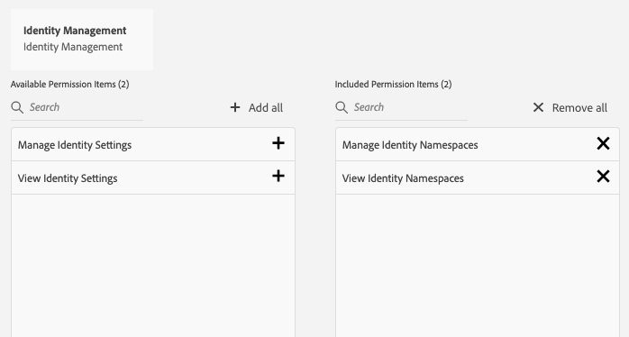

# Conditions préalables requises pour l’utilisation du SDK Web de Adobe Experience Platform

Pour utiliser le SDK Web de Adobe Experience Platform, vous devez d’abord :

- Demandez à votre entreprise de configurer cette fonctionnalité. Si vous souhaitez y accéder, veuillez renseigner les informations suivantes : [formulaire](https://adobe.ly/websdkaccess) et Adobe vous donnera accès aux flux de données et à Adobe Experience Platform (si nécessaire). Veuillez noter que l’Adobe vous fournira l’accès nécessaire à une utilisation limitée avec le SDK sans frais supplémentaires.
- Il est recommandé d’activer le domaine propriétaire (CNAME). Si vous disposez déjà d’un CNAME pour Adobe Analytics, vous devez l’utiliser. Le test en développement fonctionne sans CNAME, mais Adobe recommande d’en avoir un avant de passer en production. Bien qu’une mise en oeuvre CNAME ne fournisse aucun avantage en termes de durée de vie des cookies, elle peut empêcher certains bloqueurs d’annonces et navigateurs moins courants de bloquer les demandes de SDK. Dans ce cas, l’utilisation d’un CNAME peut empêcher que votre collecte de données ne soit interrompue pour les utilisateurs qui utilisent ces outils.

>[!IMPORTANT]
>
>**Notez qu’à compter du 11/10/20, les mises en oeuvre CNAME propriétaires expirent de 7 jours sur tous les navigateurs Safari et les appareils iOS mobiles.**

- Si votre site web utilise déjà la variable [Service d’ID Experience Cloud](https://experienceleague.adobe.com/docs/experience-platform/edge/identity/overview.html) sur votre site web (via l’API visiteur ou l’extension du service d’ID Experience Cloud dans Adobe Experience Platform Launch) et que vous souhaitez continuer à l’utiliser lors de la migration vers le SDK Web Adobe Experience Platform, vous devez utiliser la dernière version de l’API visiteur ou l’extension du service d’ID Experience Cloud. Voir [Migration des identifiants](https://experienceleague.adobe.com/docs/experience-platform/edge/identity/overview.html?lang=en#identity) pour plus d’informations.

## Gestion des autorisations pour le SDK Web Adobe Experience Platform

Pour commencer à utiliser Adobe Experience Platform, vous devez disposer des droits [permissions](https://experienceleague.adobe.com/docs/experience-platform/access-control/home.html?lang=fr) pour créer vos schémas et gérer les identités. Les autorisations minimales requises sont disponibles dans la catégorie Modélisation des données et identités .

Dans la catégorie Modélisation des données , accordez aux utilisateurs les autorisations Manage Schemas (Gérer les schémas) et View Schemas (Afficher les schémas).

Dans la catégorie Identity Management , accordez aux utilisateurs les autorisations Manage Identity Namespaces (Gérer les espaces de noms d’identité) et View Identity Namespaces (Afficher les espaces de noms d’identité).

