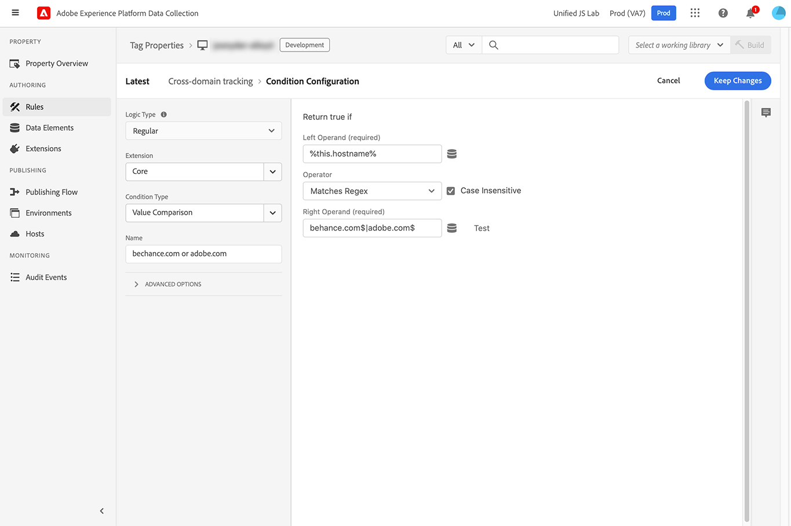

# Partage d’identifiants entre appareils mobiles et domaines

## Présentation

Le SDK Web de Adobe Experience Platform prend en charge les fonctionnalités de partage des identifiants visiteur qui permettent aux clients de fournir des expériences personnalisées plus précisément, entre les applications mobiles et le contenu web mobile, et entre les domaines.

## Cas d&#39;utilisation {#use-cases}

### offrir une personnalisation cohérente entre les applications mobiles et les sites web mobiles ;

Une société de vêtements souhaite personnaliser l’expérience de ses clients en fonction de leurs intérêts et conserver la personnalisation exacte dans une application mobile qui charge également WebViews. En utilisant la fonction de partage d’ID entre appareils mobiles et Web, ils peuvent s’assurer que les offres les plus précises sont présentées aux clients, en utilisant le même identifiant visiteur dans l’application et le même contenu web mobile en transmettant le message [!DNL ECID] à l’URL web mobile.

### Effectuer une personnalisation cohérente entre les domaines

Un détaillant disposant de plusieurs magasins en ligne souhaite personnaliser l’expérience client sur ses domaines, en fonction des intérêts du client. À l’aide de la fonctionnalité de partage d’identifiants inter-domaines du SDK Web, le détaillant peut fournir des offres précises en fonction des intérêts des clients, sur tous leurs domaines.

### Amélioration des rapports sur les activités des visiteurs

Un détaillant de technologie souhaite améliorer la création de rapports sur l’activité des visiteurs avec des informations sur le moment où ses visiteurs passent de l’application mobile à leur site web mobile ou à leurs autres domaines. Grâce à la fonctionnalité de partage d’identifiants inter-domaines du SDK Web, l’équipe marketing peut effectuer un suivi précis des visiteurs sur leurs propriétés web et générer des rapports d’activité.

## Conditions préalables {#prerequisites}

Pour utiliser le partage d’identifiants entre appareils mobiles et sur plusieurs domaines, vous devez utiliser [!DNL Web SDK] version 2.11.0 ou ultérieure.

Pour les implémentations mobiles d’Edge Network, cette fonctionnalité est prise en charge dans la [Identité pour le réseau Edge](https://aep-sdks.gitbook.io/docs/foundation-extensions/identity-for-edge-network) à partir de la version 1.1.0 (iOS et Android).

Cette fonctionnalité est également compatible avec [!DNL VisitorAPI.js] version 1.7.0 ou ultérieure.

## Partage des identifiants de mobile à web {#mobile-to-web}

Utilisez la variable `getUrlVariables` de l’API [Identité pour le réseau Edge](https://aep-sdks.gitbook.io/docs/foundation-extensions/identity-for-edge-network/api-reference#geturlvariables) extension pour récupérer les identifiants en tant que paramètres de requête et les joindre à votre URL lors de l’ouverture [!DNL webViews].

Aucune configuration supplémentaire n’est requise pour que le SDK Web accepte `ECID` dans la chaîne de requête.

Le paramètre de chaîne de requête comprend :

* `MCID`: L’ID d’Experience Cloud (`ECID`)
* `MCORGID`: L’Experience Cloud `orgID` qui doit correspondre à la variable `orgID` configuré dans le [!DNL Web SDK].
* `TS`: Un paramètre d’horodatage ne peut pas dépasser cinq minutes.


Le partage des identifiants entre appareils mobiles et web utilise la variable `adobe_mc` . Lorsque la variable `adobe_mc` est présent et valide, la variable `ECID` de la chaîne de requête est automatiquement ajoutée à la carte d’identité dans la première requête envoyée au réseau Edge. Toutes les interactions réseau Edge suivantes utiliseront la variable `ECID`.

Pour plus d’informations sur la manière de transmettre les identifiants visiteur d’une application mobile à un WebView, consultez la documentation sur [gestion des WebViews](https://experienceleague.adobe.com/docs/platform-learn/implement-mobile-sdk/app-implementation/web-views.html#implementation).

## Partage des identifiants inter-domaines {#cross-domain-sharing}

Pour le partage d’identifiants entre domaines, le SDK Web version 2.11.0 prend en charge la variable `appendIdentityToUrl` . Lorsqu’elle est utilisée, cette commande génère le `adobe_mc` paramètre de chaîne de requête.

La commande accepte un objet avec une propriété, `url`, et renvoie un objet avec la propriété . `url`.

Cette commande n’attend aucune mise à jour du consentement. Si le consentement n’a pas été fourni, l’URL est renvoyée inchangée.

Si `ECID` n’est pas fourni, la variable `/acquire` Un point de terminaison est appelé pour générer une `ECID`.

Vous trouverez ci-dessous un exemple de la manière dont un client peut mettre en oeuvre le partage d’ID inter-domaines sur son site web.

Ce code ajoute un écouteur d’événement pour tous les clics sur la page et si le clic se trouvait sur un lien vers un domaine correspondant (dans ce cas `adobe.com` ou `behance.com`), ajoute l’identité à l’URL et y redirige l’utilisateur.

```js
document.addEventListener("click", event => {
  const anchor = event.target.closest("a");
  if (!anchor || !anchor.href) {
    return;
  }
  const url = new URL(anchor.href);
  if (!url.hostname.endsWith("adobe.com") && !url.hostname.endsWith("behance.com")) {
    return;
  }
  event.preventDefault();
  alloy("appendIdentityToUrl", { url: anchor.href }).then(result => {
    document.location = result.url;
  });
});
```

## Utilisation de l’extension Balises {#tags-extension}

Semblable à l’utilisation de la variable [!DNL Web SDK], aucune configuration supplémentaire n’est requise dans la variable [!DNL Tags] pour utiliser les identités transmises par le biais de l’URL.

Pour utiliser le partage d’identifiants entre appareils mobiles et sur plusieurs domaines via l’extension Tags, vous devez utiliser la version 2.12.0 ou ultérieure de l’extension Tags.

Pour partager des identités de la page active avec d’autres domaines, une nouvelle action est disponible dans la variable [!DNL Web SDK] [!DNL Tags] extension . Cette action est conçue pour être utilisée avec une **[!UICONTROL Core - Clic]** type d’événement et condition de comparaison des valeurs.

Suivez les étapes décrites [here](../../tags/ui/managing-resources/rules.md) pour créer une règle avec la configuration suivante :

* [!UICONTROL Configuration d’événement]:
   * **[!UICONTROL Extension : Core]**
   * **[!UICONTROL Type d’événement : Cliquez sur]**
   * Sélectionner **[!UICONTROL Lorsque l’utilisateur clique sur > éléments spécifiques]**
   * Saisissez dans la variable **[!UICONTROL Sélecteur]**: `a[href]`. Cet événement se déclenche chaque fois qu’un utilisateur clique sur une balise d’ancrage sur la page comportant une balise `href` .

      

* [!UICONTROL Configuration de condition]
   * **[!UICONTROL Type de logique]**: [!UICONTROL Normal]
   * **[!UICONTROL Extension]** : [!UICONTROL Core]
   * **[!UICONTROL Type de condition]**: [!UICONTROL Value Comparison]
   * **[!UICONTROL Opérateur de gauche]**: [!UICONTROL `%this.hostname%`]. Il s’agit d’un élément de données spécial qui fonctionne avec [!UICONTROL Core - Clic] et correspond au nom d’hôte du lien sur lequel l’utilisateur a cliqué.
   * **[!UICONTROL Opérateur]**: [!UICONTROL Matches Regex]
   * **[!UICONTROL Opérateur de droit]**: Saisissez une expression régulière correspondant aux domaines avec lesquels vous souhaitez partager des identités. Par exemple, pour faire correspondre des liens avec des noms d’hôtes se terminant par `adobe.com` ou `behance.com`, utilisez cette expression régulière : `behance.com$|adobe.com$`. La page liée doit avoir la variable [!DNL Web SDK] ou [!DNL Visitor ID] installé pour accepter l’identité.

      

* [!UICONTROL Configuration d’action]
   * **[!UICONTROL Extension]**: [!UICONTROL SDK Web Adobe Experience Platform]
   * **[!UICONTROL Type d’action]**: [!UICONTROL Redirection vers une identité]
   * **[!UICONTROL Instance]**: Sélectionnez votre instance. Dans la plupart des cas, une seule instance est configurée. Si vous disposez de plusieurs instances, sélectionnez celle avec l’identité que vous souhaitez partager.

      

Le **[!UICONTROL Redirection vers une identité]** empêche le navigateur de naviguer jusqu’au lien. Ensuite, il appelle la variable `appendIdentityToUrl` sur la méthode [!DNL Web SDK] instance.

Enfin, il redirige l’utilisateur vers la fonction [!DNL URL] avec le `adobe_mc` paramètre de chaîne de requête ajouté.
