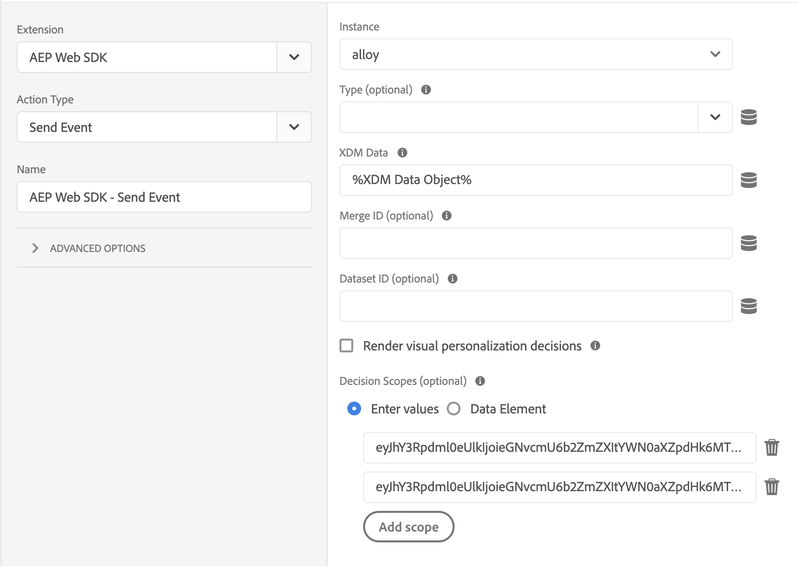

# Utilisation d’Offer Decisioning avec le SDK Web Platform

>[!NOTE]
>
>L’utilisation d’Offer Decisioning dans le SDK Web de Adobe Experience Platform est disponible en accès anticipé pour certains utilisateurs. Cette fonctionnalité n’est pas disponible pour toutes les organisations IMS.

Adobe Experience Platform [!DNL Web SDK] peut diffuser et générer des offres personnalisées gérées dans Offer Decisioning. Vous pouvez créer vos offres et d’autres objets connexes en utilisant l’interface utilisateur (UI) ou les API d’Offer Decisioning.

## Conditions préalables

* L’organisation IMS est activée pour la prise de décision Edge
* Offres, Activités créées
* Datastream est publié

## Terminologie

Il est important de comprendre la terminologie suivante lorsque vous utilisez Offer Decisioning. Pour plus d’informations et pour consulter d’autres termes, reportez-vous à la section [Glossaire Offer decisioning](https://experienceleague.adobe.com/docs/offer-decisioning/using/get-started/glossary.html).

* **Conteneur :** Un conteneur est un mécanisme d’isolation qui permet de séparer différentes préoccupations. L&#39;ID de conteneur est le premier élément de chemin d&#39;accès pour toutes les API du référentiel. Tous les objets de prise de décision résident dans un conteneur.

* **Portées de décision :** Pour les Offers decisionings, les portées de décision sont les chaînes codées Base64 de JSON contenant les identifiants d’activité et d’emplacement que vous souhaitez que le service d’offer decisioning utilise pour proposer des offres.

   *Portée de décision JSON :*

   ```json
   {
     "activityId":"xcore:offer-activity:11cfb1fa93381aca",
     "placementId":"xcore:offer-placement:1175009612b0100c"
   }
   ```

   *Chaîne codée Base64 du périmètre de la décision :*

   ```json
   "eyJhY3Rpdml0eUlkIjoieGNvcmU6b2ZmZXItYWN0aXZpdHk6MTFjZmIxZmE5MzM4MWFjYSIsInBsYWNlbWVudElkIjoieGNvcmU6b2ZmZXItcGxhY2VtZW50OjExNzUwMDk2MTJiMDEwMGMifQ=="
   ```

   >[!TIP]
   >
   >Vous pouvez copier la valeur de la portée de décision à partir de la variable **Présentation de l’activité** dans l’interface utilisateur.

   

* **Datastreams :** Pour plus d’informations, veuillez lire la [datastreams](../../datastreams/overview.md) documentation.

* **Identité**: Pour plus d’informations, veuillez lire cette documentation décrivant comment [Le SDK Web Platform utilise Identity Service](../../identity/overview.md).

## Activation de l’Offer decisioning

Pour activer l’Offer decisioning, procédez comme suit :

1. Adobe Experience Platform activé dans votre [datastream](../../datastreams/overview.md) et cochez la case &quot;Offer decisioning&quot;

   

1. Suivez les instructions de la section [installation du SDK](../../fundamentals/installing-the-sdk.md) (Le SDK peut être installé de manière autonome ou par l’intermédiaire de la fonction [Interface utilisateur de la collecte de données](https://experience.adobe.com/#/data-collection/). Voir [guide de démarrage rapide des balises](../../../tags/quick-start/quick-start.md)) pour plus d’informations.
1. [Configuration du SDK](../../fundamentals/configuring-the-sdk.md) pour l’Offer decisioning. Vous trouverez ci-dessous d’autres étapes spécifiques à l’Offer decisioning.

   * Installation du SDK autonome

      1. Configurez l’action &quot;sendEvent&quot; avec votre `decisionScopes`

         ```javascript
          alloy("sendEvent", {
             ...
             "decisionScopes": [
                 "eyJhY3Rpdml0eUlkIjoieGNvcmU6b2ZmZXItYWN0aXZpdHk6MTIxYWIwOWMxM2JkZDIyNCIsInBsYWNlbWVudElkIjoieGNvcmU6b2ZmZXItcGxhY2VtZW50OjEyMWFiMDZhODRkMDViMTEifQ==",
                 "eyJhY3Rpdml0eUlkIjoieGNvcmU6b2ZmZXItYWN0aXZpdHk6MTIxYWIyNWI5NTUwNWIxZiIsInBsYWNlbWVudElkIjoieGNvcmU6b2ZmZXItcGxhY2VtZW50OjEyMWFiMjFmOTQzMDE0MmIifQ=="
             ]
          })
         ```
   * Installation du SDK par le biais de balises

      1. [Créer une propriété de balise](../../../tags/ui/administration/companies-and-properties.md)
      1. [Ajouter du code incorporé](https://experienceleague.adobe.com/docs/core-services-learn/implementing-in-websites-with-launch/configure-launch/launch-add-embed.html)
      1. Installez et configurez l’extension SDK Web Platform avec le Datastream que vous avez créé en sélectionnant la configuration dans la liste déroulante &quot;Datastream&quot;. Consultez la documentation relative aux [extensions](../../../tags/ui/managing-resources/extensions/overview.md).

         

         

      1. Créez les [Éléments de données](../../../tags/ui/managing-resources/data-elements.md) nécessaires. Au minimum, vous devez créer un mappage d’identité SDK web Platform et un élément de données objet XDM du SDK web Platform.

         

         

      1. Créez votre [Règles](../../../tags/ui/managing-resources/rules.md).

         * Ajoutez une action Envoyer l’événement du SDK Web Platform et ajoutez le `decisionScopes` à la configuration de cette action.

            
      1. [](../../../tags/ui/publishing/libraries.md)Créez et publiez une bibliothèque contenant toutes les règles, éléments de données et extensions pertinents que vous avez configurés


## Exemples de requêtes et de réponses

### One `decisionScopes` value

**Requête**

```json
{
  "events": [
    {
      "xdm": {
        "identityMap": {
          "ECID": [
            {
              "id": "91133425615229052182584359620783097099"
            }
          ]
        }
      },
      "query": {
        "personalization": {
          "decisionScopes": [
            "eyJhY3Rpdml0eUlkIjoieGNvcmU6b2ZmZXItYWN0aXZpdHk6MTFjZmIxZmE5MzM4MWFjYSIsInBsYWNlbWVudElkIjoieGNvcmU6b2ZmZXItcGxhY2VtZW50OjExNzUwMDk2MTJiMDEwMGMifQ=="
          ]
        }
      }
    }
  ]
}
```

| Propriété | Obligatoire | Description | Limites | Exemple |
|---|---|---|---|---|
| `identityMap` | Oui | Consultez cette section [Documentation d’Identity Service](../../identity/overview.md). | Une identité par demande. | `{ "identityMap": { "ECID": [ { "id": "91133425615229052182584359620783097099" } ] } }`. <br><br> Remarque : Les utilisateurs n’ont pas besoin d’inclure la variable `ECID` dans l’appel API. Si nécessaire, ce paramètre est automatiquement ajouté à l’appel . |
| `decisionScopes` | Oui | Tableau de chaînes codées Base64 de JSON contenant les identifiants d’activité et d’emplacement. | Maximum 30 `decisionScopes` par demande. | `"decisionScopes": ["eyJhY3Rpdml0eUlkIjoieGNvcmU6b2ZmZXItYWN0aXZpdHk6MTFjZmIxZmE5MzM4MWFjYSIsInBsYWNlbWVudElkIjoieGNvcmU6b2ZmZXItcGxhY2VtZW50OjExNzUwMDk2MTJiMDEwMGMifQ=="]` |

**Réponse**

```json
{
  "requestId": "94c4f2f1-9218-43ce-afd3-eb0d853c5174",
  "handle": [
    {
      "payload": [
        {
          "id": "2862bb89-5df2-4bc6-85c2-d8f7e1a091de",
          "scope": "eyJhY3Rpdml0eUlkIjoieGNvcmU6b2ZmZXItYWN0aXZpdHk6MTFjZmIxZmE5MzM4MWFjYSIsInBsYWNlbWVudElkIjoieGNvcmU6b2ZmZXItcGxhY2VtZW50OjExNzUwMDk2MTJiMDEwMGMifQ==",
          "activity": {
            "id": "xcore:offer-activity:11cfb1fa93381aca",
            "etag": "2"
          },
          "placement": {
            "id": "xcore:offer-placement:1175009612b0100c",
            "etag": "1"
          },
          "items": [
            {
              "id": "xcore:personalized-offer:124cc332095cfa74",
              "schema": "https://ns.adobe.com/experience/offer-management/content-component-html",
              "etag": "1",
              "data": {
                "id": "xcore:personalized-offer:124cc332095cfa74",
                "format": "text/html",
                "language": [
                  "en-US"
                ],
                "content": "<p>20% Off on shipping</p>",
                "characteristics": {
                  "foo": "bar",
                  "foo1": "bar1"
                }
              }
            }
          ]
        }
      ],
      "type": "personalization:decisions",
      "eventIndex": 0
    }
  ]
}
```

| Propriété | Description | Exemple |
|---|---|---|
| `scope` | Portée de décision qui a abouti aux offres proposées. | `"scope": "eyJhY3Rpdml0eUlkIjoieGNvcmU6b2ZmZXItYWN0aXZpdHk6MTFjZmIxZmE5MzM4MWFjYSIsInBsYWNlbWVudElkIjoieGNvcmU6b2ZmZXItcGxhY2VtZW50OjExNzUwMDk2MTJiMDEwMGMifQ=="` |
| `activity.id` | Identifiant unique de l’activité d’offre. | `"id": "xcore:offer-activity:11cfb1fa93381aca"` |
| `placement.id` | Identifiant unique de l’emplacement de l’offre. | `"id": "xcore:offer-placement:1175009612b0100c"` |
| `items.id` | L’identifiant de l’offre proposée. | `"id": "xcore:personalized-offer:124cc332095cfa74"` |
| `schema` | Le schéma du contenu associé à l’offre proposée. | `"schema": "https://ns.adobe.com/experience/offer-management/content-component-html"` |
| `data.id` | L’identifiant de l’offre proposée. | `"id": "xcore:personalized-offer:124cc332095cfa74"` |
| `format` | Format du contenu associé à l’offre proposée. | `"format": "text/html"` |
| `language` | Tableau de langues associées au contenu de l’offre proposée. | `"language": [ "en-US" ]` |
| `content` | Contenu associé à l’offre proposée au format d’une chaîne. | `"content": "<p style="color:red;">20% Off on shipping</p>"` |
| `deliveryUrl` | Contenu de l&#39;image associé à l&#39;offre proposée au format d&#39;une URL. | `"deliveryURL": "https://image.jpeg"` |
| `characteristics` | Caractéristiques associées à l’offre proposée au format d’un objet JSON. | `"characteristics": { "foo": "bar", "foo1": "bar1" }` |

### Multiple `decisionScopes` values

**Requête**

```json
{
  "events": [
    {
      "xdm": {
        "identityMap": {
          "ECID": [
            {
              "id": "91133425615229052182584359620783097099"
            }
          ]
        }
      },
      "query": {
        "personalization": {
          "decisionScopes": [
            "eyJhY3Rpdml0eUlkIjoieGNvcmU6b2ZmZXItYWN0aXZpdHk6MTFjZmIxZmE5MzM4MWFjYSIsInBsYWNlbWVudElkIjoieGNvcmU6b2ZmZXItcGxhY2VtZW50OjExNzUwMDk2MTJiMDEwMGMifQ==",
            "eyJhY3Rpdml0eUlkIjoieGNvcmU6b2ZmZXItYWN0aXZpdHk6MTIyMjA4YjNhODc0MDU1OCIsInBsYWNlbWVudElkIjoieGNvcmU6b2ZmZXItcGxhY2VtZW50OjEyMjIwNDUyOTUxNGEyYzAifQ==",
            "eyJhY3Rpdml0eUlkIjoieGNvcmU6b2ZmZXItYWN0aXZpdHk6MTIyYzkxMzg1Mjc2MDE4YyIsInBsYWNlbWVudElkIjoieGNvcmU6b2ZmZXItcGxhY2VtZW50OjEyMzMxZjU2MTYyYWEyZjcifQ=="
          ]
        }
      }
    }
  ]
}
```

| Propriété | Obligatoire | Description | Limites | Exemple |
|---|---|---|---|---|
| `identityMap` | Oui | Consultez cette section [Documentation d’Identity Service](../../identity/overview.md). | Une identité par demande. | `{ "identityMap": { "ECID": [ { "id": "91133425615229052182584359620783097099" } ] } }`. <br><br> Remarque : Les utilisateurs n’ont pas besoin d’inclure la variable `ECID` dans l’appel API. Si nécessaire, ce paramètre est automatiquement ajouté à l’appel . |
| `decisionScopes` | Oui | Tableau de chaînes codées Base64 de JSON contenant les identifiants d’activité et d’emplacement. | Maximum 30 `decisionScopes` par demande. | `"decisionScopes":["eyJhY3Rpdml0eUlkIjoieGNvcmU6b2ZmZXItYWN0aXZpdHk6MTFjZmIxZmE5MzM4MWFjYSIsInBsYWNlbWVudElkIjoieGNvcmU6b2ZmZXItcGxhY2VtZW50OjExNzUwMDk2MTJiMDEwMGMifQ==", "eyJhY3Rpdml0eUlkIjoieGNvcmU6b2ZmZXItYWN0aXZpdHk6MTIyMjA4YjNhODc0MDU1OCIsInBsYWNlbWVudElkIjoieGNvcmU6b2ZmZXItcGxhY2VtZW50OjEyMjIwNDUyOTUxNGEyYzAifQ=="` |

**Réponse**

```json
{
  "requestId": "94c4f2f1-9218-43ce-afd3-eb0d853c5174",
  "handle": [
    {
      "payload": [
        {
          "id": "a2804dfb-a0ec-4df9-8311-59d3ecdeb642",
          "scope": "eyJhY3Rpdml0eUlkIjoieGNvcmU6b2ZmZXItYWN0aXZpdHk6MTFjZmIxZmE5MzM4MTEyMyIsInBsYWNlbWVudElkIjoieGNvcmU6b2ZmZXItcGxhY2VtZW50OjExNzUwMDk2MTJiMDExMjMifQ==",
          "activity": {
            "id": "xcore:offer-activity:11cfb1fa93381123",
            "etag": "1"
          },
          "placement": {
            "id": "xcore:offer-placement:1175009612b01123",
            "etag": "3"
          },
          "items": [
            {
              "id": "xcore:personalized-offer:11e36d4a22954123",
              "schema": "https://ns.adobe.com/experience/offer-management/content-component-text",
              "etag": "2",
              "data": {
                "id": "xcore:personalized-offer:11e36d4a22954123",
                "format": "text/text",
                "language": [
                  "en"
                ],
                "content": "20% Off on shipping",
                "characteristics": {
                  "foo2": "bar2"
                }
              }
            }
          ]
        },
        {
          "id": "a2804dfb-a0ec-4df9-8311-59d3ecdeb642",
          "scope": "eyJhY3Rpdml0eUlkIjoieGNvcmU6b2ZmZXItYWN0aXZpdHk6MTFjZmIxZmE5MzM4MWFjYSIsInBsYWNlbWVudElkIjoieGNvcmU6b2ZmZXItcGxhY2VtZW50OjExNzUwMDk2MTJiMDEwMGMifQ==",
          "activity": {
            "id": "xcore:offer-activity:11cfb1fa93381aca",
            "etag": "2"
          },
          "placement": {
            "id": "xcore:offer-placement:1175009612b0100c",
            "etag": "1"
          },
          "items": [
            {
              "id": "xcore:personalized-offer:11e36d4a2295415d",
              "schema": "https://ns.adobe.com/experience/offer-management/content-component-imagelink",
              "etag": "1",
              "data": {
                "id": "xcore:personalized-offer:11e36d4a2295415d",
                "format": "image/png",
                "language": [
                  "en"
                ],
                "deliveryURL": "https://image.jpeg",
                "characteristics": {
                  "foo": "bar",
                  "foo1": "bar1"
                }
              }
            }
          ]
        }
      ],
      "type": "personalization:decisions",
      "eventIndex": 0
    }
  ]
}
```

| Propriété | Description | Exemple |
|---|---|---|
| `scope` | Portée de décision qui a abouti aux offres proposées. | `"scope": "eyJhY3Rpdml0eUlkIjoieGNvcmU6b2ZmZXItYWN0aXZpdHk6MTFjZmIxZmE5MzM4MWFjYSIsInBsYWNlbWVudElkIjoieGNvcmU6b2ZmZXItcGxhY2VtZW50OjExNzUwMDk2MTJiMDEwMGMifQ=="` |
| `activity.id` | Identifiant unique de l’activité d’offre. | `"id": "xcore:offer-activity:11cfb1fa93381123"` |
| `placement.id` | Identifiant unique de l’emplacement de l’offre. | `"xcore:offer-placement:1175009612b01123"` |
| `items.id` | L’identifiant de l’offre proposée. | `"id": "xcore:personalized-offer:11e36d4a22954123"` |
| `schema` | Le schéma du contenu associé à l’offre proposée. | `"schema": "https://ns.adobe.com/experience/offer-management/content-component-text"` |
| `data.id` | L’identifiant de l’offre proposée. | `"id": "xcore:personalized-offer:11e36d4a22954123"` |
| `format` | Format du contenu associé à l’offre proposée. | `"format": "text/text"` |
| `language` | Tableau de langues associées au contenu de l’offre proposée. | `"language": [ "en-US" ]` |
| `content` | Contenu associé à l’offre proposée au format d’une chaîne. | `"content": "<p style="color:red;">20% Off on shipping</p>"` |
| `deliveryUrl` | Contenu de l&#39;image associé à l&#39;offre proposée au format d&#39;une URL. | `"deliveryURL": "https://image.jpeg"` |
| `characteristics` | Caractéristiques associées à l’offre proposée au format d’un objet JSON. | `"characteristics": { "foo": "bar", "foo1": "bar1" }` |

## Limites

Certaines contraintes d’offre ne sont actuellement pas prises en charge avec les workflows Experience Edge mobiles, comme les limitations, par exemple. La valeur du champ Limitation indique le nombre de fois où une offre peut être présentée à tous les utilisateurs. Pour plus d’informations, voir [Documentation sur les règles d’éligibilité et les contraintes d’offres](https://experienceleague.adobe.com/docs/offer-decisioning/using/managing-offers-in-the-offer-library/creating-personalized-offers.html#eligibility).
