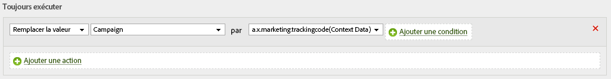

# (bêta) Envoi de données à Adobe Analytics

>[!IMPORTANT]
>
>Le SDK Web d’Adobe Experience Platform est actuellement en version bêta et n’est pas disponible pour tous les utilisateurs. La documentation et la fonctionnalité peuvent changer.

Le SDK Web d’Adobe Experience Platform peut envoyer des données à Adobe Analytics. Cela fonctionne en traduisant `xdm` dans un format utilisable par Adobe Analytics.

## Configuration

Adobe Analytics récupère automatiquement les données que vous envoyez si une suite de rapports est mappée dans l’interface utilisateur de configuration du client. Ici, vous pouvez mapper un ou plusieurs à une configuration donnée. Une fois qu’une suite de rapports est mappée, les données commencent automatiquement à circuler.

## Données mappées automatiquement

Adobe Experience Platform Edge Network mappe automatiquement de nombreuses variables XDM. Le complet des variables mappées automatiquement est répertorié [ici](../analytics/automatically-mapped-vars.md).

## Données mappées manuellement

Toutes les données collectées par le réseau Edge sont accessibles via des règles de traitement. Les données sont aplaties à l’aide de la notation point et disponibles sous la forme contextData.

Si vous aviez un  qui ressemblait à ça.

```javascript
{
  key:value,
  object:{
    key1:value1,
    key2:value2
  },
  array:[
    v1,
    v2,
    v3
  ],
  arrayofobjects:[
    {
      obj1key:objval1
    },
    {
      obj2key:objval2
    }
  ]
}
```

Il s’agirait alors des clés de données contextuelles à votre disposition.

```javascript
a.x.key //value
a.x.object.key1 //value1
a.x.object.key2 //value2
a.x.array[0] //v1
a.x.array[1] //v2
a.x.array[3] //v3
a.x.arrayofobjects[1].obj1key //objval1
a.x.arrayofobjects[2].obj2key //objval2
```

Voici un exemple de règle de traitement qui utiliserait ces données.


