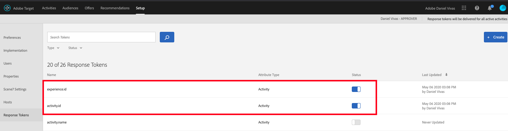

# [!DNL Target] Présentation

Adobe Experience Platform [!DNL Web SDK] peut fournir et rendre des expériences personnalisées gérées à Adobe Target sur le canal Web. Vous pouvez utiliser un éditeur WYSIWYG, appelé compositeur [d’expérience](https://docs.adobe.com/content/help/en/target/using/experiences/vec/visual-experience-composer.html) visuelle (VEC), ou une interface non visuelle, le compositeur d’expérience [basé sur les](https://docs.adobe.com/content/help/fr-FR/target/using/experiences/form-experience-composer.html)formulaires, pour créer, activer et diffuser vos activités et expériences de personnalisation.

## Activation de Adobe Target

Pour activer [!DNL Target]cette fonction, vous devez effectuer les opérations suivantes :

1. Activez les jetons de réponse activité.id et experience.id dans l’ [!DNL Target] interface utilisateur.



1. Activez la cible dans votre configuration [](../../fundamentals/edge-configuration.md) Edge avec le code client approprié.
1. ajoutez l’ `renderDecisions` option à vos événements.

Ensuite, vous pouvez également :

* ajoutez `decisionScopes` vos événements pour récupérer des activités spécifiques (utiles pour les activités créées avec le compositeur basé sur les formulaires).
* ajoutez le fragment de code [](../../solution-specific/target/flicker-management.md) caché pour masquer uniquement certaines parties de la page.

## Utilisation du compositeur d’expérience visuelle Adobe Target

Avec le SDK, vous pouvez utiliser le compositeur d’expérience visuelle normalement à une exception près : vous avez besoin de l&#39;extension [d&#39;assistance du compositeur d&#39;expérience visuelle de](https://docs.adobe.com/content/help/en/target/using/experiences/vec/troubleshoot-composer/vec-helper-browser-extension.html) cible installée et principale.

## Activités du compositeur d’expérience visuelle à rendu automatique

Le SDK Web AEP a le pouvoir de rendre automatiquement à vos utilisateurs les expériences définies via le compositeur d’expérience visuelle d’Adobe Target sur le Web. Pour indiquer au SDK Web AEP de générer automatiquement des activités du compositeur d’expérience visuelle, envoyez un événement avec `renderDecisions = true`:

```javascript
alloy
("sendEvent", 
  { 
  "renderDecisions": true, 
  "xdm": {
    "commerce": { 
      "order": {
        "purchaseID": "a8g784hjq1mnp3", 
         "purchaseOrderNumber": "VAU3123", 
         "currencyCode": "USD", 
         "priceTotal": 999.98 
         } 
      } 
    }
  }
);
```

## Utilisation du compositeur d’après les formulaires

Le compositeur d’expérience d’après les formulaires est une interface non visuelle qui s’avère utile pour configurer des tests A/B, [!DNL Experience Targeting]Automated Personalization et des activités Recommendations avec différents types de réponse, tels que JSON, HTML, Image, etc. En fonction du type de réponse ou de la décision renvoyée par Adobe Target, votre logique métier de base peut être exécutée. Pour récupérer les décisions relatives à vos activités de compositeur d’après les formulaires, envoyez un événement contenant toutes les &quot;étendues de décision&quot; pour lesquelles vous souhaitez récupérer une décision.

```javascript
alloy
  ("sendEvent", { 
    decisionScopes: [
      "foo", "bar"], 
      "xdm": {
        "commerce": { 
          "order": { 
            "purchaseID": "a8g784hjq1mnp3", 
            "purchaseOrderNumber": "VAU3123", 
            "currencyCode": "USD", 
            "priceTotal": 999.98 
          } 
        } 
      } 
    }
  );
```

## Etendues de décision

`decisionScopes` définit les sections, les emplacements ou les parties de vos pages dans lesquelles vous souhaitez générer une expérience personnalisée. Il `decisionScopes` s’agit de personnalisables et définies par l’utilisateur. Pour les [!DNL Target] clients actuels, `decisionScopes` sont également appelés &quot;mbox&quot;. Dans l’ [!DNL Target] interface utilisateur, `decisionScopes` apparaissent les &quot;emplacements&quot;.

## __Portée de la vue__

AEP [!DNL Web SDK] fournit une fonctionnalité qui vous permet de récupérer les actions du compositeur d’expérience visuelle sans vous reposer sur l’ [!DNL Web SDK] assistant pour effectuer le rendu des actions du compositeur d’expérience visuelle. Envoie un événement avec `__view__` défini comme `decisionScopes`un.

```javascript
alloy("sendEvent", {
  decisionScopes: [“__view__”,"foo", "bar"], 
  "xdm": { 
    "web": { 
      "webPageDetails": { 
        "name": "Home Page"
       }
      } 
     }
    }
   ).then(results){
  for (decision of results.decisions){
     if(decision.decisionScope == "__view__")
       console.log(decision.content)
}
};
```

## audiences dans XDM

Lors de la définition d’Audiences pour vos activités de Cible qui seront diffusées via le SDK Web AEP, [XDM](https://docs.adobe.com/content/help/fr-FR/experience-platform/xdm/home.html) doit être défini et utilisé. Après avoir défini des schémas XDM, des classes et des mixins, vous pouvez créer une règle d’audience de Cible définie par les données XDM pour le ciblage. Dans la Cible, les données XDM s’affichent dans le créateur d’Audiences sous la forme d’un paramètre personnalisé. Le XDM est sérialisé à l’aide de la notation par point (par exemple, `web.webPageDetails.name`).

Si vous disposez d’activités de Cible avec des audiences prédéfinies qui utilisent des paramètres personnalisés ou un profil utilisateur, n’oubliez pas qu’elles ne seront pas diffusées correctement via le SDK Web AEP. Au lieu d&#39;utiliser des paramètres personnalisés ou le profil utilisateur, vous devez utiliser XDM à la place. Cependant, il existe des champs de ciblage d’audience prêts à l’emploi pris en charge par l’intermédiaire du SDK Web AEP qui ne nécessitent pas XDM. Il s’agit des champs disponibles dans l’interface utilisateur de la Cible qui ne nécessitent pas XDM :

* Bibliothèque Target
* Géo
* Réseau
* Système d’exploitation
* Pages du site
* Navigateur
* Sources de trafic
* Période

## Terminologie

__Décisions__ - En [!DNL Target]fait, elles sont corrélées à l&#39;expérience qui est sélectionnée à partir d&#39;une Activité.

__Portée__ - Portée de la décision. Dans [!DNL Target], voici la mBox. La mBox globale est la `__view__` portée.

__Schéma__ - Le schéma d&#39;une décision est le type d&#39;offre dans [!DNL Target].

__XDM__ - Le XDM est sérialisé en notation de point, puis placé [!DNL Target] en tant que paramètres mBox.
