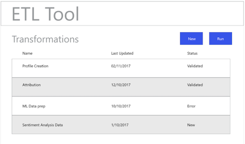

# Workflow ETL

Différents outils d’extraction, de transformation et de chargement (ETL) peuvent avoir des formats différents, mais la plupart présentent des fonctionnalités similaires pour faciliter la combinaison de plusieurs sources de données.

## Exemple d’outil ETL

Les diagrammes suivants présentent des simulations d’actions ETL courantes et une expérience utilisateur générique basée sur des interactions standard. Ces images peuvent facilement être adaptées à une expérience utilisateur ETL spécifique.

Les actions illustrées ci-dessous sont détaillées dans les étapes décrites dans le [guide d’intégration ETL](home.md). Certaines étapes font référence à des « figures » spécifiques, d’autres décrivent des actions similaires au workflow présenté ici.

### Figure 1 - Configuration du nouveau connecteur Adobe Experience Platform :

### Figure 2 - [!DNL Experience Platform] Connecteur activé :

### Figure 3 - Interface utilisateur de la gestion de la transformation ETL :

### Figure 4 - New Transformation UI, selecting [!DNL Experience Platform] Connection:

### Figure 5 - Browsing for source [!DNL Experience Platform] Datasets:

### Figure 6 - Métadonnées et données d’exemple du jeu de données dans l’interface utilisateur du processus ETL :

### Figure 7 - Affichage des informations relatives aux champs de schéma à partir des jeux de données :

### Figure 8 - Prévisualisation des données provenant des jeux de données :

### Figure 9 - Définition des paramètres de synchronisation des données pour la mise en œuvre de la transformation :

### Figure 10 - Définition du jeu de données de cible [!DNL Experience Data Model] (XDM) :

### Figure 11 - Affichage des métadonnées et des schémas hiérarchiques XDM pour prendre en charge les mappages/transformations :

### Figure 12 - Enregistrement et exécution/planification des transformations :

