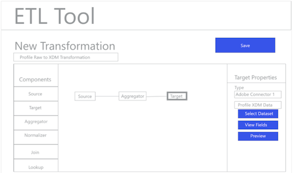

# Flux ETL

Différents outils d’extraction, de transformation et de chargement (ETL) peuvent présenter des formats différents, mais la plupart présentent des fonctionnalités similaires pour faciliter la combinaison de plusieurs sources de données.

## Exemple d’outil ETL

Les diagrammes suivants fournissent des simulations d’actions ETL courantes et une expérience utilisateur générique basée sur des interactions standard. Ces images peuvent facilement être adaptées à une expérience utilisateur ETL spécifique.

Les actions illustrées ci-dessous sont décrites dans les étapes décrites dans le Guide [d&#39;intégration](home.md)ETL. Certaines étapes font référence à des &quot;figures&quot; spécifiques, d’autres décrivent des actions similaires au flux de travail illustré ici.

### Figure 1 - Configuration du nouveau connecteur de plate-forme Adobe Experience Platform :

### Figure 2 - Connecteur de plateforme d’expérience activé :

### Figure 3 - Interface utilisateur de gestion de la transformation ETL :

### Figure 4 - Nouvelle interface utilisateur de transformation, sélection de la connexion à la plate-forme d’expérience :

### Figure 5 - Recherche de jeux de données de plateformes d’expérience source :

### Figure 6 - Métadonnées et données d’exemple du jeu de données dans l’interface utilisateur ETL :

### Figure 7 - Affichage des informations de de champs à partir de jeux de données :

### Figure 8 - Prévisualisation de données à partir de jeux de données :

### Figure 9 - Définition des paramètres de synchronisation des données pour le fonctionnement de la transformation :

### Figure 10 - Définition du jeu de données  du modèle de données d’expérience (XDM) :

### Figure 11 - Affichage du et des métadonnées hiérarchiques XDM pour prendre en charge la correspondance/les transformations :

### Figure 12 - Enregistrement et exécution/planification des transformations :

