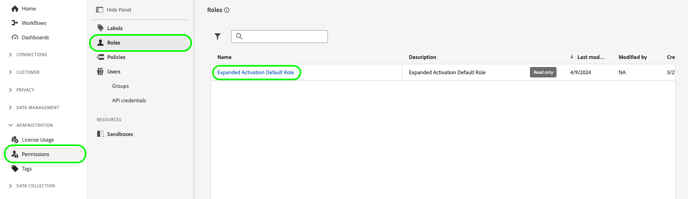
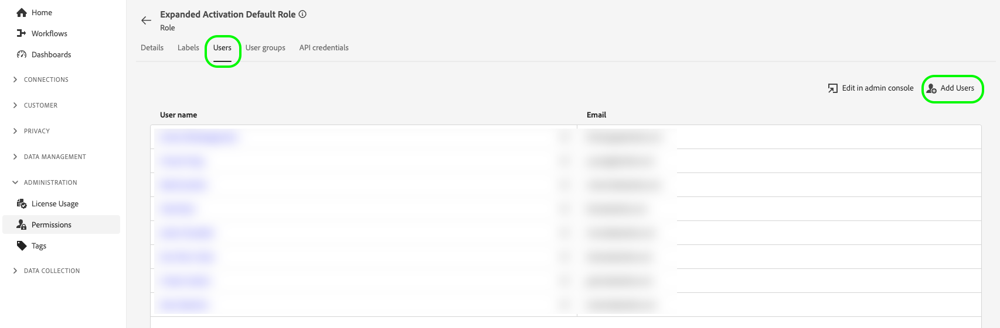
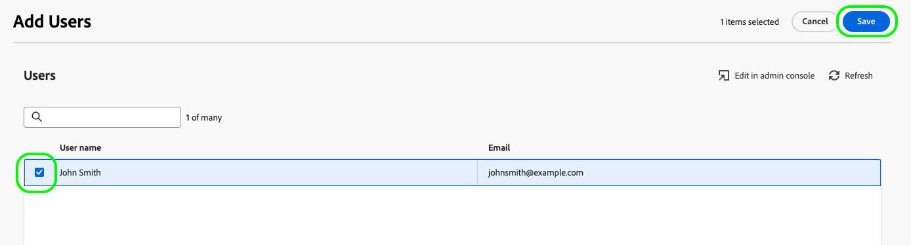
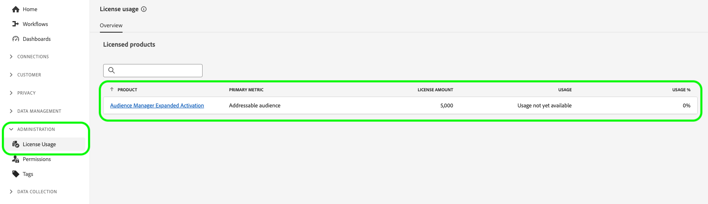

# Administration des comptes

Pour ingérer des audiences d’Audience Manager et les activer vers des destinations publicitaires et sociales, vous devez d’abord créer un compte utilisateur d’activation étendu et affecter le compte au rôle d’autorisation approprié.

Cette page explique comment créer un compte utilisateur dans Admin Console et transmettre les autorisations appropriées pour l’activation étendue.

## Création de comptes utilisateur {#create-users}

Avant de pouvoir utiliser [!DNL Audience Manager Expanded Activation], vous devez créer un compte utilisateur.

Pour créer un compte d’utilisateur pour [!DNL Expanded Activation], suivez les instructions de la section Gestion des utilisateurs de la documentation de [Adobe Admin Console](https://helpx.adobe.com/fr/enterprise/using/manage-users-individually.html).

## Ajouter des utilisateurs au rôle d’autorisation {#permissions}

Après avoir créé un compte utilisateur, vous devez l’ajouter au rôle d’autorisation [!DNL Expanded Activation], dans l’interface utilisateur [!DNL Expanded Activation].

Accédez à **[!UICONTROL Administration]** -> **[!UICONTROL Permissions]** -> **[!UICONTROL Roles]**, puis sélectionnez le **[!UICONTROL Expanded Activation Default Role]**.

Accédez à l’onglet **[!UICONTROL Users]** et sélectionnez **[!UICONTROL Add Users]**.

Sélectionnez l’utilisateur nouvellement créé dans la liste disponible, puis sélectionnez **[!UICONTROL Save]**.

Le compte utilisateur est maintenant créé et affecté au rôle approprié. Il est maintenant prêt à accéder à l’interface utilisateur **[!UICONTROL Expanded Activation]**.

## Surveillance de l’utilisation des licences {#license-usage}

Votre contrat [!DNL Audience Manager Expanded Activation] spécifie le nombre maximal d’e-mails hachés que vous pouvez ingérer sur votre compte.

Vous trouverez ces informations en accédant à la page **[!UICONTROL Administration]** -> **[!UICONTROL License Usage]** .

Sur cette page, vous trouverez les informations suivantes :

* **[!UICONTROL Product]** : produit Adobe pour lequel vous possédez une licence. Il s’agit toujours de **[!UICONTROL Audience Manager Expanded Activation]**.
* **[!UICONTROL Primary metric]** : nom de la mesure faisant l’objet d’un suivi pour utilisation. Il s’agit toujours de **[!UICONTROL Addressable audience]**.
* **[!UICONTROL License amount]** : nombre maximal d’e-mails hachés que vous êtes autorisé à ingérer.

  >[!TIP]
  >
  >Vous ingérez des e-mails hachés via le connecteur source . Pour plus d’informations, consultez la documentation sur [comment activer des audiences](activate-audiences.md).

* **[!UICONTROL Usage]** : nombre d’e-mails hachés que vous avez ingérés.
* **[!UICONTROL Usage %]** : pourcentage du montant de votre licence que vous avez utilisé.

Pour en savoir plus sur l’utilisation des licences dans Experience Platform, consultez la [documentation sur l’utilisation des licences](../dashboards/guides/license-usage.md).

## Étapes suivantes {#next-steps}

Maintenant que vous avez configuré au moins un compte utilisateur avec l’accès approprié à l’activation étendue, vous pouvez commencer à utiliser le compte pour [activer des audiences](activate-audiences.md).
