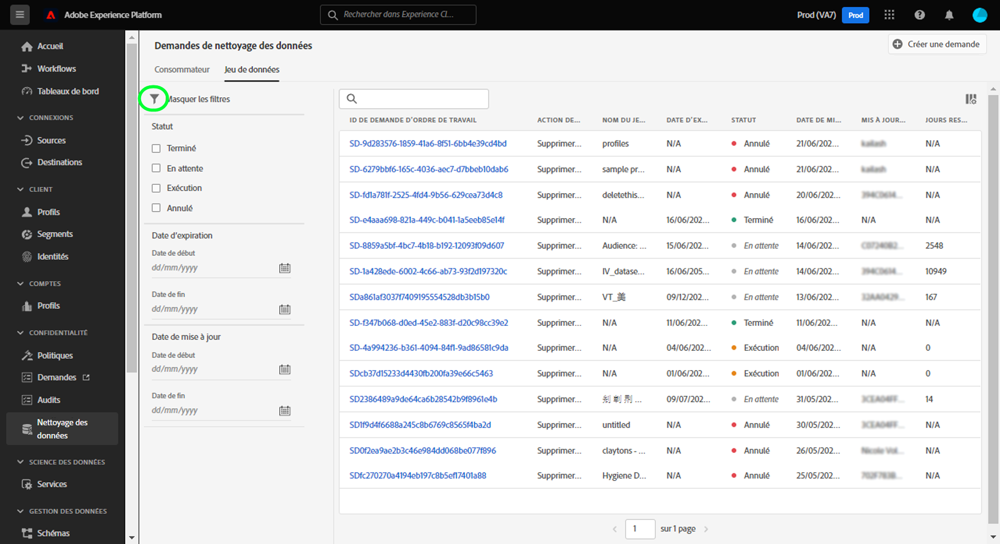
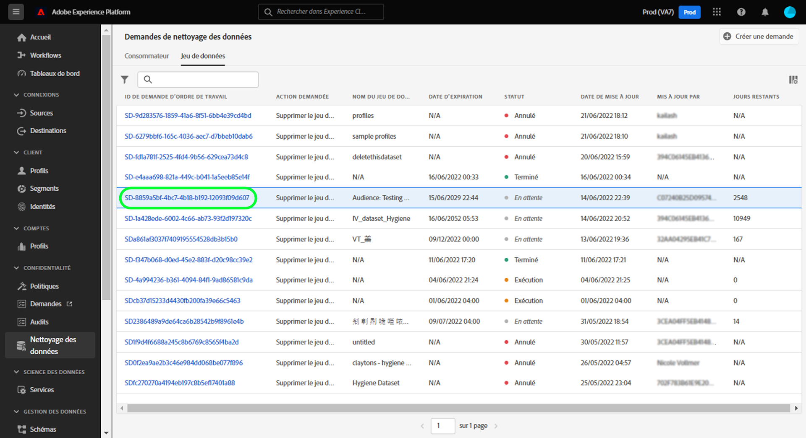
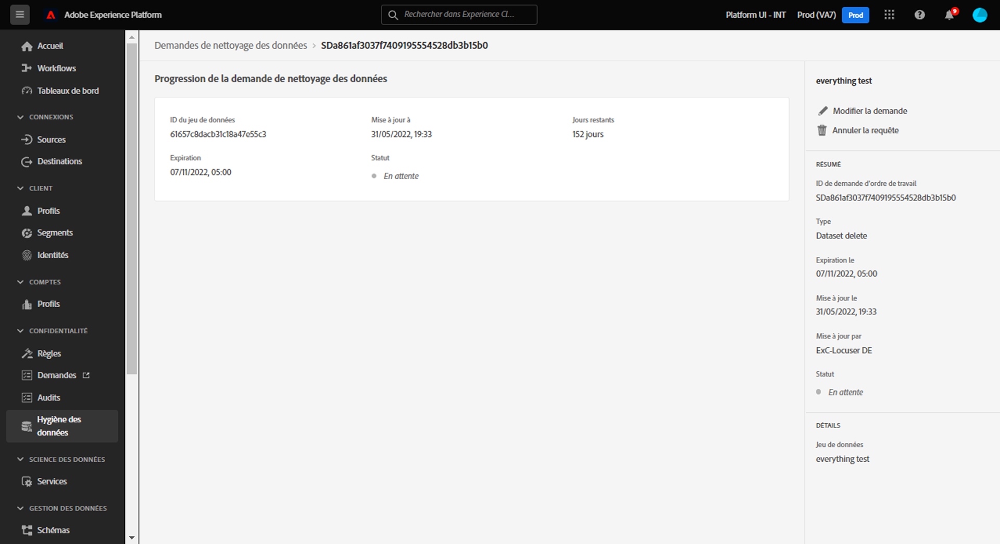

# Parcourir les ordres de travail relatifs au cycle de vie des données {#browse-work-orders}

>[!CONTEXTUALHELP]
>id="platform_hygiene_workorders"
>title="Identifiants des ordres de travail"
>abstract="Lorsqu’une demande de cycle de vie des données est envoyée au système, un ordre de travail est créé pour exécuter la tâche demandée. En d’autres termes, un ordre de travail représente un processus spécifique de cycle de vie des données comprenant le statut actuel et d’autres détails connexes. Chaque ordre de travail est automatiquement doté d’un identifiant unique lors de sa création."
>text="See the data lifecycle UI guide to learn more."

Lorsqu’une demande de cycle de vie des données est envoyée au système, un ordre de travail est créé pour exécuter la tâche demandée. Un ordre de travail représente un processus de cycle de vie des données spécifique, tel qu’une expiration de jeu de données planifiée, qui inclut son état actuel et d’autres détails connexes.

Ce guide explique comment afficher et gérer les ordres de travail existants dans l’interface utilisateur d’Adobe Experience Platform.

## Répertorier et filtrer les ordres de travail existants

Lorsque vous accédez pour la première fois à l’espace de travail **[!UICONTROL Cycle de vie des données]** dans l’interface utilisateur, une liste des ordres de travail existants s’affiche avec leurs détails de base.

![ Image montrant l’espace de travail [!UICONTROL Data Lifecycle] dans l’interface utilisateur de Platform](../images/ui/browse/work-order-list.png)

La liste affiche uniquement les ordres de travail d’une catégorie à la fois. Sélectionnez **[!UICONTROL Consumer]** pour afficher une liste de tâches de suppression d’enregistrement et **[!UICONTROL Jeu de données]** pour afficher une liste d’expirations de jeux de données planifiées.

![Image illustrant l’onglet [!UICONTROL Jeu de données]](../images/ui/browse/dataset-tab.png).

Sélectionnez l’icône d’entonnoir () pour consulter une liste de filtres pour les ordres de travail affichés.

Selon le type d’ordre de travail que vous consultez, différentes options de filtre sont disponibles.

### Filtres pour les suppressions d’enregistrement

Les filtres suivants s’appliquent aux demandes de suppression d’enregistrement :

| Filtre | Description |
| --- | --- |
| [!UICONTROL Statut] | Filtre basé sur le statut actuel de l’ordre de travail :<ul><li>**[!UICONTROL Terminé]** : le traitement est terminé.</li><li>**[!UICONTROL Échec]** : le traitement a rencontré une erreur et n’a pas pu être terminé.</li><li>**[!UICONTROL Traitement]** : la requête a commencé et est en cours de traitement.</li></ul> |
| [!UICONTROL Date de création] | Filtre basé sur le moment où l’ordre de travail a été effectué. |
| [!UICONTROL Date de mise à jour] | Filtrez en fonction de la date de la dernière mise à jour de l’ordre de travail. Les créations sont comptabilisées comme des mises à jour. |

### Filtres pour l’expiration des jeux de données

Les filtres suivants s’appliquent aux requêtes d’expiration de jeu de données :

| Filtre | Description |
| --- | --- |
| [!UICONTROL Statut] | Filtre basé sur le statut actuel de l’ordre de travail :<ul><li>**[!UICONTROL Terminé]** : le traitement est terminé.</li><li>**[!UICONTROL En attente]** : le traitement a été créé mais n’a pas encore été exécuté. Une [demande relative à l’expiration du jeu de données](./dataset-expiration.md) suppose que ce statut est antérieur à la date de suppression planifiée. Une fois la date de suppression atteinte, le statut est mis à jour vers [!UICONTROL Exécution], sauf si le traitement est annulé au préalable.</li><li>**[!UICONTROL Exécution]** : la demande relative à l’expiration du jeu de données a commencé et est en cours de traitement.</li><li>**[!UICONTROL Annulé]** : le traitement a été annulé dans le cadre d’une demande d’utilisateur manuelle.</li></ul> |
| [!UICONTROL Date de création] | Filtre basé sur le moment où l’ordre de travail a été effectué. |
| [!UICONTROL Date d’expiration] | Filtrez les demandes relatives à l’expiration du jeu de données en fonction de la date de suppression planifiée pour le jeu de données en question. |
| [!UICONTROL Date de mise à jour] | Filtrez en fonction de la date de la dernière mise à jour de l’ordre de travail. Les créations et les expirations sont comptées comme des mises à jour. |

{style="table-layout:auto"}

## Afficher les détails d’un ordre de travail {#view-details}

>[!CONTEXTUALHELP]
>id="platform_hygiene_statusbyservice"
>title="Statut par service"
>abstract="Les demandes liées au cycle de vie des données sont traitées indépendamment par plusieurs services d’Experience Platform. Cette section décrit le statut actuel du traitement de la requête pour chaque service respectif. Pour en savoir plus, consultez le guide de l’interface d’utilisation du cycle de vie des données."

>[!CONTEXTUALHELP]
>id="platform_hygiene_numberofidentities"
>title="Nombre d’identités"
>abstract="Le nombre d&#39;identités pour lesquelles une demande de mise à jour ou de suppression des enregistrements a été formulée dans le cadre de cet ordre de travail. Les identités incluses dans le nombre n’existent pas nécessairement dans les jeux de données affectés. Pour en savoir plus, consultez le guide de l’interface d’utilisation du cycle de vie des données."

>[!CONTEXTUALHELP]
>id="platform_hygiene_responsemessages"
>title="Réponse de suppression d&#39;enregistrement"
>abstract="Lorsqu&#39;un processus de suppression d&#39;enregistrement reçoit une réponse du système, ces messages s&#39;affichent sous la section **[!UICONTROL Résultat]**. Si un problème se produit alors qu’un ordre de travail est en cours de traitement, tous les messages d’erreur pertinents s’affichent dans cette section pour vous aider à résoudre le problème. Pour en savoir plus, consultez le guide de l’interface d’utilisation du cycle de vie des données."

Sélectionnez l’identifiant d’un ordre de travail répertorié pour en afficher les détails.

.

Différentes informations et commandes sont fournies en fonction du type d’ordre de travail sélectionné. Elles sont décrites dans les sections ci-dessous.

### Détails de suppression des enregistrements {#record-delete}

Les détails d’une requête de suppression d’enregistrement incluent son état actuel et le temps écoulé depuis que la requête a été effectuée. Chaque requête comprend également une section **[!UICONTROL Statut par service]** qui fournit des détails de statuts individuels sur chaque service en aval impliqué dans la suppression. Sur le rail de droite, vous pouvez utiliser des contrôles pour mettre à jour le nom et la description de l’ordre de travail.

### Détails sur l’expiration du jeu de données {#dataset-expiration}

La page de détails d’une expiration de jeu de données fournit des informations sur les attributs de base, notamment la date d’expiration prévue pour les jours restants avant la suppression. Dans le rail de droite, vous pouvez utiliser des commandes pour modifier ou annuler l’expiration.

## Étapes suivantes

Ce guide explique comment afficher et gérer les ordres de travail du cycle de vie des données existants dans l’interface utilisateur de Platform. Pour plus d’informations sur la création de vos propres ordres de travail, consultez la documentation suivante :

* [Gérer des expirations de jeux de données](./dataset-expiration.md)
* [Gérer les suppressions d’enregistrement](./record-delete.md)
