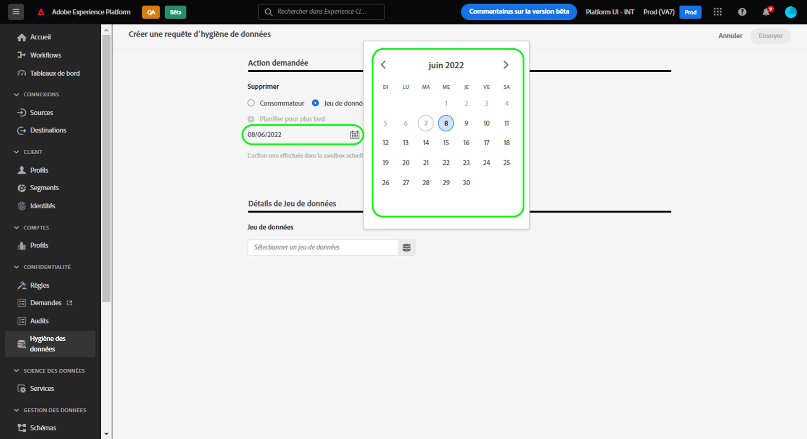

# Expirations automatisées des jeux de données {#dataset-expiration}

>[!CONTEXTUALHELP]
>id="platform_privacyConsole_scheduleDatasetExpiration_description"
>title="Supprimer des enregistrements de clients et de clientes et de jeux de données non souhaités ou ayant expiré"
>abstract="<h2>Description</h2>
Pour gérer le cycle de vie de vos données Experience Platform sans rapport avec la conformité réglementaire, vous pouvez supprimer les enregistrements des consommateurs et consommatrices et planifier des dates d’expiration pour les jeux de données. Pour créer ou gérer des demandes des titulaires de données, consultez le bloc de cas d’utilisation « Respecter les demandes d’accès à des informations personnelles des titulaires de données ».
"

L’espace de travail [[!UICONTROL cycle de vie des données] ](./overview.md) de l’interface utilisateur de Adobe Experience Platform vous permet de planifier l’expiration des jeux de données. Lorsqu’un jeu de données atteint sa date d’expiration, le lac de données, le service d’identités et le profil client en temps réel lancent des processus distincts pour supprimer le contenu du jeu de données de leurs services respectifs. Une fois les données supprimées des trois services, l’expiration est marquée comme étant terminée.

>[!WARNING]
>
>Si un jeu de données est défini pour expirer, vous devez modifier manuellement les flux de données susceptibles d’ingérer des données dans ce jeu, afin que vos workflows en aval ne soient pas affectés négativement.

Ce document explique comment planifier et automatiser les expirations de jeux de données dans l’interface utilisateur d’Experience Platform.

>[!NOTE]
>
>L’expiration du jeu de données ne supprime actuellement pas les données de l’Edge Network Adobe Experience Platform. Cependant, il n’est pas possible que les données restent dans Edge Network après l’expiration du jeu de données. Cela est dû au fait que le contrat de licence de service de 15 jours pour l’expiration des jeux de données chevauche la période de 14 jours pendant laquelle les données existent dans Edge Network avant d’être ignorées.

Advanced Data Lifecycle Management prend en charge les suppressions de jeux de données via le [point d’entrée d’expiration du jeu de données](../api/dataset-expiration.md) et les suppressions d’identifiants (données au niveau des lignes) à l’aide d’identités principales via le [point d’entrée d’ordre de travail](../api/workorder.md). Vous pouvez également gérer les expirations de jeux de données et les [suppressions d’enregistrements](./record-delete.md) via l’interface utilisateur d’Experience Platform. Pour plus d’informations, consultez la documentation associée .

>[!NOTE]
>
>Le cycle de vie des données ne prend pas en charge la suppression de lots.

## Planifier l’expiration d’un jeu de données {#schedule-dataset-expiration}

>[!CONTEXTUALHELP]
>id="platform_privacyConsole_scheduleDatasetExpiration_instructions"
>title="Instructions"
>abstract="<ul><li>Sélectionnez <a href="https://experienceleague.adobe.com/docs/experience-platform/hygiene/ui/overview.html?lang=fr">Cycle de vie des données</a> dans le volet de navigation de gauche, puis <b>Créer une requête</b>.</li><li>Si vous souhaitez supprimer des enregistrements :</li>   <li>Sélectionnez <b>Enregistrement</b>.</li>   <li>Sélectionnez un jeu de données spécifique à partir duquel supprimer des enregistrements ou choisissez l’option permettant de les supprimer de tous les jeux de données.</li>   <li>Indiquez les identités des consommateurs et des consommatrices dont les enregistrements doivent être supprimés. Sélectionnez <b>Ajouter une identité</b> pour fournir les identités une par une ou sélectionnez <b>Choisir les fichiers</b> pour charger un fichier JSON d’identités à la place.</li>   <li>Si nécessaire, sélectionnez <b>Modèle</b> pour afficher le format attendu du fichier JSON.</li><li>Consultez la documentation pour obtenir des instructions si vous souhaitez <a href="https://experienceleague.adobe.com/docs/experience-platform/hygiene/ui/dataset-expiration.html?lang=fr#schedule-dataset-expiration">planifier des dates d’expiration des jeux de données</a>.</li></ul>"

Pour créer une requête, sélectionnez **[!UICONTROL Créer une requête]** dans la page principale de l’espace de travail.

>[!IMPORTANT]
>
>Les utilisateurs de Real-Time CDP, Adobe Journey Optimizer et Customer Journey Analytics ont 20 ordres de travail d’expiration de jeu de données planifiés en attente. Les utilisateurs de Healthcare Shield et de Privacy and Security Shield disposent de 50 ordres de travail d’expiration de jeux de données planifiés en attente. Cela signifie que vous pouvez avoir 20 ou 50 jeux de données planifiés pour être supprimés à tout moment. Par exemple, si vous avez 20 expirations de jeux de données planifiées et qu’un jeu de données doit être supprimé demain, vous ne pouvez pas définir d’autres expirations tant que ce jeu de données n’a pas été supprimé.

![L’espace de travail [!UICONTROL Cycle de vie des données] avec l’option [!UICONTROL Créer une requête] mise en surbrillance.](../images/ui/ttl/create-request-button.png)

Le workflow de création de demande s’affiche. Dans la section [!UICONTROL Action demandée], sélectionnez **[!UICONTROL Supprimer le jeu de données]** pour mettre à jour les commandes de la planification de l’expiration des jeux de données.

![Workflow de création de requête avec l’option [!UICONTROL Supprimer le jeu de données] mise en surbrillance.](../images/ui/ttl/dataset-selected.png)

### Sélectionner une date et un jeu de données {#select-date-and-dataset}

Dans la section **[!UICONTROL Action demandée]**, sélectionnez une date à laquelle vous souhaitez que le jeu de données soit supprimé. Vous pouvez saisir la date manuellement (au format `mm/dd/yyyy`) ou sélectionner l’icône de calendrier () pour sélectionner la date dans une boîte de dialogue.

Ensuite, sous **[!UICONTROL Détails du jeu de données]**, sélectionnez l’icône de base de données () pour ouvrir une boîte de dialogue de sélection de jeu de données. Dans la liste, sélectionnez un jeu de données auquel appliquer l’expiration, puis cliquez sur **[!UICONTROL Terminé]**.

![La boîte de dialogue [!UICONTROL Sélectionner un jeu de données] avec un jeu de données sélectionné et [!UICONTROL Terminé] en surbrillance.](../images/ui/ttl/select-dataset.png)

>[!NOTE]
>
>Seuls les jeux de données appartenant au sandbox actuel s’affichent.

### Envoyer la requête {#submit-request}

La section [!UICONTROL Détails du jeu de données] est renseignée afin d’inclure l’identité principale et le schéma du jeu de données sélectionné. Dans la section **[!UICONTROL Paramètres de la requête]**, saisissez un nom et une description facultative pour la requête, suivis d’**[!UICONTROL Envoyer]**.

![Une demande d’expiration de jeu de données terminée avec le bouton [!UICONTROL Paramètres de la demande] et [!UICONTROL Envoyer] en surbrillance.](../images/ui/ttl/submit.png)

Une boîte de dialogue [!UICONTROL Confirmer la demande] s’affiche. Vous êtes invité à confirmer le nom du jeu de données et la date à laquelle le jeu de données sera supprimé. Sélectionnez **[!UICONTROL Envoyer]** pour continuer.

Une fois la requête soumise, un ordre de travail est créé et s’affiche dans l’onglet principal de l’espace de travail [!UICONTROL Cycle de vie des données]. Ensuite, vous pouvez surveiller le statut de l’ordre de travail lors du traitement de la requête.

>[!NOTE]
>
>Consultez la section de présentation sur [la chronologie et la transparence](../home.md#dataset-expiration-transparency) pour plus d’informations sur le traitement des expirations des jeux de données une fois qu’elles sont exécutées.

## Modifier ou annuler l’expiration d’un jeu de données {#edit-or-cancel}

Pour modifier ou annuler l’expiration d’un jeu de données, sélectionnez **[!UICONTROL Jeu de données]** dans la page principale de l’espace de travail, puis cliquez sur l’expiration du jeu de données dans la liste.

Dans la page des détails de l’expiration du jeu de données, le rail de droite affiche les commandes permettant de modifier ou d’annuler la suppression planifiée.

## Étapes suivantes

Ce document explique comment planifier des expirations de jeux de données dans l’interface utilisateur d’Experience Platform. Pour plus d’informations sur l’exécution d’autres tâches de minimisation des données dans l’interface utilisateur, reportez-vous à la section [ Présentation de l’interface utilisateur du cycle de vie des données ](./overview.md).

Pour savoir comment planifier l’expiration des jeux de données à l’aide de l’API Data Hygiene, consultez le guide [point d’entrée d’expiration du jeu de données](../api/dataset-expiration.md).
