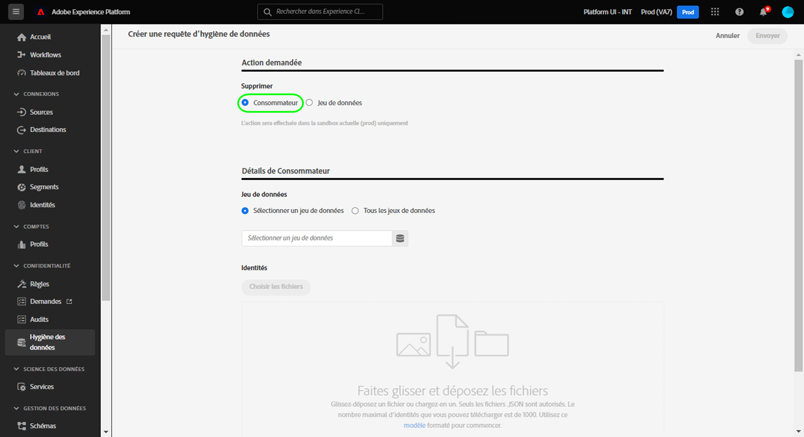
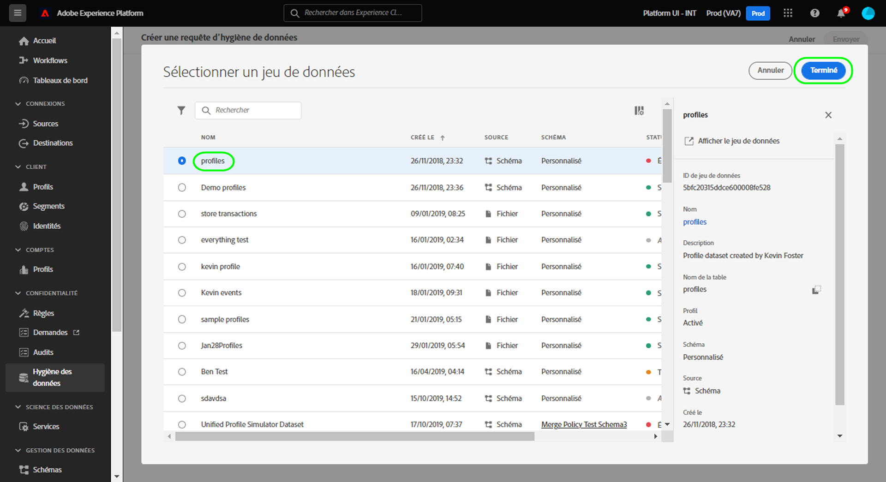
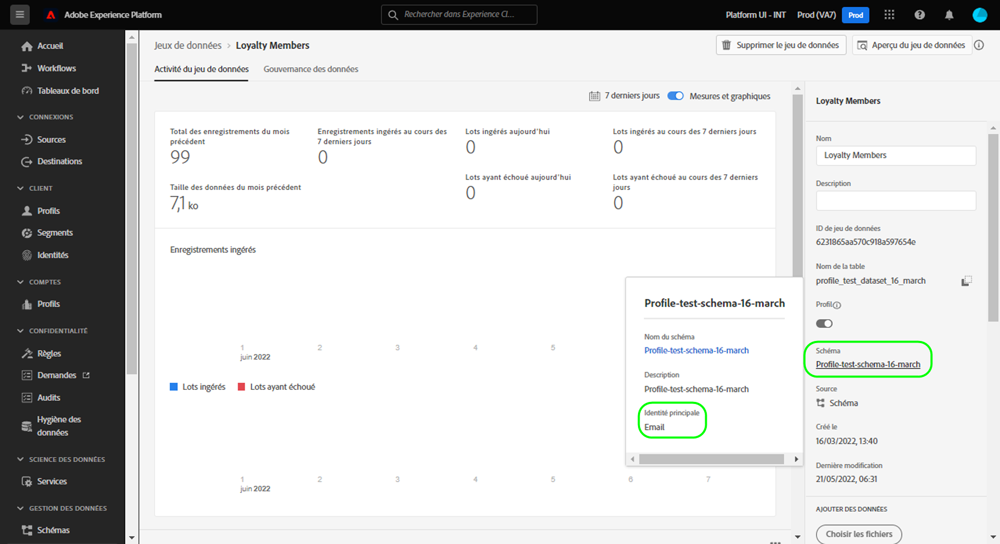
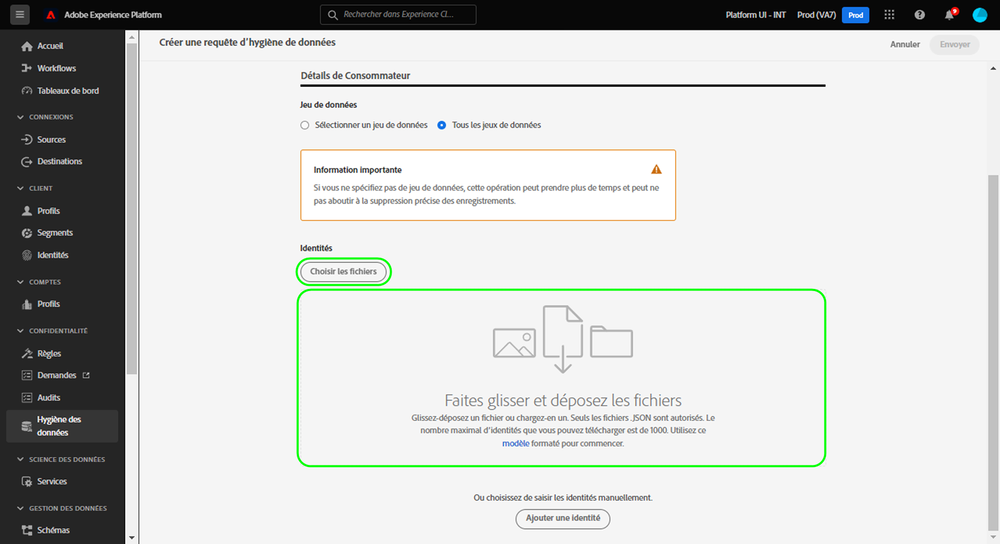
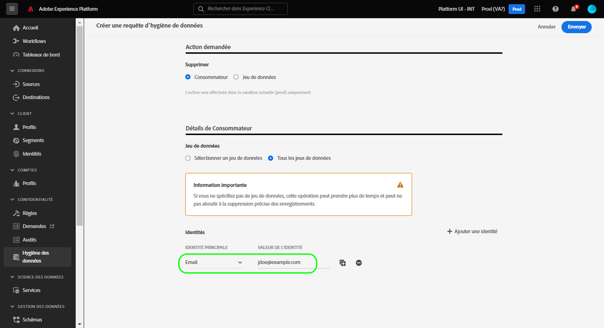
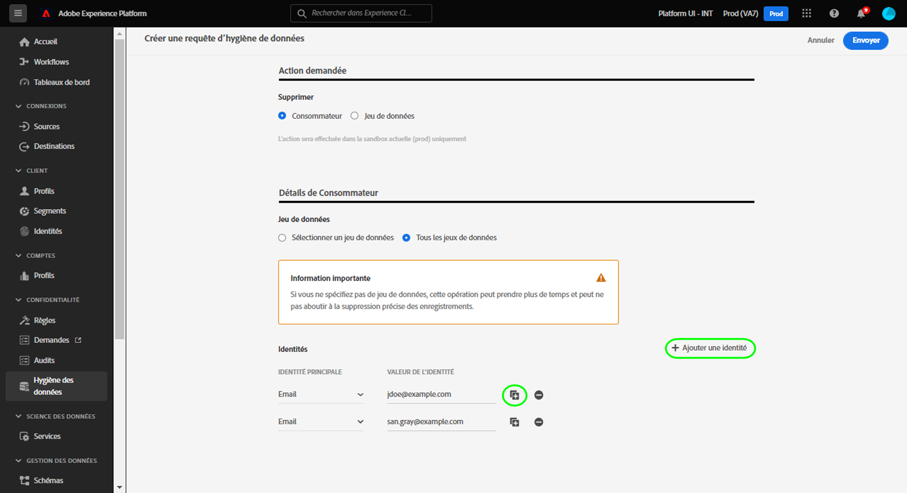
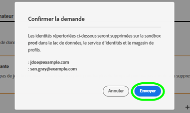

# Supprimer des enregistrements de clients

>[!IMPORTANT]
>
>Actuellement, seules les organisations qui ont acheté Healthcare Shield disposent des capacités d’hygiène des données dans Adobe Experience Platform.

L’espace de travail [[!UICONTROL Nettoyage de données]](./overview.md) dans l’interface utilisateur d’Adobe Experience Platform, vous permet de supprimer les enregistrements des clients qui utilisent le service d’identités et le profil client en temps réel.

## Conditions préalables

La suppression des enregistrements de clients nécessite une compréhension pratique du fonctionnement des champs d’identité dans Experience Platform. Concrètement, vous devez connaître les valeurs d’identité principale des clients dont vous souhaitez supprimer les enregistrements, en fonction du jeu de données (ou des jeux de données) à partir duquel vous les supprimez.

Pour plus d’informations sur les identités dans Platform, consultez la documentation suivante :

* [Adobe Experience Platform Identity Service](../../identity-service/home.md) : associe les identités des appareils et des systèmes, en liant les jeux de données en fonction des champs d’identité définis par les schémas XDM auxquels ils se conforment.
   * [Espaces de noms d’identité](../../identity-service/namespaces.md) : définissent les différents types d’informations d’identité qui peuvent être associés à une seule personne et constituent un composant obligatoire pour chaque champ d’identité.
* [Profil client en temps réel](../../profile/home.md) : utilise des graphiques d’identités des clients pour fournir des profils de clients unifiés basés sur des données agrégées provenant de plusieurs sources et mis à jour pratiquement en temps réel.
* [Modèle de données d’expérience (XDM)](../../xdm/home.md) : fournit des structures et des définitions standard pour les données de Platform à l’aide de schémas. Tous les jeux de données de Platform sont conformes à un schéma XDM spécifique et le schéma définit les champs qui sont des identités.
   * [Champs d’identité](../../xdm/ui/fields/identity.md) : découvrez la définition d’un champ d’identité dans un schéma XDM.

## Créer une requête

Pour lancer le processus, sélectionnez **[!UICONTROL Créer une requête]** dans la page principale de l’espace de travail.

![Image illustrant le bouton [!UICONTROL Créer une requête] sélectionné](../images/ui/delete-consumer/create-request-button.png).

La boîte de dialogue de création de requête s’affiche. Par défaut, l’option **[!UICONTROL Consommateur]** est sélectionnée sous la section **[!UICONTROL Action]**. Conservez la sélection de cette option.

.

## Sélectionner des jeux de données

Sous la section **[!UICONTROL Détails du client]**, l’étape suivante consiste à déterminer si vous souhaitez supprimer des données client d’un seul jeu de données ou de tous les jeux de données.

Si vous choisissez **[!UICONTROL Sélectionner un jeu de données]**, sélectionnez l’icône de base de données (). Une boîte de dialogue s’affiche et vous permet de sélectionner le jeu de données souhaité dans la liste.

.

Si vous souhaitez supprimer des données client de tous les jeux de données, sélectionnez **[!UICONTROL Tous les jeux de données]**.

![Image illustrant l’option [!UICONTROL Tous les jeux de données] sélectionnée](../images/ui/delete-consumer/all-datasets.png).

>[!NOTE]
>
>La sélection de l’option **[!UICONTROL Tous les jeux de données]** peut entraîner un temps de suppression plus long et une suppression imprécise des enregistrements.

## Fournir des identités de clients {#provide-consumer-identities}

>[!CONTEXTUALHELP]
>id="platform_hygiene_primaryidentity"
>title="Identité principale"
>abstract="Une identité principale est un attribut qui lie un enregistrement au profil d’un client dans Experience Platform. Le champ d’identité principale d’un jeu de données est défini par le schéma sur lequel le jeu de données est basé. Dans cette colonne, vous devez indiquer le type (ou l’espace de noms) de l’identité principale du client, par exemple `email` pour les adresses e-mail et `ecid` pour les identifiants Experience Cloud. Pour en savoir plus, consultez le guide de l’interface utilisateur de nettoyage de données."

>[!CONTEXTUALHELP]
>id="platform_hygiene_identityvalue"
>title="Valeur de l’identité"
>abstract="Dans cette colonne, vous devez indiquer la valeur de l’identité principale du client, qui doit correspondre au type d’identité fourni dans la colonne de gauche. Si le type d’identité principale est `email`, la valeur doit correspondre à l’adresse électronique du client. Pour en savoir plus, consultez le guide de l’interface utilisateur de nettoyage de données."

Lors de la suppression des données client, vous devez fournir des informations d’identité afin que le système puisse identifier les enregistrements à supprimer. Pour les jeux de données de Platform, les enregistrements sont supprimés en fonction du champ **Identité principale** défini par le schéma du jeu de données.

Comme tous les champs d’identité de Platform, une identité principale se compose de deux éléments : un **type** (parfois appelé espace de noms d’identité) et une **valeur**. Le type d’identité fournit un contexte sur la manière dont le champ identifie un client (une adresse électronique, par exemple) et la valeur représente l’identité spécifique d’un client pour ce type (par exemple, `jdoe@example.com` pour le type d’identité `email`).  Les champs courants utilisés comme identités comprennent les informations de compte, les identifiants d’appareil et les identifiants de cookie.

>[!TIP]
>
>Si vous ne connaissez pas l’identité principale d’un jeu de données spécifique, vous pouvez la trouver dans l’interface utilisateur de Platform. Dans l’espace de travail **[!UICONTROL Jeux de données]**, sélectionnez le jeu de données en question dans la liste. Sur la page des détails du jeu de données, passez la souris sur le nom du schéma du jeu de données dans le rail de droite. L’identité principale s’affiche avec le nom et la description du schéma.
>
>.

Si vous supprimez des enregistrements de clients d’un seul jeu de données, toutes les identités que vous fournissez doivent avoir le même type, car un jeu de données ne peut avoir qu’une seule identité principale. Si vous effectuez une suppression dans tous les jeux de données, vous pouvez inclure plusieurs types d’identité, car différents jeux de données peuvent avoir différentes identités principales.

Deux options permettent de fournir des identités de clients lors de la suppression d’enregistrements de clients :

* [Charger un fichier JSON](#upload-json)
* [Saisir des valeurs d’identité manuellement](#manual-identity)

### Charger un fichier JSON {#upload-json}

Pour charger un fichier JSON, vous pouvez le faire glisser et le déposer dans la zone prévue à cet effet ou sélectionner **[!UICONTROL Choisir les fichiers]** pour parcourir et sélectionner les fichiers dans votre répertoire local.

.

Le fichier JSON doit être formaté sous la forme d’un tableau d’objets, chaque objet représentant une identité de client.

```json
[
  {
    "namespaceCode": "email",
    "value": "jdoe@example.com"
  },
  {
    "namespaceCode": "email",
    "value": "san.gray@example.com"
  }
]
```

| Propriété | Description |
| --- | --- |
| `namespaceCode` | Type d’identité. |
| `value` | L’identité du client telle qu’elle est identifiée par le type. |

Une fois le fichier chargé, vous pouvez continuer à [envoyer la requête](#submit).

### Saisir des identités manuellement {#manual-identity}

Pour saisir les identités manuellement, sélectionnez **[!UICONTROL Ajouter une identité]**.

![Image illustrant le bouton [!UICONTROL Ajouter une identité] sélectionné](../images/ui/delete-consumer/add-identity.png).

Des commandes s’affichent pour vous permettre de saisir une par une les identités des clients. Sous **[!UICONTROL Identité principale]**, utilisez le menu déroulant pour sélectionner le type d’identité. Sous **[!UICONTROL Valeur de l’identité]**, fournissez la valeur de l’identité principale pour le client.

.

Pour ajouter d’autres identités, cliquez sur l’icône plus () en regard de l’une des lignes ou sélectionnez **[!UICONTROL Ajouter une identité]**.

.

## Envoyer la requête (#submit)

Une fois que vous avez terminé d’ajouter des identités à la requête, sélectionnez **[!UICONTROL Envoyer]**.

![Image illustrant le bouton [!UICONTROL Envoyer] sélectionné](../images/ui/delete-consumer/submit.png).

Vous êtes invité à confirmer la liste des identités dont vous souhaitez supprimer les données. Sélectionnez **[!UICONTROL Envoyer]** pour confirmer votre sélection.

.

Une fois la requête soumise, un ordre de travail est créé et s’affiche dans l’onglet [!UICONTROL Consommateur] de l’espace de travail [!UICONTROL Nettoyage de données]. Ensuite, vous pouvez surveiller le statut de l’ordre de travail lors du traitement de la requête. La majorité des ordres de travail de suppression des clients prennent plusieurs jours.

## Étapes suivantes

Ce document explique comment supprimer des enregistrements de clients dans l’interface utilisateur d’Experience Platform. Pour plus d’informations sur l’exécution d’autres tâches de nettoyage de données dans l’interface utilisateur, consultez la [Présentation de l’interface utilisateur de nettoyage de données](./overview.md).

<!--

Paragraph below should be commented out until workorder.md will be added to the TOC.

To learn how to delete consumer records using the Data Hygiene API, refer to the [work order endpoint guide](../api/workorder.md).

-->
