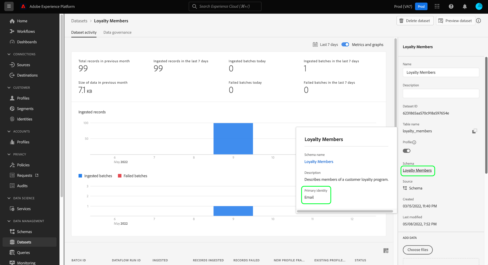

# Demandes de suppression d’enregistrements (workflow de l’interface utilisateur) {#record-delete}

Utilisez l’espace de travail [[!UICONTROL Cycle de vie des données] ](./overview.md) pour supprimer des enregistrements dans Adobe Experience Platform en fonction de leur identité principale. Ces enregistrements peuvent être liés à des consommateurs individuels ou à toute autre entité incluse dans le graphique d’identité.

>[!IMPORTANT]
>
>Les suppressions d’enregistrements sont destinées au nettoyage des données, à la suppression des données anonymes ou à la minimisation des données. Elles ne sont **pas** destinées aux demandes de droits des titulaires de données (conformité) en ce qui concerne les réglementations de confidentialité comme le Règlement général sur la protection des données (RGPD). Pour tous les cas d’utilisation de conformité, utilisez plutôt [Adobe Experience Platform Privacy Service](../../privacy-service/home.md).

## Conditions préalables {#prerequisites}

La suppression d’enregistrements nécessite une compréhension pratique du fonctionnement des champs d’identité dans Experience Platform. Plus précisément, vous devez connaître les valeurs d’espace de noms d’identité des entités dont vous souhaitez supprimer les enregistrements, en fonction du jeu de données (ou des jeux de données) à partir duquel vous les supprimez.

Pour plus d’informations sur les identités dans Experience Platform, consultez la documentation suivante :

* [Service d’identités d’Adobe Experience Platform](../../identity-service/home.md) : associe les identités des appareils et des systèmes, en liant les jeux de données en fonction des champs d’identité définis par les schémas XDM auxquels ils se conforment.
* [Espaces de noms d’identité](../../identity-service/features/namespaces.md) : définissent les différents types d’informations d’identité qui peuvent être associés à une seule personne et constituent un composant obligatoire pour chaque champ d’identité.
* [Real-Time Customer Profile](../../profile/home.md) : utilise des graphiques d’identités pour fournir des profils de clients unifiés basés sur des données agrégées issues de plusieurs sources et mis à jour pratiquement en temps réel.
* [Modèle de données d’expérience (XDM)](../../xdm/home.md) : fournit des structures et des définitions standard pour les données Experience Platform à l’aide de schémas. Tous les jeux de données Experience Platform sont conformes à un schéma XDM spécifique et le schéma définit les champs qui sont des identités.
* [Champs d’identité](../../xdm/ui/fields/identity.md) : découvrez la définition d’un champ d’identité dans un schéma XDM.

## Création d’une requête {#create-request}

Pour lancer le processus, sélectionnez **[!UICONTROL Cycle de vie des données]** dans le volet de navigation de gauche de l’interface utilisateur d’Experience Platform. L’espace de travail [!UICONTROL Demandes relatives au cycle de vie des données] s’affiche. Sélectionnez ensuite **[!UICONTROL Créer une requête]** dans la page principale de l’espace de travail.

![Espace de travail [!UICONTROL Demandes relatives au cycle de vie des données] avec l’option [!UICONTROL Créer une demande] sélectionnée.](../images/ui/record-delete/create-request-button.png)

Le workflow de création de demande s’affiche. Par défaut, l’option **[!UICONTROL Supprimer l’enregistrement]** est sélectionnée sous la section **[!UICONTROL Action demandée]**. Conservez la sélection de cette option.

>[!IMPORTANT]
> 
>Pour améliorer l’efficacité et rendre les opérations des jeux de données moins coûteuses, les organisations qui ont été déplacées vers le format Delta peuvent supprimer des données du service d’identités, du profil client en temps réel et du lac de données. Ce type d’utilisateur est appelé « migration delta ». Les utilisateurs des organisations qui ont subi une migration delta peuvent choisir de supprimer des enregistrements d’un seul jeu de données ou de tous les jeux de données. Les utilisateurs des organisations qui n’ont pas subi de migration delta ne peuvent pas supprimer de manière sélective des enregistrements d’un seul jeu de données ou de tous les jeux de données, comme illustré dans l’image ci-dessous. Dans ce cas, reportez-vous à la section [Fournir des identités](#provide-identities) du guide.

![Le workflow de création de demande avec l’option [!UICONTROL Supprimer l’enregistrement] sélectionnée et mise en surbrillance.](../images/ui/record-delete/delete-record.png)

## Sélectionner des jeux de données {#select-dataset}

L’étape suivante consiste à déterminer si vous souhaitez supprimer des enregistrements d’un seul jeu de données ou de tous les jeux de données. Selon la configuration de votre organisation, l’option de sélection du jeu de données peut ne pas être disponible. Si cette option n’apparaît pas, passez à la section [Fournir des identités](#provide-identities) du guide.

Dans la section **[!UICONTROL Détails de l’enregistrement]**, sélectionnez un bouton radio pour choisir un jeu de données spécifique ou tous les jeux de données.

Pour effectuer une suppression dans un jeu de données spécifique, sélectionnez **[!UICONTROL Sélectionner le jeu de données]**, puis sélectionnez l’icône de base de données (). Dans la boîte de dialogue qui s’affiche, choisissez un jeu de données et sélectionnez **[!UICONTROL Terminé]** pour confirmer.

![La boîte de dialogue [!UICONTROL Sélectionner un jeu de données] avec un jeu de données sélectionné et [!UICONTROL Terminé] en surbrillance.](../images/ui/record-delete/select-dataset.png)

Pour supprimer de tous les jeux de données, sélectionnez **[!UICONTROL Tous les jeux de données]**. Cette option augmente la portée de l’opération et nécessite que vous fournissiez tous les types d’identité pertinents.

![La boîte de dialogue [!UICONTROL Sélectionner un jeu de données] avec l’option [!UICONTROL Tous les jeux de données] sélectionnée.](../images/ui/record-delete/all-datasets.png)

>[!WARNING]
>
>La sélection de **[!UICONTROL Tous les jeux de données]** étend l’opération à tous les jeux de données de votre organisation. Chaque jeu de données peut utiliser un type d’identité principale différent. Vous devez fournir **tous les types d’identité requis** pour garantir une correspondance précise.
>
>Si un type d’identité est manquant, certains enregistrements peuvent être ignorés lors de la suppression. Cela peut ralentir le traitement et conduire à des résultats **partiels**.

Chaque jeu de données d’Experience Platform ne prend en charge qu’un seul type d’identité principal.

* Lors de la suppression d’un **jeu de données unique**, toutes les identités de votre requête doivent utiliser le **même type**.
* Lors de la suppression de de **tous les jeux de données**, vous pouvez inclure **plusieurs types d’identité**, car différents jeux de données peuvent dépendre de différentes identités principales. »

## Fournir des identités {#provide-identities}

>[!CONTEXTUALHELP]
>id="platform_hygiene_primaryidentity"
>title="Espace de noms d’identité"
>abstract="Un espace de noms d’identité est un attribut qui lie un enregistrement au profil d’un client ou d’une cliente dans Experience Platform. Le champ Espace de noms d’identité d’un jeu de données est défini par le schéma sur lequel le jeu de données est basé. Dans cette colonne, vous devez indiquer le type (ou l’espace de nommage) de l’espace de noms d’identité de l’enregistrement, par exemple `email` pour les adresses e-mail et `ecid` pour les identifiants Experience Cloud. Pour en savoir plus, consultez le guide de l’interface d’utilisation du cycle de vie des données."

>[!CONTEXTUALHELP]
>id="platform_hygiene_identityvalue"
>title="Valeur d’identité principale"
>abstract="Dans cette colonne, vous devez indiquer la valeur de l’espace de noms d’identité de l’enregistrement, qui doit correspondre au type d’identité fourni dans la colonne de gauche. Si l’espace de noms d’identité est `email`, la valeur doit correspondre à l’adresse e-mail de l’enregistrement. Pour en savoir plus, consultez le guide de l’interface d’utilisation du cycle de vie des données."

Lors de la suppression d&#39;enregistrements, vous devez fournir des informations d&#39;identité afin que le système puisse déterminer les enregistrements à supprimer. Pour les jeux de données d’Experience Platform, les enregistrements sont supprimés en fonction du champ **espace de noms d’identité** défini par le schéma du jeu de données.

Comme tous les champs d’identité d’Experience Platform, un espace de noms d’identité se compose de deux éléments : un **type** (parfois appelé espace de noms d’identité) et un **valeur**. Le type d’identité fournit un contexte sur la manière dont le champ identifie un enregistrement (une adresse e-mail, par exemple). La valeur représente l&#39;identité spécifique d&#39;un enregistrement pour ce type (par exemple, `jdoe@example.com` pour le type d&#39;identité `email`). Les champs courants utilisés comme identités comprennent les informations de compte, les identifiants d’appareil et les identifiants de cookie.

>[!TIP]
>
>Si vous ne connaissez pas l’espace de noms d’identité d’un jeu de données spécifique, vous pouvez le trouver dans l’interface utilisateur d’Experience Platform. Dans l’espace de travail **[!UICONTROL Jeux de données]**, sélectionnez le jeu de données en question dans la liste. Sur la page des détails du jeu de données, passez la souris sur le nom du schéma du jeu de données dans le rail de droite. L’espace de noms d’identité s’affiche avec le nom et la description du schéma.
>
>

Il existe deux options pour fournir des identités lors de la suppression d’enregistrements :

* [Charger un fichier JSON](#upload-json)
* [Saisir manuellement les valeurs d’identité principale](#manual-identity)

### Charger un fichier JSON {#upload-json}

Pour charger un fichier JSON, vous pouvez le faire glisser et le déposer dans la zone prévue à cet effet ou sélectionner **[!UICONTROL Choisir les fichiers]** pour parcourir et sélectionner les fichiers dans votre répertoire local.


Le fichier JSON doit être formaté sous la forme d’un tableau d’objets, chaque objet représentant une identité.

```json
[
  {
    "namespaceCode": "email",
    "value": "jdoe@example.com"
  },
  {
    "namespaceCode": "email",
    "value": "san.gray@example.com"
  }
]
```

| Propriété | Description |
| --- | --- |
| `namespaceCode` | Type d’identité. |
| `value` | Valeur de l’identité principale telle qu’elle est indiquée par le type. |

Une fois le fichier chargé, vous pouvez continuer à [envoyer la requête](#submit).

### Saisie manuelle d’identités {#manual-identity}

Pour saisir les identités manuellement, sélectionnez **[!UICONTROL Ajouter une identité]**.

![Workflow de création de demandes avec l’option [!UICONTROL  Ajouter une identité ] mise en surbrillance.](../images/ui/record-delete/add-identity.png)

Des commandes s’affichent pour vous permettre de saisir des identités une par une. Sous **[!UICONTROL espace de noms d’identité]**, utilisez le menu déroulant pour sélectionner le type d’identité. Sous **[!UICONTROL Valeur d’identité de Principal]**, indiquez la valeur de l’espace de noms d’identité pour l’enregistrement.


Pour ajouter d’autres identités, sélectionnez l’icône plus () en regard de l’une des lignes ou sélectionnez **[!UICONTROL Ajouter une identité]**.


## Quotas et délais de traitement {#quotas}

Les demandes de suppression d’enregistrements sont soumises à des limites d’envoi d’identifiants quotidiennes et mensuelles, déterminées par les droits de licence de votre entreprise. Ces limites s’appliquent à la fois aux requêtes de suppression basées sur l’interface utilisateur et les API.

>[!NOTE]
>
>Vous pouvez envoyer jusqu’à 1 000 000 **d’identifiants par jour** mais uniquement si votre quota mensuel restant le permet. Si votre limite mensuelle est inférieure à 1 million, vos soumissions quotidiennes ne peuvent pas dépasser cette limite.

### Droit d’envoi mensuel par produit {#quota-limits}

Le tableau ci-dessous présente les limites d’envoi des identifiants par produit et niveau de droit. Pour chaque produit, la limite mensuelle est la moins élevée des deux valeurs suivantes : un plafond d’identifiant fixe ou un seuil basé sur un pourcentage lié à votre volume de données sous licence.

| Produit | Description du droit | Plafond mensuel (le moins élevé) |
|----------|-------------------------|---------------------------------|
| Real-Time CDP ou Adobe Journey Optimizer | Sans Privacy and Security Shield ni module complémentaire Healthcare Shield | 2 000 000 d’identifiants ou 5 % de l’audience adressable |
| Real-Time CDP ou Adobe Journey Optimizer | Avec le module complémentaire Privacy and Security Shield ou Healthcare Shield | 15 000 000 d’identifiants ou 10 % de l’audience adressable |
| Customer Journey Analytics | Sans Privacy and Security Shield ni module complémentaire Healthcare Shield | 2 000 000 d’identifiants ou 100 d’identifiants par million de lignes CJA de droits |
| Customer Journey Analytics | Avec le module complémentaire Privacy and Security Shield ou Healthcare Shield | 15 000 000 d’identifiants ou 200 d’identifiants par million de lignes CJA de droits |

>[!NOTE]
>
> La plupart des entreprises ont des limites mensuelles inférieures en fonction de leur audience adressable réelle ou de leurs droits de ligne CJA.

Les quotas sont réinitialisés le premier jour de chaque mois civil. Le quota inutilisé n **est pas reporté**

>[!NOTE]
>
>Les quotas sont basés sur les droits mensuels sous licence de votre entreprise pour les **identifiants envoyés**. Elles ne sont pas appliquées par les mécanismes de sécurisation du système, mais peuvent être surveillées et examinées.
>
>La suppression d’enregistrements est un **service partagé**. Votre limite mensuelle reflète les droits les plus élevés pour Real-Time CDP, Adobe Journey Optimizer, Customer Journey Analytics et tous les modules complémentaires Shield applicables.

### Chronologies de traitement des envois d’identifiants {#sla-processing-timelines}

Après l’envoi, les demandes de suppression d’enregistrements sont mises en file d’attente et traitées en fonction de votre niveau de droits.

| Description du produit et des droits | Durée de la file d’attente | Durée Maximale De Traitement (SLA) |
|------------------------------------------------------------------------------------|---------------------|-------------------------------|
| Sans Privacy and Security Shield ni module complémentaire Healthcare Shield | Jusqu’à 15 jours | 30 jours |
| Avec le module complémentaire Privacy and Security Shield ou Healthcare Shield | Généralement 24 heures | 15 jours |

Si votre organisation requiert des limites plus élevées, contactez votre représentant Adobe pour une révision des droits.

>[!TIP]
>
>Pour vérifier votre niveau d’utilisation ou de droit de quota actuel, consultez le [Guide de référence des quotas](../api/quota.md).

## Envoyer la requête {#submit}

Une fois que vous avez terminé d’ajouter des identités à la requête, sous **[!UICONTROL Paramètres de requête]**, attribuez un nom et une description facultative à la requête avant de sélectionner **[!UICONTROL Envoyer]**.

>[!TIP]
>
>Vous pouvez envoyer jusqu’à 10 000 identités par requête via l’interface utilisateur. Pour envoyer des volumes plus importants (jusqu’à 100 000 identifiants par requête), utilisez la méthode [API](../api/workorder.md#create).

![Champs [!UICONTROL Nom] et [!UICONTROL Description] du paramètre de requête avec [!UICONTROL Envoyer] en surbrillance.](../images/ui/record-delete/submit.png)

Une boîte de dialogue [!UICONTROL Confirmer la demande] s’affiche pour indiquer que les identités ne peuvent pas être récupérées une fois supprimées. Sélectionnez **[!UICONTROL Envoyer]** pour confirmer la liste des identités dont vous souhaitez supprimer les données.

![Boîte de dialogue [!UICONTROL Confirmer la demande].](../images/ui/record-delete/confirm-request.png)

Une fois la requête soumise, un ordre de travail est créé et s’affiche dans l’onglet [!UICONTROL Enregistrement] de l’espace de travail [!UICONTROL Cycle de vie des données]. Ensuite, vous pouvez surveiller le statut de l’ordre de travail lors du traitement de la requête.

>[!NOTE]
>
>Consultez la section de présentation sur [la chronologie et la transparence](../home.md#record-delete-transparency) pour plus d’informations sur le traitement des suppressions d’enregistrements une fois qu’elles sont exécutées.

![L’onglet [!UICONTROL Enregistrement] de l’espace de travail [!UICONTROL Cycle de vie des données] avec la nouvelle demande mise en surbrillance.](../images/ui/record-delete/request-log.png)

## Étapes suivantes

Ce document explique comment supprimer des enregistrements dans l’interface utilisateur d’Experience Platform. Pour plus d’informations sur l’exécution d’autres tâches de gestion du cycle de vie des données dans l’interface utilisateur, reportez-vous à la section [ Présentation de l’interface utilisateur du cycle de vie des données](./overview.md).

Pour savoir comment supprimer des enregistrements à l’aide de l’API Data Hygiene, reportez-vous au guide de point d’entrée d’ordre de travail [](../api/workorder.md).
