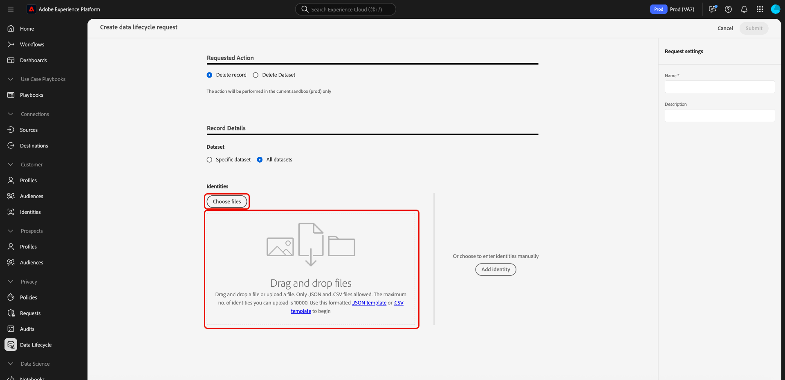

# Supprimer des enregistrements {#record-delete}

Utilisez la variable [[!UICONTROL Cycle de vie des données] workspace](./overview.md) pour supprimer des enregistrements dans Adobe Experience Platform en fonction de leur identité principale. Ces enregistrements peuvent être liés à des consommateurs individuels ou à toute autre entité incluse dans le graphique d’identités.

>[!IMPORTANT]
> 
>La fonction de suppression d’enregistrement est actuellement en version bêta et disponible uniquement dans un **version limitée**. Il n’est pas disponible pour tous les clients. Les demandes de suppression d’enregistrements ne sont disponibles que pour les organisations de la version limitée.
> 
> 
>Les suppressions d’enregistrements sont destinées à être utilisées pour la normalisation des données, la suppression des données anonymes ou la minimisation des données. Elles ne sont **pas** destinées aux demandes de droits des titulaires de données (conformité) en ce qui concerne les réglementations de confidentialité comme le Règlement général sur la protection des données (RGPD). Pour tous les cas d’utilisation de conformité, utilisez plutôt [Adobe Experience Platform Privacy Service](../../privacy-service/home.md).

## Conditions préalables {#prerequisites}

La suppression d’enregistrements nécessite une compréhension pratique du fonctionnement des champs d’identité dans Experience Platform. Plus précisément, vous devez connaître les valeurs d’espace de noms d’identité des entités dont vous souhaitez supprimer les enregistrements, en fonction du jeu de données (ou des jeux de données) dont vous les supprimez.

Pour plus d’informations sur les identités dans Platform, consultez la documentation suivante :

* [Service d’identités d’Adobe Experience Platform](../../identity-service/home.md) : associe les identités des appareils et des systèmes, en liant les jeux de données en fonction des champs d’identité définis par les schémas XDM auxquels ils se conforment.
* [Espaces de noms d’identité](../../identity-service/features/namespaces.md) : définissent les différents types d’informations d’identité qui peuvent être associés à une seule personne et constituent un composant obligatoire pour chaque champ d’identité.
* [Profil client en temps réel](../../profile/home.md): utilise des graphiques d’identités pour fournir des profils consommateurs unifiés basés sur des données agrégées provenant de plusieurs sources, mis à jour en temps quasi réel.
* [Modèle de données d’expérience (XDM)](../../xdm/home.md) : fournit des structures et des définitions standard pour les données de Platform à l’aide de schémas. Tous les jeux de données de Platform sont conformes à un schéma XDM spécifique et le schéma définit les champs qui sont des identités.
* [Champs d’identité](../../xdm/ui/fields/identity.md) : découvrez la définition d’un champ d’identité dans un schéma XDM.

## Création d’une requête {#create-request}

Pour lancer le processus, sélectionnez **[!UICONTROL Cycle de vie des données]** dans le volet de navigation de gauche de l’interface utilisateur de Platform. La variable [!UICONTROL Requêtes de cycle de vie des données] workspace s’affiche. Ensuite, sélectionnez **[!UICONTROL Créer une requête]** de la page principale de l’espace de travail.

![La variable [!UICONTROL Requêtes de cycle de vie des données] Workspace avec [!UICONTROL Créer une requête] sélectionné.](../images/ui/record-delete/create-request-button.png)

Le workflow de création de requête s’affiche. Par défaut, la variable **[!UICONTROL Supprimer un enregistrement]** est sélectionnée sous la propriété **[!UICONTROL Action requise]** . Conservez la sélection de cette option.

>[!IMPORTANT]
> 
>Pour améliorer l’efficacité et réduire le coût des opérations des jeux de données, les organisations qui ont été déplacées au format Delta peuvent supprimer des données d’Identity Service, de Real-Time Customer Profile et du lac de données. Ce type d’utilisateur est appelé delta-migrated. Les utilisateurs des organisations qui ont fait l’objet d’une migration delta peuvent choisir de supprimer des enregistrements d’un seul jeu de données ou de tous les jeux de données. Les utilisateurs d’organisations qui n’ont pas subi de migration delta ne peuvent pas supprimer de manière sélective des enregistrements d’un seul jeu de données ou de tous les jeux de données, comme illustré dans l’image ci-dessous. Dans ce cas, continuez à [Fournir des identités](#provide-identities) du guide.

![Le workflow de création de la requête avec la fonction [!UICONTROL Supprimer un enregistrement] sélectionnée et surlignée.](../images/ui/record-delete/delete-record.png)

## Sélectionner des jeux de données {#select-dataset}

L’étape suivante consiste à déterminer si vous souhaitez supprimer des enregistrements d’un seul jeu de données ou de tous les jeux de données. Si cette option n’est pas disponible, passez à la [Fournir des identités](#provide-identities) du guide.

Sous , **[!UICONTROL Détails de l’enregistrement]** utilisez le bouton radio pour effectuer une sélection entre un jeu de données spécifique et tous les jeux de données. Si vous choisissez **[!UICONTROL Sélectionner un jeu de données]**, procédez pour sélectionner l’icône de base de données () pour ouvrir une boîte de dialogue qui fournit une liste de jeux de données disponibles. Sélectionnez le jeu de données souhaité dans la liste, suivi de **[!UICONTROL Terminé]**.

![La variable [!UICONTROL Sélectionner un jeu de données] Boîte de dialogue avec un jeu de données sélectionné et [!UICONTROL Terminé] surlignée.](../images/ui/record-delete/select-dataset.png)

Si vous souhaitez supprimer des enregistrements de tous les jeux de données, sélectionnez **[!UICONTROL Tous les jeux de données]**.

![La variable [!UICONTROL Sélectionner un jeu de données] avec la boîte de dialogue [!UICONTROL Tous les jeux de données] l’option sélectionnée.](../images/ui/record-delete/all-datasets.png)

>[!NOTE]
>
>La sélection de l’option **[!UICONTROL Tous les jeux de données]** peut entraîner un temps de suppression plus long et une suppression imprécise des enregistrements.

## Fournir des identités {#provide-identities}

>[!CONTEXTUALHELP]
>id="platform_hygiene_primaryidentity"
>title="Espace de noms d’identité"
>abstract="Un espace de noms d’identité est un attribut qui lie un enregistrement au profil d’un client ou d’une cliente dans Experience Platform. Le champ Espace de noms d’identité d’un jeu de données est défini par le schéma sur lequel le jeu de données est basé. Dans cette colonne, vous devez indiquer le type (ou l’espace de nommage) de l’espace de noms d’identité de l’enregistrement, par exemple `email` pour les adresses e-mail et `ecid` pour les identifiants Experience Cloud. Pour en savoir plus, consultez le guide de l’interface d’utilisation du cycle de vie des données."

>[!CONTEXTUALHELP]
>id="platform_hygiene_identityvalue"
>title="Valeur d’identité principale"
>abstract="Dans cette colonne, vous devez indiquer la valeur de l’espace de noms d’identité de l’enregistrement, qui doit correspondre au type d’identité fourni dans la colonne de gauche. Si l’espace de noms d’identité est `email`, la valeur doit correspondre à l’adresse e-mail de l’enregistrement. Pour en savoir plus, consultez le guide de l’interface d’utilisation du cycle de vie des données."

Lors de la suppression d’enregistrements, vous devez fournir des informations d’identité afin que le système puisse déterminer les enregistrements à supprimer. Pour tout jeu de données de Platform, les enregistrements sont supprimés en fonction de la variable **espace de noms d’identité** champ défini par le schéma du jeu de données.

Comme tous les champs d’identité de Platform, un espace de noms d’identité est composé de deux éléments : un **type** (parfois appelé espace de noms d’identité) et un **value**. Le type d’identité fournit un contexte sur la manière dont le champ identifie un enregistrement (une adresse électronique, par exemple). La valeur représente l’identité spécifique d’un enregistrement pour ce type (par exemple, `jdoe@example.com` pour le `email` type d’identité). Les champs courants utilisés comme identités comprennent les informations de compte, les identifiants d’appareil et les identifiants de cookie.

>[!TIP]
>
>Si vous ne connaissez pas l’espace de noms d’identité d’un jeu de données spécifique, vous pouvez le trouver dans l’interface utilisateur de Platform. Dans l’espace de travail **[!UICONTROL Jeux de données]**, sélectionnez le jeu de données en question dans la liste. Sur la page des détails du jeu de données, passez la souris sur le nom du schéma du jeu de données dans le rail de droite. L’espace de noms de l’identité s’affiche avec le nom et la description du schéma.
>
>

Si vous supprimez des enregistrements d’un seul jeu de données, toutes les identités que vous fournissez doivent avoir le même type, car un jeu de données ne peut avoir qu’un seul espace de noms d’identité. Si vous effectuez une suppression dans tous les jeux de données, vous pouvez inclure plusieurs types d’identité, car différents jeux de données peuvent avoir différentes identités principales.

Deux options permettent de fournir des identités lors de la suppression d’enregistrements :

* [Charger un fichier JSON](#upload-json)
* [Saisie manuelle des valeurs d’identité principale](#manual-identity)

### Charger un fichier JSON {#upload-json}

Pour charger un fichier JSON, vous pouvez le faire glisser et le déposer dans la zone fournie, ou sélectionner **[!UICONTROL Sélection de fichiers]** pour parcourir et sélectionner dans votre répertoire local.



Le fichier JSON doit être formaté sous la forme d’un tableau d’objets, chaque objet représentant une identité.

```json
[
  {
    "namespaceCode": "email",
    "value": "jdoe@example.com"
  },
  {
    "namespaceCode": "email",
    "value": "san.gray@example.com"
  }
]
```

| Propriété | Description |
| --- | --- |
| `namespaceCode` | Type d’identité. |
| `value` | La valeur d’identité principale indiquée par le type. |

Une fois le fichier chargé, vous pouvez continuer à [envoyer la requête](#submit).

### Saisie manuelle des identités {#manual-identity}

Pour saisir les identités manuellement, sélectionnez **[!UICONTROL Ajouter une identité]**.

![Le workflow de création de la requête avec la fonction [!UICONTROL Ajouter une identité] en surbrillance.](../images/ui/record-delete/add-identity.png)

Les commandes qui s’affichent vous permettent de saisir des identités une par une. Sous **[!UICONTROL espace de noms d’identité]**, utilisez le menu déroulant pour sélectionner le type d’identité. Sous **[!UICONTROL Valeur d’identité du Principal]**, indiquez la valeur de l’espace de noms d’identité pour l’enregistrement.


Pour ajouter d’autres identités, cliquez sur l’icône plus () en regard de l’une des lignes, ou sélectionnez **[!UICONTROL Ajouter une identité]**.


## Envoyer la requête {#submit}

Une fois que vous avez terminé d’ajouter des identités à la requête, sous **[!UICONTROL Paramètres de requête]**, attribuez un nom et une description facultative à la requête avant de sélectionner **[!UICONTROL Envoyer]**.

>[!IMPORTANT]
> 
>Il existe différentes limites pour le nombre total de suppressions d’enregistrement d’identité unique qui peuvent être envoyées chaque mois. Ces limites sont basées sur votre contrat de licence. Les organisations qui ont acheté toutes les éditions d’Adobe Real-time Customer Data Platform ou de Adobe Journey Optimizer peuvent envoyer jusqu’à 100 000 enregistrements d’identité supprimés chaque mois. Organisations ayant effectué des achats **Adobe Health Care Shield** ou **Adobe de la confidentialité et de la sécurité** peut envoyer jusqu’à 600 000 enregistrements d’identité supprimés chaque mois.<br>Une seule requête de suppression d’enregistrement via l’interface utilisateur vous permet d’envoyer 10 000 identifiants à la fois. La variable [Méthode d’API pour supprimer des enregistrements](../api/workorder.md#create) permet l’envoi simultané de 100 000 identifiants.<br>Il est recommandé d’envoyer autant d’ID par demande que possible, jusqu’à votre limite d’ID. Lorsque vous envisagez de supprimer un volume élevé d’identifiants, il est préférable d’éviter d’envoyer un volume faible ou une seule demande de suppression d’identifiant par enregistrement.

![Le paramètre de requête [!UICONTROL Nom] et [!UICONTROL Description] champs avec [!UICONTROL Envoyer] surlignée.](../images/ui/record-delete/submit.png)

A [!UICONTROL Confirmer la requête] s’affiche pour indiquer que les identités ne peuvent pas être récupérées une fois supprimées. Sélectionner **[!UICONTROL Envoyer]** pour confirmer la liste des identités dont vous souhaitez supprimer les données.

![La variable [!UICONTROL Confirmer la requête] boîte de dialogue.](../images/ui/record-delete/confirm-request.png)

Une fois la demande envoyée, un ordre de travail est créé et s’affiche sur la page [!UICONTROL Enregistrement] de la [!UICONTROL Cycle de vie des données] workspace. Ensuite, vous pouvez surveiller le statut de l’ordre de travail lors du traitement de la requête.

>[!NOTE]
>
>Reportez-vous à la section de présentation sur [calendrier et transparence](../home.md#record-delete-transparency) pour plus d’informations sur le traitement des suppressions d’enregistrement une fois qu’elles sont exécutées.

![La variable [!UICONTROL Enregistrement] de la [!UICONTROL Cycle de vie des données] espace de travail avec la nouvelle requête mise en surbrillance.](../images/ui/record-delete/request-log.png)

## Étapes suivantes

Ce document explique comment supprimer des enregistrements dans l’interface utilisateur de l’Experience Platform. Pour plus d’informations sur l’exécution d’autres tâches de gestion du cycle de vie des données dans l’interface utilisateur, reportez-vous au [Présentation de l’interface utilisateur du cycle de vie des données](./overview.md).

Pour savoir comment supprimer des enregistrements à l’aide de l’API Data Hygiene, reportez-vous à la section [guide de point de terminaison des commandes de travail](../api/workorder.md).
