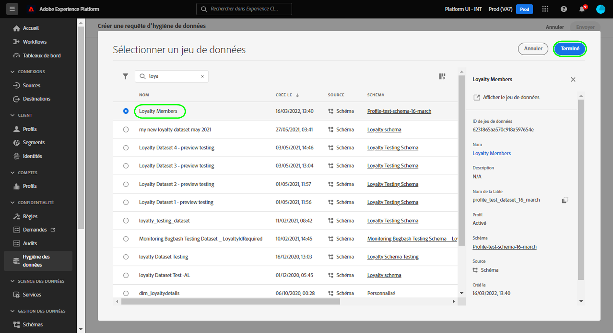

# Gérer des TTL de jeux de données

>[!IMPORTANT]
>
>Actuellement, les fonctionnalités de nettoyage de données d’Adobe Experience Platform sont uniquement disponibles pour les organisations qui ont acheté Adobe Shield for Healthcare.

L’espace de travail [[!UICONTROL Nettoyage de données]](./overview.md) dans l’interface utilisateur d’Adobe Experience Platform vous permet de planifier une durée de vie (TTL) pour un jeu de données.

Ce document explique comment planifier et gérer des TTL de jeux de données dans l’interface utilisateur de Platform.

## Planifier une TTL

Pour créer une requête, sélectionnez **[!UICONTROL Créer une requête]** dans la page principale de l’espace de travail.

![Image illustrant le bouton [!UICONTROL Créer une requête] sélectionné](../images/ui/ttl/create-request-button.png).

<!-- The request creation dialog appears. Under the **[!UICONTROL Action]** section, select **[!UICONTROL Dataset]** to update the available controls for TTL scheduling-->

### Sélectionner une date et un jeu de données

La boîte de dialogue de création de requête s’affiche. Sous la section **[!UICONTROL Action]**, sélectionnez une date à laquelle vous souhaitez que le jeu de données soit supprimé. Vous pouvez saisir la date manuellement (au format `mm/dd/yyyy`) ou sélectionner l’icône de calendrier () pour sélectionner la date dans une boîte de dialogue.

.

Ensuite, sous **[!UICONTROL Détails du jeu de données]**, sélectionnez l’icône de base de données () pour ouvrir une boîte de dialogue de sélection de jeu de données. Dans la liste, sélectionnez un jeu de données auquel appliquer la TTL, puis sélectionnez **[!UICONTROL Terminé]**.

.

>[!NOTE]
>
>Seuls les jeux de données appartenant au sandbox actuel s’affichent.

### Envoyer la requête

Une fois que vous avez sélectionné un jeu de données et une date de TTL, sélectionnez **[!UICONTROL Envoyer]**.

![Image illustrant le bouton [!UICONTROL Envoyer] sélectionné](../images/ui/ttl/submit.png).

Vous êtes invité à confirmer la date à laquelle le jeu de données sera supprimé. Sélectionnez **[!UICONTROL Envoyer]** pour continuer.

Une fois la demande envoyée, un ordre de travail est créé et s’affiche sur l’onglet principal de la [!UICONTROL Hygiène des données] workspace. Ensuite, vous pouvez surveiller le statut de l’ordre de travail lors du traitement de la requête.

## Modifier ou annuler une TTL

Pour modifier ou annuler une TTL, sélectionnez **[!UICONTROL Jeu de données]** dans la page principale de l’espace de travail, puis sélectionnez TTL dans la liste.

Dans la page des détails de la TTL, le rail de droite affiche les commandes permettant de modifier ou d’annuler la suppression planifiée.

## Étapes suivantes

Ce document explique comment planifier des TTL de jeux de données dans l’interface utilisateur d’Experience Platform. Pour découvrir comment planifier des TTL de jeux de données à l’aide de l’API Data Hygiene, consultez le [Guide de point d’entrée de TTL de jeu de données](../api/ttl.md).
