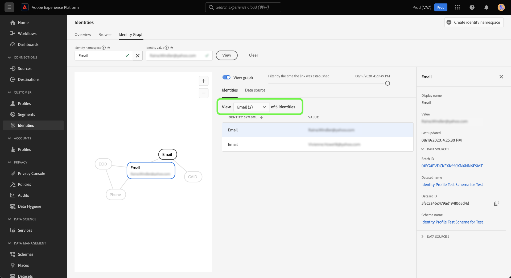
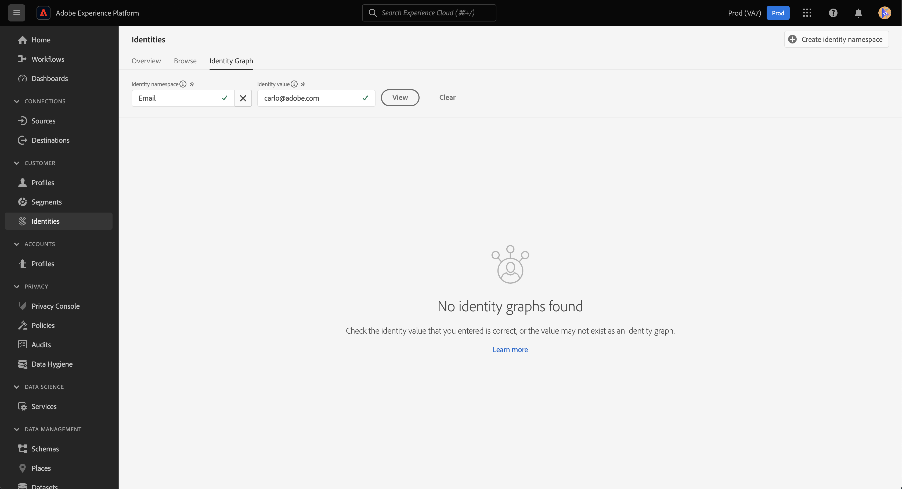
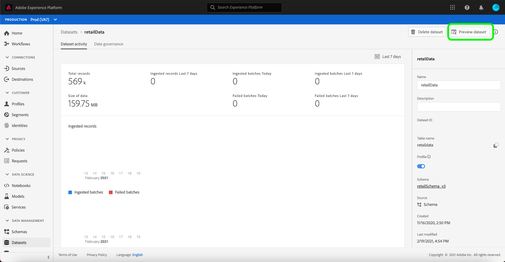

# Visionneuse de graphiques d’identités

Un graphique d’identités est une carte des relations entre différentes identités pour un client spécifique. Il permet de visualiser la manière dont un client interagit avec votre marque sur différents canaux. Tous les graphiques d’identités client sont gérés et mis à jour collectivement par le Service d’identités d’Adobe Experience Platform en temps quasi réel, en réponse à l’activité du client.

La visionneuse de graphiques d’identités de l’interface utilisateur d’Experience Platform vous permet de visualiser et de mieux comprendre quelles identités de client sont regroupées, et de quelles façons. La visionneuse vous permet de faire glisser différentes parties du graphique et d’interagir avec celles-ci. Vous pouvez ainsi examiner les relations d’identité complexes, effectuer plus efficacement le débogage et bénéficier d’une plus grande transparence en ce qui concerne l’utilisation des informations.

Le document suivant décrit les étapes à suivre pour accéder à la visionneuse de graphiques d’identités et l’utiliser dans l’interface utilisateur d’Experience Platform.

## Tutoriel vidéo

La vidéo suivante est destinée à vous aider à comprendre la visionneuse de graphiques d’identités.

>[!VIDEO](https://video.tv.adobe.com/v/345654/?quality=12&learn=on&captions=fre_fr)

## Commencer

L’utilisation de la visionneuse de graphiques d’identités nécessite une compréhension des différents services Adobe Experience Platform impliqués. Avant de commencer à travailler avec la visionneuse de graphiques d’identités, consultez la documentation relative aux services suivants :

- [[!DNL Identity Service]](../home.md) : obtenez une meilleure compréhension des clients individuels et de leurs comportements en rapprochant des identités entre appareils et systèmes.
- [Real-Time Customer Profile](../../profile/home.md) : les graphiques d’identités sont utilisés par Real-Time Customer Profile pour créer une vue d’ensemble exhaustive et unique de vos attributs et de votre comportement client.

### Terminologie

- **Identité (nœud) :** une identité ou un nœud est une donnée propre à une entité, généralement une personne. Une identité se compose d’un espace de noms d’identité et d’une valeur d’identité. Par exemple, une identité complète peut être constituée d’un espace de noms d’identité pour **E-mail**, associé à une valeur d’identité **robin@email.com**.
- **Lien (périphérie) :** un lien ou une périphérie représente le lien entre les identités. Les liens d’identité incluent des propriétés telles que la première date et l’heure établies et la dernière date et heure mises à jour. Le premier horodatage établi définit la date et l’heure auxquelles une nouvelle identité est liée à une identité existante. La date et l’heure de la dernière mise à jour définissent la date et l’heure de la dernière mise à jour d’un lien d’identité existant.
- **Graphique (cluster) :** un graphique ou un cluster est un groupe d’identités et de liens qui représentent une personne.

## Accès à la visionneuse de graphiques d’identités {#access-identity-graph-viewer}

Dans l’interface utilisateur d’Experience Platform, sélectionnez **[!UICONTROL Identités]** dans le volet de navigation de gauche, puis sélectionnez **[!UICONTROL Graphique d’identités]** dans la liste des onglets de l’en-tête.

Pour afficher un graphique d’identités, indiquez un espace de noms d’identité et sa valeur correspondante, puis sélectionnez **[!UICONTROL Affichage]**.

>[!TIP]
>
>Sélectionnez l’icône de tableau  pour afficher un panneau avec une liste de tous les espaces de noms d’identité disponibles dans votre organisation. Vous pouvez utiliser n’importe quel espace de noms d’identité tant qu’une valeur d’identité valide y est connectée. Pour plus d’informations, consultez le [guide des espaces de noms d’identité](./namespaces.md).

## Présentation de l’interface de la visionneuse de graphiques d’identités

L’interface de la visionneuse de graphiques d’identités se compose de plusieurs éléments que vous pouvez utiliser pour interagir avec vos données d’identité et mieux les comprendre.

Le graphique d’identités affiche toutes les identités liées à la combinaison espace de noms d’identité et valeur que vous avez saisie. Chaque nœud est constitué d’un espace de noms d’identité et de sa valeur correspondante. Vous pouvez sélectionner, maintenir la touche enfoncée et faire glisser n’importe quel nœud pour interagir avec le graphique. Vous pouvez également placer le pointeur de la souris sur un nœud pour afficher des informations sur la valeur d’identité correspondante. Sélectionnez **[!UICONTROL Afficher le graphique]** pour masquer ou afficher le graphique.

>[!IMPORTANT]
>
>Un graphique d’identités nécessite au moins deux identités liées à générer et un espace de noms d’identité et une combinaison de valeurs valides. Le nombre maximal d’identités que la visionneuse de graphiques peut afficher est de 50. Voir la section [annexe](#appendix) ci-dessous pour plus d’informations.

Sélectionnez un lien dans le graphique pour afficher le jeu de données et l’identifiant de lot qui contribuent à ce lien. La sélection d’un lien met également à jour le rail de droite pour fournir plus d’informations sur les détails de la source de données, ainsi que sur les propriétés telles que les horodatages établis pour la première et la dernière mise à jour.

Le tableau [!UICONTROL Identités] fournit une vue différente de vos données d’identité, répertoriant l’espace de noms d’identité et la combinaison de valeurs d’identité sous la forme d’un tableau. La sélection d’un nœud dans le graphique met à jour l’élément de ligne en surbrillance dans le tableau [!UICONTROL Identités].

Utilisez le menu déroulant pour trier les données du graphique et mettre en surbrillance les informations sur un espace de noms d’identité spécifique. Par exemple, sélectionnez **[!UICONTROL E-mail]** dans le menu pour afficher les données spécifiques à l’espace de noms d’identité de l’e-mail.

Le rail de droite affiche des informations sur une identité sélectionnée, y compris sa dernière date et heure mises à jour. Le rail de droite affiche également des informations sur la source de données qui correspond à l’identité sélectionnée, y compris son identifiant de lot, son nom de jeu de données, son identifiant de jeu de données et son nom de schéma.

Le tableau suivant fournit des informations supplémentaires sur les propriétés de la source de données affichées dans le rail de droite :

| Source de données | Description |
| --- | --- | 
| ID de lot | Identifiant généré automatiquement et correspondant aux données du lot. |
| Identifiant du jeu de données | Identifiant généré automatiquement et correspondant à votre jeu de données. |
| Nom du jeu de données | Nom du jeu de données contenant les données par lot. |
| Nom du schéma | Nom du schéma. Le schéma fournit un ensemble de règles qui représentent et valident la structure et le format des données. |

Vous pouvez également utiliser la *[!UICONTROL Source de données]* pour afficher la liste des sources de données qui contribuent à vos identités. Sélectionnez [!UICONTROL Source de données] pour obtenir une vue tabulaire de vos jeux de données et de vos identifiants de lot.

Utilisez le curseur pour filtrer les données du graphique selon l’heure à laquelle les identités ont été établies pour la première fois. Par défaut, la visionneuse de graphiques d’identités affiche toutes les identités liées dans le graphique. Maintenez le curseur enfoncé et faites-le glisser pour ajuster l’heure à la dernière date et heure auxquelles une nouvelle identité a été liée au graphique. Dans l’exemple ci-dessous, le graphique indique que le lien d’identité le plus récent (GAID) a été établi le **[!UICONTROL 08/19/2020 à 16:29:29]**.

Réglez le curseur pour voir qu’un autre lien d’identité (e-mail) a été établi le **[!UICONTROL 08/19/2020 à 16:25:30]**.

Vous pouvez également régler le curseur pour afficher la première itération du graphique. Dans l’exemple ci-dessous, la visionneuse de graphiques d’identités indique que le graphique a été créé le **[!UICONTROL 08/19/2020, 16:11:49]** avec ses premiers liens ECID, E-mail et Téléphone.

## Annexe

La section suivante fournit des informations supplémentaires sur l’utilisation de la visionneuse de graphiques d’identités.

### Comprendre les messages d’erreur

Des erreurs peuvent se produire lors de l’accès à la visionneuse de graphiques d’identités. Voici une liste des conditions préalables et des limites à prendre en compte lors de l’utilisation de la visionneuse de graphiques d’identités.

- Une valeur d’identité doit exister dans l’espace de noms sélectionné.
- La visionneuse de graphiques d’identités nécessite au moins deux identités liées à générer. Il est possible qu’il n’y ait qu’une seule valeur d’identité et aucune identité liée. Dans ce cas, la valeur n’existerait que dans [!DNL Profile] visionneuse.
- La visionneuse de graphiques d’identités ne peut pas dépasser 50 identités maximum.

### Accès à la visionneuse de graphiques d’identités à partir de jeux de données

Vous pouvez également accéder à la visionneuse de graphiques d’identités à l’aide de l’interface des jeux de données. Sur la page Jeux de données [!UICONTROL Parcourir], sélectionnez un jeu de données avec lequel vous souhaitez interagir, puis sélectionnez **[!UICONTROL Prévisualiser le jeu de données]**

Dans la fenêtre d’aperçu, sélectionnez une icône d’empreinte digitale pour afficher les identités représentées par le biais de la visionneuse de graphiques d’identités.

>[!TIP]
>
>L’icône d’empreinte ne s’affiche que si le jeu de données comporte plusieurs identités.

## Étapes suivantes

En lisant ce document, vous avez appris à explorer les graphiques d’identités de vos clients dans l’interface utilisateur d’Experience Platform. Pour plus d’informations sur les identités dans Experience Platform, reportez-vous à la [&#x200B; présentation du service d’identités &#x200B;](../home.md)

## Journal des modifications

| Date | Action |
| ---- | ------ |
| 2021-2001 | <ul><li>Ajout de la prise en charge des données ingérées en flux continu et du sandbox hors production.</li><li>Correction de bogues mineurs.</li></ul> |
| 2021-2002 | <ul><li>La visionneuse de graphiques d’identités est rendue accessible via la prévisualisation du jeu de données.</li><li>Correction de bogues mineurs.</li><li>La visionneuse de graphiques d’identités est mise à la disposition du grand public.</li></ul> |
| 2023-01 | <ul><li>Mises à jour de l’interface utilisateur.</li></ul> |
