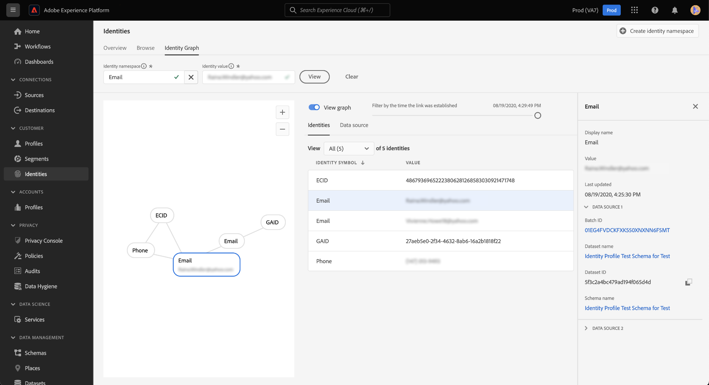

# Visionneuse de graphique d’identités

Un graphique d’identités est une carte des relations entre différentes identités pour un client spécifique, qui vous fournit une représentation visuelle de la manière dont votre client interagit avec votre marque sur différents canaux. Tous les graphiques d’identités client sont gérés et mis à jour collectivement par le Service d’identités d’Adobe Experience Platform en temps quasi réel, en réponse à l’activité du client.

La visionneuse de graphiques d’identités de l’interface utilisateur de Platform vous permet de visualiser et de mieux comprendre quelles identités de client sont regroupées, et de quelles manières. La visionneuse vous permet de faire glisser différentes parties du graphique et d’interagir avec celles-ci. Vous pouvez ainsi examiner les relations d’identité complexes, effectuer plus efficacement le débogage et bénéficier d’une plus grande transparence en ce qui concerne l’utilisation des informations.

Le document suivant décrit les étapes à suivre pour accéder à la visionneuse de graphiques d’identités et l’utiliser dans l’interface utilisateur de Platform.

## Tutoriel vidéo

La vidéo suivante est destinée à vous aider à comprendre la visionneuse de graphiques d’identités.

>[!VIDEO](https://video.tv.adobe.com/v/331030/?quality=12&learn=on)

## Commencer

L’utilisation de la visionneuse de graphiques d’identités nécessite une compréhension des différents services Adobe Experience Platform impliqués. Avant de commencer à utiliser la visionneuse de graphiques d’identités, veuillez consulter la documentation relative aux services suivants :

- [[!DNL Identity Service]](../home.md) : profitez d’une meilleure vue d’ensemble des clients et de leur comportement en rapprochant des identités entre appareils et systèmes.
- [ Real-Time Customer Profile ](../../profile/home.md) : les graphiques d’identités sont utilisés par Real-Time Customer Profile pour créer une vue d’ensemble exhaustive et unique de vos attributs et comportements clients.

### Terminologie

- **Identité (noeud) :** Une identité ou un noeud est des données propres à une entité, généralement une personne. Une identité se compose d’un espace de noms d’identité et d’une valeur d’identité. Par exemple, une identité entièrement qualifiée peut se composer d’un espace de noms d’identité pour **Email**, combiné à une valeur d’identité de **robin@email.com**.
- **Lien (périphérie) :** Un lien ou un bord représente la connexion entre les identités. Les liens d’identité incluent des propriétés telles que les horodatages préétablis et mis à jour en dernier. Le premier horodatage établi définit la date et l’heure auxquelles une nouvelle identité est liée à une identité existante. L’horodatage de la dernière mise à jour définit la date et l’heure de la dernière mise à jour d’un lien d’identité existant.
- **Graphique (grappe) :** Un graphique ou une grappe est un groupe d’identités et de liens qui représentent une personne.

## Accès à la visionneuse de graphiques d’identités {#access-identity-graph-viewer}

Dans l’interface utilisateur de Platform, sélectionnez **[!UICONTROL Identités]** dans le volet de navigation de gauche, puis **[!UICONTROL Graphique d’identités]** dans la liste des onglets de l’en-tête.

Pour afficher un graphique d’identités, fournissez un espace de noms d’identité et sa valeur correspondante, puis sélectionnez **[!UICONTROL Afficher]**.

>[!TIP]
>
>Sélectionnez l’icône de table  pour afficher un panneau avec une liste de tous les espaces de noms d’identité disponibles dans votre organisation. Vous pouvez utiliser n’importe quel espace de noms d’identité tant qu’une valeur d’identité valide y est connectée. Pour plus d’informations, consultez le [guide sur l’espace de noms d’identité](./namespaces.md).

## Présentation de l’interface de la visionneuse de graphiques d’identités

L’interface de la visionneuse de graphiques d’identités est composée de plusieurs éléments que vous pouvez utiliser pour interagir avec vos données d’identité et mieux les comprendre.

Le graphique d’identités affiche toutes les identités liées à la combinaison espace de noms et valeur d’identité que vous avez saisie. Chaque noeud se compose d’un espace de noms d’identité et de sa valeur correspondante. Vous pouvez sélectionner, maintenir enfoncé et faire glisser n’importe quel noeud pour interagir avec le graphique. Vous pouvez également survoler un noeud avec la souris pour afficher des informations sur sa valeur d’identité correspondante. Sélectionnez **[!UICONTROL Afficher le graphique]** pour masquer ou afficher le graphique.

>[!IMPORTANT]
>
>Un graphique d’identités requiert au minimum deux identités liées et une combinaison valide d’espace de noms et de valeurs d’identité. Le nombre maximal d’identités que la visionneuse de graphiques peut afficher est de 50. Pour plus d’informations, consultez la section [annexe](#appendix) ci-dessous.

Sélectionnez un lien dans le graphique pour afficher le jeu de données et l’identifiant de lot qui contribuent à ce lien. La sélection d’un lien met également à jour le rail de droite afin de fournir plus d’informations sur les détails de la source de données, ainsi que des propriétés telles que les horodatages premier établi et dernier mis à jour.

La table [!UICONTROL Identités] fournit une vue différente de vos données d’identité, répertoriant l’espace de noms d’identité et la combinaison de valeurs d’identité dans un format tabulaire. La sélection d’un noeud dans le graphique met à jour l’élément de ligne surligné dans le tableau [!UICONTROL Identités] .

Utilisez le menu déroulant pour trier les données du graphique et mettre en surbrillance les informations sur un espace de noms d’identité spécifique. Par exemple, sélectionnez **[!UICONTROL Email]** dans le menu pour afficher les données spécifiques à l’espace de noms de l’identité de l’email.

Le rail de droite affiche des informations sur une identité sélectionnée, y compris son dernier horodatage mis à jour. Le rail de droite affiche également des informations sur la source de données qui correspond à l’identité sélectionnée, y compris son identifiant de lot, son nom de jeu de données, son identifiant de jeu de données et son nom de schéma.

Le tableau suivant fournit des informations supplémentaires sur les propriétés de la source de données affichées dans le rail de droite :

| Source de données | Description |
| --- | --- | 
| ID de lot | Identifiant généré automatiquement qui correspond à vos données de lot. |
| Identifiant du jeu de données | L’identifiant généré automatiquement qui correspond à votre jeu de données. |
| Nom du jeu de données | Nom du jeu de données qui contient vos données de lot. |
| Nom du schéma | Nom du schéma. Le schéma fournit un ensemble de règles qui représentent et valident la structure et le format des données. |

Vous pouvez également utiliser la *[!UICONTROL source de données]* pour afficher la liste des sources de données qui contribuent à vos identités. Sélectionnez [!UICONTROL Source de données] pour obtenir une vue tabulaire de vos jeux de données et de vos identifiants de lot.

Utilisez le curseur pour filtrer les données du graphique selon le moment auquel les identités ont été établies pour la première fois. Par défaut, la visionneuse de graphiques d’identités affiche toutes les identités liées dans le graphique. Maintenez le curseur enfoncé et faites glisser le curseur pour ajuster l’heure au dernier horodatage auquel une nouvelle identité était liée au graphique. Dans l’exemple ci-dessous, le graphique indique que le lien d’identité le plus récent (GAID) a été établi le **[!UICONTROL 08/19/2020, 4:29:29 PM]**.

Réglez le curseur pour voir qu’un autre lien d’identité (e-mail) a été établi le **[!UICONTROL 08/19/2020, 4:25:30 PM]**.

Vous pouvez également ajuster le curseur pour afficher la première itération du graphique. Dans l’exemple ci-dessous, la visionneuse de graphiques d’identités indique que le graphique a été créé pour la première fois le **[!UICONTROL 08/19/2020, 4:11:49 PM]**, avec ses premiers liens comme ECID, Email et Phone.

## Annexe

La section suivante fournit des informations supplémentaires sur l’utilisation de la visionneuse de graphiques d’identités.

### Comprendre les messages d’erreur

Des erreurs peuvent se produire lors de l’accès à la visionneuse de graphiques d’identités. Vous trouverez ci-dessous une liste des conditions préalables et des limites à prendre en compte lors de l’utilisation de la visionneuse de graphiques d’identités.

- Une valeur d’identité doit exister dans l’espace de noms sélectionné.
- La visionneuse de graphiques d’identités requiert au moins deux identités liées à générer. Il est possible qu’il n’existe qu’une seule valeur d’identité et aucune identité liée. Dans ce cas, la valeur n’existerait que dans la visionneuse [!DNL Profile].
- La visionneuse de graphiques d’identités ne peut pas dépasser 50 identités au maximum.

### Accès à la visionneuse de graphiques d’identités à partir de jeux de données

Vous pouvez également accéder à la visionneuse de graphiques d’identités à l’aide de l’interface des jeux de données. Sur la page [!UICONTROL Parcourir] des jeux de données, sélectionnez un jeu de données avec lequel interagir, puis sélectionnez **[!UICONTROL Prévisualiser le jeu de données]**

Dans la fenêtre d’aperçu, sélectionnez une icône d’empreinte digitale pour afficher les identités représentées par le biais de la visionneuse de graphiques d’identités.

>[!TIP]
>
>L’icône d’empreinte ne s’affiche que si le jeu de données comporte deux identités ou plus.

## Étapes suivantes

En lisant ce document, vous avez appris à explorer les graphiques d’identités de vos clients dans l’interface utilisateur de Platform. Pour plus d’informations sur les identités dans Platform, reportez-vous à la [présentation d’Identity Service](../home.md)

## Journal des modifications

| Date | Action |
| ---- | ------ |
| 2021-01 | <ul><li>Ajout de la prise en charge de la diffusion en continu des données ingérées et des environnements de test hors production.</li><li>Correction de bogues mineurs.</li></ul> |
| 2021-02 | <ul><li>La visionneuse de graphiques d’identités est rendue accessible par l’aperçu du jeu de données.</li><li>Correction de bogues mineurs.</li><li>La visionneuse de graphique d’identités est rendue disponible en général.</li></ul> |
| 2023-01 | <ul><li>Mises à jour de l’interface utilisateur.</li></ul> |
