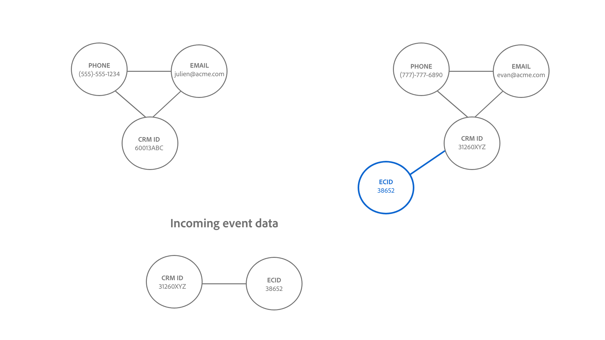

# Logique de liaison d’Identity Service {#identity-service-linking-logic}

>[!CONTEXTUALHELP]
>id="platform_identities_simulatedgraph"
>title="Graphe simulé"
>abstract="Les identités sont liées lorsque l’espace de noms d’identité et la valeur d’identité correspondent."

Un lien entre deux identités est établi lorsque l’espace de noms d’identité et les valeurs d’identité correspondent.

Deux types d’identités sont liés :

* **Enregistrements de profil** : ces identités proviennent généralement de systèmes CRM.
* **Événements d’expérience** : ces identités proviennent généralement de l’implémentation de WebSDK ou de la source Adobe Analytics.

## Signification sémantique de l&#39;établissement de liens

Une identité représente une entité du monde réel. S’il existe un lien établi entre deux identités, cela signifie que les deux identités sont associées l’une à l’autre. Voici quelques exemples illustrant ce concept :

| Action | Liens établis | Signification |
| --- | --- | --- |
| Un utilisateur final se connecte à l’aide d’un ordinateur. | Le CRMID et l’ECID sont liés. | Une personne (CRMID) possède un appareil avec un navigateur (ECID). |
| Un utilisateur final navigue anonymement à l’aide d’une iPhone . | IDFA est lié à ECID. | L’appareil matériel Apple (IDFA), tel qu’iPhone, est associé au navigateur (ECID). |
| Un utilisateur final se connecte à l’aide de Google Chrome, puis de Firefox. | Le CRMID est lié à deux ECID différents. | Une personne (CRMID) est associée à 2 navigateurs web (**Remarque** : chaque navigateur possède son propre ECID). |
| Un ingénieur de données ingère un enregistrement CRM qui comprend deux champs marqués comme identité : CRMID et E-mail. | CRMID et Email sont liés. | Une personne (CRMID) est associée à l’adresse e-mail. |

## Comprendre la logique de liaison d’Identity Service

Une identité se compose d’un espace de noms d’identité et d’une valeur d’identité.

* Un espace de noms d’identité est le contexte d’une valeur d’identité donnée vers. Les exemples courants d’espaces de noms d’identité incluent CRMID, E-mail et Téléphone.
* Une valeur d’identité est la chaîne qui représente une entité du monde réel. Par exemple : « julien@acme.com » peut être une valeur d’identité pour un espace de noms E-mail et 555-555-1234 peut être une valeur d’identité correspondante pour un espace de noms Téléphone.

>[!TIP]
>
>L’espace de noms d’identité est important, car sans lui, la valeur d’identité perd son contexte et ne dispose pas de suffisamment d’informations pour correspondre correctement aux identités.

Consultez les diagrammes suivants pour obtenir une représentation visuelle du fonctionnement de la logique de liaison d’Identity Service :

>[!BEGINTABS]

>[!TAB Graphique existant]

Supposons que vous ayez un graphique d’identités existant avec trois identités liées :

* TÉLÉPHONE :(555)-555-1234
* EMAIL:julien@acme.com
* CRMID:60013ABC

>[!TAB Données entrantes]

Une paire d’identités est ingérée dans votre graphique et contient :

* CRMID:60013ABC
* ECID:100066526

>[!TAB Graphique mis à jour]

Identity Service reconnaît que CRMID:60013ABC existe déjà dans votre graphique et ne lie donc que le nouvel ECID

>[!ENDTABS]

## Scénario client

Vous êtes ingénieur de données et vous ingérez le jeu de données CRM (enregistrement de profil) suivant dans Experience Platform.

| CRMID** | Téléphone* | Adresse e-mail* | Prénom | Nom |
| --- | --- | --- | --- | --- |
| 60013ABC | 555-555-1234 | julien@acme.com | Julien | Smith |
| 31260XYZ | 777-777-6890 | evan@acme.com | Evan | Smith |

>[!NOTE]
>
>* `**` : indique le champ marqué comme identité principale.
>* `*` : indique le champ marqué comme identité secondaire.
>
>Identity Service ne fait pas la distinction entre l’identité principale et l’identité secondaire. Tant qu’un champ est marqué comme identité, il est ingéré dans Identity Service.

Vous avez également implémenté WebSDK et ingéré un jeu de données WebSDK (événement d’expérience) avec les tableaux de données suivants :

| Date et heure | Identités de l’événement* | Événement |
| --- | --- | --- |
| `t=1` | ECID:38652 | Afficher la page d’accueil |
| `t=2` | ECID:38652, CRMID:31260XYZ | Rechercher des chaussures |
| `t=3` | ECID:44675 | Afficher la page d’accueil |
| `t=4` | ECID:44675, CRMID: 31260XYZ | Afficher l&#39;historique des achats |

L’identité principale de chaque événement sera déterminée en fonction de la [configuration des types d’éléments de données](../../tags/extensions/client/web-sdk/data-element-types.md).

>[!NOTE]
>
>* Si vous sélectionnez le CRMID comme principal, les événements authentifiés (événements avec mappage d’identité contenant le CRMID et l’ECID) auront une identité principale CRMID. Pour les événements non authentifiés (événements avec le mappage d’identité contenant uniquement l’ECID), une identité principale d’ECID est attribuée. Adobe recommande cette option.
>
>* Si vous sélectionnez l’ECID comme principal, quel que soit l’état d’authentification, l’ECID devient l’identité principale.

Dans cet exemple :

* `t=1`, utilisez un ordinateur de bureau (ECID:38652) et pour afficher la page d’accueil, naviguez de manière anonyme.
* `t=2`, a utilisé le même ordinateur de bureau, s’est connecté (CRMID:31260XYZ), puis a recherché des chaussures.
   * Une fois qu’un utilisateur est connecté, l’événement envoie l’ECID et le CRMID au service d’identités.
* `t=3`, a utilisé un ordinateur portable (ECID:44675) et a navigué anonymement.
* `t=4`, utilisait le même ordinateur portable, s&#39;est connecté (CRMID : 31260XYZ), puis a consulté l&#39;historique des achats.

>[!BEGINTABS]

>[!TAB timestamp=0]

Au `timestamp=0`, vous disposez de deux graphiques d’identités pour deux clients différents. Chacun d’eux est représenté par trois identités liées.

| | CRMID | E-mail | Téléphone |
| --- | --- | --- | --- |
| Client | 60013ABC | julien@acme.com | 555-555-1234 |
| Client 2 | 31260XYZ | evan@acme.com | 777-777-6890 |

>[!TAB timestamp=1]

Chez `timestamp=1`, un client utilise un ordinateur portable pour visiter votre site de commerce électronique, afficher votre page d&#39;accueil et naviguer de manière anonyme. Cet événement de navigation anonyme est identifié comme ECID:38652. Comme Identity Service stocke uniquement les événements comportant au moins deux identités, ces informations ne sont pas stockées.

>[!TAB timestamp=2]

Chez `timestamp=2`, un client utilise le même ordinateur portable pour visiter votre site Web de commerce électronique. Ils se connectent avec leur combinaison de nom d&#39;utilisateur et de mot de passe et recherchent des chaussures. Identity Service identifie le compte du client lors de sa connexion, car il correspond à son CRMID : 31260XYZ. En outre, Identity Service associe ECID:38562 à CRMID:31260XYZ, car ils utilisent tous deux le même navigateur sur le même appareil.

>[!TAB timestamp=3]

Chez `timestamp=3`, un client utilise une tablette pour visiter votre site d’e-commerce et naviguer anonymement. Cet événement de navigation anonyme est identifié comme ECID:44675. Comme Identity Service stocke uniquement les événements comportant au moins deux identités, ces informations ne sont pas stockées.

>[!TAB timestamp=4]

Au `timestamp=4`, un client ou une cliente utilise la même tablette, se connecte à son compte (CRMID:31260XYZ) et consulte son historique d’achats. Cet événement associe leur CRMID:31260XYZ à l’identifiant de cookie affecté à l’activité de navigation anonyme, ECID:44675, et associe ECID:44675 au graphique d’identité du client deux.

>[!ENDTABS]
