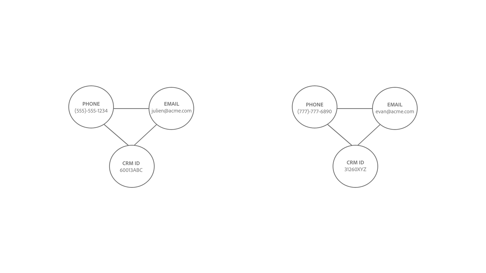

# Logique de liaison d’Identity Service

Un lien entre deux identités est établi lorsque l’espace de noms de l’identité et les valeurs d’identité correspondent.

Deux types d’identités sont liés :

* **Enregistrements de profil** : Ces identités proviennent généralement de systèmes CRM.
* **Événements d’expérience** : ces identités proviennent généralement de l’implémentation de WebSDK ou de la source Adobe Analytics.

## Signification sémantique de l’établissement de liens

Une identité représente une entité réelle. S’il existe un lien établi entre deux identités, cela signifie que les deux identités sont associées l’une à l’autre. Voici quelques exemples illustrant ce concept :

| Action | Liens établis | Signification |
| --- | --- | --- |
| Un utilisateur final se connecte à l’aide d’un ordinateur. | L’identifiant CRM et l’ECID sont liés. | Une personne (identifiant CRM) possède un appareil avec un navigateur (ECID). |
| Un utilisateur final navigue anonymement à l’aide d’iPhone . | IDFA est lié à ECID. | L’appareil matériel Apple (IDFA), tel qu’iPhone, est associé au navigateur (ECID). |
| Un utilisateur final se connecte à l’aide de Google Chrome, puis de Firefox. | L’identifiant CRM est lié à deux ECID différents. | Une personne (ID CRM) est associée à 2 navigateurs web (**Remarque** : chaque navigateur aura son propre ECID). |
| Un ingénieur de données ingère un enregistrement CRM qui comprend deux champs marqués comme identité : Identifiant CRM et Courrier électronique. | L&#39;identifiant CRM et l&#39;email sont liés. | Une personne (identifiant CRM) est associée à l’adresse email. |

## Présentation de la logique de liaison d’Identity Service

Une identité se compose d’un espace de noms d’identité et d’une valeur d’identité.

* Un espace de noms d’identité est le contexte d’une valeur d’identité donnée à . Les exemples d’espaces de noms d’identité courants incluent l’ID CRM, le courrier électronique et le téléphone.
* Une valeur d’identité est la chaîne qui représente une entité du monde réel. Par exemple : &quot;julien@acme.com&quot; peut être une valeur d’identité pour un espace de noms Email et 555-555-1234 peut être une valeur d’identité correspondante pour un espace de noms Phone.

>[!TIP]
>
>L’espace de noms d’identité est important, car sans lui, la valeur d’identité perd son contexte et ne dispose pas d’informations suffisantes pour correspondre correctement aux identités.

Consultez les diagrammes suivants pour une représentation visuelle du fonctionnement de la logique de liaison d’Identity Service :

>[!BEGINTABS]

>[!TAB Graphique existant]

Supposons que vous ayez un graphique d’identités existant avec trois identités liées :

* PHONE : (555)-555-1234
* EMAIL : julien@acme.com
* Identifiant CRM : 60013ABC

>[!TAB Données entrantes]

Une paire d’identités est ingérée dans votre graphique et cette paire contient :

* Identifiant CRM : 60013ABC
* ECID:100066526

>[!TAB Graphique mis à jour]

Identity Service reconnaît que l’ID CRM : 60013ABC existe déjà dans votre graphique. Il lie donc uniquement le nouvel ECID.

>[!ENDTABS]

## Scénario client

Vous êtes ingénieur en données et vous ingérez le jeu de données CRM suivant (enregistrement de profil) à Experience Platform.

| Identifiant CRM** | Téléphone* | Adresse e-mail* | Prénom | Nom |
| --- | --- | --- | --- | --- |
| 60013ABC | 555-555-1234 | julien@acme.com | Julien | Smith |
| 31260XYZ | 777-777-6890 | evan@acme.com | Evan | Smith |

>[!NOTE]
>
>* `**` - Indique le champ marqué comme identité principale.
>* `*` - Indique le champ marqué comme identité secondaire.
>
>Identity Service ne fait pas la distinction entre l’identité principale et l’identité secondaire. Tant qu’un champ est marqué comme identité, il sera ingéré dans Identity Service.

Vous avez également implémenté WebSDK et ingéré un jeu de données WebSDK (Experience Event) avec les tableaux de données suivants :

| Date et heure | Identités dans l’événement* | Événement |
| --- | --- | --- |
| `t=1` | ECID:38652 | Afficher la page d’accueil |
| `t=2` | ECID:38652, ID CRM:31260XYZ | Rechercher des chaussures |
| `t=3` | ECID:44675 | Afficher la page d’accueil |
| `t=4` | ECID : 44675, ID CRM : 31260XYZ | Afficher l’historique des achats |

L’identité principale de chaque événement sera déterminée en fonction de la façon dont vous configurez les types d’éléments de données ](../../tags/extensions/client/web-sdk/data-element-types.md).[

>[!NOTE]
>
>* Si vous sélectionnez l’identifiant CRM comme principal, les événements authentifiés (événements avec carte d’identité contenant l’identifiant CRM et l’ECID) auront une identité principale de l’identifiant CRM. Pour les événements non authentifiés (les événements dont la carte d’identité contient uniquement un ECID) auront une identité principale d’ECID. Adobe recommande cette option.
>
>* Si vous sélectionnez l’ECID comme identité principale, quel que soit l’état d’authentification, l’ECID devient l’identité principale.

Dans cet exemple :

* `t=1`, a utilisé un ordinateur de bureau (ECID:38652) et pour afficher le navigateur de la page d’accueil de manière anonyme.
* `t=2`, a utilisé le même ordinateur de bureau, s’est connecté (ID CRM : 31260XYZ), puis a recherché des chaussures.
   * Une fois qu’un utilisateur est connecté, l’événement envoie à la fois l’identifiant ECID et l’identifiant CRM à Identity Service.
* `t=3`, utilisait un ordinateur portable (ECID:44675) et naviguait de manière anonyme.
* `t=4`, a utilisé le même ordinateur portable, s&#39;est connecté (ID CRM : 31260XYZ), puis a consulté l&#39;historique des achats.

>[!BEGINTABS]

>[!TAB timestamp=0]

À `timestamp=0`, vous avez deux graphiques d’identités pour deux clients différents. Tous deux sont représentés par trois identités liées.

| | Identifiant CRM | E-mail | Téléphone |
| --- | --- | --- | --- |
| Customer One | 60013ABC | julien@acme.com | 555-555-1234 |
| Client deux | 31260XYZ | evan@acme.com | 777-777-6890 |

>[!TAB timestamp=1]

Sur `timestamp=1`, un client utilise un ordinateur portable pour visiter votre site web d’e-commerce, afficher votre page d’accueil et naviguer de manière anonyme. Cet événement de navigation anonyme est identifié comme ECID:38652. Comme Identity Service ne stocke que les événements avec au moins deux identités, ces informations ne sont pas stockées.

>[!TAB timestamp=2]

À `timestamp=2`, un client utilise le même ordinateur portable pour visiter votre site web de commerce électronique. Ils se connectent avec leur nom d’utilisateur et leur mot de passe, et ils recherchent des chaussures. Identity Service identifie le compte du client lorsqu’il se connecte, car il correspond à son identifiant CRM : 31260XYZ. En outre, Identity Service associe ECID:38562 à l’ID CRM:31260XYZ, car ils utilisent tous deux le même navigateur sur le même appareil.

>[!TAB timestamp=3]

Sur `timestamp=3`, un client utilise une tablette pour visiter votre site web d’e-commerce et naviguer de manière anonyme. Cet événement de navigation anonyme est identifié comme ECID:44675. Comme Identity Service ne stocke que les événements avec au moins deux identités, ces informations ne sont pas stockées.

>[!TAB timestamp=4]

Sur `timestamp=4`, un client utilise la même tablette, se connecte à son compte (ID CRM : 31260XYZ) et affiche son historique des achats. Cet événement lie leur ID CRM : 31260XYZ à l’identifiant de cookie affecté à l’activité de navigation anonyme, ECID : 44675, et relie ECID : 44675 au graphique d’identités de customer two.

>[!ENDTABS]
