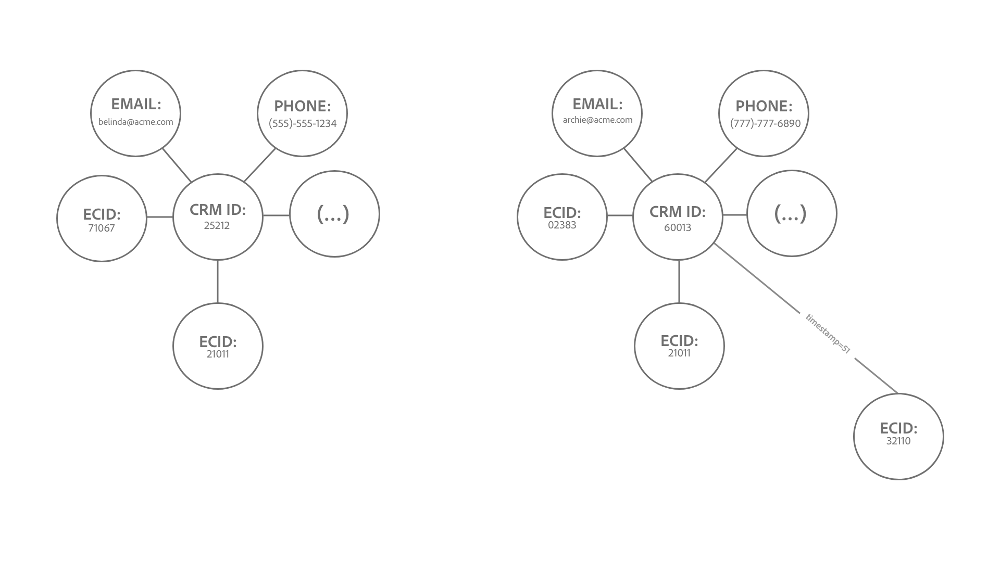

# Barrières de sécurité pour [!DNL Identity Service] data

Ce document traite de l’utilisation et des limites de débit des données [!DNL Identity Service] afin de vous aider à optimiser l’utilisation du graphique d’identité. Lors de la révision des mécanismes de sécurisation suivants, on suppose que vous avez correctement modélisé les données. Si vous avez des questions sur la manière de modéliser vos données, contactez votre représentant du service client.

>[!IMPORTANT]
>
>Vérifiez vos droits de licence dans votre commande commerciale et les [Description du produit](https://helpx.adobe.com/fr/legal/product-descriptions.html) sur les limites d’utilisation réelles en plus de cette page des barrières de sécurité.

## Commencer

Les services Experience Platform suivants sont impliqués dans la modélisation des données d’identités :

* [Identités](home.md) : associez les identités à partir de sources de données disparates lors de leur ingestion dans Platform.
* [[!DNL Real-Time Customer Profile]](../profile/home.md) : créez des profils clients unifiés à l’aide de données provenant de plusieurs sources.

## Limites du modèle de données

Les tableaux ci-dessous fournissent des conseils sur les barrières de sécurité des limites statiques et les règles de validation à prendre en compte pour les espaces de noms d’identité.

### Limites statiques

Le tableau suivant décrit les limites statiques appliquées aux données d’identité.

| Mécanisme de sécurisation | Limite | Notes |
| --- | --- | --- |
| Nombre d’identités dans un graphique | 50 | Lorsqu’un graphique comportant 50 identités liées est mis à jour, Identity Service applique un mécanisme &quot;premier entré, premier sorti&quot; et supprime l’identité la plus ancienne afin de libérer de l’espace pour la nouvelle identité de ce graphique (**Remarque**: Real-Time Customer Profile n’est pas affecté). La suppression est basée sur le type d’identité et sur la date et l’heure. La limite est appliquée au niveau de la sandbox. Pour plus d’informations, consultez la section sur [compréhension de la logique de suppression](#deletion-logic). |
| Nombre de liens vers une identité pour une ingestion par lots unique | 50 | Un seul lot peut contenir des identités anormales qui entraînent des fusions de graphiques indésirables. Pour éviter cela, Identity Service n’ingère pas d’identités déjà liées à 50 identités ou plus. |
| Nombre d’identités dans un enregistrement XDM | 20 | Le nombre minimum d’enregistrements XDM requis est de deux. |
| Nombre d’espaces de noms personnalisés | Aucun | Vous pouvez créer autant d’espaces de noms personnalisés que vous le souhaitez. |
| Nombre de caractères présents dans le nom d’affichage d’un espace de noms ou un symbole d’identité | Aucun | Le nombre de caractères dans le nom d’affichage d’un espace de noms ou un symbole d’identité est illimité. |

{style="table-layout:auto"}

### Validation de la valeur d’identité

Le tableau suivant décrit les règles à suivre pour garantir la validation de votre valeur d’identité.

| Espace de noms | Règle de validation | Comportement du système en cas de violation de règle |
| --- | --- | --- |
| ECID | <ul><li>La valeur d’identité d’un ECID doit comporter exactement 38 caractères.</li><li>La valeur d’identité d’un ECID ne doit être composée que de chiffres.</li></ul> | <ul><li>Si la valeur d’identité d’un ECID ne comporte pas exactement 38 caractères, l’enregistrement est ignoré.</li><li>Si la valeur d’identité d’un ECID contient des caractères non numériques, l’enregistrement est ignoré.</li></ul> |
| Non-ECID | <ul><li>La valeur d’identité ne peut pas dépasser 1 024 caractères.</li><li>Les valeurs d’identité ne peuvent pas être &quot;null&quot;, &quot;anonymous&quot;, &quot;invalid&quot; ou être une chaîne vide (par exemple : &quot;&quot;, &quot;&quot;, &quot;&quot;).</li></ul> | <ul><li>Le cas échéant, l’enregistrement est ignoré.</li><li>L’identité sera bloquée de l’ingestion.</li></ul> |

{style="table-layout:auto"}

### Ingestion des espaces de noms d’identité

Depuis le 31 mars 2023, le service d’identités bloque l’ingestion des identifiants Adobe Analytics (AAID) pour les nouvelles clientes et les nouveaux clients. L’ingestion de cette identité s’effectue généralement par la [source Adobe Analytics](../sources/connectors/adobe-applications/analytics.md). La [source Adobe Audience Manager](../sources//connectors/adobe-applications/audience-manager.md) est redondante, car l’ECID représente le même navigateur web. Si vous souhaitez modifier cette configuration par défaut, contactez votre équipe Adobe en charge des comptes.

## Comprendre la logique de suppression lorsqu’un graphique d’identités à la capacité est mis à jour {#deletion-logic}

Lorsqu’un graphique d’identité complet est mis à jour, le service d’identités supprime l’identité la plus ancienne du graphique avant d’ajouter la dernière identité. Cela permet de garantir l’exactitude et la pertinence des données d’identité. Le processus de suppression suit les deux règles suivantes :

### Règle 1 : la priorité de suppression dépend du type d’identité d’un espace de noms

La priorité de suppression est comme suit :

1. ID de cookie
2. ID d’appareil
3. ID, e-mail et téléphone sur l’ensemble des appareils

### Règle 2 : la suppression est basée sur la date et l’heure stockées sur l’identité

Chaque identité liée d’un graphique possède une date et une heure correspondantes qui lui sont propres. Lorsqu’un graphique complet est mis à jour, le service d’identités supprime l’identité dont la date et l’heure sont les plus anciennes.

Lorsqu’un graphique complet est mis à jour avec une nouvelle identité, les deux règles agissent de concert pour désigner l’ancienne identité à supprimer. Le service d’identités supprime d’abord l’ID de cookie le plus ancien, puis l’ID d’appareil le plus ancien et enfin l’ID/e-mail/téléphone sur l’ensemble des appareils le plus ancien.

>[!NOTE]
>
>Si l’identité à supprimer est liée à plusieurs autres identités du graphique, les liens reliant cette identité sont également supprimés.

### Implications sur la mise en oeuvre

Les sections suivantes décrivent les implications de la logique de suppression sur Identity Service, Real-Time Customer Profile et WebSDK.

#### Identity Service : modifications du type d’identité d’espace de noms personnalisé

Contactez votre équipe de compte d’Adobe pour demander un changement de type d’identité si votre environnement de test de production contient :

* Espace de noms personnalisé dans lequel les identifiants de personne (tels que les identifiants CRM) sont configurés en tant que type d’identité de cookie/appareil.
* Espace de noms personnalisé dans lequel les identifiants de cookie/d’appareil sont configurés en tant que type d’identité multi-appareils.

Une fois cette fonction disponible, les graphiques qui dépassent la limite de 50 identités sont réduits jusqu’à 50 identités. Pour Real-Time CDP Édition B2C, cela peut entraîner une augmentation minimale du nombre de profils qualifiés pour une audience, car ces profils étaient auparavant ignorés de la segmentation et de l’activation.

#### Real-Time Customer Profile : impact sur les audiences adressables

La suppression se produit uniquement pour les données d’Identity Service et non pour Real-Time Customer Profile.

* Ce comportement peut donc créer plus de profils avec un seul ECID, car celui-ci ne fait plus partie du graphique d’identités.
* Pour rester dans vos numéros de droits d’audience adressables, il est recommandé d’activer [expiration pseudonyme des données de profil](../profile/pseudonymous-profiles.md) pour supprimer vos anciens profils.

#### Real-Time Customer Profile et WebSDK : suppression d’identité par Principal

Si vous souhaitez conserver vos événements authentifiés par rapport à l’identifiant CRM, il est recommandé de modifier vos identifiants principaux ECID en identifiant CRM. Lisez les documents suivants pour connaître les étapes de mise en oeuvre de cette modification :

* [Configuration de la carte d’identité pour les balises Experience Platform](../tags/extensions/client/web-sdk/data-element-types.md#identity-map).
* [Données d’identité dans le SDK Web Experience Platform](../web-sdk/identity/overview.md#using-identitymap)

### Exemples de scénarios

#### Exemple 1 : graphique grand type

*Diagram note :*

* `t` = horodatage.
* La valeur d’un horodatage correspond à la récence d’une identité donnée. Par exemple : `t1` représente la première identité liée (la plus ancienne) et `t51` représente l’identité liée la plus récente.

Dans cet exemple, avant que le graphique de gauche ne puisse être mis à jour avec une nouvelle identité, Identity Service supprime d’abord l’identité existante avec l’horodatage le plus ancien. Cependant, comme l’identité la plus ancienne est un ID d’appareil, le service d’identités ignore cette identité et cherche à supprimer un espace de noms avec un type plus élevé dans la liste de priorité de suppression, en l’occurrence `ecid-3`. Une fois la suppression de l’identité la plus ancienne avec un type de priorité de suppression plus élevé effectuée, le graphique est mis à jour avec un nouveau lien, `ecid-51`.

* Dans le rare cas où il existe deux identités avec le même horodatage et le même type d’identité, Identity Service triera les identifiants en fonction des [XID](./api/list-native-id.md) et effectuer la suppression.

#### Exemple 2 : &quot;split graphique&quot;

>[!BEGINTABS]

>[!TAB Événement entrant]

*Diagram note :*

* Le diagramme suivant suppose que à `timestamp=50`, il existe 50 identités dans le graphique d’identités.
* `(...)` désigne les autres identités déjà liées dans le graphique.

Dans cet exemple, ECID:32110 est ingéré et lié à un graphique volumineux à l’adresse `timestamp=51`, dépassant ainsi la limite de 50 identités.

>[!TAB Processus de suppression]

Par conséquent, Identity Service supprime l’identité la plus ancienne en fonction de l’horodatage et du type d’identité. Dans ce cas, ECID:35577 est supprimé uniquement du graphique d’identités.

>[!TAB Sortie graphique]

Suite à la suppression de ECID:35577, les périphéries qui liaient l’ID CRM:60013 et l’ID CRM:25212 avec l’ECID:35577 désormais supprimé sont également supprimées. Ce processus de suppression entraîne la division du graphique en deux graphiques plus petits.

>[!ENDTABS]

#### Exemple 3 : &quot;hub-and-speak&quot;

>[!BEGINTABS]

>[!TAB Événement entrant]

*Diagram note :*

* Le diagramme suivant suppose que à `timestamp=50`, il existe 50 identités dans le graphique d’identités.
* `(...)` désigne les autres identités déjà liées dans le graphique.

En vertu de la logique de suppression, certaines identités &quot;hub&quot; peuvent également être supprimées. Ces identités de hub font référence à des noeuds liés à plusieurs identités individuelles qui seraient sinon dissociées.

Dans l’exemple ci-dessous, ECID:21011 est ingéré et lié au graphique à l’adresse `timestamp=51`, dépassant ainsi la limite de 50 identités.

>[!TAB Processus de suppression]

Par conséquent, Identity Service supprime uniquement l’identité la plus ancienne du graphique d’identités, qui dans ce cas est ECID:35577. La suppression de ECID:35577 entraîne également la suppression des éléments suivants :

* Le lien entre l’ID de gestion de la relation client : 60013 et l’ECID:35577 désormais supprimé, ce qui entraîne un scénario de partage de graphique.
* IDFA : 32110, IDFA : 02383, et les identités restantes représentées par `(...)`. Ces identités sont supprimées car, individuellement, elles ne sont liées à aucune autre identité et ne peuvent donc pas être représentées dans un graphique.

>[!TAB Sortie graphique]

Enfin, le processus de suppression génère deux graphiques plus petits.

>[!ENDTABS]

## Étapes suivantes

Pour plus d’informations sur [!DNL Identity Service], consultez la documentation suivante :

* [Vue d’ensemble des [!DNL Identity Service]](home.md)
* [Visionneuse de graphique d’identités](features/identity-graph-viewer.md)

Pour plus d’informations sur les barrières de sécurité des autres services Experience Platform, sur les informations de latence de bout en bout et les informations de licence des documents Description du produit Real-Time CDP, consultez la documentation suivante :

* [Barrières de sécurité Real-Time CDP](/help/rtcdp/guardrails/overview.md)
* [Diagrammes de latence de bout en bout](https://experienceleague.adobe.com/docs/blueprints-learn/architecture/architecture-overview/deployment/guardrails.html?lang=en#end-to-end-latency-diagrams) pour divers services Experience Platform.
* [Real-time Customer Data Platform (Édition B2C - Packages Prime et Ultimate)](https://helpx.adobe.com/fr/legal/product-descriptions/real-time-customer-data-platform-b2c-edition-prime-and-ultimate-packages.html)
* [Real-time Customer Data Platform (B2P - Packages Prime et Ultimate)](https://helpx.adobe.com/legal/product-descriptions/real-time-customer-data-platform-b2p-edition-prime-and-ultimate-packages.html)
* [Real-time Customer Data Platform (B2B - Packages Prime et Ultimate)](https://helpx.adobe.com/legal/product-descriptions/real-time-customer-data-platform-b2b-edition-prime-and-ultimate-packages.html)
