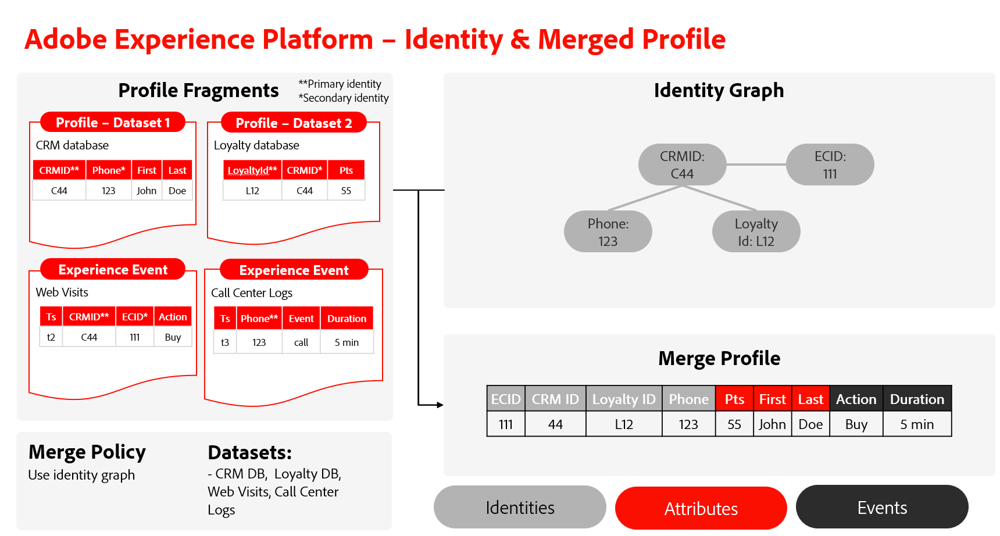

# Comprendre la relation entre Identity Service et le profil client en temps réel

>[!IMPORTANT]
>
>Cette page suppose que la politique de fusion utilise le graphique d’identité. Pour plus d’informations sur les politiques de fusion dans le profil client en temps réel, consultez la documentation sur [les politiques de fusion et la combinaison d’identités](../profile/merge-policies/overview.md#identity-stitching).

Bien que vous puissiez utiliser Identity Service et le profil client en temps réel en tandem, les deux fonctionnalités de Adobe Experience Platform ne sont pas intrinsèquement les mêmes.

* Vous pouvez utiliser Identity Service pour générer et gérer le graphique d’identités qui rassemble les identités disparates d’un client individuel.
* Vous pouvez utiliser le profil client en temps réel pour rassembler des fragments de profil disparates et créer un profil fusionné. Ce processus nécessite l’utilisation du graphique d’identité.

Ce document décrit les similitudes, les différences et les relations entre Identity Service et le profil client en temps réel.

## Service d’identités par rapport au profil client en temps réel

Les principales différences entre Identity Service et le profil client en temps réel sont les suivantes :

| | Service d’identités | Profil client en temps réel |
| --- | --- |--- |
| **Rôle** | <ul><li>Identity Service vous permet de créer et de gérer des graphiques d’identités.</li></ul> | Vous pouvez utiliser le profil client en temps réel pour : <ul><li>Créez une vue à 360 degrés d’un profil client.</li><li>Affichage et gestion des profils.</li></ul> |
| **Entrée** | <ul><li>Pour utiliser Identity Service, vous devez ingérer des données d’enregistrement ou des événements de série temporelle comportant au moins deux champs marqués comme identité. Les champs que vous marquez comme identité sont ensuite ingérés dans Identity Service.</li></ul> | <ul><li>Fragments de profil : représentent une identité principale unique et les données d’enregistrement ou d’événement correspondantes pour cet identifiant au sein d’un jeu de données donné.</li><li>Graphiques d’identités : le profil référence le graphique d’identités d’un profil client donné afin d’identifier tous les fragments de profil avec les mêmes identités principales.</li></ul> |
| **Processus** | <ul><li>Une fois que vous avez ingéré au moins deux identités, Identity Service les lie.</li></ul> | <ul><li>Le profil client en temps réel fusionne les fragments de profil tout en référençant les graphiques d’identités correspondants.</li></ul> |
| **Output** | <ul><li>Le résultat est un graphique d’identités, qui est un ensemble d’identités liées à un individu.</li></ul> | <ul><li>Le résultat est un profil fusionné, qui est une vue unique et complète d’un client donné. Ce profil peut ensuite être qualifié pour un segment.</li></ul> |

{style="table-layout:auto"}

## Processus de création de profil fusionné

Lisez les étapes ci-dessous pour mieux comprendre le processus de création d’un profil fusionné :

* Tout d’abord, le profil client en temps réel référence un graphique d’identités et récupère toutes les identités.
* Ensuite, Profile récupère les fragments de profil avec les identités principales dans le graphique d’identités.
* Une fois l’opération réussie, Profile than fusionne tous les événements et attributs existants.
   * En cas de conflit entre les informations d’attribut, les attributs sont sélectionnés en fonction de la méthode de fusion. Pour plus d’informations, reportez-vous à la [vue d’ensemble des politiques de fusion](../profile/merge-policies/overview.md).

## Désigner un champ comme identité

Dans le modèle de données d’expérience (XDM), le marquage ou la désignation d’un champ en tant qu’identité est une instruction permettant à Experience Platform d’ingérer ce champ spécifique dans Identity Service. Cette désignation permet ensuite de fusionner des fragments de profil dans le profil client en temps réel. Si aucun fragment de profil n’est associé à l’identité, ne la désignez pas comme identité.

### Comprendre les identités principales et secondaires

Une fois que vous avez marqué les champs comme identités, ils peuvent être définis comme identités principales ou secondaires. Les identités Principal et secondaires sont des concepts qui font partie du profil client en temps réel.

* L’identité principale (parfois appelée « clé primaire ») est l’identité dans laquelle les fragments de profil sont stockés.
* S’il n’existe qu’une seule identité dans une ligne de données donnée, cette identité unique est désignée comme principale.
* S’il existe plusieurs identités, l’une d’elles est désignée comme principale et l’autre comme secondaire.

Identity Service établira des liens entre les identités tant qu’il existe au moins deux champs marqués comme identité. Identity Service ne stocke pas d’informations indiquant si une identité est principale ou secondaire.

