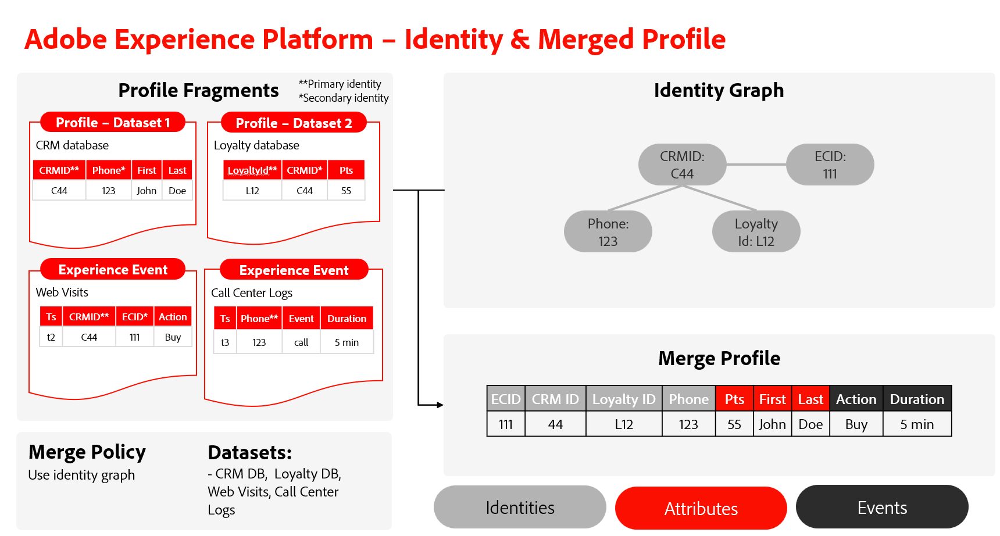

# Présentation de la relation entre Identity Service et Real-Time Customer Profile

>[!IMPORTANT]
>
>Cette page suppose que la stratégie de fusion utilise le graphique d’identités. Pour plus d’informations sur les stratégies de fusion dans Real-Time Customer Profile, consultez la documentation sur les [stratégies de fusion et combinaison d’identités](../profile/merge-policies/overview.md#identity-stitching).

Bien que vous puissiez utiliser Identity Service et Real-time Customer Profile en tandem, les deux fonctionnalités de Adobe Experience Platform ne sont pas intrinsèquement les mêmes.

* Vous pouvez utiliser Identity Service pour générer et gérer le graphique d’identités qui rassemble les identités disparates d’un client individuel.
* Vous pouvez utiliser Real-time Customer Profile pour rassembler des fragments de profil disparates et créer un profil fusionné. Ce processus nécessite l’utilisation du graphique d’identités.

Ce document décrit les similitudes, les différences et les relations entre Identity Service et Real-Time Customer Profile.

## Identity Service et Real-time Customer Profile

Les principales différences entre Identity Service et Real-Time Customer Profile sont les suivantes :

| | Service d’identités | Profil client en temps réel |
| --- | --- |--- |
| **Rôle** | <ul><li>Vous pouvez utiliser Identity Service pour créer et gérer des graphiques d’identités.</li></ul> | Vous pouvez utiliser Real-time Customer Profile pour : <ul><li>Créez une vue à 360 degrés d’un profil client.</li><li>Affichage et gestion des profils</li></ul> |
| **Entrée** | <ul><li>Pour utiliser Identity Service, vous devez ingérer des données d’enregistrement ou des événements de série temporelle comportant au moins deux champs marqués comme identité. Les champs que vous marquez comme identité sont ensuite ingérés dans Identity Service.</li></ul> | <ul><li>Fragments de profil : représentent une identité principale unique et les données d’enregistrement ou d’événement correspondantes pour cet identifiant dans un jeu de données donné.</li><li>Graphiques d’identités : le profil référence le graphique d’identités d’un profil client donné afin d’identifier tous les fragments de profil avec les mêmes identités principales.</li></ul> |
| **Processus** | <ul><li>Une fois que vous avez ingéré au moins deux identités, Identity Service relie ensuite ces identités.</li></ul> | <ul><li>Real-Time Customer Profile fusionne des fragments de profil lors du référencement de leurs graphiques d’identités correspondants.</li></ul> |
| **Output** | <ul><li>Le résultat est un graphique d’identités, qui est un ensemble d’identités liées à un individu.</li></ul> | <ul><li>Le résultat est un profil fusionné, qui est une vue unique et complète d’un client donné. Ce profil peut ensuite être admissible pour un segment.</li></ul> |

{style="table-layout:auto"}

## Processus de création de profil fusionné

Lisez les étapes ci-dessous pour mieux comprendre le processus de création d’un profil fusionné :

* Tout d’abord, Real-Time Customer Profile référence un graphique d’identités et récupère toutes les identités.
* Ensuite, Profile récupère les fragments de profil avec les identités principales dans le graphique d’identités.
* Une fois l’opération terminée, Profile fusionne tous les événements et attributs existants.
   * En cas de conflit d’informations d’attribut, les attributs sont choisis en fonction de la méthode de fusion. Pour plus d’informations, consultez la [présentation des stratégies de fusion](../profile/merge-policies/overview.md).

## Désignation d’un champ comme identité

Dans le modèle de données d’expérience (XDM), marquer ou désigner un champ comme identité est une instruction de l’Experience Platform pour ingérer ce champ particulier dans Identity Service. Cette désignation permet ensuite de fusionner des fragments de profil dans Real-time Customer Profile. Si aucun fragment de profil n’est associé à l’identité, ne la désignez pas en tant qu’identité.

### Compréhension des identités principale et secondaire

Une fois que vous marquez des champs comme identités, ils peuvent être définis comme identités principale ou secondaire. Les identités Principal et secondaire font partie des concepts de Real-time Customer Profile.

* L’identité principale (parfois appelée &quot;clé primaire&quot;) est l’identité dans laquelle les fragments de profil sont stockés.
* S’il n’existe qu’une seule identité dans une ligne de données donnée, cette identité unique est désignée comme identité principale.
* S’il existe plusieurs identités, l’une est désignée comme principale et l’autre est désignée comme secondaire.

Identity Service établira des liens entre les identités tant qu’il y aura au moins deux champs marqués comme identité. Identity Service ne stocke pas d’informations sur le caractère principal ou secondaire d’une identité.

