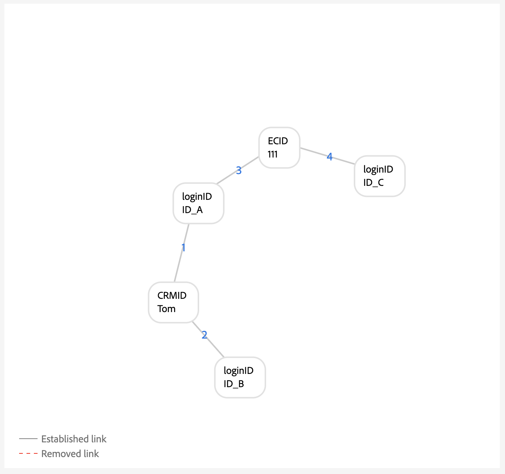

# Guide de configuration des règles de liaison de graphique d’identités

>[!AVAILABILITY]
>
>Les règles de liaison de graphiques d’identités sont actuellement en version bêta. Contactez votre équipe de compte d’Adobe pour plus d’informations sur les critères de participation. Les fonctionnalités et la documentation sont susceptibles d’être modifiées.

Lisez ce document pour obtenir un guide détaillé que vous pouvez suivre lors de l’implémentation de vos données avec Adobe Experience Platform Identity Service.

Composition détaillé :

1. [Créer les espaces de noms d’identité nécessaires](#namespace)
2. [Utilisez l’outil de simulation graphique pour vous familiariser avec l’algorithme d’optimisation des identités.](#graph-simulation)
3. [Utilisez l’outil de paramètres d’identité pour désigner vos espaces de noms uniques et configurer des classements de priorité pour vos espaces de noms.](#identity-settings)
4. [Création d’un schéma de modèle de données d’expérience (XDM)](#schema)
5. [Créer un jeu de données](#dataset)
6. [Ingestion de vos données dans Experience Platform](#ingest)

## Conditions préalables à la mise en oeuvre

Avant de commencer, vous devez vous assurer que les événements authentifiés de votre système contiennent toujours un identifiant de personne.

## Définition des autorisations {#set-permissions}

La première étape du processus de mise en oeuvre d’Identity Service consiste à s’assurer que votre compte Experience Platform est ajouté à un rôle doté des autorisations nécessaires. Votre administrateur peut configurer les autorisations de votre compte en accédant à l’interface utilisateur Autorisations de Adobe Experience Cloud. À partir de là, votre compte doit être ajouté à un rôle avec les autorisations suivantes :

* [!UICONTROL Afficher les paramètres d’identité] : appliquez cette autorisation pour pouvoir afficher les espaces de noms uniques et la priorité d’espace de noms dans la page de navigation de l’espace de noms d’identité.
* [!UICONTROL Modifier les paramètres d’identité] : appliquez cette autorisation pour pouvoir modifier et enregistrer vos paramètres d’identité.

Pour plus d’informations sur les autorisations, consultez le [guide des autorisations](../../access-control/abac/ui/permissions.md).

## Création des espaces de noms d’identité {#namespace}

Si vos données en ont besoin, vous devez d’abord créer les espaces de noms appropriés pour votre organisation. Pour savoir comment créer un espace de noms personnalisé, consultez le guide sur la [création d’un espace de noms personnalisé dans l’interface utilisateur](../features/namespaces.md#create-custom-namespaces).

## Utiliser l&#39;outil de simulation graphique {#graph-simulation}

Ensuite, accédez à l’[outil de simulation graphique](./graph-simulation.md) dans l’espace de travail de l’interface utilisateur d’Identity Service. Vous pouvez utiliser l’outil de simulation graphique pour simuler des graphiques d’identités, créés avec différentes configurations de priorité d’espace de noms et d’espace de noms uniques.

En créant différentes configurations, vous pouvez utiliser l’outil de simulation graphique pour découvrir et mieux comprendre comment l’algorithme d’optimisation des identités et certaines configurations peuvent affecter le comportement de votre graphique.

## Configuration des paramètres d’identité {#identity-settings}

Une fois que vous avez une meilleure idée du comportement de votre graphique, accédez à l’ [outil de paramètres d’identité](./identity-settings-ui.md) dans l’espace de travail de l’interface utilisateur d’Identity Service.

Utilisez l’outil de paramètres d’identité pour désigner vos espaces de noms uniques et configurer vos espaces de noms par ordre de priorité. Une fois que vous avez terminé d’appliquer vos paramètres, vous devez attendre au moins six heures avant de pouvoir procéder à l’ingestion des données, car au moins six heures sont nécessaires pour que les nouveaux paramètres soient reflétés dans Identity Service.

## Créer un schéma XDM {#schema}

Une fois vos espaces de noms uniques et vos priorités d’espace de noms établies, vous pouvez procéder à la configuration requise pour ingérer vos données. Tout d’abord, vous devez créer un schéma XDM. En fonction de vos données, vous devrez peut-être créer un schéma pour XDM Individual Profile et XDM ExperienceEvent.

Pour ingérer des données dans Real-time Customer Profile, vous devez vous assurer que votre schéma contient au moins un champ qui a été désigné comme identité principale. En définissant une identité principale, vous pouvez activer un schéma donné pour l’ingestion de profils.

Pour plus d’informations sur la création d’un schéma, consultez le guide sur la [création d’un schéma XDM dans l’interface utilisateur](../../xdm/tutorials/create-schema-ui.md).

## Créer un jeu de données {#dataset}

Créez ensuite un jeu de données afin de fournir une structure pour les données que vous allez ingérer. Un jeu de données est une structure de stockage et de gestion pour une collection de données, généralement sous la forme d’un tableau, qui contient un schéma (des colonnes) et des champs (des lignes). Les jeux de données fonctionnent en tandem avec les schémas. Pour ingérer des données dans Real-time Customer Profile, votre jeu de données doit être activé pour l’ingestion de Profile. Pour que votre jeu de données soit activé pour Profile, il doit référencer un schéma activé pour l’ingestion de Profile.

Pour plus d’informations sur la création d’un jeu de données, consultez le [guide de l’interface utilisateur du jeu de données](../../catalog/datasets/user-guide.md).

## Ingestion de données {#ingest}

>[!WARNING]
>
>* Pendant votre processus de prémise en oeuvre, vous devez vous assurer que les événements authentifiés que votre système enverra à l’Experience Platform contiennent toujours un identifiant de personne, tel que CRMID.
>* Pendant l’implémentation, vous devez vous assurer que l’espace de noms unique ayant la priorité la plus élevée est toujours présent dans chaque profil. Consultez l’ [annexe](#appendix) pour obtenir des exemples de scénarios graphiques qui sont résolus en s’assurant que chaque profil contient l’espace de noms unique avec la priorité la plus élevée.

À ce stade, vous devriez disposer des éléments suivants :

* Autorisations nécessaires pour accéder aux fonctionnalités Identity Service.
* Espaces de noms pour vos données.
* Espaces de noms uniques désignés et priorités configurées pour vos espaces de noms.
* Au moins un schéma XDM. (En fonction de vos données et de votre cas d’utilisation spécifique, vous devrez peut-être créer des schémas d’événement de profil et d’expérience.)
* Jeu de données basé sur votre schéma.

Une fois que tous les éléments sont répertoriés ci-dessus, vous pouvez commencer à ingérer vos données dans Experience Platform. Vous pouvez procéder à l’ingestion des données de plusieurs manières différentes. Vous pouvez utiliser les services suivants pour importer vos données dans Experience Platform :

* [Ingestion par lots et par flux](../../ingestion/home.md)
* [Collecte de données dans Experience Platform](../../collection/home.md)
* [Sources Experience Platform](../../sources/home.md)

>[!TIP]
>
>Une fois vos données ingérées, la charge utile des données brutes XDM ne change pas. Il se peut que vos configurations d’identité principale s’affichent toujours dans l’interface utilisateur. Toutefois, ces configurations seront remplacées par les paramètres d’identité.

Pour tout commentaire, utilisez l’option **[!UICONTROL Commentaires Beta]** dans l’espace de travail de l’interface utilisateur d’Identity Service.

## Annexe {#appendix}

Lisez cette section pour plus d’informations sur la mise en oeuvre de vos paramètres d’identité et espaces de noms uniques.

### Scénario d’appareil partagé {#shared-device-scenario}

Vous devez vous assurer qu’un seul espace de noms est utilisé sur tous les profils qui représentent une personne. Cela permet à Identity Service de détecter l’identifiant de personne approprié dans un graphique donné.

>[!BEGINTABS]

>[!TAB Sans espace de noms d’identifiant de personne unique]

Sans espace de noms unique pour représenter les identifiants de personne, vous pouvez obtenir un graphique qui pointe vers des identifiants de personne disparates vers le même ECID. Dans cet exemple, B2BCRM et B2CCRM sont liés au même ECID en même temps. Ce graphique suggère que Tom, utilisant son compte de connexion B2C, a partagé un appareil avec Summer, en utilisant son compte de connexion B2B. Cependant, le système reconnaîtra qu’il s’agit d’un profil (effondrement du graphique).

>[!TAB  Avec un espace de noms de personne unique]

Compte tenu d’un espace de noms unique (dans ce cas, un CRMID au lieu de deux espaces de noms disparates), Identity Service peut discerner l’identifiant de personne qui a été associé pour la dernière fois à l’ECID. Dans cet exemple, puisqu’il existe un CRMID unique, Identity Service peut reconnaître un scénario &quot;appareil partagé&quot;, où deux entités partagent le même appareil.

>[!ENDTABS]

### Scénario loginID dangereux {#dangling-loginid-scenario}

Le graphique suivant simule un scénario loginID &quot;dangling&quot;. Dans cet exemple, deux loginID différents sont liés au même ECID. Cependant, `{loginID: ID_C}` n’est pas lié au CRMID. Par conséquent, il n’existe aucun moyen pour Identity Service de détecter que ces deux loginID représentent deux entités différentes.

>[!BEGINTABS]

>[!TAB Identifiant de connexion ambigu]

Dans cet exemple, `{loginID: ID_C}` reste en attente et n’est pas lié à un CRMID. Par conséquent, l’entité de personne à laquelle cet identifiant de connexion doit être associé reste ambiguë.

>[!TAB loginID est lié à un CRMID]

Dans cet exemple, `{loginID: ID_C}` est lié à `{CRMID: Tom}`. Par conséquent, le système est en mesure de discerner que cet identifiant de connexion est associé à Tom.

>[!TAB loginID est lié à un autre CRMID]

Dans cet exemple, `{loginID: ID_C}` est lié à `{CRMID: Summer}`. Par conséquent, le système est en mesure de discerner que cet identifiant de connexion est associé à une autre entité de personne, dans ce cas, Summer.

Cet exemple montre également que Tom et Summer doivent séparer les entités de personnes qui partagent un appareil, représenté par `{ECID: 111}`.

>[!ENDTABS]
