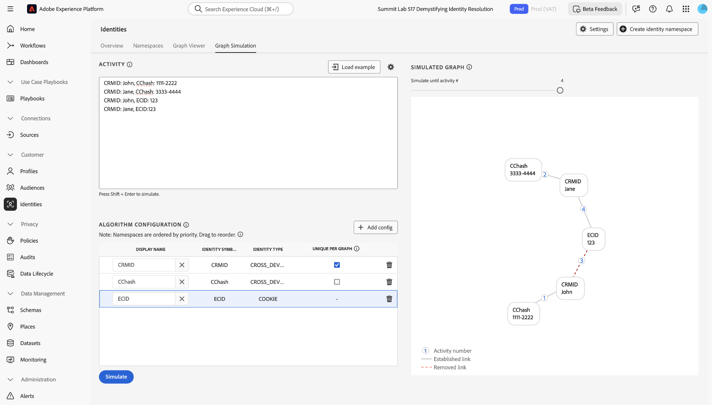
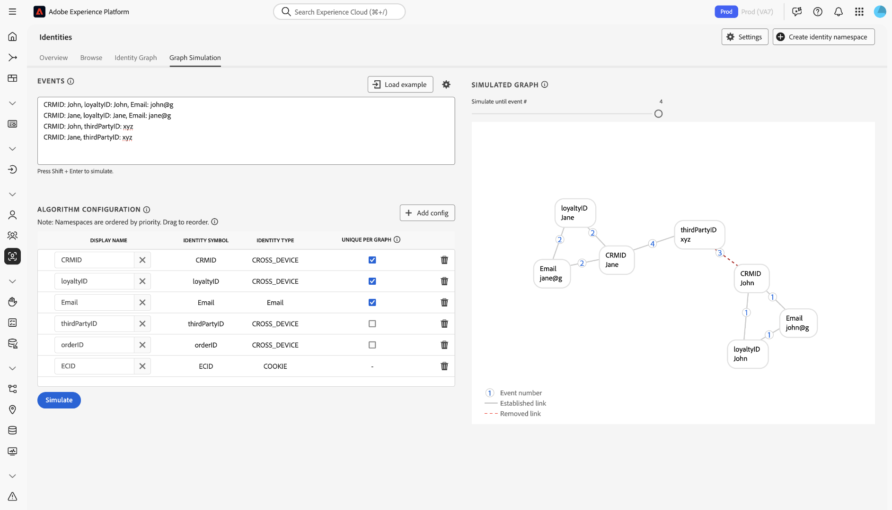

# Guide des configurations des [!DNL Identity Graph Linking Rules] {#configurations-guide}

>[!CONTEXTUALHELP]
>id="platform_identities_algorithmconfiguration"
>title="Configuration de l’algorithme"
>abstract="Configurez un espace de noms unique et une priorité d’espace de noms adaptée à vos identités ingérées."

Lisez ce document pour en savoir plus sur les différents types d’implémentation que vous pouvez configurer à l’aide de [!DNL Identity Graph Linking Rules].

Les scénarios des graphiques clients peuvent être regroupés en trois catégories différentes.

* **De base** : les [Implémentations de base](#basic-implementations) incluent des graphiques qui incluent le plus souvent des implémentations simples. Ces implémentations ont tendance à s’articuler autour d’un seul espace de noms inter-appareils (par exemple, CRMID). Bien que les implémentations de base soient assez simples, la réduction du graphique peut toujours se produire, souvent en raison de scénarios **appareil partagé**.
* **Intermédiaire** : les [implémentations intermédiaires](#intermediate-implementations) incluent plusieurs variables telles que **plusieurs espaces de noms sur l’ensemble des appareils**, **identités non uniques** et **plusieurs espaces de noms uniques**.
* **Avancé** : les [implémentations avancées](#advanced-implementations) impliquent des scénarios graphiques complexes et à plusieurs couches. Pour les implémentations avancées, il est essentiel d’établir l’ordre de priorité correct des espaces de noms afin de s’assurer que les liens appropriés sont supprimés, empêchant ainsi la réduction du graphique.

## Commencer

Avant de passer au document suivant, assurez-vous de vous familiariser avec plusieurs concepts importants d’Identity Service et de [!DNL Identity Graph Linking Rules].

* [Présentation du service d’identités](../home.md)
* [Vue d’ensemble d’[!DNL Identity Graph Linking Rules]](../identity-graph-linking-rules/namespace-priority.md)
* [Priorité d’espace de noms](namespace-priority.md)
* [Espace de noms unique](overview.md#unique-namespace)
* [Simulation de graphes](graph-simulation.md)

## Implémentations de base {#basic-implementations}

>[!NOTE]
>
>Pour terminer les implémentations ci-dessous, vous devez créer un espace de noms personnalisé avec le symbole d’identité (sensible à la casse) de : `CRMID`.

Lisez cette section pour obtenir des implémentations de base de [!DNL Identity Graph Linking Rules].

### Cas d’utilisation : implémentation simple qui utilise un espace de noms sur plusieurs appareils

En règle générale, les clients Adobe disposent d’un espace de noms unique sur l’ensemble des appareils utilisé dans toutes leurs propriétés, y compris le web, les appareils mobiles et les applications. Ce système est indépendant du secteur et de la géographie, car les clients du commerce de détail, des télécommunications et des services financiers utilisent ce type d’implémentation.

En règle générale, un utilisateur final est représenté par un espace de noms entre appareils (souvent un CRMID). Par conséquent, le CRMID doit être classé comme un espace de noms unique. Un utilisateur final propriétaire d’un ordinateur et d’un [!DNL iPhone] et qui ne partage pas son appareil peut disposer d’un graphique d’identité du type suivant.

Imaginez que vous êtes un architecte de données au sein d’une société de commerce électronique appelée **ACME**. John et Jane sont vos clients. Il s’agit d’utilisateurs finaux qui vivent ensemble à San Jose, en Californie. Ils partagent un ordinateur de bureau et l’utilisent pour parcourir votre site Web. De même, John et Jane partagent également un [!DNL iPad] et utilisent parfois ce [!DNL iPad] pour naviguer sur Internet, y compris sur votre site Web.

**Mode texte**

```json
CRMID: John, ECID: 123
CRMID: John, ECID: 999, IDFA: a-b-c
```

**Configuration des algorithmes (paramètres d’identité)**

Configurez les paramètres suivants dans l’interface de simulation de graphique avant de simuler votre graphique.

| Nom d’affichage | Symbole d’identité | Type d’identité | Unique par graphe | Priorité d’espace de noms |
| --- | --- | --- | --- | --- |
| CRMID | CRMID | CROSS_DEVICE | ✔️ | 1 |
| ECID | ECID | COOKIE | | 2 |
| IDFA | IDFA | PÉRIPHÉRIQUE | | 3 |

**Graphique simulé**

Dans ce graphique, John (l’utilisateur final) est représenté par le CRMID. `{ECID: 123}` représente le navigateur Web que John a utilisé sur son ordinateur personnel pour visiter votre plateforme de commerce électronique. `{ECID: 999}` représente le navigateur qu’il a utilisé sur son [!DNL iPhone] et `{IDFA: a-b-c}` représente son [!DNL iPhone].


**Exercice**

Simulez la configuration suivante dans la simulation de graphiques. Vous pouvez créer vos propres événements ou effectuer un copier-coller à l’aide du mode texte.

>[!BEGINTABS]

>[!TAB Périphérique partagé (PC)]

**Périphérique partagé (PC)**

**Mode texte**

```json
CRMID: John, ECID: 111
CRMID: Jane, ECID: 111
```

**Graphique simulé**

Dans ce graphique, John et Jane sont représentés par leurs propres CRMID respectifs :

* `{CRMID: John}`
* `{CRMID: Jane}`

Le navigateur sur l’ordinateur de bureau qu’ils utilisent tous les deux pour visiter votre plateforme d’e-commerce est représenté par `{ECID: 111}`. Dans ce scénario de graphique, Jeanne est le dernier utilisateur final authentifié. Par conséquent, le lien entre `{ECID: 111}` et `{CRMID: John}` est supprimé.


>[!TAB Appareil partagé (mobile)]

**Appareil partagé (mobile)**

**Mode texte**

```json
CRMID: John, ECID: 111, IDFA: a-b-c
CRMID: Jane, ECID: 111, IDFA: a-b-c
```

**Graphique simulé**

Dans ce graphique, John et Jane sont tous deux représentés par leurs propres CRMID respectifs. Le navigateur qu’ils utilisent est représenté par des `{ECID: 111}` et le [!DNL iPad] qu’ils partagent est représenté par des `{IDFA: a-b-c}`. Dans ce scénario de graphique, Jane est le dernier utilisateur final authentifié. Par conséquent, les liens de `{ECID: 111}` et `{IDFA: a-b-c}` à `{CRMID: John}` sont supprimés.


>[!ENDTABS]

## Implémentations intermédiaires {#intermediate-implementations}

>[!TIP]
>
>Une **identité non unique** est une identité associée à un espace de noms non unique.

Lisez cette section pour connaître les implémentations intermédiaires de [!DNL Identity Graph Linking Rules].

### Cas d’utilisation : vos données incluent des identités non uniques

>[!NOTE]
>
>Pour terminer les implémentations ci-dessous, vous devez créer les espaces de noms personnalisés suivants avec les symboles d’identité (sensibles à la casse) de :
>
>* `CRMID`
>* `CChash` (il s’agit d’un espace de noms personnalisé qui représente un numéro de carte de crédit haché.)

Imaginez que vous êtes un architecte de données travaillant pour une banque commerciale qui émet des cartes de crédit. Votre équipe marketing a indiqué qu’elle souhaitait inclure l’historique des transactions passées par carte de crédit dans un profil. Ce graphique d’identité peut se présenter comme suit.

**Mode texte**

```json
CRMID: John, CChash: 1111-2222 
CRMID: John, CChash: 3333-4444 
CRMID: John, ECID: 123 
CRMID: John, ECID: 999, IDFA: a-b-c
```

**Configuration des algorithmes (paramètres d’identité)**

Configurez les paramètres suivants dans l’interface de simulation de graphique avant de simuler votre graphique.

| Nom d’affichage | Symbole d’identité | Type d’identité | Unique par graphe | Priorité d’espace de noms |
| --- | --- | --- | --- | --- |
| CRMID | CRMID | CROSS_DEVICE | ✔️ | 1 |
| Hachage | Hachage | CROSS_DEVICE | | 2 |
| ECID | ECID | COOKIE | | 3 |
| IDFA | IDFA | PÉRIPHÉRIQUE | | 4 |

**Graphique simulé**


Rien ne garantit que ces numéros de carte de crédit ou tout autre espace de noms non unique seront toujours associés à un seul utilisateur final. Deux utilisateurs finaux peuvent s’enregistrer avec la même carte de crédit. Des valeurs d’espace réservé non uniques peuvent également être ingérées par erreur. En d’autres termes, il n’existe aucune garantie que les espaces de noms non uniques ne provoqueront pas la réduction du graphique.

Pour résoudre ce problème, Identity Service supprime les liens les plus anciens et conserve les liens les plus récents. Vous disposez ainsi d’un seul CRMID dans un graphique, ce qui empêche la réduction du graphique.

**Exercice**

Simulez les configurations suivantes dans la simulation graphique. Vous pouvez créer vos propres événements ou effectuer un copier-coller à l’aide du mode texte.

>[!BEGINTABS]

>[!TAB Appareil partagé]

**Mode texte**

```json
CRMID: John, CChash: 1111-2222
CRMID: Jane, CChash: 3333-4444
CRMID: John, ECID: 123
CRMID: Jane, ECID:123
```

**Graphique simulé**



>[!TAB Deux utilisateurs finaux avec la même carte de crédit]

Deux utilisateurs finaux différents s’inscrivent à votre site web d’e-commerce avec la même carte de crédit. Votre équipe marketing souhaite éviter la réduction du graphique en s’assurant que la carte de crédit est associée à un seul profil.

**Mode texte**

```json
CRMID: John, CChash: 1111-2222
CRMID: Jane, CChash: 1111-2222
CRMID: John, ECID: 123
CRMID: Jane, ECID:456
```

**Graphique simulé**


>[!TAB Numéro de carte de crédit non valide]

En raison de données non nettoyées, un numéro de carte de crédit non valide est ingéré dans Experience Platform.

**Mode texte**

```json
CRMID: John, CChash: undefined
CRMID: Jane, CChash: undefined
CRMID: Jack, CChash: undefined
CRMID: Jill, CChash: undefined
```

**Graphique simulé**


>[!ENDTABS]

### Cas d’utilisation : vos données incluent des CRMID hachés et non hachés

>[!NOTE]
>
>Pour terminer les implémentations ci-dessous, vous devez créer des espaces de noms personnalisés avec les symboles d’identité (sensibles à la casse) de :
>
>* `CRMID`
>* `CRMIDhash`

Vous ingérez un CRMID non haché (hors ligne) et un CRMID haché (en ligne). Il est attendu qu’il existe une relation directe entre les CRMID non hachés et hachés. Lorsqu’un utilisateur final navigue avec un compte authentifié, le CRMID haché est envoyé avec l’ID d’appareil (représenté sur Identity Service sous la forme d’un ECID).

**Configuration des algorithmes (paramètres d’identité)**

Configurez les paramètres suivants dans l’interface de simulation de graphique avant de simuler votre graphique.

| Nom d’affichage | Symbole d’identité | Type d’identité | Unique par graphe | Priorité d’espace de noms |
| --- | --- | --- | --- | --- | 
| CRMID | CRMID | CROSS_DEVICE | ✔️ | 1 |
| CRMIDhash | CRMIDhash | CROSS_DEVICE | ✔️ | 2 |
| ECID | ECID | COOKIE | | 3 |


**Exercice**

Simulez les configurations suivantes dans la simulation graphique. Vous pouvez créer vos propres événements ou effectuer un copier-coller à l’aide du mode texte.

>[!BEGINTABS]

>[!TAB Appareil partagé]

John et Jane partagent un appareil.

**Mode texte**

```json
CRMID: John, CRMIDhash: John
CRMID: Jane, CRMIDhash: Jane
CRMIDhash: John, ECID: 111 
CRMIDhash: Jane, ECID: 111
```


>[!TAB Données incorrectes]

En raison d’erreurs dans le processus de hachage, un CRMID haché non unique est généré et envoyé au service d’identités.

**Mode texte**

```json
CRMID: John, CRMIDhash: aaaa
CRMID: Jane, CRMIDhash: aaaa
```


>[!ENDTABS]
<!-- 
### Use case: You are using Real-Time CDP and Adobe Commerce

You have two types of end-users:

* **Members**: An end-user who is assigned a CRMID and has an email account registered to your system.
* **Guests**: An end-user who is not a member. They do not have an assigned CRMID and their email accounts are not registered to your system.

In this scenario, your customers are sending data from Adobe Commerce to Real-Time CDP.

**Exercise**

Simulate the following configurations in the graph simulation tool. You can either create your own events, or copy and paste using text mode.

>[!BEGINTABS]

>[!TAB Shared device between two members]

In this scenario, two members share the same device to browse an e-commerce website.

**Text mode**

```json
CRMID: John, Email: john@g
CRMID: Jane, Email: jane@g
CRMID: John, ECID: 111
CRMID: Jane, ECID: 111
```


>[!TAB Shared device between two guests]

In this scenario, two guests share the same device to browse an e-commerce website.

**Text mode**

```json
Email: john@g, ECID: 111
Email: jane@g, ECID: 111
```


>[!TAB Shared device between a member and a guest]

In this scenario, a member and a guest share the same device to browse an e-commerce website.

**Text mode**

```json
CRMID: John, Email: john@g
CRMID: John, ECID: 111
Email: jane@g, ECID: 111
```


>[!ENDTABS] -->

### Cas d’utilisation : vos données incluent trois espaces de noms uniques

>[!NOTE]
>
>Pour terminer les implémentations ci-dessous, vous devez créer un espace de noms personnalisé avec le symbole d’identité (sensible à la casse) de : `CRMID`.

Votre client définit une entité pour une seule personne comme suit :

* Utilisateur final disposant d’un CRMID attribué.
* Utilisateur final associé à une adresse e-mail hachée, de sorte que les profils puissent être activés vers des destinations qui prennent en charge les e-mails hachés (par exemple, [!DNL Facebook]).
* Utilisateur final associé à une adresse e-mail, de sorte que le personnel d’assistance puisse rechercher son profil sur Real-Time CDP à l’aide de cette adresse e-mail.

| Nom d’affichage | Symbole d’identité | Type d’identité | Unique par graphe | Priorité d’espace de noms |
| --- | --- | --- | --- | --- |
| CRMID | CRMID | CROSS_DEVICE | ✔️ | 1 |
| E-mail | E-mail | E-mail | ✔️ | 2 |
| Email_LC_SHA256 | Email_LC_SHA256 | E-mail | ✔️ | 3 |
| ECID | ECID | COOKIE | | 4 |

Simulez les configurations suivantes dans l’outil de simulation graphique. Vous pouvez créer vos propres événements ou effectuer un copier-coller à l’aide du mode texte.

>[!BEGINTABS]

>[!TAB Appareil partagé]

Dans ce scénario, John et Jane se connectent tous deux à un site web d’e-commerce.

**Mode texte**

```json
CRMID: John, Email: john@g, Email_LC_SHA256: john_hash 
CRMID: Jane, Email: jane@g, Email_LC_SHA256: jane_hash 
CRMID: John, ECID: 111 
CRMID: Jane, ECID: 111
```


>[!TAB Un utilisateur final modifie son e-mail]

**Mode texte**

```json
CRMID: John, Email: john@g, Email_LC_SHA256: john_hash
CRMID: John, Email: john@y, Email_LC_SHA256: john_y_hash
```


>[!ENDTABS]

## Implémentations avancées {#advanced-implementations}

Les implémentations avancées impliquent des scénarios graphiques complexes et à plusieurs couches. Ces types d’implémentation incluent l’utilisation de la **priorité de l’espace de noms** afin d’identifier les liens corrects qui doivent être supprimés pour éviter la réduction du graphique.

**Priorité des espaces de noms** est une métadonnée qui classe les espaces de noms en fonction de leur importance. Si un graphique contient deux identités, chacune ayant un espace de noms unique différent, Identity Service utilise la priorité de l’espace de noms pour décider quels liens supprimer. Pour plus d’informations, consultez la documentation [ sur la priorité des espaces de noms ](../identity-graph-linking-rules/namespace-priority.md).

La priorité des espaces de noms joue un rôle essentiel dans les scénarios graphiques complexes. Les graphiques peuvent comporter plusieurs calques : un utilisateur final peut être associé à plusieurs ID de connexion qui peuvent être hachés. En outre, différents ECID peuvent être liés à différents ID de connexion. Pour vous assurer que le lien approprié, au niveau approprié, est supprimé, vos configurations de priorité d’espace de noms doivent être correctes.

Lisez cette section pour obtenir des implémentations avancées de [!DNL Identity Graph Linking Rules].

### Cas d’utilisation : vous avez besoin d’une assistance pour plusieurs secteurs d’activité

>[!NOTE]
>
>Pour terminer les implémentations ci-dessous, vous devez créer des espaces de noms personnalisés avec les symboles d’identité (sensibles à la casse) de :
>
>* `CRMID`
>* `loginID`

Vos utilisateurs finaux ont deux comptes différents : un compte personnel et un compte professionnel. Chaque compte est identifié par un identifiant différent. Dans ce scénario, un graphique type ressemblerait à ce qui suit :

**Mode texte**

```json
CRMID: John, loginID: JohnPersonal
CRMID: John, loginID: JohnBusiness
loginID: JohnPersonal, ECID: 111
loginID: JohnPersonal, ECID: 222
loginID: JohnBusiness, ECID: 222
```

**Configuration des algorithmes (paramètres d’identité)**

Configurez les paramètres suivants dans l’interface de simulation de graphique avant de simuler votre graphique.

| Nom d’affichage | Symbole d’identité | Type d’identité | Unique par graphe | Priorité d’espace de noms |
| --- | --- | --- | --- | --- |
| CRMID | CRMID | CROSS_DEVICE | ✔️ | 1 |
| loginID | loginID | CROSS_DEVICE | | 2 |
| ECID | ECID | COOKIE | | 3 |

**Graphique simulé**


**Exercice**

Simulez la configuration suivante dans la simulation de graphiques. Vous pouvez créer vos propres événements ou effectuer un copier-coller à l’aide du mode texte.

>[!BEGINTABS]

>[!TAB Appareil partagé]

**Mode texte**

```json
CRMID: John, loginID: JohnPersonal
CRMID: John, loginID: JohnBusiness
CRMID: Jane, loginID: JanePersonal
CRMID: Jane, loginID: JaneBusiness
loginID: JohnPersonal, ECID: 111
loginID: JanePersonal, ECID: 111
```


>[!TAB Des données incorrectes sont envoyées à Real-Time CDP]

**Mode texte**

```json
CRMID: John, loginID: JohnPersonal
CRMID: John, loginID: error
CRMID: Jane, loginID: JanePersonal
CRMID: Jane, loginID: error
loginID: JohnPersonal, ECID: 111
loginID: JanePersonal, ECID: 222
```


>[!ENDTABS]

### Cas d’utilisation : vous disposez d’implémentations complexes qui nécessitent plusieurs espaces de noms

>[!NOTE]
>
>Pour terminer les implémentations ci-dessous, vous devez créer des espaces de noms personnalisés avec les symboles d’identité (sensibles à la casse) de :
>
>* `CRMID`
>* `loyaltyID`
>* `thirdPartyID`
>* `orderID`

Vous êtes une entreprise de médias et de divertissement et vos utilisateurs finaux disposent des éléments suivants :

* UN CRAMIDE
* Un identifiant de fidélité

De plus, vos utilisateurs finaux peuvent effectuer un achat sur le site web d’e-commerce et ces données sont liées à leur adresse e-mail. Les données utilisateur sont également enrichies par un fournisseur de base de données tiers et sont envoyées à Experience Platform par lots.

**Mode texte**

```json
CRMID: John, loyaltyID: John, Email: john@g
Email: john@g, orderID: aaa
CRMID: John, thirdPartyID: xyz
CRMID: John, ECID: 111
```

**Configuration des algorithmes (paramètres d’identité)**

Configurez les paramètres suivants dans l’interface de simulation de graphique avant de simuler votre graphique.

| Nom d’affichage | Symbole d’identité | Type d’identité | Unique par graphe | Priorité d’espace de noms |
| --- | --- | --- | --- | --- |
| CRMID | CRMID | CROSS_DEVICE | ✔️ | 1 |
| loyaltyID | loyaltyID | CROSS_DEVICE | ✔️ | 2 |
| E-mail | E-mail | E-mail | ✔️ | 3 |
| thirdPartyID | thirdPartyID | CROSS_DEVICE | | 4 |
| orderID | orderID | CROSS_DEVICE | | 5 |
| ECID | ECID | COOKIE | | 6 |

**Exercice**

Simulez la configuration suivante dans la simulation de graphiques. Vous pouvez créer vos propres événements ou effectuer un copier-coller à l’aide du mode texte.

>[!BEGINTABS]

>[!TAB Appareil partagé]

**Mode texte**

```json
CRMID: John, loyaltyID: John, Email: john@g
CRMID: Jane, loyaltyID: Jane, Email: jane@g
Email: john@g, orderID: aaa 
CRMID: John, thirdPartyID: xyz 
CRMID: John, ECID: 111
CRMID: Jane, ECID: 111
```


>[!TAB L’utilisateur final modifie son adresse e-mail]

**Mode texte**

```json
CRMID: John, loyaltyID: John, Email: john@g
CRMID: John, loyaltyID: John, Email: john@y
```


>[!TAB L’association thirdPartyID change]

**Mode texte**

```json
CRMID: John, loyaltyID: John, Email: john@g
CRMID: Jane, loyaltyID: Jane, Email: jane@g
CRMID: John, thirdPartyID: xyz
CRMID: Jane, thirdPartyID: xyz
```



>[!TAB orderID non unique]

**Mode texte**

```json
CRMID: John, loyaltyID: John, Email: john@g
CRMID: Jane, loyaltyID: Jane, Email: jane@g
Email: john@g, orderID: aaa
Email: jane@g, orderID: aaa
```


>[!TAB loyaltyID erroné]

**Mode texte**

```json
CRMID: John, loyaltyID: aaa, Email: john@g
CRMID: Jane, loyaltyID: aaa, Email: jane@g
```


>[!ENDTABS]

## Étapes suivantes

Pour plus d’informations sur [!DNL Identity Graph Linking Rules], consultez la documentation suivante :

* [Vue d’ensemble d’[!DNL Identity Graph Linking Rules]](./overview.md)
* [Algorithme d’optimisation des identités](./identity-optimization-algorithm.md)
* [Guide de mise en œuvre](./implementation-guide.md)
* [Résolution des problèmes et FAQ](./troubleshooting.md)
* [Priorité d’espace de noms](./namespace-priority.md)
* [Interface utilisateur de simulation de graphique](./graph-simulation.md)
* [Interface utilisateur des paramètres d’identité](./identity-settings-ui.md)