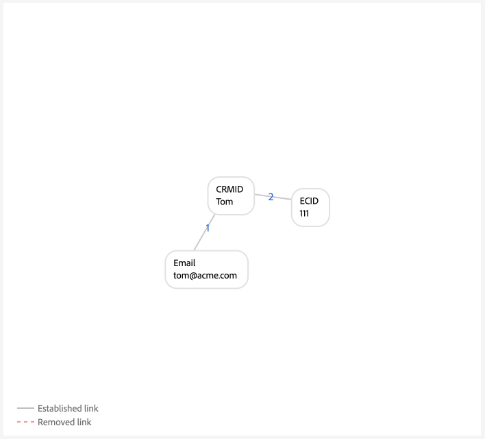
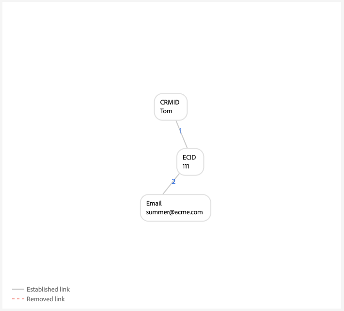
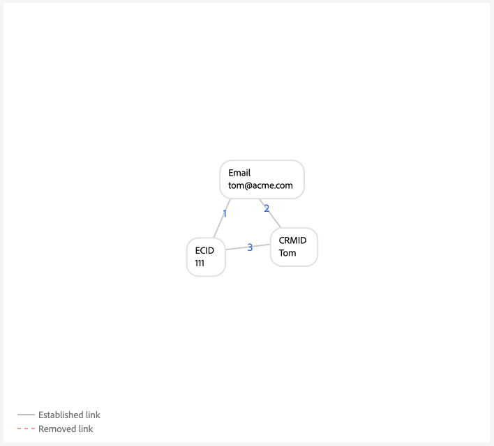

# Exemples de configurations de graphes {#examples-of-graph-configurations}

>[!CONTEXTUALHELP]
>id="platform_identities_algorithmconfiguration"
>title="Configuration de l’algorithme"
>abstract="Configurez un espace de noms unique et une priorité d’espace de noms adaptée à vos identités ingérées."

>[!AVAILABILITY]
>
>Les règles de liaison de graphiques d’identités sont actuellement en disponibilité limitée. Contactez l’équipe de votre compte Adobe pour plus d’informations sur l’accès à la fonctionnalité dans les sandbox de développement.

>[!NOTE]
>
>* « CRMID » et « loginID » sont des espaces de noms personnalisés. Dans ce document, « CRMID » est un identifiant de personne et « loginID » est un identifiant de connexion associé à une personne donnée.
>* Pour simuler les exemples de scénarios de graphique décrits dans ce document, vous devez d’abord créer deux espaces de noms personnalisés, l’un avec le symbole d’identité « CRMID » et l’autre avec le symbole d’identité « loginID ». Les symboles d’identité respectent la casse.

Ce document présente des exemples de configuration de graphique représentant les scénarios courants que vous pouvez rencontrer lors de l’utilisation de règles de liaison de graphiques d’identités et de données d’identité.

## CRMID uniquement

Il s’agit d’un exemple de scénario d’implémentation simple où les événements en ligne (CRMID et ECID) sont ingérés et les événements hors ligne (enregistrements de profil) sont uniquement stockés par rapport au CRMID.

**Implémentation :**

| Espaces de noms utilisés | Méthode de collecte des comportements Web |
| --- | --- |
| CRMID, ECID | SDK Web |

**Événements:**

Vous pouvez créer ce scénario dans une simulation graphique en copiant les événements suivants en mode texte :

```shell
CRMID: Tom, ECID: 111
```

**Configuration de l’algorithme :**

Vous pouvez créer ce scénario dans la simulation graphique en configurant la configuration suivante pour votre algorithme :

| Priorité | Nom d’affichage | Type d’identité | Unique par graphe |
| ---| --- | --- | --- |
| 1 | CRMID | CROSS_DEVICE | Oui |
| 2 | ECID | COOKIE | Non |

**Sélection d&#39;identité de Principal pour le profil client en temps réel :**

Dans le cadre de cette configuration, l’identité principale sera définie comme suit :

| Statut d’authentification | Espace(s) de noms dans les événements | Identité principale |
| --- | --- | --- |
| Authenticated (Authentifié) | CRMID, ECID | CRMID |
| Non authentifié | ECID | ECID |

**Exemples de graphiques**

>[!BEGINTABS]

>[!TAB Graphique idéal pour une seule personne]

Voici un exemple de graphique idéal pour une seule personne, où le CRMID est unique et se voit attribuer la priorité la plus élevée.


>[!TAB Graphique multipersonne]

Voici un exemple de graphique multi-personnes. Cet exemple illustre un scénario « appareil partagé », où il y a deux CRMID et où l’ancien lien établi est supprimé.


**Entrée des événements de simulation du graphique**

```shell
CRMID: Tom, ECID: 111
CRMID: Summer, ECID: 111
```

>[!ENDTABS]

## CRMID avec e-mail haché

Dans ce scénario, un CRMID est ingéré et représente les données en ligne (événement d’expérience) et hors ligne (enregistrement de profil). Ce scénario implique également l’ingestion d’un e-mail haché, qui représente un autre espace de noms envoyé dans le jeu de données d’enregistrement CRM avec le CRMID.

>[!IMPORTANT]
>
>**Il est essentiel que le CRMID soit toujours envoyé pour chaque utilisateur**. Si vous ne le faites pas, un ID de connexion « incertain » peut se produire, où une seule personne partage un appareil avec une autre personne.

**Implémentation :**

| Espaces de noms utilisés | Méthode de collecte des comportements Web |
| --- | --- |
| CRMID, Email_LC_SHA256, ECID | SDK Web |

**Événements:**

Vous pouvez créer ce scénario dans une simulation graphique en copiant les événements suivants en mode texte :

```shell
CRMID: Tom, Email_LC_SHA256: tom<span>@acme.com
CRMID: Tom, ECID: 111
CRMID: Summer, Email_LC_SHA256: summer<span>@acme.com
CRMID: Summer, ECID: 222
```

**Configuration de l’algorithme :**

Vous pouvez créer ce scénario dans la simulation graphique en configurant la configuration suivante pour votre algorithme :

| Priorité | Nom d’affichage | Type d’identité | Unique par graphe |
| ---| --- | --- | --- |
| 1 | CRMID | CROSS_DEVICE | Oui |
| 2 | E-mails (SHA256, en minuscules) | E-mail | Non |
| 3 | ECID | COOKIE | Non |

**Sélection d&#39;identité de Principal pour Profil :**

Dans le cadre de cette configuration, l’identité principale sera définie comme suit :

| Statut d’authentification | Espace(s) de noms dans les événements | Identité principale |
| --- | --- | --- |
| Authenticated (Authentifié) | CRMID, ECID | CRMID |
| Non authentifié | ECID | ECID |

**Exemples de graphiques**

>[!BEGINTABS]

>[!TAB Graphique idéal pour une seule personne]

Vous trouverez ci-dessous des exemples de paires de graphiques pour une seule personne idéales, où chaque CRMID est associé à leur espace de noms d’e-mail et à leur ECID hachés respectifs.


>[!TAB Graphique multipersonne : appareil partagé]

Voici un exemple de scénario de graphique multi-personnes dans lequel un appareil est partagé par deux personnes.


**Entrée des événements de simulation du graphique**

```shell
CRMID: Tom, Email_LC_SHA256: aabbcc
CRMID: Tom, ECID: 111
CRMID: Summer, Email_LC_SHA256: ddeeff
CRMID: Summer, ECID: 222
CRMID: Summer, ECID: 111
```

>[!TAB Graphique multipersonne : e-mail non unique]

Voici un exemple de scénario graphique multi-personnes dans lequel l’e-mail n’est pas unique et est associé à deux CRMID différents.


**Entrée des événements de simulation du graphique**

```shell
CRMID: Tom, Email_LC_SHA256: aabbcc
CRMID: Tom, ECID: 111
CRMID: Summer, Email_LC_SHA256: ddeeff
CRMID: Summer, ECID: 222
CRMID: Summer, Email_LC_SHA256: aabbcc
```

>[!ENDTABS]

## CRMID avec e-mail, téléphone, GAID et IDFA hachés

Ce scénario est similaire au précédent. Cependant, dans ce scénario, l’e-mail et le téléphone hachés sont marqués comme des identités à utiliser dans [[!DNL Segment Match]](../../segmentation/ui/segment-match/overview.md).

>[!IMPORTANT]
>
>**Il est essentiel que le CRMID soit toujours envoyé pour chaque utilisateur**. Si vous ne le faites pas, un ID de connexion « incertain » peut se produire, où une seule personne partage un appareil avec une autre personne.

**Implémentation :**

| Espaces de noms utilisés | Méthode de collecte des comportements Web |
| --- | --- |
| CRMID, Email_LC_SHA256, Phone_SHA256, GAID, IDFA, ECID | SDK Web |

**Événements:**

Vous pouvez créer ce scénario dans une simulation graphique en copiant les événements suivants en mode texte :

```shell
CRMID: Tom, Email_LC_SHA256: aabbcc, Phone_SHA256: 123-4567
CRMID: Tom, ECID: 111
CRMID: Tom, ECID: 222, IDFA: A-A-A
CRMID: Summer, Email_LC_SHA256: ddeeff, Phone_SHA256: 765-4321
CRMID: Summer, ECID: 333
CRMID: Summer, ECID: 444, GAID:B-B-B
```

**Configuration de l’algorithme :**

Vous pouvez créer ce scénario dans la simulation graphique en configurant la configuration suivante pour votre algorithme :

| Priorité | Nom d’affichage | Type d’identité | Unique par graphe |
| ---| --- | --- | --- |
| 1 | CRMID | CROSS_DEVICE | Oui |
| 2 | E-mails (SHA256, en minuscules) | E-mail | Non |
| 3 | Téléphone (SHA256) | Téléphone | Non |
| 4 | ID d’annonce Google (GAID) | PÉRIPHÉRIQUE | Non |
| 5 | Apple IDFA (ID pour Apple) | PÉRIPHÉRIQUE | Non |
| 6 | ECID | COOKIE | Non |

**Sélection d&#39;identité de Principal pour Profil :**

Dans le cadre de cette configuration, l’identité principale sera définie comme suit :

| Statut d’authentification | Espace(s) de noms dans les événements | Identité principale |
| --- | --- | --- |
| Authenticated (Authentifié) | CRMID, IDFA, ECID | CRMID |
| Authenticated (Authentifié) | CRMID, GAID, ECID | CRMID |
| Authenticated (Authentifié) | CRMID, ECID | CRMID |
| Non authentifié | GAID, ECID | GAID |
| Non authentifié | IDFA, ECID | IDFA |
| Non authentifié | ECID | ECID |

**Exemples de graphiques**

>[!BEGINTABS]

>[!TAB Graphique idéal pour une seule personne]

Voici un scénario de graphique d’une seule personne idéal dans lequel les e-mails et les téléphones hachés sont marqués comme des identités à utiliser dans [!DNL Segment Match]. Dans ce scénario, les graphiques sont divisés en deux pour représenter deux entités de personne disparates.


>[!TAB Graphique multipersonne : appareil partagé, ordinateur partagé]

Voici un scénario de graphique multi-personnes dans lequel un appareil (ordinateur) est partagé par deux personnes. Dans ce scénario, l’ordinateur partagé est représenté par `{ECID: 111}` et est lié à `{CRMID: Summer}`, car ce lien est le lien le plus récemment établi. `{CRMID: Tom}` est supprimé, car le lien entre `{CRMID: Tom}` et `{ECID: 111}` est plus ancien et parce que CRMID est l’espace de noms unique désigné dans cette configuration.


**Entrée des événements de simulation du graphique**

```shell
CRMID: Tom, Email_LC_SHA256: aabbcc, Phone_SHA256: 123-4567
CRMID: Tom, ECID: 111
CRMID: Tom, ECID: 222, IDFA: A-A-A
CRMID: Summer, Email_LC_SHA256: ddeeff, Phone_SHA256: 765-4321
CRMID: Summer, ECID: 333
CRMID: Summer, ECID: 444, GAID:B-B-B
CRMID: Summer, ECID: 111
```

>[!TAB Graphique multipersonne : appareil partagé, appareil mobile Android]

Voici un scénario de graphique multi-personnes dans lequel un appareil Android est partagé par deux personnes. Dans ce scénario, CRMID est configuré comme un espace de noms unique et, par conséquent, le lien plus récent de `{CRMID: Tom, GAID: B-B-B, ECID:444}` remplace l’ancien `{CRMID: Summer, GAID: B-B-B, ECID:444}`.


**Entrée des événements de simulation du graphique**

```shell
CRMID: Tom, Email_LC_SHA256: aabbcc, Phone_SHA256: 123-4567
CRMID: Tom, ECID: 111
CRMID: Tom, ECID: 222, IDFA: A-A-A
CRMID: Summer, Email_LC_SHA256: ddeeff, Phone_SHA256: 765-4321
CRMID: Summer, ECID: 333
CRMID: Summer, ECID: 444, GAID: B-B-B
CRMID: Tom, ECID: 444, GAID: B-B-B
```

>[!TAB Graphique multipersonne : appareil partagé, appareil mobile Apple, aucune réinitialisation d’ECID]

Vous trouverez ci-dessous un scénario graphique impliquant plusieurs personnes et dans lequel un appareil Apple est partagé par deux personnes. Dans ce scénario, l’IDFA est partagé, mais l’ECID n’est pas réinitialisé.


**Entrée des événements de simulation du graphique**

```shell
CRMID: Tom, Email_LC_SHA256: aabbcc, Phone_SHA256: 123-4567
CRMID: Tom, ECID: 111
CRMID: Tom, ECID: 222, IDFA: A-A-A
CRMID: Summer, Email_LC_SHA256: ddeeff, Phone_SHA256: 765-4321
CRMID: Summer, ECID: 333
CRMID: Summer, ECID: 444, GAID: B-B-B
CRMID: Summer, ECID: 222, IDFA: A-A-A
```

>[!TAB Graphique multipersonne : réinitialisations d’ECID, d’apple, d’appareil partagé]

Vous trouverez ci-dessous un scénario graphique impliquant plusieurs personnes et dans lequel un appareil Apple est partagé par deux personnes. Dans ce scénario, l’ECID se réinitialise, mais l’IDFA reste le même.


**Entrée des événements de simulation du graphique**

```shell
CRMID: Tom, Email_LC_SHA256: aabbcc, Phone_SHA256: 123-4567
CRMID: Tom, ECID: 111
CRMID: Tom, ECID: 222, IDFA: A-A-A
CRMID: Summer, Email_LC_SHA256: ddeeff, Phone_SHA256: 765-4321
CRMID: Summer, ECID: 333
CRMID: Summer, ECID: 444, GAID: B-B-B
CRMID: Summer, ECID: 555, IDFA: A-A-A
```

>[!TAB Graphique multipersonne : téléphone non unique]

Voici un scénario sous forme de graphique impliquant plusieurs personnes, dans lequel le même numéro de téléphone est partagé par deux personnes.


**Entrée des événements de simulation du graphique**

```shell
CRMID: Tom, Email_LC_SHA256: aabbcc, Phone_SHA256: 123-4567
CRMID: Tom, ECID: 111
CRMID: Tom, ECID: 222, IDFA: A-A-A
CRMID: Summer, Email_LC_SHA256: ddeeff, Phone_SHA256: 765-4321
CRMID: Summer, ECID: 333
CRMID: Summer, ECID: 444, GAID: B-B-B
CRMID: Summer, Phone_SHA256: 123-4567
```

Dans cet exemple, `{Phone_SHA256}` est également marqué comme espace de noms unique. Par conséquent, un graphique ne peut pas avoir plusieurs identités avec l’espace de noms `{Phone_SHA256}`. Dans ce scénario, `{Phone_SHA256: 765-4321}` n’est pas lié à `{CRMID: Summer}` et `{Email_LC_SHA256: ddeeff}`, car il s’agit de l’ancien lien.


>[!TAB Graphique multipersonne : e-mail non unique]

Voici un scénario sous forme de graphique impliquant plusieurs personnes et dans lequel l’e-mail est partagé par deux personnes.


**Entrée des événements de simulation du graphique**

```shell
CRMID: Tom, Email_LC_SHA256: aabbcc, Phone_SHA256: 123-4567
CRMID: Tom, ECID: 111
CRMID: Tom, ECID: 222, IDFA: A-A-A
CRMID: Summer, Email_LC_SHA256: ddeeff, Phone_SHA256: 765-4321
CRMID: Summer, ECID: 333
CRMID: Summer, ECID: 444, GAID: B-B-B
CRMID: Summer, Email_LC_SHA256: aabbcc
```

>[!ENDTABS]

## CRMID unique avec plusieurs identifiants de connexion (version simple)

Dans ce scénario, un seul CRMID représente une entité de personne. Cependant, une entité de personne peut avoir plusieurs identifiants de connexion :

* Une entité de personne donnée peut avoir différents types de compte (personnel ou professionnel, compte par état, compte par marque, etc.)
* Une entité de personne donnée peut utiliser des adresses e-mail différentes pour un nombre illimité de comptes.

>[!IMPORTANT]
>
>**Il est essentiel que le CRMID soit toujours envoyé pour chaque utilisateur**. Si vous ne le faites pas, un ID de connexion « incertain » peut se produire, où une seule personne partage un appareil avec une autre personne.

**Implémentation :**

| Espaces de noms utilisés | Méthode de collecte des comportements Web |
| --- | --- |
| CRMID, loginID, ECID | SDK Web |

**Événements:**

Vous pouvez créer ce scénario dans une simulation graphique en copiant les événements suivants en mode texte :

```shell
CRMID: Tom, loginID: ID_A
CRMID: Tom, loginID: ID_B
loginID: ID_A, ECID: 111
CRMID: Summer, loginID: ID_C
CRMID: Summer, loginID: ID_D
loginID: ID_C, ECID: 222
```

**Configuration de l’algorithme :**

Vous pouvez créer ce scénario dans la simulation graphique en configurant la configuration suivante pour votre algorithme :

| Priorité | Nom d’affichage | Type d’identité | Unique par graphe |
| ---| --- | --- | --- |
| 1 | CRMID | CROSS_DEVICE | Oui |
| 2 | loginID | CROSS_DEVICE | Non |
| 3 | ECID | COOKIE | Non |

**Sélection d&#39;identité de Principal pour Profil :**

Dans le cadre de cette configuration, l’identité principale sera définie comme suit :

| Statut d’authentification | Espace(s) de noms dans les événements | Identité principale |
| --- | --- | --- |
| Authenticated (Authentifié) | loginID, ECID | loginID |
| Authenticated (Authentifié) | loginID, ECID | loginID |
| Authenticated (Authentifié) | CRMID, loginID, ECID | CRMID |
| Authenticated (Authentifié) | CRMID, ECID | CRMID |
| Non authentifié | ECID | ECID |

**Exemples de graphiques**

>[!BEGINTABS]

>[!TAB Scénario idéal pour une seule personne]

Voici un scénario de graphique d’une seule personne avec un seul CRMID et plusieurs identifiants de connexion.


>[!TAB Scénario graphique multi-personnes : appareil partagé]

Voici un scénario de graphique multi-personnes dans lequel un appareil est partagé par deux personnes. Dans ce scénario, `{ECID:111}` est lié à la fois à `{loginID:ID_A}` et à `{loginID:ID_C}`, et l’ancien lien établi de `{ECID:111, loginID:ID_A}` est supprimé.


**Entrée des événements de simulation du graphique**

```shell
CRMID: Tom, loginID: ID_A
CRMID: Tom, loginID: ID_B
loginID: ID_A, ECID: 111
CRMID: Summer, loginID: ID_C
CRMID: Summer, loginID: ID_D
loginID: ID_C, ECID: 222
loginID: ID_C, ECID: 111
```

>[!TAB Scénario de graphique multi-personnes : données incorrectes]

Voici un scénario de graphique multi-personnes qui implique des données incorrectes. Dans ce scénario, `{loginID:ID_D}` est lié à tort à deux utilisateurs disparates et le lien avec l’ancienne date et heure est supprimé, au profit du lien plus récemment établi.


**Entrée des événements de simulation du graphique**

```shell
CRMID: Tom, loginID: ID_A
CRMID: Tom, loginID: ID_B
loginID: ID_A, ECID: 111
CRMID: Summer, loginID: ID_C
CRMID: Summer, loginID: ID_D
loginID: ID_C, ECID: 222
CRMID: Tom, loginID: ID_D
```

>[!TAB  &#39;Dangling&#39; loginID]

Le graphique suivant simule un scénario d’identifiant de connexion « non résolu ». Dans cet exemple, deux identifiants de connexion différents sont liés au même ECID. Cependant, `{loginID:ID_C}` n’est pas lié au CRMID. Par conséquent, Identity Service ne peut en aucun cas détecter que ces deux ID de connexion représentent deux entités différentes.


**Entrée des événements de simulation du graphique**

```shell
CRMID: Tom, loginID: ID_A
CRMID: Tom, loginID: ID_B
loginID: ID_A, ECID: 111
loginID: ID_C, ECID: 111
```

>[!ENDTABS]

## CRMID unique avec plusieurs identifiants de connexion (version complexe)

Dans ce scénario, un seul CRMID représente une entité de personne. Cependant, une entité de personne peut avoir plusieurs identifiants de connexion :

* Une entité de personne donnée peut avoir différents types de compte (personnel ou professionnel, compte par état, compte par marque, etc.)
* Une entité de personne donnée peut utiliser des adresses e-mail différentes pour un nombre illimité de comptes.

>[!IMPORTANT]
>
>**Il est essentiel que le CRMID soit toujours envoyé pour chaque utilisateur**. Si vous ne le faites pas, un ID de connexion « incertain » peut se produire, où une seule personne partage un appareil avec une autre personne.

**Implémentation :**

| Espaces de noms utilisés | Méthode de collecte des comportements Web |
| --- | --- |
| CRMID, Email_LC_SHA256, Phone_SHA256, loginID, ECID | Connecteur source Adobe Analytics. <br> **Remarque :** par défaut, les AAID sont bloqués dans le service d’identités. Vous devez donc accorder une priorité plus élevée à vos ECID qu’aux AAID lors de l’utilisation de la source Analytics. Pour plus d’informations, consultez le [ guide de mise en œuvre ](./implementation-guide.md#ingest-your-data). </br> |

**Événements:**

Vous pouvez créer ce scénario dans une simulation graphique en copiant les événements suivants en mode texte :

```shell
CRMID: Tom, Email_LC_SHA256: aabbcc, Phone_SHA256: 123-4567
CRMID: Tom, loginID: ID_A
CRMID: Tom, loginID: ID_B
loginID: ID_A, ECID: 111
CRMID: Summer, Email_LC_SHA256: ddeeff, Phone_SHA256: 765-4321
CRMID: Summer, loginID: ID_C
CRMID: Summer, loginID: ID_D
loginID: ID_C, ECID: 222
```

**Configuration de l’algorithme :**

Vous pouvez créer ce scénario dans la simulation graphique en configurant la configuration suivante pour votre algorithme :

| Priorité | Nom d’affichage | Type d’identité | Unique par graphe |
| ---| --- | --- | --- | 
| 1 | CRMID | CROSS_DEVICE | Oui |
| 2 | Email_LC_SHA256 | E-mail | Non |
| 3 | Phone_SHA256 | Téléphone | Non |
| 4 | loginID | CROSS_DEVICE | Non |
| 5 | ECID | COOKIE | Non |
| 6 | AAID | COOKIE | Non |

**Sélection d&#39;identité de Principal pour Profil :**

Dans le cadre de cette configuration, l’identité principale sera définie comme suit :

| Statut d’authentification | Espace(s) de noms dans les événements | Identité principale |
| --- | --- | --- |
| Authenticated (Authentifié) | loginID, ECID | loginID |
| Authenticated (Authentifié) | loginID, ECID | loginID |
| Authenticated (Authentifié) | CRMID, loginID, ECID | CRMID |
| Authenticated (Authentifié) | CRMID, ECID | CRMID |
| Non authentifié | ECID | ECID |

**Exemples de graphiques**

>[!BEGINTABS]

>[!TAB Graphique idéal pour une seule personne]

Voici un exemple de deux graphiques pour une seule personne qui comportent chacun un CRMID et plusieurs identifiants de connexion.


>[!TAB Graphique multipersonne : appareil partagé 1]

Voici un scénario d’appareil partagé entre plusieurs personnes où `{ECID:111}` est lié à la fois à `{loginID:ID_A}` et à `{loginID:ID_C}`. Dans ce cas, les liens établis plus anciens sont supprimés en faveur des liens établis plus récemment.


**Entrée des événements de simulation du graphique**

```shell
CRMID: Tom, Email_LC_SHA256: aabbcc, Phone_SHA256: 123-4567
CRMID: Tom, loginID: ID_A
CRMID: Tom, loginID: ID_B
loginID: ID_A, ECID: 111
CRMID: Summer, Email_LC_SHA256: ddeeff, Phone_SHA256: 765-4321
CRMID: Summer, loginID: ID_C
CRMID: Summer, loginID: ID_D
loginID: ID_C, ECID: 222
loginID: ID_C, ECID: 111
```

>[!TAB Graphique multipersonne : appareil partagé 2]

Dans ce scénario, au lieu d’envoyer uniquement l’identifiant de connexion, les identifiants loginID et CRMID sont envoyés en tant qu’événements d’expérience.


**Entrée des événements de simulation du graphique**

```shell
CRMID: Tom, Email_LC_SHA256: aabbcc, Phone_SHA256: 123-4567
CRMID: Tom, loginID: ID_A
CRMID: Tom, loginID: ID_B
loginID: ID_A, ECID: 111
CRMID: Summer, Email_LC_SHA256: ddeeff, Phone_SHA256: 765-4321
CRMID: Summer, loginID: ID_C
CRMID: Summer, loginID: ID_D
loginID: ID_C, ECID: 222
CRMID: Summer, loginID: ID_C, ECID: 111
loginID: ID_A, ECID: 111
```

>[!TAB Graphique multipersonne : données loginID incorrectes]

Dans ce scénario, `{loginID:ID_C}` est lié à la fois à `{CRMID:Tom}` et à `{CRMID:Summer}`. Il est donc considéré comme une donnée incorrecte, car les scénarios graphiques idéaux ne doivent pas lier les mêmes identifiants de connexion à deux utilisateurs disparates. Dans ce cas, les liens établis plus anciens sont supprimés en faveur des liens établis plus récemment.


**Entrée des événements de simulation du graphique**

```shell
CRMID: Tom, Email_LC_SHA256: aabbcc, Phone_SHA256: 123-4567
CRMID: Tom, loginID: ID_A
CRMID: Tom, loginID: ID_B
loginID: ID_A, ECID: 111
CRMID: Summer, Email_LC_SHA256: ddeeff, Phone_SHA256: 765-4321
CRMID: Summer, loginID: ID_C
CRMID: Summer, loginID: ID_D
loginID: ID_C, ECID: 222
CRMID: Tom, loginID: ID_C
```

>[!TAB Graphique multipersonne : e-mail non unique]

Dans ce scénario, un e-mail non unique est lié à deux CRMID différents. Par conséquent, les liens établis plus anciens sont supprimés au profit des liens établis plus récemment.


**Entrée des événements de simulation du graphique**

```shell
CRMID: Tom, Email_LC_SHA256: aabbcc, Phone_SHA256: 123-4567
CRMID: Tom, loginID: ID_A
CRMID: Tom, loginID: ID_B
loginID: ID_A, ECID: 111
CRMID: Summer, Email_LC_SHA256: ddeeff, Phone_SHA256: 765-4321
CRMID: Summer, loginID: ID_C
CRMID: Summer, loginID: ID_D
loginID: ID_C, ECID: 222
CRMID: Summer, Email_LC_SHA256: aabbcc
```

>[!TAB Graphique multipersonne : téléphone non unique]

Dans ce scénario, un numéro de téléphone non unique est lié à deux CRMID différents, les liens établis plus anciens sont supprimés au profit des liens établis plus récemment.


**Entrée des événements de simulation du graphique**

```shell
CRMID: Tom, Email_LC_SHA256: aabbcc, Phone_SHA256: 123-4567
CRMID: Tom, loginID: ID_A
CRMID: Tom, loginID: ID_B
loginID: ID_A, ECID: 111
CRMID: Summer, Email_LC_SHA256: ddeeff, Phone_SHA256: 765-4321
CRMID: Summer, loginID: ID_C
CRMID: Summer, loginID: ID_D
loginID: ID_C, ECID: 222
CRMID: Tom, Phone_SHA256: 111-1111
CRMID: Summer, Phone_SHA256: 111-1111
```

>[!ENDTABS]

## Utilisation dans d’autres Adobe Commerce

Les exemples de configuration de graphique de cette section présentent des cas d’utilisation pour Adobe Commerce. Les exemples ci-dessous se concentrent sur les clients de détail avec deux types d’utilisateurs :

* Utilisateur enregistré (utilisateurs ayant créé un compte)
* Utilisateurs invités (utilisateurs qui n’ont qu’une adresse e-mail)

>[!IMPORTANT]
>
>**Il est essentiel que le CRMID soit toujours envoyé pour chaque utilisateur**. Si vous ne le faites pas, un ID de connexion « incertain » peut se produire, où une seule personne partage un appareil avec une autre personne.

**Implémentation :**

| Espaces de noms utilisés | Méthode de collecte des comportements Web |
| --- | --- |
| CRMID, E-mail, ECID | SDK Web |

**Événements:**

Vous pouvez créer ce scénario dans une simulation graphique en copiant les événements suivants en mode texte :

```shell
CRMID: Tom, Email: tom@acme.com
CRMID: Tom, ECID: 111
```

**Configuration de l’algorithme :**

Vous pouvez créer ce scénario dans la simulation graphique en configurant la configuration suivante pour votre algorithme :

| Priorité | Nom d’affichage | Type d’identité | Unique par graphe |
| ---| --- | --- | --- | 
| 1 | CRMID | CROSS_DEVICE | Oui |
| 2 | E-mail | E-mail | Oui |
| 5 | ECID | COOKIE | Non |

**Sélection d&#39;identité de Principal pour Profil :**

Dans le cadre de cette configuration, l’identité principale sera définie comme suit :

| Activité utilisateur | Espace(s) de noms dans les événements | Identité principale |
| --- | --- | --- |
| Navigation authentifiée | CRMID, ECID | CRMID |
| Passage en caisse des invités | E-mail, ECID | E-mail |
| Navigation non authentifiée | ECID | ECID |

>[!WARNING]
>
>Les utilisateurs enregistrés doivent disposer de CRMID et d’e-mails dans leurs profils pour que les scénarios de graphique suivants fonctionnent.

**Exemples de graphiques**

>[!BEGINTABS]

>[!TAB Graphique idéal pour une seule personne]

Voici un exemple de graphique idéal pour une seule personne.



>[!TAB Graphiques multi-personnes]

Voici un exemple de graphique multi-personnes dans lequel deux utilisateurs enregistrés naviguent à l’aide du même appareil.


**Entrée des événements de simulation du graphique**

```shell
CRMID: Tom, Email: tom@acme.com
CRMID: Summer, Email: summer@acme.com
CRMID: Tom, ECID: 111
CRMID: Summer, ECID: 111
```

Dans ce scénario, un utilisateur enregistré et un utilisateur invité partagent le même appareil.


**Entrée des événements de simulation du graphique**

```shell
CRMID: Tom, Email: tom@acme.com
CRMID: Tom, ECID: 111
Email: summer@acme.com, ECID: 111
```

Dans ce scénario, un utilisateur enregistré et un utilisateur invité partagent un appareil. Cependant, une erreur d’implémentation se produit, car le CRMID ne contient pas d’espace de noms d’e-mail correspondant. Dans ce scénario, Tom est l’utilisateur enregistré et Summer l’utilisateur invité. Contrairement au scénario précédent, les deux entités sont fusionnées, car il n’existe pas d’espaces de noms d’e-mail communs aux deux entités personne.



**Entrée des événements de simulation du graphique**

```shell
CRMID: Tom, ECID: 111
Email: summer@acme.com, ECID: 111
```

Dans ce scénario, deux utilisateurs invités partagent le même appareil.


**Entrée des événements de simulation du graphique**

```shell
Email: tom@acme.com, ECID: 111
Email: summer@acme.com, ECID: 111
```

Dans ce scénario, un utilisateur invité extrait un élément, puis s’enregistre à l’aide du même appareil.



**Entrée des événements de simulation du graphique**

```shell
Email: tom@acme.com, ECID: 111
Email: tom@acme.com, CRMID: Tom
CRMID: Tom, ECID: 111
```

>[!ENDTABS]

## Étapes suivantes

Pour plus d’informations sur les règles de liaison de graphiques d’identités, consultez la documentation suivante :

* [Aperçu des règles de liaison des graphiques d’identités](./overview.md)
* [Algorithme d’optimisation de l’identité](./identity-optimization-algorithm.md)
* [Guide de mise en œuvre](./implementation-guide.md)
* [Résolution des problèmes et FAQ](./troubleshooting.md)
* [Priorité d’espace de noms](./namespace-priority.md)
* [Interface utilisateur de simulation de graphique](./graph-simulation.md)
* [Interface utilisateur des paramètres d’identité](./identity-settings-ui.md)