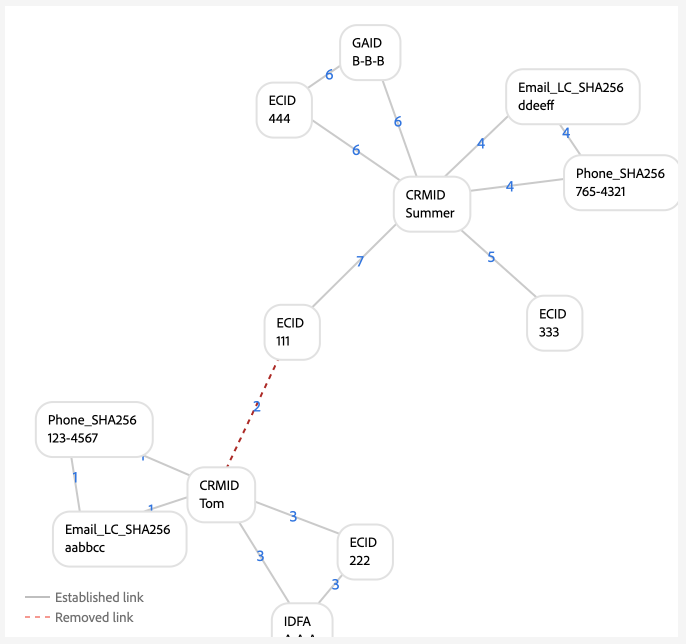

# Exemples de configurations de graphique

>[!AVAILABILITY]
>
>Les règles de liaison de graphiques d’identités sont actuellement en version bêta. Contactez votre équipe de compte d’Adobe pour plus d’informations sur les critères de participation. Les fonctionnalités et la documentation sont susceptibles d’être modifiées.

>[!NOTE]
>
>* &quot;CRMID&quot; et &quot;loginID&quot; sont des espaces de noms personnalisés. Dans ce document, &quot;CRMID&quot; est un identifiant de personne et &quot;loginID&quot; est un identifiant de connexion associé à une personne donnée.
>* Pour simuler les exemples de scénarios graphiques décrits dans ce document, vous devez d’abord créer deux espaces de noms personnalisés, l’un avec le symbole d’identité &quot;CRMID&quot; et l’autre avec le symbole d’identité &quot;loginID&quot;. Les symboles d’identité sont sensibles à la casse.


Ce document présente des exemples de configuration de graphique de scénarios courants que vous pouvez rencontrer lors de l’utilisation de règles de liaison de graphiques d’identités et de données d’identité.

## CRMID uniquement

Il s’agit d’un exemple de scénario de mise en oeuvre simple dans lequel les événements en ligne (CRMID et ECID) sont ingérés et les événements hors ligne (enregistrements de profil) ne sont stockés que par rapport au CRMID.

**Mise en oeuvre :**

| Espaces de noms utilisés | Méthode de collecte des comportements web |
| --- | --- |
| CRMID, ECID | SDK Web |

**Événements :**

Vous pouvez créer ce scénario dans la simulation graphique en copiant les événements suivants en mode texte :

```shell
CRMID: Tom, ECID: 111
```

**Configuration de l’algorithme :**

Vous pouvez créer ce scénario dans la simulation graphique en configurant la configuration suivante pour votre configuration d’algorithme :

| Priorité | Nom d’affichage | Type d’identité | Unique par graphe |
| ---| --- | --- | --- |
| 1 | CRMID | CROSS_DEVICE | Oui |
| 2 | ECID | COOKIE | Non |

**Sélection d’identité par Principal pour Real-Time Customer Profile :**

Dans le contexte de cette configuration, l’identité principale sera définie comme suit :

| État d’authentification | Espace(s) de noms dans les événements | Identité principale |
| --- | --- | --- |
| Authenticated (Authentifié) | CRMID, ECID | CRMID |
| Non authentifié | ECID | ECID |

**Exemples de graphiques**

>[!BEGINTABS]

>[!TAB Graphique à une seule personne idéal]

Voici un exemple de graphique à une seule personne idéal, où le CRMID est unique et a la priorité la plus élevée.


>[!TAB Graphique multi-personne]

Voici un exemple de graphique à plusieurs personnes. Cet exemple affiche un scénario &quot;appareil partagé&quot;, où il existe deux CRMID et celui avec l’ancien lien établi est supprimé.


**Entrée des événements de simulation graphique**

```shell
CRMID: Tom, ECID: 111
CRMID: Summer, ECID: 111
```

>[!ENDTABS]

## CRMID avec courrier électronique haché

Dans ce scénario, un CRMID est ingéré et représente les données en ligne (événement d’expérience) et hors ligne (enregistrement de profil). Ce scénario implique également l’ingestion d’un email haché, qui représente un autre espace de noms envoyé dans le jeu de données d’enregistrement CRM avec le CRMID.

>[!IMPORTANT]
>
>**Il est essentiel que le CRMID soit toujours envoyé pour chaque utilisateur**. Si vous ne le faites pas, un scénario d’identifiant de connexion &quot;dangling&quot; peut se produire, dans lequel une entité de personne unique est supposée partager un appareil avec une autre personne.

**Mise en oeuvre :**

| Espaces de noms utilisés | Méthode de collecte des comportements web |
| --- | --- |
| CRMID, Email_LC_SHA256, ECID | SDK Web |

**Événements :**

Vous pouvez créer ce scénario dans la simulation graphique en copiant les événements suivants en mode texte :

```shell
CRMID: Tom, Email_LC_SHA256: tom<span>@acme.com
CRMID: Tom, ECID: 111
CRMID: Summer, Email_LC_SHA256: summer<span>@acme.com
CRMID: Summer, ECID: 222
```

**Configuration de l’algorithme :**

Vous pouvez créer ce scénario dans la simulation graphique en configurant la configuration suivante pour votre configuration d’algorithme :

| Priorité | Nom d’affichage | Type d’identité | Unique par graphe |
| ---| --- | --- | --- |
| 1 | CRMID | CROSS_DEVICE | Oui |
| 2 | E-mails (SHA256, en minuscules) | E-mail | Non |
| 3 | ECID | COOKIE | Non |

**Sélection d’identité de Principal pour Profile :**

Dans le contexte de cette configuration, l’identité principale sera définie comme suit :

| État d’authentification | Espace(s) de noms dans les événements | Identité principale |
| --- | --- | --- |
| Authenticated (Authentifié) | CRMID, ECID | CRMID |
| Non authentifié | ECID | ECID |

**Exemples de graphiques**

>[!BEGINTABS]

>[!TAB Graphique à une seule personne idéal]

Vous trouverez ci-dessous des exemples d’une paire de graphiques à une seule personne idéaux, où chaque CRMID est associé à son espace de noms d’email haché respectif et à l’ECID.


>[!TAB Graphique multi-personnes : appareil partagé]

Voici un exemple de scénario de graphique à plusieurs personnes où un appareil est partagé par deux personnes.


**Entrée des événements de simulation graphique**

```shell
CRMID: Tom, Email_LC_SHA256: aabbcc
CRMID: Tom, ECID: 111
CRMID: Summer, Email_LC_SHA256: ddeeff
CRMID: Summer, ECID: 222
CRMID: Summer, ECID: 111
```

>[!TAB Graphique à plusieurs personnes : email non unique]

Voici un exemple de scénario de graphique à plusieurs personnes où le courrier électronique n’est pas unique et est associé à deux CRMID différents.


**Entrée des événements de simulation graphique**

```shell
CRMID: Tom, Email_LC_SHA256: aabbcc
CRMID: Tom, ECID: 111
CRMID: Summer, Email_LC_SHA256: ddeeff
CRMID: Summer, ECID: 222
CRMID: Summer, Email_LC_SHA256: aabbcc
```

>[!ENDTABS]

## CRMID avec courrier électronique haché, téléphone haché, GAID et IDFA

Ce scénario est similaire au précédent. Cependant, dans ce scénario, le courrier électronique et le téléphone hachés sont marqués comme des identités à utiliser dans [[!DNL Segment Match]](../../segmentation/ui/segment-match/overview.md).

>[!IMPORTANT]
>
>**Il est essentiel que le CRMID soit toujours envoyé pour chaque utilisateur**. Si vous ne le faites pas, un scénario d’identifiant de connexion &quot;dangling&quot; peut se produire, dans lequel une entité de personne unique est supposée partager un appareil avec une autre personne.

**Mise en oeuvre :**

| Espaces de noms utilisés | Méthode de collecte des comportements web |
| --- | --- |
| CRMID, Email_LC_SHA256, Phone_SHA256, GAID, IDFA, ECID | SDK Web |

**Événements :**

Vous pouvez créer ce scénario dans la simulation graphique en copiant les événements suivants en mode texte :

```shell
CRMID: Tom, Email_LC_SHA256: aabbcc, Phone_SHA256: 123-4567
CRMID: Tom, ECID: 111
CRMID: Tom, ECID: 222, IDFA: A-A-A
CRMID: Summer, Email_LC_SHA256: ddeeff, Phone_SHA256: 765-4321
CRMID: Summer, ECID: 333
CRMID: Summer, ECID: 444, GAID:B-B-B
```

**Configuration de l’algorithme :**

Vous pouvez créer ce scénario dans la simulation graphique en configurant la configuration suivante pour votre configuration d’algorithme :

| Priorité | Nom d’affichage | Type d’identité | Unique par graphe |
| ---| --- | --- | --- |
| 1 | CRMID | CROSS_DEVICE | Oui |
| 2 | E-mails (SHA256, en minuscules) | E-mail | Non |
| 3 | Téléphone (SHA256) | Téléphone | Non |
| 4 | Google Ad ID (GAID) | DEVICE | Non |
| 5 | Apple IDFA (ID pour Apple) | DEVICE | Non |
| 6 | ECID | COOKIE | Non |

**Sélection d’identité de Principal pour Profile :**

Dans le contexte de cette configuration, l’identité principale sera définie comme suit :

| État d’authentification | Espace(s) de noms dans les événements | Identité principale |
| --- | --- | --- |
| Authenticated (Authentifié) | CRMID, IDFA, ECID | CRMID |
| Authenticated (Authentifié) | CRMID, GAID, ECID | CRMID |
| Authenticated (Authentifié) | CRMID, ECID | CRMID |
| Non authentifié | GAID, ECID | GAID |
| Non authentifié | IDFA, ECID | IDFA |
| Non authentifié | ECID | ECID |

**Exemples de graphiques**

>[!BEGINTABS]

>[!TAB Graphique à une seule personne idéal]

Voici un scénario graphique à une seule personne idéal où les courriers électroniques hachés et les téléphones hachés sont marqués comme identités à utiliser dans [!DNL Segment Match]. Dans ce scénario, les graphiques sont divisés en deux, pour représenter des entités de personnes disparates.


>[!TAB Graphique multi-personnes : appareil partagé, ordinateur partagé]

Voici un scénario de graphique à plusieurs personnes où un appareil (ordinateur) est partagé par deux personnes. Dans ce scénario, l’ordinateur partagé est représenté par `{ECID: 111}` et est lié à `{CRMID: Summer}`, car ce lien est le lien le plus récemment établi. `{CRMID: Tom}` est supprimé car le lien entre `{CRMID: Tom}` et `{ECID: 111}` est plus ancien et parce que CRMID est l’espace de noms unique désigné dans cette configuration.



**Entrée des événements de simulation graphique**

```shell
CRMID: Tom, Email_LC_SHA256: aabbcc, Phone_SHA256: 123-4567
CRMID: Tom, ECID: 111
CRMID: Tom, ECID: 222, IDFA: A-A-A
CRMID: Summer, Email_LC_SHA256: ddeeff, Phone_SHA256: 765-4321
CRMID: Summer, ECID: 333
CRMID: Summer, ECID: 444, GAID:B-B-B
CRMID: Summer, ECID: 111
```

>[!TAB Graphique à plusieurs personnes : appareil partagé, appareil mobile Android]

Voici un scénario de graphique à plusieurs personnes où un appareil Android est partagé par deux personnes. Dans ce scénario, CRMID est configuré comme un espace de noms unique et, par conséquent, le lien le plus récent de `{CRMID: Tom, GAID: B-B-B, ECID:444}` remplace l’ancien `{CRMID: Summer, GAID: B-B-B, ECID:444}`.


**Entrée des événements de simulation graphique**

```shell
CRMID: Tom, Email_LC_SHA256: aabbcc, Phone_SHA256: 123-4567
CRMID: Tom, ECID: 111
CRMID: Tom, ECID: 222, IDFA: A-A-A
CRMID: Summer, Email_LC_SHA256: ddeeff, Phone_SHA256: 765-4321
CRMID: Summer, ECID: 333
CRMID: Summer, ECID: 444, GAID: B-B-B
CRMID: Tom, ECID: 444, GAID: B-B-B
```

>[!TAB Graphique multi-personnes : appareil partagé, appareil mobile apple, pas de réinitialisation ECID]

Vous trouverez ci-dessous un scénario de graphique à plusieurs personnes dans lequel un appareil Apple est partagé par deux personnes. Dans ce scénario, l’IDFA est partagé, mais l’ECID n’est pas réinitialisé.


**Entrée des événements de simulation graphique**

```shell
CRMID: Tom, Email_LC_SHA256: aabbcc, Phone_SHA256: 123-4567
CRMID: Tom, ECID: 111
CRMID: Tom, ECID: 222, IDFA: A-A-A
CRMID: Summer, Email_LC_SHA256: ddeeff, Phone_SHA256: 765-4321
CRMID: Summer, ECID: 333
CRMID: Summer, ECID: 444, GAID: B-B-B
CRMID: Summer, ECID: 222, IDFA: A-A-A
```

>[!TAB Graphique multi-personnes : appareil partagé, pomme, réinitialisations ECID]

Vous trouverez ci-dessous un scénario de graphique à plusieurs personnes dans lequel un appareil Apple est partagé par deux personnes. Dans ce scénario, l’ECID se réinitialise, mais l’IDFA reste le même.


**Entrée des événements de simulation graphique**

```shell
CRMID: Tom, Email_LC_SHA256: aabbcc, Phone_SHA256: 123-4567
CRMID: Tom, ECID: 111
CRMID: Tom, ECID: 222, IDFA: A-A-A
CRMID: Summer, Email_LC_SHA256: ddeeff, Phone_SHA256: 765-4321
CRMID: Summer, ECID: 333
CRMID: Summer, ECID: 444, GAID: B-B-B
CRMID: Summer, ECID: 555, IDFA: A-A-A
```

>[!TAB Graphique multi-personne : téléphone non unique]

Vous trouverez ci-dessous un scénario de graphique à plusieurs personnes dans lequel le même numéro de téléphone est partagé par deux personnes.


**Entrée des événements de simulation graphique**

```shell
CRMID: Tom, Email_LC_SHA256: aabbcc, Phone_SHA256: 123-4567
CRMID: Tom, ECID: 111
CRMID: Tom, ECID: 222, IDFA: A-A-A
CRMID: Summer, Email_LC_SHA256: ddeeff, Phone_SHA256: 765-4321
CRMID: Summer, ECID: 333
CRMID: Summer, ECID: 444, GAID: B-B-B
CRMID: Summer, Phone_SHA256: 123-4567
```

Dans cet exemple, `{Phone_SHA256}` est également marqué comme espace de noms unique. Par conséquent, un graphique ne peut pas avoir plusieurs identités avec l’espace de noms `{Phone_SHA256}`. Dans ce scénario, `{Phone_SHA256: 765-4321}` n&#39;est pas lié à `{CRMID: Summer}` et `{Email_LC_SHA256: ddeeff}`, car il s&#39;agit du lien plus ancien,


>[!TAB Graphique multi-personne : email non unique]

Vous trouverez ci-dessous un scénario graphique à plusieurs personnes dans lequel le courrier électronique est partagé par deux personnes.


**Entrée des événements de simulation graphique**

```shell
CRMID: Tom, Email_LC_SHA256: aabbcc, Phone_SHA256: 123-4567
CRMID: Tom, ECID: 111
CRMID: Tom, ECID: 222, IDFA: A-A-A
CRMID: Summer, Email_LC_SHA256: ddeeff, Phone_SHA256: 765-4321
CRMID: Summer, ECID: 333
CRMID: Summer, ECID: 444, GAID: B-B-B
CRMID: Summer, Email_LC_SHA256: aabbcc
```

>[!ENDTABS]

## Un seul CRMID avec plusieurs identifiants de connexion (version simple)

Dans ce scénario, un seul CRMID représente une entité de personne. Cependant, une entité de personne peut avoir plusieurs identifiants de connexion :

* Une entité de personne donnée peut avoir différents types de compte (personnel/entreprise, compte par état, compte par marque, etc.)
* Une entité de personne donnée peut utiliser des adresses électroniques différentes pour n’importe quel nombre de comptes.

>[!IMPORTANT]
>
>**Il est essentiel que le CRMID soit toujours envoyé pour chaque utilisateur**. Si vous ne le faites pas, un scénario d’identifiant de connexion &quot;dangling&quot; peut se produire, dans lequel une entité de personne unique est supposée partager un appareil avec une autre personne.

**Mise en oeuvre :**

| Espaces de noms utilisés | Méthode de collecte des comportements web |
| --- | --- |
| CRMID, loginID, ECID | SDK Web |

**Événements :**

Vous pouvez créer ce scénario dans la simulation graphique en copiant les événements suivants en mode texte :

```shell
CRMID: Tom, loginID: ID_A
CRMID: Tom, loginID: ID_B
loginID: ID_A, ECID: 111
CRMID: Summer, loginID: ID_C
CRMID: Summer, loginID: ID_D
loginID: ID_C, ECID: 222
```

**Configuration de l’algorithme :**

Vous pouvez créer ce scénario dans la simulation graphique en configurant la configuration suivante pour votre configuration d’algorithme :

| Priorité | Nom d’affichage | Type d’identité | Unique par graphe |
| ---| --- | --- | --- |
| 1 | CRMID | CROSS_DEVICE | Oui |
| 2 | loginID | CROSS_DEVICE | Non |
| 3 | ECID | COOKIE | Non |

**Sélection d’identité de Principal pour Profile :**

Dans le contexte de cette configuration, l’identité principale sera définie comme suit :

| État d’authentification | Espace(s) de noms dans les événements | Identité principale |
| --- | --- | --- |
| Authenticated (Authentifié) | loginID, ECID | loginID |
| Authenticated (Authentifié) | loginID, ECID | loginID |
| Authenticated (Authentifié) | CRMID, loginID, ECID | CRMID |
| Authenticated (Authentifié) | CRMID, ECID | CRMID |
| Non authentifié | ECID | ECID |

**Exemples de graphiques**

>[!BEGINTABS]

>[!TAB Scénario idéal pour une seule personne]

Vous trouverez ci-dessous un scénario de graphique à une seule personne avec un seul CRMID et plusieurs identifiants de connexion.


>[!TAB Scénario de graphique multi-personne : appareil partagé]

Voici un scénario de graphique à plusieurs personnes où un appareil est partagé par deux personnes. Dans ce scénario, `{ECID:111}` est lié à `{loginID:ID_A}` et `{loginID:ID_C}` et l’ancien lien établi de `{ECID:111, loginID:ID_A}` est supprimé.


**Entrée des événements de simulation graphique**

```shell
CRMID: Tom, loginID: ID_A
CRMID: Tom, loginID: ID_B
loginID: ID_A, ECID: 111
CRMID: Summer, loginID: ID_C
CRMID: Summer, loginID: ID_D
loginID: ID_C, ECID: 222
loginID: ID_C, ECID: 111
```

>[!TAB Scénario de graphique multi-personne : données incorrectes]

Voici un scénario de graphique à plusieurs personnes qui implique des données incorrectes. Dans ce scénario, `{loginID:ID_D}` est lié à tort à deux utilisateurs disparates et le lien avec l’horodatage plus ancien est supprimé, au profit du lien plus récemment établi.


**Entrée des événements de simulation graphique**

```shell
CRMID: Tom, loginID: ID_A
CRMID: Tom, loginID: ID_B
loginID: ID_A, ECID: 111
CRMID: Summer, loginID: ID_C
CRMID: Summer, loginID: ID_D
loginID: ID_C, ECID: 222
CRMID: Tom, loginID: ID_D
```

>[!TAB &#39;Dangling&#39; loginID]

Le graphique suivant simule un scénario loginID &quot;dangling&quot;. Dans cet exemple, deux loginID différents sont liés au même ECID. Cependant, `{loginID:ID_C}` n’est pas lié au CRMID. Par conséquent, il n’existe aucun moyen pour Identity Service de détecter que ces deux loginID représentent deux entités différentes.


**Entrée des événements de simulation graphique**

```shell
CRMID: Tom, loginID: ID_A
CRMID: Tom, loginID: ID_B
loginID: ID_A, ECID: 111
loginID: ID_C, ECID: 111
```

>[!ENDTABS]

## Un seul CRMID avec plusieurs identifiants de connexion (version complexe)

Dans ce scénario, un seul CRMID représente une entité de personne. Cependant, une entité de personne peut avoir plusieurs identifiants de connexion :

* Une entité de personne donnée peut avoir différents types de compte (personnel/entreprise, compte par état, compte par marque, etc.)
* Une entité de personne donnée peut utiliser des adresses électroniques différentes pour n’importe quel nombre de comptes.

>[!IMPORTANT]
>
>**Il est essentiel que le CRMID soit toujours envoyé pour chaque utilisateur**. Si vous ne le faites pas, un scénario d’identifiant de connexion &quot;dangling&quot; peut se produire, dans lequel une entité de personne unique est supposée partager un appareil avec une autre personne.

**Mise en oeuvre :**

| Espaces de noms utilisés | Méthode de collecte des comportements web |
| --- | --- |
| CRMID, Email_LC_SHA256, Phone_SHA256, loginID, ECID | Connecteur source Adobe Analytics. <br> **Remarque :** Par défaut, les AAID sont bloqués dans Identity Service. Par conséquent, vous devez accorder une priorité plus élevée à vos ECID qu’aux AAID lors de l’utilisation de la source Analytics. Pour plus d&#39;informations, consultez le [guide de mise en oeuvre](./implementation-guide.md#ingest-your-data).</br> |

**Événements :**

Vous pouvez créer ce scénario dans la simulation graphique en copiant les événements suivants en mode texte :

```shell
CRMID: Tom, Email_LC_SHA256: aabbcc, Phone_SHA256: 123-4567
CRMID: Tom, loginID: ID_A
CRMID: Tom, loginID: ID_B
loginID: ID_A, ECID: 111
CRMID: Summer, Email_LC_SHA256: ddeeff, Phone_SHA256: 765-4321
CRMID: Summer, loginID: ID_C
CRMID: Summer, loginID: ID_D
loginID: ID_C, ECID: 222
```

**Configuration de l’algorithme :**

Vous pouvez créer ce scénario dans la simulation graphique en configurant la configuration suivante pour votre configuration d’algorithme :

| Priorité | Nom d’affichage | Type d’identité | Unique par graphe |
| ---| --- | --- | --- | 
| 1 | CRMID | CROSS_DEVICE | Oui |
| 2 | Email_LC_SHA256 | E-mail | Non |
| 3 | Phone_SHA256 | Téléphone | Non |
| 4 | loginID | CROSS_DEVICE | Non |
| 5 | ECID | COOKIE | Non |
| 6 | AAID | COOKIE | Non |

**Sélection d’identité de Principal pour Profile :**

Dans le contexte de cette configuration, l’identité principale sera définie comme suit :

| État d’authentification | Espace(s) de noms dans les événements | Identité principale |
| --- | --- | --- |
| Authenticated (Authentifié) | loginID, ECID | loginID |
| Authenticated (Authentifié) | loginID, ECID | loginID |
| Authenticated (Authentifié) | CRMID, loginID, ECID | CRMID |
| Authenticated (Authentifié) | CRMID, ECID | CRMID |
| Non authentifié | ECID | ECID |

**Exemples de graphiques**

>[!BEGINTABS]

>[!TAB Graphique à une seule personne idéal]

Vous trouverez ci-dessous un exemple de deux graphiques à une seule personne comportant chacun un CRMID et plusieurs loginID.


>[!TAB Graphique multi-personne : appareil partagé 1]

Voici un scénario d’appareil partagé à plusieurs personnes où `{ECID:111}` est lié à `{loginID:ID_A}` et `{loginID:ID_C}`. Dans ce cas, les liens plus anciens sont supprimés au profit des liens plus récemment établis.


**Entrée des événements de simulation graphique**

```shell
CRMID: Tom, Email_LC_SHA256: aabbcc, Phone_SHA256: 123-4567
CRMID: Tom, loginID: ID_A
CRMID: Tom, loginID: ID_B
loginID: ID_A, ECID: 111
CRMID: Summer, Email_LC_SHA256: ddeeff, Phone_SHA256: 765-4321
CRMID: Summer, loginID: ID_C
CRMID: Summer, loginID: ID_D
loginID: ID_C, ECID: 222
loginID: ID_C, ECID: 111
```

>[!TAB Graphique multi-personne : appareil partagé 2]

Dans ce scénario, au lieu d’envoyer uniquement l’identifiant de connexion, les identifiants de connexion et CRMID sont envoyés comme événements d’expérience.


**Entrée des événements de simulation graphique**

```shell
CRMID: Tom, Email_LC_SHA256: aabbcc, Phone_SHA256: 123-4567
CRMID: Tom, loginID: ID_A
CRMID: Tom, loginID: ID_B
loginID: ID_A, ECID: 111
CRMID: Summer, Email_LC_SHA256: ddeeff, Phone_SHA256: 765-4321
CRMID: Summer, loginID: ID_C
CRMID: Summer, loginID: ID_D
loginID: ID_C, ECID: 222
CRMID: Summer, loginID: ID_C, ECID: 111
loginID: ID_A, ECID: 111
```

>[!TAB Graphique multi-personnes : données d’identifiant de connexion erronées]

Dans ce scénario, `{loginID:ID_C}` est lié à `{CRMID:Tom}` et `{CRMID:Summer}` et est donc considéré comme de mauvaises données, car les scénarios graphiques idéaux ne doivent pas lier les mêmes loginID à deux utilisateurs disparates. Dans ce cas, les liens plus anciens sont supprimés au profit des liens plus récemment établis.


**Entrée des événements de simulation graphique**

```shell
CRMID: Tom, Email_LC_SHA256: aabbcc, Phone_SHA256: 123-4567
CRMID: Tom, loginID: ID_A
CRMID: Tom, loginID: ID_B
loginID: ID_A, ECID: 111
CRMID: Summer, Email_LC_SHA256: ddeeff, Phone_SHA256: 765-4321
CRMID: Summer, loginID: ID_C
CRMID: Summer, loginID: ID_D
loginID: ID_C, ECID: 222
CRMID: Tom, loginID: ID_C
```

>[!TAB Graphique à plusieurs personnes : email non unique]

Dans ce scénario, un email non unique est lié à deux CRMID différents. Par conséquent, les liens plus anciens sont supprimés au profit des liens plus récemment établis.


**Entrée des événements de simulation graphique**

```shell
CRMID: Tom, Email_LC_SHA256: aabbcc, Phone_SHA256: 123-4567
CRMID: Tom, loginID: ID_A
CRMID: Tom, loginID: ID_B
loginID: ID_A, ECID: 111
CRMID: Summer, Email_LC_SHA256: ddeeff, Phone_SHA256: 765-4321
CRMID: Summer, loginID: ID_C
CRMID: Summer, loginID: ID_D
loginID: ID_C, ECID: 222
CRMID: Summer, Email_LC_SHA256: aabbcc
```

>[!TAB Graphique multi-personnes : téléphone non unique]

Dans ce scénario, un numéro de téléphone non unique est lié à deux CRMID différents, les liens plus anciens sont supprimés au profit des liens plus récemment établis.


**Entrée des événements de simulation graphique**

```shell
CRMID: Tom, Email_LC_SHA256: aabbcc, Phone_SHA256: 123-4567
CRMID: Tom, loginID: ID_A
CRMID: Tom, loginID: ID_B
loginID: ID_A, ECID: 111
CRMID: Summer, Email_LC_SHA256: ddeeff, Phone_SHA256: 765-4321
CRMID: Summer, loginID: ID_C
CRMID: Summer, loginID: ID_D
loginID: ID_C, ECID: 222
CRMID: Tom, Phone_SHA256: 111-1111
CRMID: Summer, Phone_SHA256: 111-1111
```

>[!ENDTABS]

## Utilisation dans d’autres Adobe Commerce

Les exemples de configuration de graphique de cette section décrivent les cas d’utilisation d’Adobe Commerce. Les exemples ci-dessous sont axés sur les clients de vente au détail ayant deux types d’utilisateurs :

* Utilisateur enregistré (utilisateurs ayant créé un compte)
* Utilisateurs invités (utilisateurs disposant uniquement d’une adresse électronique)

>[!IMPORTANT]
>
>**Il est essentiel que le CRMID soit toujours envoyé pour chaque utilisateur**. Si vous ne le faites pas, un scénario d’identifiant de connexion &quot;dangling&quot; peut se produire, dans lequel une entité de personne unique est supposée partager un appareil avec une autre personne.

**Mise en oeuvre :**

| Espaces de noms utilisés | Méthode de collecte des comportements web |
| --- | --- |
| CRMID, Email, ECID | SDK Web |

**Événements :**

Vous pouvez créer ce scénario dans la simulation graphique en copiant les événements suivants en mode texte :

```shell
CRMID: Tom, Email: tom@acme.com
CRMID: Tom, ECID: 111
```

**Configuration de l’algorithme :**

Vous pouvez créer ce scénario dans la simulation graphique en configurant la configuration suivante pour votre configuration d’algorithme :

| Priorité | Nom d’affichage | Type d’identité | Unique par graphe |
| ---| --- | --- | --- | 
| 1 | CRMID | CROSS_DEVICE | Oui |
| 2 | E-mail | E-mail | Oui |
| 5 | ECID | COOKIE | Non |

**Sélection d’identité de Principal pour Profile :**

Dans le contexte de cette configuration, l’identité principale sera définie comme suit :

| Activité de l’utilisateur | Espace(s) de noms dans les événements | Identité principale |
| --- | --- | --- |
| Navigation authentifiée | CRMID, ECID | CRMID |
| Passage en caisse des invités | Email, ECID | E-mail |
| Navigation non authentifiée | ECID | ECID |

>[!WARNING]
>
>Les utilisateurs enregistrés doivent disposer à la fois du CRMID et d’un e-mail dans leurs profils, afin que les scénarios de graphique suivants fonctionnent.

**Exemples de graphiques**

>[!BEGINTABS]

>[!TAB Graphique à une seule personne idéal]

Voici un exemple de graphique à une seule personne idéal.


>[!TAB Graphiques multi-personnes]

Vous trouverez ci-dessous un exemple de graphique à plusieurs personnes sur lequel deux utilisateurs enregistrés naviguent à l’aide du même appareil.


**Entrée des événements de simulation graphique**

```shell
CRMID: Tom, Email: tom@acme.com
CRMID: Summer, Email: summer@acme.com
CRMID: Tom, ECID: 111
CRMID: Summer, ECID: 111
```

Dans ce scénario, un utilisateur enregistré et un utilisateur invité partagent le même appareil.


**Entrée des événements de simulation graphique**

```shell
CRMID: Tom, Email: tom@acme.com
CRMID: Tom, ECID: 111
Email: summer@acme.com, ECID: 111
```

Dans ce scénario, un utilisateur enregistré et un utilisateur invité partagent un appareil. Cependant, une erreur d’implémentation se produit, car le CRMID ne contient pas d’espace de noms de courrier électronique correspondant. Dans ce scénario, Tom est l’utilisateur enregistré et Summer l’utilisateur invité. Contrairement au scénario précédent, les deux entités sont fusionnées puisqu’il n’existe aucun espace de noms d’email commun entre les deux entités.


**Entrée des événements de simulation graphique**

```shell
CRMID: Tom, ECID: 111
Email: summer@acme.com, ECID: 111
```

Dans ce scénario, deux utilisateurs invités partagent le même appareil.


**Entrée des événements de simulation graphique**

```shell
Email: tom@acme.com, ECID: 111
Email: summer@acme.com, ECID: 111
```

Dans ce scénario, un utilisateur invité extrait un élément, puis s’enregistre à l’aide du même appareil.


**Entrée des événements de simulation graphique**

```shell
Email: tom@acme.com, ECID: 111
Email: tom@acme.com, CRMID: Tom
CRMID: Tom, ECID: 111
```

>[!ENDTABS]

## Étapes suivantes

Pour plus d’informations sur les règles de liaison des graphiques d’identités, consultez la documentation suivante :

* [Présentation des règles de liaison de graphiques d’identités](./overview.md)
* [Algorithme d’optimisation des identités](./identity-optimization-algorithm.md)
* [Guide de mise en oeuvre](./implementation-guide.md)
* [Dépannage et FAQ](./troubleshooting.md)
* [Priorité des espaces de noms](./namespace-priority.md)
* [Interface utilisateur de la simulation graphique](./graph-simulation.md)
* [Interface utilisateur des paramètres d’identité](./identity-settings-ui.md)