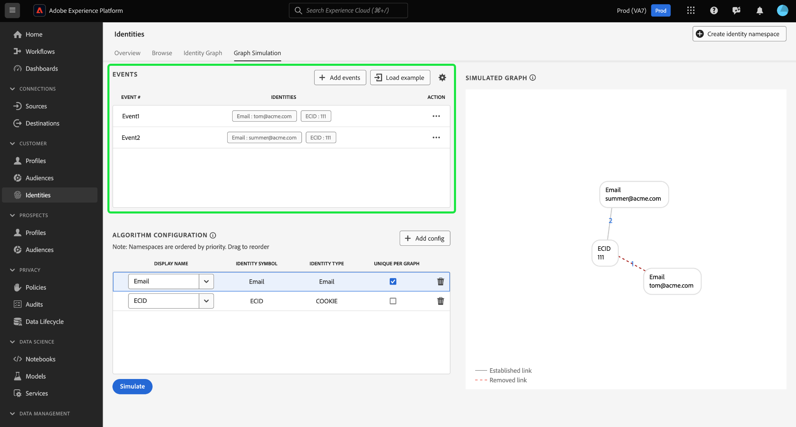
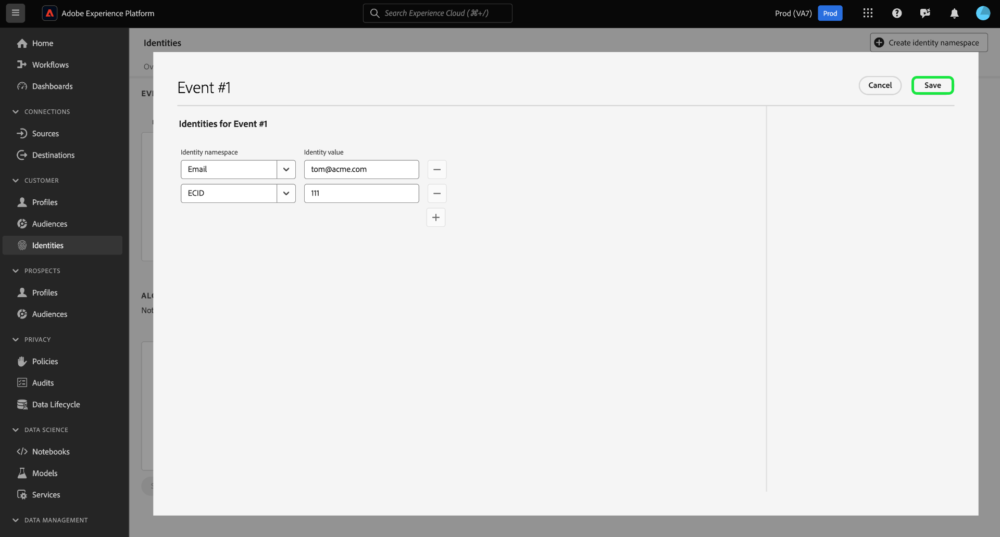

# Guide de l’interface utilisateur de [!DNL Graph Simulation] {#graph-simulation}

>[!CONTEXTUALHELP]
>id="platform_identities_graphsimulation"
>title="Simulation de graphes"
>abstract="Simulez des graphiques pour comprendre comment Identity Service lie les identités et comment fonctionne l’algorithme d’optimisation des identités."

>[!AVAILABILITY]
>
>* Les règles de liaison de graphiques d’identités sont actuellement en disponibilité limitée. Contactez l’équipe de votre compte Adobe pour plus d’informations sur l’accès à la fonctionnalité dans les sandbox de développement.
>
>* Votre compte doit être configuré avec l’autorisation **Afficher le graphique d’identités** pour accéder à l’outil de [!DNL Graph Simulation]. Pour plus d’informations, consultez le guide [ sur les autorisations dans le contrôle d’accès basé sur les attributs](../../access-control/abac/ui/permissions.md).

[!DNL Graph Simulation] est un outil de l’interface utilisateur d’Identity Service que vous pouvez utiliser pour simuler le comportement d’un graphique d’identités selon une combinaison particulière d’identités et la manière dont vous configurez l’algorithme [optimisation des identités](./identity-optimization-algorithm.md).

Regardez la vidéo suivante pour plus d’informations sur l’utilisation de l’interface [!DNL Graph Simulation] dans l’espace de travail de l’interface utilisateur d’Identity Service :

>[!VIDEO](https://video.tv.adobe.com/v/3444032/?learn=on&enablevpops)

Lisez ce document pour découvrir comment utiliser [!DNL Graph Simulation] pour mieux comprendre le comportement du graphique d’identités et le fonctionnement de l’algorithme du graphique.

## Découvrir l’interface [!DNL Graph Simulation] {#interface}

Vous pouvez accéder à [!DNL Graph Simulation] dans l’interface utilisateur de Adobe Experience Platform. Sélectionnez **[!UICONTROL Identités]** dans le volet de navigation de gauche, puis sélectionnez **[!UICONTROL Simulation de graphique]** dans l’en-tête supérieur.

L’interface [!DNL Graph Simulation] se divise en trois sections :

>[!BEGINTABS]

>[!TAB Événements]

Événements : utilisez le panneau **[!UICONTROL Événements]** pour ajouter des identités afin de simuler un graphique. Une identité complète doit avoir un espace de noms d’identité et sa valeur d’identité correspondante. Vous devez ajouter au moins deux identités pour simuler un graphique. Vous pouvez également sélectionner **[!UICONTROL Exemple de chargement]** pour saisir un événement préconfiguré et la configuration de l’algorithme.

>[!TAB Configuration des algorithmes]

Configuration des algorithmes : utilisez le panneau **[!UICONTROL Configuration des algorithmes]** pour ajouter et configurer l’algorithme d’optimisation de vos espaces de noms. Vous pouvez faire glisser et déposer un espace de noms pour modifier leur rang de priorité respectif. Vous pouvez également sélectionner **[!UICONTROL Unique par graphique]** pour déterminer si un espace de noms est unique.

>[!TAB Visionneuse de graphiques simulés]

Visionneuse de graphiques simulés : la visionneuse de graphiques simulés affiche le graphique obtenu en fonction des événements que vous avez ajoutés et de l’algorithme que vous avez configuré. Une ligne droite entre deux identités signifie qu’un lien est établi. Une ligne pointillée indique qu’un lien a été supprimé.

>[!ENDTABS]

## Ajouter des événements {#add-events}

Pour commencer, sélectionnez **[!UICONTROL Ajouter des événements]**.

Une fenêtre pop-up s’affiche pour [!UICONTROL Event #1]. À partir de là, saisissez votre combinaison espace de noms d’identité et valeur d’identité . Vous pouvez utiliser le menu déroulant pour sélectionner un espace de noms d’identité. Vous pouvez également saisir les premières lettres d’un espace de noms, puis sélectionner les options fournies dans le menu déroulant. Une fois que vous avez sélectionné votre espace de noms, indiquez une valeur d’identité correspondant à votre espace de noms.

>[!TIP]
>
>La valeur d’identité saisie lors des exercices [!DNL Graph Simulation] n’a pas besoin d’être une valeur d’identité réelle et peut être constituée de simples espaces réservés.

Une fois votre première identité terminée, sélectionnez l’icône d’ajout (**`+`**) pour ajouter une seconde identité.

Répétez ensuite les mêmes étapes et ajoutez une deuxième identité. Deux identités entièrement qualifiées sont requises pour générer un graphique d’identités. Dans l’exemple ci-dessous, un ECID est ajouté en tant qu’espace de noms et est fourni avec une valeur de `111`. Lorsque vous avez terminé, sélectionnez **[!UICONTROL Enregistrer]**.

L’interface [!UICONTROL Events] se met à jour pour afficher votre premier événement, qui est dans ce cas : `{Email: tom@acme.com, ECID: 111}`.

Répétez ensuite les mêmes étapes pour ajouter un deuxième événement. Pour Event #2, ajoutez `{Email: summer@acme.com}` comme première identité, puis ajoutez le même `{ECID: 111}` que la seconde identité, créant ainsi un second événement de : `{Email: summer@acme.com}, {ECID: 111}`. Lorsque vous avez terminé, vous devriez avoir deux événements, un pour `{Email: tom@acme.com, ECID: 111}` et un pour `{Email: summer@acme.com}, {ECID: 111}`.

### Charger l’exemple {#load-example}

Sélectionnez **[!UICONTROL Charger l’exemple]** pour configurer un exemple de graphique avec un algorithme prédéfini et une configuration d’événement.

Une fenêtre pop-up s’affiche, vous fournissant les scénarios graphiques disponibles parmi lesquels choisir :

| Exemple de graphique | Description | Exemple |
| --- | --- | --- |
| Appareil partagé | L’appareil partagé fait référence aux scénarios où deux utilisateurs différents se connectent au même appareil unique. | Un mari et une femme partagent une iPad pour la navigation sur Internet et le commerce électronique. |
| Téléphone non valide (non unique) | Un téléphone non valide ou non unique fait référence à des scénarios où deux utilisateurs différents utilisent le même numéro de téléphone pour créer un compte. | Une mère et sa fille utilisent leur numéro de téléphone personnel commun pour s’inscrire à un compte de commerce électronique. |
| Valeurs d’identité « incorrectes » | Les valeurs d’identité « incorrectes » font référence aux scénarios où Identity Service génère des IDFA non uniques en raison d’une implémentation erronée. | Le SDK Web envoie par erreur une valeur `user_null` pour chaque événement en raison de problèmes d’implémentation du code. |

Sélectionnez l’une des options pour charger des [!DNL Graph Simulation] avec des événements et un algorithme préconfigurés. Vous pouvez toujours effectuer d’autres configurations pour n’importe quel exemple de scénario graphique préchargé.

Lorsque vous avez terminé, sélectionnez **[!UICONTROL Simuler]**.

### Utiliser la version texte {#use-text-version}

Vous pouvez également utiliser le mode texte pour configurer des événements. Pour utiliser le mode texte, sélectionnez l’icône des paramètres, puis sélectionnez **[!UICONTROL Texte (utilisateurs avancés)]**.

Vous pouvez saisir manuellement vos identités en mode texte. Utilisez le signe deux-points (`:`) pour distinguer la valeur d’identité correspondant à l’espace de noms saisi, puis utilisez une virgule (`,`) pour séparer vos identités. Pour distinguer différents événements les uns des autres, utilisez une nouvelle ligne pour chaque événement.

### Modifier l’événement {#edit-event}

Pour modifier un événement, sélectionnez les points de suspension (`...`) en regard d’un événement donné, puis sélectionnez **[!UICONTROL Modifier]**.

### Supprimer l’événement {#delete-event}

Pour supprimer un événement, sélectionnez les points de suspension (`...`) en regard d’un événement donné, puis sélectionnez **[!UICONTROL Supprimer]**.

## Configurer l’algorithme {#configure-algorithm}

>[!IMPORTANT]
>
>L’algorithme que vous configurez détermine la manière dont Identity Service traite les espaces de noms que vous avez saisis dans vos événements. Toute configuration que vous rassemblez dans le [!DNL Graph Simulation UI] n’est pas enregistrée dans les paramètres d’identité.

Une fois que vous avez ajouté vos événements, vous pouvez configurer l’algorithme qui sera utilisé pour simuler votre graphique. Pour commencer, sélectionnez **[!UICONTROL Ajouter une configuration]**.

Une ligne de configuration vide s’affiche. Tout d’abord, saisissez le même espace de noms que celui utilisé pour vos événements. Dans ce cas, commencez par saisir un e-mail. Une fois que vous avez saisi votre espace de noms, les colonnes [!UICONTROL Symbole d’identité] et [!UICONTROL Type d’identité] sont automatiquement renseignées.

Répétez ensuite les mêmes étapes et ajoutez votre deuxième espace de noms, qui est dans ce cas l’ECID. Une fois tous vos espaces de noms renseignés, vous pouvez commencer à configurer leurs priorités et leur unicité.

* **Priorité des espaces de noms** : la priorité d’un espace de noms détermine son importance relative par rapport aux autres espaces de noms d’un graphique d’identités donné. Par exemple, si votre graphique d’identité comporte quatre espaces de noms différents : CRMID, ECID, E-mail et Apple IDFA, vous pouvez configurer des priorités afin de déterminer un ordre d’importance pour les quatre espaces de noms.
* **Espace de noms unique** : si un espace de noms est désigné comme unique, Identity Service génère des graphiques avec la mise en garde qu’une seule identité avec un espace de noms unique donné peut exister. Par exemple, si l’espace de noms E-mail est désigné comme espace de noms unique, un graphique ne peut avoir qu’une seule identité avec E-mail. S’il existe plusieurs identités avec l’espace de noms E-mail , le lien le plus ancien est supprimé.

Pour configurer la priorité des espaces de noms, sélectionnez les lignes d’espace de noms et faites-les glisser dans l’ordre de priorité de votre choix, la ligne supérieure représentant la priorité la plus élevée et la ligne inférieure représentant la priorité la plus faible. Pour désigner un espace de noms comme unique, cochez la case **[!UICONTROL Unique par graphique]**.

Lorsque vous avez terminé, sélectionnez **[!UICONTROL Simuler]**.

## Afficher le graphique simulé

La section [!UICONTROL Graphique simulé] affiche le ou les graphiques d’identités générés en fonction des événements que vous avez ajoutés et de l’algorithme que vous avez configuré.

| Icônes du graphique | Description |
| --- | --- |
| Ligne continue | Une ligne continue représente un lien établi entre deux identités. |
| Ligne pointillée | Une ligne pointillée représente un lien supprimé entre deux identités. |
| Numéro sur la ligne | Un nombre sur une ligne représente l’horodatage du moment où ce lien donné a été généré. Le nombre le plus bas (1) représente le premier lien établi. |

Dans l’exemple de graphique ci-dessous, une ligne pointillée existe entre `{Email: tom@acme.com}` et `{ECID: 111}` pour les raisons suivantes :

* L’e-mail a été désigné comme unique lors de l’étape de configuration de l’algorithme. Par conséquent, une seule identité avec un espace de noms E-mail peut exister dans un graphique.
* Le lien entre `{Email: tom@acme.com}` et `{ECID: 111}` était la première identité établie (#1 d’événement). Il s’agit du lien le plus ancien et il est donc supprimé.

## Étapes suivantes

Grâce à la lecture de ce document, vous savez désormais comment utiliser l’outil [!DNL Graph Simulation] pour mieux comprendre comment vos données d’identité sont traitées selon un ensemble particulier de règles et de configurations. Pour plus d’informations, consultez les documents suivants :

* [Aperçu des règles de liaison des graphiques d’identités](./overview.md)
* [Algorithme d’optimisation de l’identité](./identity-optimization-algorithm.md)
* [Guide de mise en œuvre](./implementation-guide.md)
* [Résolution des problèmes et FAQ](./troubleshooting.md)
* [Exemples de configurations de graphes](./example-configurations.md)
* [Priorité d’espace de noms](./namespace-priority.md)
* [Interface utilisateur des paramètres d’identité](./identity-settings-ui.md)
