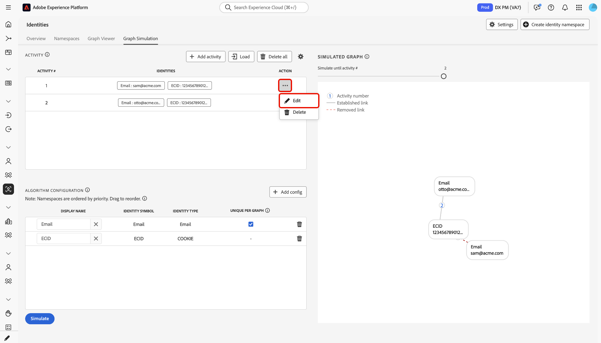
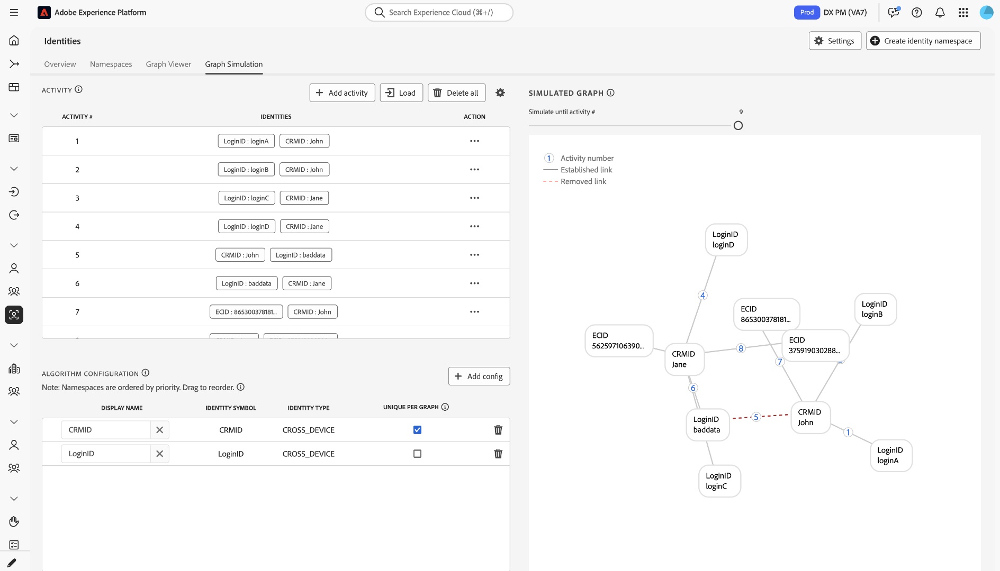

# Guide de l’interface utilisateur de [!DNL Graph Simulation] {#graph-simulation}

>[!CONTEXTUALHELP]
>id="platform_identities_graphsimulation"
>title="Simulation de graphes"
>abstract="Simulez des graphes pour comprendre comment le service d’identités lie les identités et comment l’algorithme d’optimisation des identités fonctionne."

[!DNL Graph Simulation] est un outil de l’interface utilisateur d’Identity Service que vous pouvez utiliser pour simuler le comportement d’un graphique d’identités en fonction des identités que vous fournissez et la manière dont vous configurez l’algorithme [Identity Optimization](./identity-optimization-algorithm.md).

Utilisez-le pour tester en toute sécurité le comportement du graphique avant d’appliquer des [!DNL Identity Graph Linking Rules] aux données de production. En définissant des exemples d’événements et en configurant l’algorithme d’optimisation des identités, y compris les priorités des espaces de noms et les paramètres « unique par graphique », vous pouvez voir si les identités fusionnent dans un graphique ou restent distinctes, puis ajuster votre configuration si nécessaire. Utilisez cette fonctionnalité pour effectuer les actions suivantes :

* Empêcher la réduction du graphique (par exemple, lorsque plusieurs personnes partagent un appareil ou un numéro de téléphone)
* Régler les priorités des espaces de noms (par exemple, si EMAIL ou CRM_ID doivent être dominants)
* Évaluez l’impact potentiel des identifiants de faible qualité ou réutilisés sur le groupement dans votre environnement.

Vous pouvez également répéter les modifications de configuration et les problèmes d’identité de débogage qui s’affichent dans les applications en aval. Par exemple, si les tailles d’audience ou les profils fusionnés ne semblent pas corrects, vous pouvez recréer les événements pertinents dans [!DNL Graph Simulation] pour voir comment vos règles actuelles façonnent le graphique et essayer d’autres méthodes plus sûres.

Les scénarios d’exemple intégrés vous aident à expliquer le comportement des identités et le risque de réduction des graphiques aux parties prenantes et à prendre en charge l’adhésion à la qualité des données et la gouvernance des identités.

## Comprendre l’interface [!DNL Graph Simulation]

Pour accéder à [!DNL Graph Simulation], accédez à l’espace de travail Service d’identités dans l’interface utilisateur de Adobe Experience Platform, puis sélectionnez **[!UICONTROL Graph Simulation]**.

L’interface se compose de trois sections principales :

>[!BEGINTABS]

>[!TAB Activité]

Utilisez le panneau **[!UICONTROL Activity]** pour ajouter des identités afin de simuler un graphique. Chaque identité a besoin d’un espace de noms et d’une valeur. Vous devez ajouter au moins deux identités pour exécuter une simulation. Vous pouvez également sélectionner **[!UICONTROL Load]** pour importer un événement et une configuration d’algorithme préconfigurés ou pour ouvrir un graphique existant.

>[!TAB Configuration des algorithmes]

Utilisez le panneau **[!UICONTROL Algorithm configuration]** pour ajouter et configurer l’algorithme d’optimisation de vos espaces de noms. Faites glisser et déposez des lignes d’espace de noms pour modifier l’ordre de priorité. Vous pouvez également sélectionner **[!UICONTROL Unique Per Graph]** pour indiquer si un espace de noms doit être unique dans le graphique.

>[!TAB Graphique simulé ]

Utilisez l’affichage **[!UICONTROL Simulated graph]** pour consulter le graphique généré à partir de vos activités et des paramètres de l’algorithme. Une ligne continue entre deux identités signifie que le lien est conservé ; une ligne pointillée signifie que l’algorithme a supprimé ce lien.

>[!ENDTABS]

## Workflow [!DNL Graph Simulation]

### Ajouter des activités

Pour commencer à simuler des graphiques d’identités, sélectionnez **[!UICONTROL Add Activity]**.

Lorsque la fenêtre pop-up de [!UICONTROL Activity #1] s’affiche, choisissez un espace de noms d’identité et saisissez sa valeur. Vous pouvez choisir un espace de noms dans la liste déroulante ou saisir quelques lettres pour filtrer la liste. Après avoir sélectionné un espace de noms, saisissez la valeur d’identité correspondante.

>[!TIP]
>
>Il n’est pas nécessaire d’utiliser de vraies valeurs d’identité lors de l’utilisation de [!DNL Graph Simulation].

L’interface [!UICONTROL Activity] se met à jour pour afficher votre première activité.

Sélectionnez à nouveau **[!UICONTROL Add Activity]** et effectuez une deuxième activité. Vous avez besoin d’au moins deux identités entièrement qualifiées (espace de noms plus valeur) pour générer un graphique.

### Configurer l’algorithme

>[!IMPORTANT]
>
>L’algorithme que vous configurez contrôle la manière dont Identity Service traite les espaces de noms dans vos activités. Rien de ce que vous configurez dans le [!DNL Graph Simulation UI] n’est enregistré dans les paramètres d’identité du service d’identités.

Une fois vos activités en place, configurez l’algorithme de la simulation. Sélectionnez **[!UICONTROL Add config]**.

Ajoutez chaque espace de noms que l’algorithme doit prendre en compte. Utilisez la liste déroulante pour effectuer une recherche, ou saisissez les premières lettres pour affiner la liste.

* **Priorité des espaces de noms** : vous contrôlez l’ordre d’importance de chaque espace de noms dans votre graphique d’identités. Par exemple, si votre graphique utilise CRMID, ECID, e-mail et Apple IDFA, vous pouvez définir leur priorité de manière à refléter ce qui doit être pris en compte en premier lors de la liaison d’identités. L’espace de noms en haut de votre liste aura la priorité la plus élevée.
* **Espace de noms unique** : lorsqu’un espace de noms est marqué comme unique, Identity Service s’assure qu’une seule identité avec cet espace de noms apparaît dans un graphique. Par exemple, si E-mail est défini comme unique, chaque graphique ne contient qu’une seule identité E-mail. Si plusieurs identités avec le même e-mail sont présentes, la connexion la plus ancienne sera supprimée pour conserver l’unicité.

Faites glisser les lignes d’espace de noms dans l’ordre de priorité : la ligne supérieure a la priorité la plus élevée et la ligne inférieure la plus basse. Pour traiter un espace de noms comme unique dans le graphique, cochez sa case **[!UICONTROL Unique Per Graph]**.

Lorsque vous êtes prêt, sélectionnez **[!UICONTROL Simulate]**.

### Afficher le graphique simulé

La section [!UICONTROL Simulated Graph] affiche le ou les graphiques générés à partir de vos activités et de la configuration des algorithmes.

| Icônes du graphique | Description |
| --- | --- |
| Ligne continue | Une ligne continue représente un lien établi entre deux identités. |
| Ligne pointillée | Une ligne pointillée représente un lien supprimé entre deux identités. |
| Numéro sur la ligne | Un nombre sur une ligne indique le moment où ce lien a été formé par rapport aux autres. Le numéro le plus bas (1) est le premier lien. |

## Fonctionnalités supplémentaires

Vous pouvez également modifier ou supprimer des activités, saisir des activités en mode texte, charger un exemple de scénario ou extraire un graphique existant à partir d’Identity Service.

### Modifier l’activité {#edit-activity}

Pour modifier une activité, sélectionnez les points de suspension (`...`) à côté d’une activité donnée, puis sélectionnez **[!UICONTROL Edit]**.

### Supprimer l’activité {#delete-activity}

Pour supprimer une activité, sélectionnez les points de suspension (`...`) à côté d’une activité donnée, puis sélectionnez **[!UICONTROL Delete]**.

### Utiliser le mode texte {#use-text-mode}

Vous pouvez utiliser le mode texte pour configurer vos activités. Pour utiliser le mode texte, sélectionnez l’icône des paramètres, puis sélectionnez **[!UICONTROL Text (Advanced users)]**.

En mode texte, saisissez chaque identité comme `namespace:value`. Séparez plusieurs identités dans le même événement par une virgule (`,`). Commencez une nouvelle ligne pour chaque événement.

### Charger l’exemple {#load-example}

Sélectionnez **[!UICONTROL Load example]** pour charger un graphique prêt à l’emploi avec des activités prédéfinies et des paramètres d’algorithme.

Une boîte de dialogue répertorie les scénarios que vous pouvez ouvrir :

| Exemple de graphique | Description | Exemple |
| --- | --- | --- |
| Appareil partagé | Deux utilisateurs différents se connectent sur le même appareil. | Un mari et une femme partagent une iPad pour la navigation et le commerce électronique. |
| Téléphone non valide (non unique) | Deux utilisateurs différents s’enregistrent avec le même numéro de téléphone. | Une mère et sa fille utilisent un numéro de téléphone personnel partagé pour s’inscrire à des comptes de commerce électronique. |
| Valeurs d’identité « incorrectes » | Les erreurs d’implémentation envoient des identifiants en double ou d’espace réservé (par exemple, le même IDFA pour de nombreux utilisateurs). | Web SDK envoie une valeur `user_null` sur chaque activité en raison d’un défaut de code. |

Choisissez un scénario pour charger des [!DNL Graph Simulation] avec les activités et les paramètres d’algorithme correspondants. Vous pouvez éditer le résultat comme n&#39;importe quelle simulation.

### Charger le graphique existant {#load-existing-graph}

Vous pouvez utiliser [!DNL Graph Simulation] pour charger un graphique existant et afficher ses activités, la configuration des algorithmes et le graphique.

Sélectionnez **[!UICONTROL Load]**, puis sélectionnez **[!UICONTROL Existing graph]**.

Dans la boîte de dialogue, saisissez un espace de noms et une valeur d’identité appartenant au graphique à inspecter.

Lorsque le chargement réussit, [!DNL Graph Simulation] affiche le graphique contenant cette identité.

>[!TIP]
>
>Après avoir configuré vos paramètres sur le premier écran [Paramètres d’identité](./identity-settings-ui.md), vous pouvez utiliser l’option **charger les graphiques existants** pour simuler votre graphique en fonction de ces paramètres exacts. La simulation utilisera la configuration que vous avez définie.

## Étapes suivantes

Vous pouvez utiliser [!DNL Graph Simulation] pour voir comment Identity Service lie les identités selon différentes règles avant de modifier les paramètres de production. Pour aller plus loin, consultez la documentation suivante :

* [Vue d’ensemble d’[!DNL Identity Graph Linking Rules]](./overview.md)
* [Algorithme d’optimisation des identités](./identity-optimization-algorithm.md)
* [Guide de mise en œuvre](./implementation-guide.md)
* [Résolution des problèmes et FAQ](./troubleshooting.md)
* [Exemples de configurations de graphes](./example-configurations.md)
* [Priorité d’espace de noms](./namespace-priority.md)
* [Interface utilisateur des paramètres d’identité](./identity-settings-ui.md)
