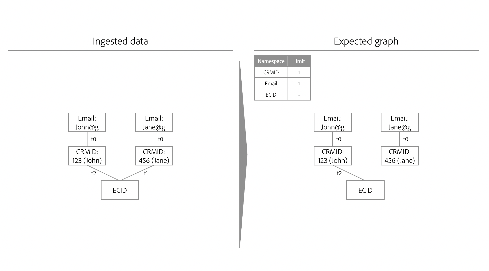
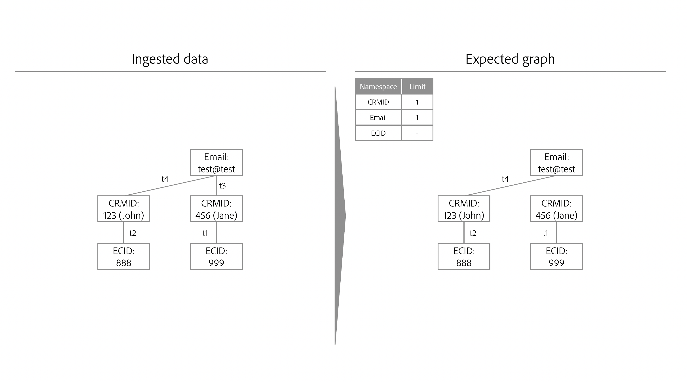

# Algorithme d’optimisation des identités

>[!AVAILABILITY]
>
>Cette fonctionnalité n’est pas encore disponible ; le programme bêta pour les règles de liaison de graphiques d’identités devrait commencer en juillet sur les environnements de test de développement. Contactez votre équipe de compte d’Adobe pour plus d’informations sur les critères de participation.

L’algorithme d’optimisation des identités est un algorithme graphique d’Identity Service qui permet de s’assurer qu’un graphique d’identités est représentatif d’une seule personne et, par conséquent, empêche la fusion indésirable d’identités sur Real-time Customer Profile.

## Paramètres d&#39;entrée {#input-parameters}

Lisez cette section pour plus d’informations sur les espaces de noms uniques et la priorité des espaces de noms. Ces deux concepts servent de paramètres d’entrée requis par l’algorithme d’optimisation des identités.

### Espace de noms unique {#unique-namespace}

Un espace de noms unique détermine les liens qui sont supprimés en cas d’effondrement du graphique.

Un profil fusionné unique et son graphique d’identités correspondant doivent représenter une seule personne (entité de personne). Une seule personne est généralement représentée par des identifiants de gestion de la relation client et/ou des identifiants de connexion. On s’attend à ce qu’aucun deux individus (ID CRM) ne soient fusionnés dans un seul profil ou graphique.

Vous devez spécifier les espaces de noms qui représentent une entité de personne dans Identity Service à l’aide de l’algorithme d’optimisation des identités. Par exemple, si une base de données CRM définit un compte utilisateur à associer à un identifiant CRM unique et à une seule adresse email, les paramètres d’identité de cet environnement de test se présentent comme suit :

* Espace de noms de l’ID de gestion de la relation client = unique
* Espace de noms de courriel = unique

Un espace de noms que vous déclarez unique est automatiquement configuré pour avoir une limite maximale d’un dans un graphique d’identités donné. Par exemple, si vous déclarez un espace de noms d’identifiant CRM unique, un graphique d’identités ne peut avoir qu’une seule identité contenant un espace de noms d’identifiant CRM. Si vous ne déclarez pas d’espace de noms unique, le graphique peut contenir plusieurs identités avec cet espace de noms.

>[!NOTE]
>
>* Pour l’instant, la représentation des entités des ménages (&quot;graphiques des ménages&quot;) n’est pas prise en charge.
>
>* Tous les espaces de noms qui sont des identifiants de personne et utilisés dans l’environnement de test pour générer des graphiques d’identité doivent être marqués comme un espace de noms unique. Dans le cas contraire, il se peut que des résultats de liaison indésirables s’affichent.

### Priorité d’espace de noms {#namespace-priority}

La priorité de l’espace de noms détermine la manière dont l’algorithme d’optimisation des identités supprime les liens.

Les espaces de noms dans Identity Service ont un ordre d’importance relatif implicite. Prenons un graphique structuré comme une pyramide. Il y a un noeud sur le calque supérieur, deux noeuds sur le calque central et quatre noeuds sur le calque inférieur. La priorité de l’espace de noms doit refléter cet ordre relatif pour s’assurer qu’une entité de personne est correctement représentée.

Pour un examen détaillé de la priorité des espaces de noms et de ses fonctionnalités et utilisations complètes, consultez le [guide de priorité des espaces de noms](./namespace-priority.md).

## Processus {#process}

Lors de l’ingestion de nouvelles identités, Identity Service vérifie si les nouvelles identités et leurs espaces de noms correspondants respectent les configurations d’espace de noms uniques. Si les configurations sont suivies, l’ingestion se poursuit et les nouvelles identités sont liées au graphique. Toutefois, si les configurations ne sont pas suivies, l’algorithme d’optimisation des identités :

* Ingérez l’événement le plus récent tout en tenant compte de la priorité de l’espace de noms.
* Supprimez le lien qui fusionnerait deux entités de personne du calque graphique approprié.

## Détails de l’algorithme d’optimisation des identités

Lorsque la contrainte d’espace de noms unique est enfreinte, l’algorithme d’optimisation de l’identité &quot;relit&quot; les liens et recrée le graphique de zéro.

* Les liens sont triés selon l’ordre suivant :
   * Dernier événement.
   * Horodatage par somme de la priorité de l’espace de noms (somme inférieure = ordre supérieur).
* Le graphique est restauré en fonction de l’ordre ci-dessus. Si l’ajout du lien enfreint la contrainte limite (par exemple, le graphique contient plusieurs identités avec un espace de noms unique), les liens sont supprimés.
* Le graphique qui en résulte sera alors conforme à la contrainte d’espace de noms unique que vous avez configurée.

## Exemples de scénarios pour l’algorithme d’optimisation des identités

La section suivante décrit le comportement de l’algorithme d’optimisation des identités dans des scénarios tels que l’appareil partagé ou l’ingestion de données avec le même horodatage.

### Appareil partagé

Un appareil partagé fait référence à un appareil utilisé par plusieurs individus. Par exemple, un appareil partagé peut être un ordinateur portable ou une tablette que vous partagez avec un partenaire ou un membre de votre famille, un ordinateur de bibliothèque ou un kiosque public.

>[!BEGINTABS]

>[!TAB Exemple 1]

| Espace de noms | Espace de noms unique |
| --- | --- |
| Identifiant CRM | Oui |
| E-mail | Oui |
| ECID | Non |

Dans cet exemple, l’identifiant CRM et le courrier électronique sont désignés comme espaces de noms uniques. À `timestamp=0`, un jeu de données d’enregistrement CRM est ingéré et crée deux graphiques différents en raison de la configuration d’espace de noms unique. Chaque graphique contient un identifiant CRM et un espace de noms Email.

* `timestamp=1` : Jane se connecte à votre site web de commerce électronique à l’aide d’un ordinateur portable. Jane est représentée par son identifiant CRM et son e-mail, tandis que le navigateur web sur son ordinateur portable qu’elle utilise est représenté par un ECID.
* `timestamp=2` : John se connecte à votre site web de commerce électronique avec le même ordinateur portable. John est représenté par son identifiant CRM et son e-mail, tandis que le navigateur web qu’il a utilisé est déjà représenté par un ECID. Comme le même ECID est lié à deux graphiques différents, Identity Service peut savoir que cet appareil (ordinateur portable) est un appareil partagé.
* Cependant, en raison de la configuration d’espace de noms unique qui définit un maximum d’un espace de noms d’identifiant CRM et d’un espace de noms d’email par graphique, l’algorithme d’optimisation de l’identité divise ensuite le graphique en deux.
   * Enfin, puisque John est le dernier utilisateur authentifié, l’ECID qui représente l’ordinateur portable reste lié à son graphique au lieu de celui de Jane.

>[!TAB Exemple 2]

| Espace de noms | Espace de noms unique |
| --- | --- |
| Identifiant CRM | Oui |
| ECID | Non |

Dans cet exemple, l’espace de noms de l’identifiant CRM est désigné comme un espace de noms unique.

* `timestamp=1` : Jane se connecte à votre site web de commerce électronique à l’aide d’un ordinateur portable. Elle est représentée par son identifiant CRM et le navigateur web sur l’ordinateur portable est représenté par l’ECID.
* `timestamp=2` : John se connecte à votre site web de commerce électronique avec le même ordinateur portable. Il est représenté par son identifiant CRM et le navigateur web qu’il utilise est représenté par le même ECID.
   * Cet événement lie deux identifiants CRM indépendants au même ECID, qui dépasse la limite configurée d’un identifiant CRM.
   * Par conséquent, l’algorithme d’optimisation des identités supprime l’ancien lien, qui dans ce cas est l’identifiant CRM Jane’s qui a été lié à `timestamp=1`.
   * Cependant, bien que l’identifiant CRM de Jane n’existe plus sous forme de graphique sur Identity Service, il persistera toujours en tant que profil sur Real-time Customer Profile. En effet, un graphique d’identités doit contenir au moins deux identités liées. En raison de la suppression des liens, l’identifiant CRM de Jane ne dispose plus d’une autre identité à laquelle créer un lien.

>[!ENDTABS]

### Mauvais email

Dans certains cas, un utilisateur peut saisir des valeurs erronées pour son adresse électronique et/ou ses numéros de téléphone.

| Espace de noms | Espace de noms unique |
| --- | --- |
| Identifiant CRM | Oui |
| E-mail | Oui |
| ECID | Non |

Dans cet exemple, l’identifiant CRM et les espaces de noms de courrier électronique sont désignés comme uniques. Supposons que Jane et John se soient inscrits à votre site web d’e-commerce à l’aide d’une valeur d’e-mail incorrecte (par exemple, test@test.com).

* `timestamp=1` : Jane se connecte à votre site web de commerce électronique à l’aide de Safari sur son iPhone, en établissant son identifiant CRM (informations de connexion) et son ECID (navigateur).
* `timestamp=2` : John se connecte à votre site web de commerce électronique à l’aide de Google Chrome sur son iPhone, en établissant son identifiant CRM (informations de connexion) et son ECID (navigateur).
* `timestamp=3` : votre ingénieur de données ingère l’enregistrement CRM de Jane, ce qui entraîne l’association de son identifiant CRM au mauvais courrier électronique.
* `timestamp=4` : votre ingénieur de données ingère l’enregistrement CRM de John, ce qui entraîne l’association de son identifiant CRM au mauvais courrier électronique.
   * Cela devient alors une violation de la configuration d’espace de noms unique, car il crée un graphique unique avec deux espaces de noms d’ID CRM.
   * Par conséquent, l’algorithme d’optimisation des identités supprime l’ancien lien, qui dans ce cas est le lien entre l’identité de Jane avec l’espace de noms de l’ID CRM et l’identité avec test@test.

Avec l’algorithme d’optimisation des identités, les valeurs d’identité erronées telles que les faux emails ou les numéros de téléphone ne sont pas propagées sur plusieurs graphiques d’identités différents.

### Association d’événements anonymes

Les ECID stockent les événements non authentifiés (anonymes), tandis que l’ID de gestion de la relation client stocke les événements authentifiés. Dans le cas des appareils partagés, l’ECID (porteur d’événements non authentifiés) est associé au **dernier utilisateur authentifié**.

Consultez le diagramme ci-dessous pour mieux comprendre le fonctionnement de l’association d’événements anonymes :

* Kevin et Nora partagent une tablette.
   * `timestamp=1` : Kevin se connecte à un site web de commerce électronique à l’aide de son compte, établissant ainsi son identifiant CRM (informations de connexion) et un ECID (navigateur). Au moment de la connexion, Kevin est désormais considéré comme le dernier utilisateur authentifié.
   * `timestamp=2` : Nora se connecte à un site web de commerce électronique à l’aide de son compte, établissant ainsi son identifiant CRM (informations de connexion) et le même ECID. Au moment de la connexion, Nora est désormais considérée comme le dernier utilisateur authentifié.
   * `timestamp=3` : Kevin utilise la tablette pour parcourir le site web d’e-commerce, mais ne se connecte pas avec son compte. L’activité de navigation de Kevin est ensuite stockée dans l’ECID, qui, à son tour, est associé à Nora car elle est le dernier utilisateur authentifié. A ce stade, Nora possède les événements anonymes.
      * Jusqu’à ce que Kevin se reconnecte, le profil fusionné de Nora sera associé à tous les événements non authentifiés stockés par rapport à l’ECID (les événements étant l’endroit où ECID est l’identité principale).
   * `timestamp=4` : Kevin se connecte une seconde fois. À ce stade, il redevient le dernier utilisateur authentifié et possède désormais les événements non authentifiés :
      * Avant sa connexion initiale avant `timestamp=1` ; et
      * Toute activité qu&#39;il ou Nora a effectuée en naviguant anonymement entre la première et la seconde connexion de Kevin.

## Étapes suivantes

Pour plus d’informations sur les règles de liaison des graphiques d’identités, consultez la documentation suivante :

* [Présentation des règles de liaison de graphiques d’identités](./overview.md)
* [Exemples de scénarios de configuration des règles de liaison de graphiques d’identités](./example-scenarios.md)
* [Logique de liaison d’identités](../features/identity-linking-logic.md)
* [Identity Service et Real-time Customer Profile](../identity-and-profile.md)
