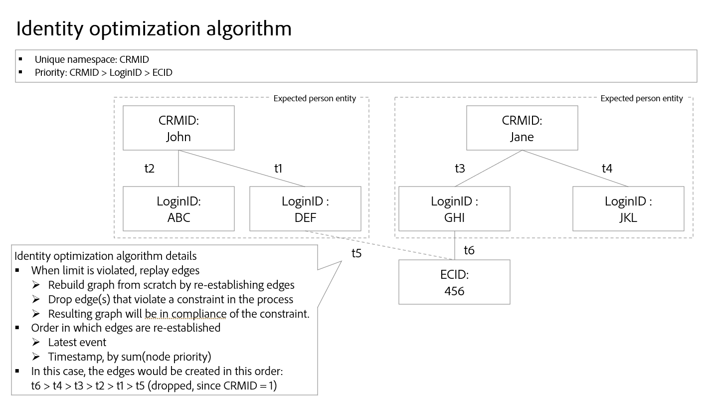

# Algorithme d’optimisation des identités {#identity-optimization-algorithm}

>[!CONTEXTUALHELP]
>id="platform_identities_uniquenamespace"
>title="Espace de noms unique"
>abstract="Un graphe ne peut pas avoir deux identités avec un espace de noms unique. Si un graphe tente de dépasser cette limite, les liens les plus récents sont conservés et les liens les plus anciens sont supprimés."

L’algorithme d’optimisation des identités est un algorithme de graphique sur Identity Service qui permet de s’assurer qu’un graphique d’identités est représentatif d’une seule personne et, par conséquent, empêche la fusion indésirable d’identités sur le profil client en temps réel.

## Paramètres d&#39;entrée {#input-parameters}

Lisez cette section pour plus d’informations sur les espaces de noms uniques et la priorité des espaces de noms. Ces deux concepts servent de paramètres d’entrée requis par l’algorithme d’optimisation des identités.

### Espace de noms unique {#unique-namespace}

Un espace de noms unique détermine les liens qui sont supprimés en cas de réduction du graphique.

Un seul profil fusionné et son graphique d’identité correspondant doivent représenter un seul individu (entité de personne). Un seul individu est généralement représenté par des CRMID et/ou des ID de connexion. On s’attend à ce que deux individus (CRMID) ne soient pas fusionnés en un seul profil ou graphique.

Vous devez spécifier les espaces de noms qui représentent une entité de personne dans Identity Service à l’aide de l’algorithme d’optimisation des identités. Par exemple, si une base de données CRM définit un compte utilisateur à associer à un seul CRMID et à une seule adresse e-mail, les paramètres d’identité de ce sandbox ressembleraient à ce qui suit :

* Espace de noms CRMID = unique
* Espace de noms de l’e-mail = unique

Un espace de noms que vous déclarez unique est automatiquement configuré pour avoir une limite maximale de un dans un graphique d’identités donné. Par exemple, si vous déclarez un espace de noms CRMID unique, alors un graphique d’identités ne peut avoir qu’une seule identité contenant un espace de noms CRMID. Si vous ne déclarez pas un espace de noms comme étant unique, le graphique peut contenir plusieurs identités avec cet espace de noms.

>[!NOTE]
>
>* La représentation de l’entité Ménage (« graphiques des ménages ») n’est pas prise en charge pour le moment.
>
>* Tous les espaces de noms qui sont des identifiants de personne et qui sont utilisés dans le sandbox pour générer des graphiques d’identités doivent être marqués comme un espace de noms unique. Dans le cas contraire, vous risquez de voir des résultats de liaison indésirables.

### Priorité d’espace de noms {#namespace-priority}

La priorité de l’espace de noms détermine la manière dont l’algorithme d’optimisation des identités supprime les liens.

Les espaces de noms dans Identity Service présentent un ordre d’importance relatif implicite. Prenons l’exemple d’un graphique structuré comme une pyramide. Il y a un nœud sur le calque supérieur, deux nœuds sur le calque intermédiaire et quatre nœuds sur le calque inférieur. La priorité de l’espace de noms doit refléter cet ordre relatif pour s’assurer qu’une entité personne est représentée avec précision.

Pour une analyse approfondie de la priorité des espaces de noms ainsi que de l’ensemble de ses fonctionnalités et utilisations, consultez le guide [namespace priority guide](./namespace-priority.md).

## Processus {#process}

Lors de l’ingestion de nouvelles identités, Identity Service vérifie si les nouvelles identités et leurs espaces de noms correspondants respectent les configurations d’espace de noms uniques. Si les configurations sont suivies, l’ingestion se poursuit et les nouvelles identités sont liées au graphique. Cependant, si les configurations ne sont pas suivies, l’algorithme d’optimisation des identités :

* Ingérez l’événement le plus récent, tout en tenant compte de la priorité de l’espace de noms.
* Supprimez le lien qui fusionnerait deux entités de personne du calque de graphique approprié.

## Détails de l’algorithme d’optimisation des identités

En cas de violation de la contrainte d’espace de noms unique, l’algorithme d’optimisation des identités « relit » les liens et recrée le graphique en partant de zéro.

* Les liens sont triés dans l’ordre suivant :
   * Dernier événement.
   * Horodatage par la somme de la priorité de l’espace de noms (somme inférieure = ordre supérieur).
* Le graphique est rétabli dans l’ordre ci-dessus. Si l’ajout du lien viole la contrainte de limite (par exemple, le graphique contient plusieurs identités avec un espace de noms unique), les liens sont supprimés.
* Le graphique qui en résulte sera alors conforme à la contrainte d’espace de noms unique que vous avez configurée.

## Exemples de scénarios pour l’algorithme d’optimisation des identités

La section suivante décrit le comportement de l’algorithme d’optimisation des identités dans des scénarios tels que l’appareil partagé ou l’ingestion de données avec le même horodatage.

### Périphérique partagé

Un appareil partagé fait référence à un appareil utilisé par plusieurs personnes. Par exemple, un appareil partagé peut être un ordinateur portable ou une tablette que vous partagez avec un partenaire ou un membre de la famille, un ordinateur de bibliothèque ou un kiosque public.

>[!BEGINTABS]

>[!TAB Exemple 1]

| Espace de noms | Espace de noms unique |
| --- | --- |
| CRMID | Oui |
| E-mail | Oui |
| ECID | Non |

Dans cet exemple, CRMID et Email sont désignés comme des espaces de noms uniques. Au `timestamp=0`, un jeu de données d’enregistrement CRM est ingéré et crée deux graphiques différents en raison de la configuration unique de l’espace de noms. Chaque graphique contient un CRMID et un espace de noms E-mail .

* `timestamp=1` : Jane se connecte à votre site e-commerce à l’aide d’un ordinateur portable. Jane est représentée par son CRMID et son adresse e-mail, tandis que le navigateur web sur son ordinateur portable qu’elle utilise est représenté par un ECID.
* `timestamp=2` : John se connecte à votre site Web de commerce électronique à l&#39;aide du même ordinateur portable. John est représenté par son CRMID et son email, tandis que le navigateur web qu&#39;il a utilisé est déjà représenté par un ECID. Comme le même ECID est lié à deux graphiques différents, Identity Service peut savoir que cet appareil (ordinateur portable) est un appareil partagé.
* Cependant, en raison de la configuration d’espace de noms unique qui définit un espace de noms CRMID et un espace de noms d’e-mail au maximum par graphique, l’algorithme d’optimisation des identités divise le graphique en deux.
   * Enfin, comme John est le dernier utilisateur authentifié, l’ECID qui représente l’ordinateur portable reste lié à son graphique à la place de celui de Jane.

>[!TAB Exemple 2]

| Espace de noms | Espace de noms unique |
| --- | --- |
| CRMID | Oui |
| ECID | Non |

Dans cet exemple, l’espace de noms CRMID est désigné comme espace de noms unique.

* `timestamp=1` : Jane se connecte à votre site e-commerce à l’aide d’un ordinateur portable. Elle est représentée par son CRMID, et le navigateur web sur l’ordinateur portable est représenté par l’ECID.
* `timestamp=2` : John se connecte à votre site Web de commerce électronique à l&#39;aide du même ordinateur portable. Il est représenté par son CRMID et le navigateur web qu’il utilise est représenté par le même ECID.
   * Cet événement associe deux CRMID indépendants au même ECID, ce qui dépasse la limite configurée d’un CRMID.
   * Par conséquent, l’algorithme d’optimisation des identités supprime l’ancien lien, qui est dans ce cas le CRMID de Jane lié à `timestamp=1`.
   * Cependant, bien que le CRMID de Jane n’existe plus en tant que graphique sur Identity Service, il persiste toujours en tant que profil sur le profil client en temps réel. En effet, un graphique d’identités doit contenir au moins deux identités liées et, suite à la suppression des liens, le CRMID de Jane ne dispose plus d’une autre identité à lier.

>[!ENDTABS]

### E-mail incorrect

Il existe des cas où un utilisateur peut saisir des valeurs incorrectes pour son adresse e-mail et/ou son numéro de téléphone.

| Espace de noms | Espace de noms unique |
| --- | --- |
| CRMID | Oui |
| E-mail | Oui |
| ECID | Non |

Dans cet exemple, les espaces de noms CRMID et Email sont désignés comme uniques. Supposons que Jane et John se soient inscrits à votre site Web d’e-commerce à l’aide d’une mauvaise valeur d’e-mail (par exemple, test@test.com).

* `timestamp=1` : Jane se connecte à votre site e-commerce à l’aide de Safari sur son iPhone, en établissant son CRMID (informations de connexion) et son ECID (navigateur).
* `timestamp=2` : John se connecte à votre site web d’e-commerce à l’aide de Google Chrome sur son iPhone, en établissant ses CRMID (informations de connexion) et ECID (navigateur).
* `timestamp=3` : votre ingénieur de données ingère l’enregistrement CRM de Jane, ce qui fait que son CRMID est lié à l’e-mail incorrect.
* `timestamp=4` : votre ingénieur de données ingère l’enregistrement CRM de John, ce qui fait que son CRMID est lié à l’e-mail incorrect.
   * Cela devient alors une violation de la configuration d’espace de noms unique, car cela crée un graphique unique avec deux espaces de noms CRMID.
   * Par conséquent, l&#39;algorithme d&#39;optimisation des identités supprime l&#39;ancien lien, qui est dans ce cas le lien entre l&#39;identité de Jane avec l&#39;espace de noms CRMID et l&#39;identité avec test@test.

Avec l’algorithme d’optimisation des identités, les valeurs d’identité incorrectes telles que les faux e-mails ou numéros de téléphone ne se propagent pas dans plusieurs graphiques d’identités différents.

## Association d’événements anonymes

Les ECID stockent les événements non authentifiés (anonymes), tandis que le CRMID stocke les événements authentifiés. Dans le cas des appareils partagés, l’ECID (porteur d’événements non authentifiés) est associé au **dernier utilisateur authentifié**.

Consultez le diagramme ci-dessous pour mieux comprendre le fonctionnement de l’association d’événements anonymes :

* Kevin et Nora partagent une tablette.
   * `timestamp=1` : Kevin se connecte à un site e-commerce à l’aide de son compte, établissant ainsi son CRMID (informations de connexion) et un ECID (navigateur). Au moment de la connexion, Kevin est désormais considéré comme le dernier utilisateur authentifié.
   * `timestamp=2` : Nora se connecte à un site web d’e-commerce à l’aide de son compte, établissant ainsi son CRMID (informations de connexion) et le même ECID. Au moment de la connexion, Nora est désormais considéré comme le dernier utilisateur authentifié.
   * `timestamp=3` : Kevin utilise la tablette pour parcourir le site d&#39;e-commerce, mais ne se connecte pas avec son compte. L’activité de navigation de Kevin est ensuite stockée dans l’ECID, qui est à son tour associé à Nora, car elle est le dernier utilisateur authentifié. À ce stade, Nora est propriétaire des événements anonymes.
      * Jusqu’à ce que Kevin se connecte à nouveau, le profil fusionné de Nora sera associé à tous les événements non authentifiés stockés par rapport à l’ECID (les événements étant l’identifiant ECID étant l’identité principale).
   * `timestamp=4` : Kevin se connecte pour la deuxième fois. À ce stade, il redevient le dernier utilisateur authentifié et possède également les événements non authentifiés :
      * Avant sa première connexion avant `timestamp=1` ; et
      * Toutes les activités qu&#39;il ou Nora a effectuées en naviguant anonymement entre les première et deuxième connexions de Kevin.

## Étapes suivantes

Pour plus d’informations sur [!DNL Identity Graph Linking Rules], consultez la documentation suivante :

* [Vue d’ensemble d’[!DNL Identity Graph Linking Rules]](./overview.md)
* [Guide de mise en œuvre](./implementation-guide.md)
* [Exemples de configurations de graphes](./example-configurations.md)
* [Résolution des problèmes et FAQ](./troubleshooting.md)
* [Priorité d’espace de noms](./namespace-priority.md)
* [Interface utilisateur de simulation de graphique](./graph-simulation.md)
* [Interface utilisateur des paramètres d’identité](./identity-settings-ui.md)