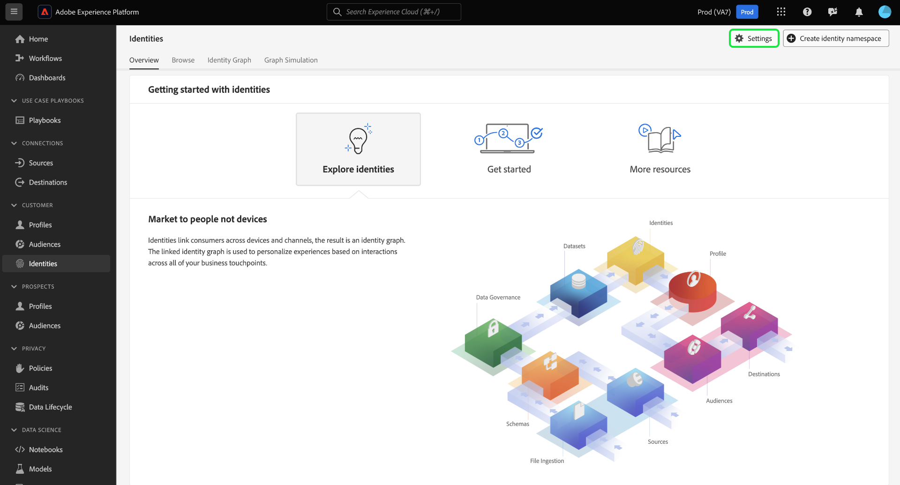

# Interface utilisateur des paramètres d’identité

>[!AVAILABILITY]
>
>Cette fonctionnalité n’est pas encore disponible ; le programme bêta pour les règles de liaison de graphiques d’identités devrait commencer en juillet sur les environnements de test de développement. Contactez votre équipe de compte d’Adobe pour plus d’informations sur les critères de participation.

Les paramètres d’identité sont une fonctionnalité de l’interface utilisateur du service Adobe Experience Platform Identity que vous pouvez utiliser pour désigner des espaces de noms uniques et configurer la priorité des espaces de noms.

Lisez ce guide pour savoir comment utiliser l’outil de paramètres d’identité.

## Prérequis

Lisez les documents suivants avant de commencer à utiliser les paramètres d’identité :

* [Algorithme d’optimisation des identités](./identity-optimization-algorithm.md)
* [Priorité d’espace de noms](./namespace-priority.md)
* [Simulation graphique](./graph-simulation.md)

## Configuration des paramètres d’identité

Pour accéder aux paramètres d’identité, accédez à l’espace de travail Identity Service dans l’interface utilisateur de Adobe Experience Platform, puis sélectionnez **[!UICONTROL Paramètres]**.

La page des paramètres d’identité s’affiche et vous recevez un message de confirmation vous rappelant de tester et de valider vos paramètres d’identité dans un environnement de test de développement avant d’avoir terminé les configurations dans un environnement de test de production.

La page des paramètres d’identité est divisée en deux sections : [!UICONTROL Espaces de noms de personne] et [!UICONTROL Espaces de noms d’appareil ou de cookie]. Les espaces de noms de personne sont des identifiants pour des individus uniques. Il peut s’agir d’identifiants multi-appareils, d’adresses électroniques et de numéros de téléphone. Les espaces de noms d’appareil ou de cookie sont des identifiants pour les appareils et les navigateurs web et ne peuvent pas avoir une priorité plus élevée que les espaces de noms de personne. Vous ne pouvez pas non plus désigner un espace de noms d’appareil ou de cookie comme espace de noms unique.

### Désigner votre espace de noms unique

Pour désigner un espace de noms unique, sélectionnez la variable [!UICONTROL Unique par graphique] correspondant à cet espace de noms. Vous pouvez sélectionner plusieurs espaces de noms uniques pour la configuration des paramètres d’identité.

Une fois vos espaces de noms uniques définis, les graphiques ne pourront plus avoir plusieurs identités contenant un espace de noms unique. Par exemple, si vous avez désigné Analytics Custom ID comme espace de noms unique, un graphique ne peut avoir qu’une seule identité avec l’espace de noms Analytics Custom ID. Pour plus d’informations, consultez la section [algorithme d’optimisation des identités - Aperçu](./identity-optimization-algorithm.md#unique-namespace).

### Configurer la priorité des espaces de noms

Pour configurer la priorité des espaces de noms, sélectionnez un espace de noms dans le menu des paramètres d’identité, puis faites glisser-le et déposez-le dans l’ordre de votre choix. Placez un espace de noms plus haut sur la liste pour lui donner une priorité plus élevée, et inversement, placez un espace de noms plus bas sur la liste pour lui donner une priorité plus faible. L’espace de noms ayant la priorité la plus élevée doit également être désigné comme un espace de noms unique.

Lorsque vous avez terminé vos configurations, sélectionnez **[!UICONTROL Suivant]**. Un message de confirmation s’affiche. Utilisez cette opportunité pour vérifier que vos configurations sont correctes, puis sélectionnez **[!UICONTROL Terminer]**.

Un avertissement s’affiche indiquant que vos nouveaux paramètres n’auront aucune incidence sur les liens existants dans un graphique d’identités et les fragments de profil d’événement d’expérience qui ont déjà été ingérés. Pour confirmer, saisissez le nom de votre environnement de test, puis sélectionnez **[!UICONTROL Confirmer]**.

