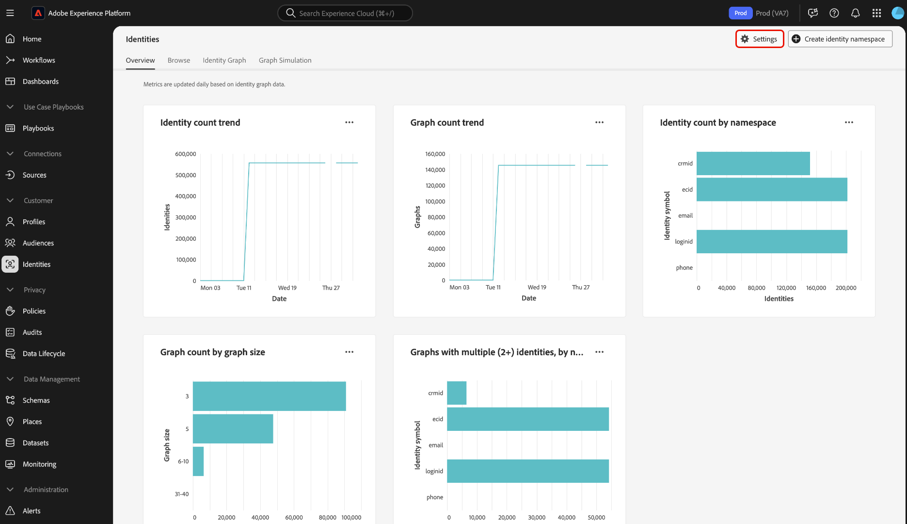
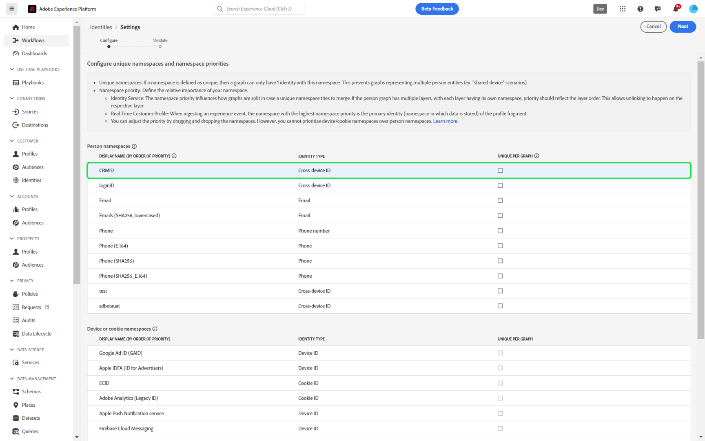
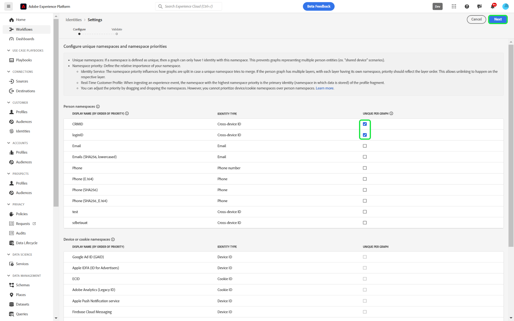
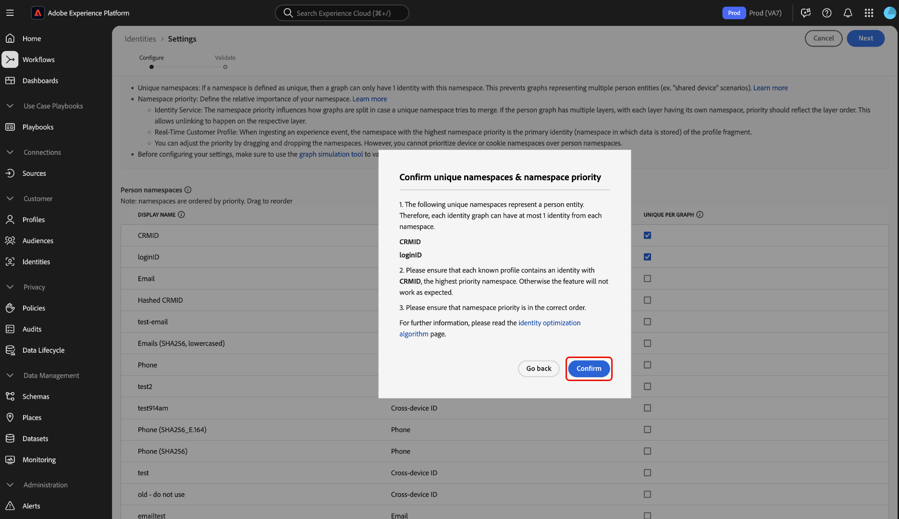
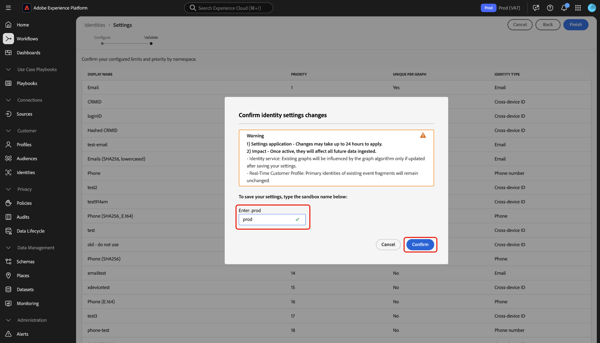

# Interface utilisateur des paramètres d’identité

>[!IMPORTANT]
>
>[!DNL Identity Graph Linking Rules] est désormais disponible pour toute la clientèle. Contactez l’équipe de votre compte Adobe ou l’assistance Adobe si vous disposez d’un sandbox existant qui nécessite que les graphiques réduits soient déréduits (« corrigés ») après l’activation des paramètres d’identité.

Les paramètres d’identité sont une fonctionnalité de l’interface utilisateur du service d’identités Adobe Experience Platform que vous pouvez utiliser pour désigner des espaces de noms uniques et configurer la priorité des espaces de noms.

Regardez la vidéo suivante pour plus d’informations sur l’utilisation de l’interface [!DNL Graph Simulation] dans l’espace de travail de l’interface utilisateur d’Identity Service :

>[!VIDEO](https://video.tv.adobe.com/v/3458487/?learn=on&enablevpops)

Lisez ce guide pour savoir comment configurer vos paramètres d’identité dans l’interface utilisateur.

## Conditions préalables

Lisez les documents suivants avant de commencer à utiliser les paramètres d’identité :

* [[!DNL Identity Graph Linking Rules]](./overview.md)
* [Algorithme d’optimisation des identités](./identity-optimization-algorithm.md)
* [Guide de mise en œuvre](./implementation-guide.md)
* [Exemples de configurations de graphes](./example-configurations.md)
* [Priorité d’espace de noms](./namespace-priority.md)
* [Simulation de graphique](./graph-simulation.md)

### Définition des autorisations {#set-permissions}

Ensuite, vous devez vous assurer que votre compte dispose des autorisations suivantes :

* **[!UICONTROL Afficher les paramètres d’identité]** : appliquez cette autorisation pour pouvoir afficher les espaces de noms uniques et la priorité des espaces de noms sur la page de navigation des espaces de noms d’identité.
* **[!UICONTROL Modifier les paramètres d’identité]** : appliquez cette autorisation pour pouvoir modifier et enregistrer vos paramètres d’identité.

Contactez votre administrateur si vous ne disposez pas de ces autorisations. Pour plus d’informations , consultez le [guide des autorisations](../../access-control/abac/ui/permissions.md).

## Configurer vos paramètres d’identité

Pour accéder aux paramètres d’identité, accédez à l’espace de travail Identity Service dans l’interface utilisateur de Adobe Experience Platform, puis sélectionnez **[!UICONTROL Paramètres]**.

La page des paramètres d’identité est divisée en deux sections : [!UICONTROL Espaces de noms de personne] et [!UICONTROL Espaces de noms d’appareil ou de cookie]. Les espaces de noms de personne sont des identifiants pour des individus uniques. Il peut s’agir d’identifiants entre appareils, d’adresses e-mail et de numéros de téléphone. Les espaces de noms d’appareil ou de cookie sont des identifiants d’appareils et de navigateurs web et ne peuvent pas recevoir une priorité supérieure aux espaces de noms de personne. Vous ne pouvez pas non plus désigner un appareil ou un espace de noms de cookie comme espace de noms unique.

### Configurer la priorité des espaces de noms

Pour configurer la priorité des espaces de noms, sélectionnez un espace de noms dans le menu Paramètres d’identité , puis faites glisser et déposez cet espace de noms dans l’ordre de votre choix. Placez un espace de noms plus haut sur la liste pour lui donner une priorité plus élevée, et inversement, placez un espace de noms plus bas sur la liste pour lui donner une priorité plus faible. L’espace de noms avec la priorité la plus élevée doit également être désigné comme espace de noms unique.

### Désigner votre espace de noms unique

Pour désigner un espace de noms unique, cochez la case [!UICONTROL Unique par graphique] qui correspond à cet espace de noms. Vous pouvez sélectionner **jusqu’à trois espaces de noms uniques** pour votre configuration de paramètres d’identité.

Une fois vos espaces de noms uniques établis, les graphiques ne pourront plus comporter plusieurs identités contenant un espace de noms unique. Par exemple, si vous avez désigné CRMID comme espace de noms unique, un graphique ne peut avoir qu’une seule identité avec l’espace de noms CRMID. Pour plus d’informations, consultez la présentation de l’algorithme [Identity Optimization](./identity-optimization-algorithm.md#unique-namespace).

Lorsque vous avez terminé vos configurations, sélectionnez **[!UICONTROL Suivant]** pour continuer.

À partir de là, vous devez confirmer les éléments suivants avant de passer à l’étape finale :

1. Espaces de noms uniques sélectionnés.
2. L’existence d’une identité avec l’espace de noms unique le plus prioritaire dans chaque profil connu.
3. Ordre de priorité de votre espace de noms.

### Confirmer vos paramètres {#confirm-your-settings}

>[!IMPORTANT]
>
>* La dernière étape consiste en un autre message de confirmation indiquant que les graphiques existants ne seront affectés par l’algorithme de graphique **uniquement si les graphiques sont mis à jour après l’enregistrement de vos paramètres** et que l’identité principale des fragments d’événement sur le profil client en temps réel ne sera pas mise à jour même après les modifications de la priorité de l’espace de noms.
>
>* Cela prendra jusqu’à **24 heures** pour que vos paramètres nouveaux ou mis à jour soient pris en compte. Pour confirmer, saisissez le nom de votre sandbox, puis sélectionnez **[!UICONTROL Confirmer]**.
>
>* Vos données ne seront pas modifiées tant que vous n’aurez pas enregistré vos paramètres d’identité.

## Étapes suivantes

Pour plus d’informations sur [!DNL Identity Graph Linking Rules], consultez la documentation suivante :

* [Vue d’ensemble d’[!DNL Identity Graph Linking Rules]](./overview.md)
* [Algorithme d’optimisation des identités](./identity-optimization-algorithm.md)
* [Guide de mise en œuvre](./implementation-guide.md)
* [Exemples de configurations de graphes](./example-configurations.md)
* [Résolution des problèmes et FAQ](./troubleshooting.md)
* [Priorité d’espace de noms](./namespace-priority.md)
* [Interface utilisateur de simulation de graphique](./graph-simulation.md)