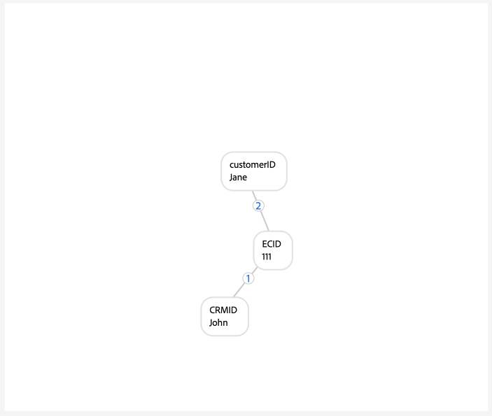

# Guide de mise en œuvre pour [!DNL Identity Graph Linking Rules]

>[!IMPORTANT]
>
>Ce document suppose que vous commencez votre implémentation dans un nouveau sandbox sans aucune donnée.

Lisez ce document pour obtenir un guide détaillé que vous pouvez suivre lors de l’implémentation de vos données avec Adobe Experience Platform Identity Service.

Esquisse détaillée :

1. [Remplir les conditions préalables à l’implémentation](#prerequisites-for-implementation)
2. [Créer les espaces de noms d’identité nécessaires](#namespace)
3. [Utilisez l’outil de simulation graphique pour vous familiariser avec l’algorithme d’optimisation des identités](#graph-simulation)
4. [Utilisez l’interface utilisateur des paramètres d’identité pour désigner vos espaces de noms uniques et configurer le classement des priorités de vos espaces de noms](#identity-settings)
5. [Créer un schéma de modèle de données d’expérience (XDM)](#schema)
6. [Créer un jeu de données](#dataset)
7. [Ingestion de données dans Experience Platform](#ingest)

## Conditions préalables à la mise en œuvre {#prerequisites-for-implementation}

Cette section décrit les étapes préalables à suivre avant d’implémenter des [!DNL Identity Graph Linking Rules] à vos données .

### Espace de noms unique

#### Espace de noms requis pour une seule personne {#single-person-namespace-requirement}

Vous devez vous assurer que l’espace de noms unique avec la priorité la plus élevée est toujours présent dans chaque profil connu. Cela permet au service d’identités de détecter l’identifiant de personne approprié dans un graphique donné.

+++Sélectionner pour afficher un exemple de graphique sans espace de noms d’identifiant de personne unique

En l’absence d’espace de noms unique pour représenter vos identifiants de personne, vous pouvez vous retrouver avec un graphique qui lie des identifiants de personne disparates au même ECID. Dans cet exemple, B2BCRM et B2CCRM sont tous deux liés au même ECID en même temps. Ce graphique suggère que Tom, à l’aide de son compte de connexion B2C, a partagé un appareil avec Summer, en utilisant son compte de connexion B2B. Cependant, le système reconnaîtra qu’il s’agit d’un profil (réduction du graphique).

{zoomable="yes"}

+++

+++Sélectionner pour afficher un exemple de graphique avec un espace de noms d’identifiant de personne unique

Avec un espace de noms unique (dans ce cas, un CRMID au lieu de deux espaces de noms disparates), Identity Service peut identifier le dernier identifiant de personne associé à l’ECID. Dans cet exemple, en raison de l’existence d’un CRMID unique, Identity Service peut reconnaître un scénario « appareil partagé », où deux entités partagent le même appareil.

{zoomable="yes"}

+++

### Configuration de la priorité des espaces de noms

Si vous utilisez le [connecteur source Adobe Analytics](../../sources/tutorials/ui/create/adobe-applications/analytics.md) pour ingérer des données, vous devez accorder à vos ECID une priorité supérieure à celle de l’Adobe Analytics ID (AAID), car le service d’identités bloque l’AAID. En donnant la priorité à l’ECID, vous pouvez demander au profil client en temps réel de stocker les événements non authentifiés dans l’ECID plutôt que dans l’AAID.

### Événement d’expérience XDM {#xdm-experience-events}

>[!CONTEXTUALHELP]
>id="platform_identities_linkingrules_xdm"
>title="Assurez-vous de disposer d’un identifiant de personne unique."
>abstract="Pendant votre processus de pré-implémentation, vous devez vous assurer que les événements authentifiés que votre système enverra à Experience Platform contiennent toujours un identifiant de personne **unique**, tel qu’un CRMID."

Pendant votre processus de pré-implémentation, vous devez vous assurer que les événements authentifiés que votre système enverra à Experience Platform contiennent toujours un identifiant de personne **unique**, tel qu’un CRMID.

* (Recommandé) Événements authentifiés avec un identifiant de personne unique.
* (Non recommandé) Événements authentifiés avec deux identifiants de personne uniques. Si vous disposez de plusieurs identifiants de personne uniques, vous pouvez rencontrer une réduction indésirable du graphique.
* (Non recommandé) Événements authentifiés sans identifiants de personne uniques. Si vous ne disposez d’aucun identifiant de personne unique, les événements authentifiés et non authentifiés seront stockés par rapport à l’ECID.

>[!BEGINTABS]

>[!TAB Événements authentifiés avec un identifiant de personne]

```json
{
  "_id": "test_id",
  "identityMap": {
      "ECID": [
          {
              "id": "62486695051193343923965772747993477018",
              "primary": false
          }
      ],
      "CRMID": [
          {
              "id": "John",
              "primary": true
          }
      ]
  },
  "timestamp": "2024-09-24T15:02:32+00:00",
  "web": {
      "webPageDetails": {
          "URL": "https://business.adobe.com/",
          "name": "Adobe Business"
      }
  }
}
```

>[!TAB Événements authentifiés avec deux identifiants de personne]

Si votre système envoie deux identifiants de personne, l’implémentation peut échouer à l’exigence d’espace de noms de personne unique. Par exemple, si identityMap dans votre implémentation webSDK contient un CRMID, un customerID et un espace de noms ECID, rien ne garantit que chaque événement contiendra à la fois CRMID et customerID.

Vous ne devez **pas** envoyer une payload comme ci-dessous :

```json
{
  "_id": "test_id",
  "identityMap": {
      "ECID": [
          {
              "id": "62486695051193343923965772747993477018",
              "primary": false
          }
      ],
      "CRMID": [
          {
              "id": "John",
              "primary": true
          }
      ],
      "customerID": [
          {
            "id": "Jane",
            "primary": false
          }
      ],
  },
  "timestamp": "2024-09-24T15:02:32+00:00",
  "web": {
      "webPageDetails": {
          "URL": "https://business.adobe.com/",
          "name": "Adobe Business"
      }
  }
}
```

Cependant, il est important de noter que si vous pouvez envoyer deux identifiants de personne, il n’existe aucune garantie qu’une réduction indésirable du graphique sera évitée en raison d’erreurs d’implémentation ou de données. Considérez le scénario suivant :

* `timestamp1` = John se connecte -> le système capture les `CRMID: John, ECID: 111`. Toutefois, `customerID: John` n’est pas présent dans ce payload d’événement.
* `timestamp2` = Jane se connecte -> le système capture les `customerID: Jane, ECID: 111`. Toutefois, `CRMID: Jane` n’est pas présent dans ce payload d’événement.

Par conséquent, il est recommandé d’envoyer un seul identifiant de personne avec vos événements authentifiés.

Dans la simulation de graphique, cette ingestion peut se présenter comme suit :

{zoomable="yes"}

>[!TAB Événements authentifiés sans identifiant de personne]

Dans cet exemple, vous pouvez supposer que l’événement suivant a été envoyé à Experience Platform pendant que John (l’utilisateur final) parcourait votre site web lors de l’authentification. Cependant, bien qu’authentifié, Experience Platform ne peut pas identifier John en raison de l’absence d’identifiants de personne dans l’événement. Par conséquent, cet événement est interprété comme un utilisateur anonyme naviguant sur le site Web d’Adobe Business, au lieu de le reconnaître comme une activité en ligne associée spécifiquement à John.

```json
{
    "_id": "test_id",
    "identityMap": {
        "ECID": [
            {
                "id": "62486695051193343923965772747993477018",
                "primary": false
            }
        ]
    },
    "timestamp": "2024-09-24T15:02:32+00:00",
    "web": {
        "webPageDetails": {
            "URL": "https://business.adobe.com/",
            "name": "Adobe Business"
        }
    }
}
```

>[!ENDTABS]

## Définition des autorisations {#set-permissions}

La première étape du processus de mise en œuvre d’Identity Service consiste à ajouter votre compte Experience Platform à un rôle doté des autorisations nécessaires. Votre administrateur peut configurer les autorisations de votre compte en accédant à l’interface utilisateur Autorisations dans Adobe Experience Cloud. À partir de là, votre compte doit être ajouté à un rôle avec les autorisations suivantes :

* [!UICONTROL Afficher les paramètres d’identité] : appliquez cette autorisation pour pouvoir afficher les espaces de noms uniques et la priorité des espaces de noms sur la page de navigation des espaces de noms d’identité.
* [!UICONTROL Modifier les paramètres d’identité] : appliquez cette autorisation pour pouvoir modifier et enregistrer vos paramètres d’identité.

Pour plus d’informations sur les autorisations, consultez le [guide des autorisations](../../access-control/abac/ui/permissions.md).

## Création d’espaces de noms d’identité {#namespace}

Si vos données le nécessitent, vous devez d’abord créer les espaces de noms appropriés pour votre organisation. Pour savoir comment créer un espace de noms personnalisé, consultez le guide sur la [création d’un espace de noms personnalisé dans l’interface utilisateur](../features/namespaces.md#create-custom-namespaces).

## Utilisation de l’outil de simulation graphique {#graph-simulation}

Accédez ensuite à l’[outil de simulation graphique](./graph-simulation.md) dans l’espace de travail de l’interface utilisateur d’Identity Service. Vous pouvez utiliser l’outil de simulation de graphiques pour simuler des graphiques d’identités, créés avec différentes configurations de priorité d’espace de noms et d’espace de noms uniques.

En créant différentes configurations, vous pouvez utiliser l’outil de simulation de graphique pour découvrir et mieux comprendre comment l’algorithme d’optimisation des identités et certaines configurations peuvent affecter le comportement de votre graphique.

## Configurer les paramètres d’identité {#identity-settings}

Une fois que vous avez une meilleure idée du comportement de votre graphique, accédez à l’[interface utilisateur des paramètres d’identité](./identity-settings-ui.md) dans l’espace de travail de l’interface utilisateur d’Identity Service. Pour accéder à l’interface utilisateur des paramètres d’identité, sélectionnez **[!UICONTROL Identités]** dans le volet de navigation de gauche, puis sélectionnez **[!UICONTROL Paramètres]**.

{zoomable="yes"}

Utilisez l’interface utilisateur des paramètres d’identité pour désigner vos espaces de noms uniques et configurer vos espaces de noms par ordre de priorité. Une fois l’application de vos paramètres terminée, vous devez attendre au moins six heures avant de pouvoir procéder à l’ingestion des données, car la prise en compte des nouveaux paramètres dans Identity Service prend au moins six heures.

Pour plus d’informations, consultez le [guide de l’interface utilisateur des paramètres d’identité](./identity-settings-ui.md).

## Créer un schéma XDM {#schema}

Une fois vos espaces de noms et priorités d’espace de noms uniques établis, vous pouvez procéder à la configuration requise pour ingérer vos données. Tout d’abord, vous devez créer un schéma XDM. Selon vos données, vous devrez peut-être créer un schéma pour XDM Individual Profile et XDM ExperienceEvent.

Pour ingérer des données dans le profil client en temps réel, vous devez vous assurer que votre schéma contient au moins un champ qui a été désigné comme identité principale. En définissant une identité principale, vous pouvez activer un schéma donné pour l’ingestion de profils.

Pour obtenir des instructions sur la création d’un schéma, consultez le guide sur la [création d’un schéma XDM dans l’interface utilisateur](../../xdm/tutorials/create-schema-ui.md).

## Créer un jeu de données {#dataset}

Créez ensuite un jeu de données afin de fournir une structure pour les données que vous allez ingérer. Un jeu de données est une structure de stockage et de gestion pour une collection de données, généralement sous la forme d’un tableau, qui contient un schéma (des colonnes) et des champs (des lignes). Les jeux de données fonctionnent en tandem avec les schémas. Pour ingérer des données dans le profil client en temps réel, votre jeu de données doit être activé pour l’ingestion de profil. Pour que votre jeu de données soit activé pour Profil, il doit référencer un schéma activé pour Ingestion de profil.

Pour plus d’informations sur la création d’un jeu de données, consultez le [guide de l’interface utilisateur des jeux de données](../../catalog/datasets/user-guide.md).

## Ingestion des données {#ingest}

À ce stade, vous devriez disposer des éléments suivants :

* Les autorisations nécessaires pour accéder aux fonctionnalités du service d’identités.
* Espaces de noms pour vos données.
* Espaces de noms uniques désignés et priorités configurées pour vos espaces de noms.
* Au moins un schéma XDM. (Selon vos données et votre cas d’utilisation spécifique, vous devrez peut-être créer des schémas de profil et d’événement d’expérience.)
* Un jeu de données basé sur votre schéma.

Une fois que vous disposez de tous les éléments répertoriés ci-dessus, vous pouvez commencer à ingérer vos données dans Experience Platform. Vous pouvez effectuer l’ingestion des données de plusieurs manières différentes. Vous pouvez utiliser les services suivants pour importer vos données dans Experience Platform :

* [Ingestion par lots et par flux](../../ingestion/home.md)
* [Collecte de données dans Experience Platform](../../collection/home.md)
* [Sources Experience Platform](../../sources/home.md)

>[!TIP]
>
>Une fois vos données ingérées, la payload de données brutes XDM ne change pas. Il se peut que vos configurations d’identité principale s’affichent toujours dans l’interface utilisateur. Toutefois, ces configurations seront remplacées par les paramètres d’identité.

Pour tout commentaire, utilisez l’option **[!UICONTROL Commentaires Beta]** dans l’espace de travail de l’interface utilisateur d’Identity Service.

## Validation des graphiques {#validate}

Utilisez le tableau de bord des identités pour obtenir des informations sur l’état de vos graphiques d’identités, tels que le nombre d’identités global et les tendances de nombre de graphiques, le nombre d’identités par espace de noms et le nombre de graphiques par taille de graphique. Vous pouvez également utiliser le tableau de bord des identités pour afficher les tendances sur les graphiques comportant plusieurs identités, organisées par espace de noms.

Sélectionnez les points de suspension (`...`), puis sélectionnez **[!UICONTROL Afficher plus]** pour obtenir plus d’informations et vérifier qu’il n’existe aucun graphique réduit.

{zoomable="yes"}

Utilisez la fenêtre qui s’affiche pour afficher des informations sur les graphiques réduits. Dans cet exemple, e-mail et téléphone sont marqués comme espace de noms unique. Par conséquent, votre sandbox ne contient aucun graphique réduit.

{zoomable="yes"}

## Annexe {#appendix}

Lisez cette section pour obtenir des informations supplémentaires auxquelles vous pouvez vous référer lors de l’implémentation de vos paramètres d’identité et espaces de noms uniques.

### Scénario loginID de perte {#dangling-loginid-scenario}

Le graphique suivant simule un scénario d’identifiant de connexion « non résolu ». Dans cet exemple, deux identifiants de connexion différents sont liés au même ECID. Cependant, `{loginID: ID_C}` n’est pas lié au CRMID. Par conséquent, Identity Service ne peut en aucun cas détecter que ces deux ID de connexion représentent deux entités différentes.

>[!BEGINTABS]

>[!TAB loginID ambigu]

Dans cet exemple, `{loginID: ID_C}` est laissé en attente et n’est pas lié à un CRMID. Par conséquent, l’entité de personne à laquelle cet ID de connexion doit être associé reste ambiguë.

{zoomable="yes"}

>[!TAB loginID est lié à un CRMID]

Dans cet exemple, `{loginID: ID_C}` est lié à `{CRMID: Tom}`. Par conséquent, le système peut identifier que cet ID de connexion est associé à Tom.

{zoomable="yes"}

>[!TAB loginID est lié à un autre CRMID]

Dans cet exemple, `{loginID: ID_C}` est lié à `{CRMID: Summer}`. Par conséquent, le système peut identifier que cet ID de connexion est associé à une autre entité de personne, dans ce cas, Summer.

Cet exemple montre également que Tom et Summer sont deux entités de personne disparates qui partagent un appareil, représenté par `{ECID: 111}`.

{zoomable="yes"}

>[!ENDTABS]

## Étapes suivantes

Pour plus d’informations sur [!DNL Identity Graph Linking Rules], consultez la documentation suivante :

* [Vue d’ensemble d’[!DNL Identity Graph Linking Rules]](./overview.md)
* [Algorithme d’optimisation des identités](./identity-optimization-algorithm.md)
* [Exemples de configurations de graphes](./example-configurations.md)
* [Résolution des problèmes et FAQ](./troubleshooting.md)
* [Priorité d’espace de noms](./namespace-priority.md)
* [Interface utilisateur de simulation de graphique](./graph-simulation.md)
* [Interface utilisateur des paramètres d’identité](./identity-settings-ui.md)
