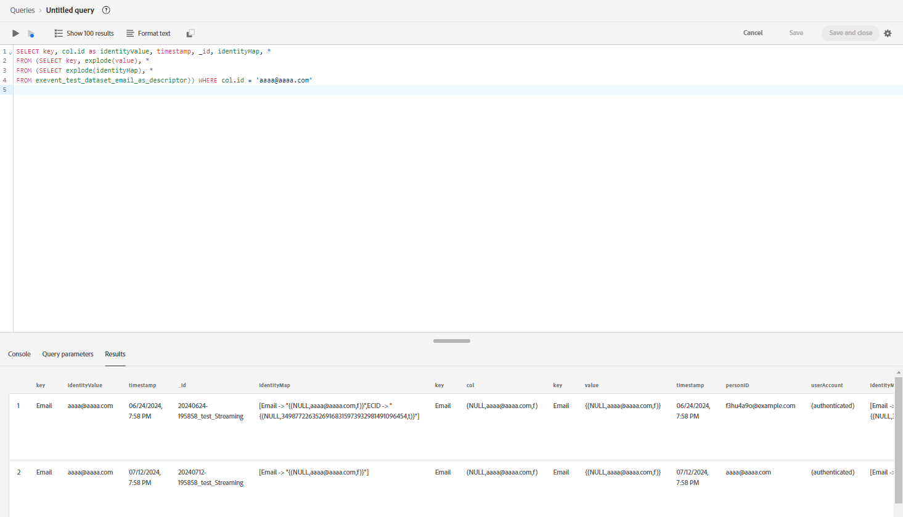

# Guide de dépannage pour [!DNL Identity Graph Linking Rules]

Lorsque vous testez et validez des [!DNL Identity Graph Linking Rules], vous pouvez rencontrer des problèmes liés à l’ingestion des données et au comportement du graphique. Lisez ce document pour savoir comment résoudre certains problèmes courants que vous pouvez rencontrer lorsque vous utilisez [!DNL Identity Graph Linking Rules].

## Présentation du flux d’ingestion de données {#data-ingestion-flow-overview}

Le diagramme suivant est une représentation simplifiée du flux de données dans Adobe Experience Platform et les applications. Utilisez ce diagramme comme référence pour vous aider à mieux comprendre le contenu de cette page.


Il est important de noter les facteurs suivants :

* Pour les données en flux continu, le profil client en temps réel, le service d’identités et le lac de données commenceront à traiter les données lorsque celles-ci seront envoyées. Cependant, la latence pour terminer le traitement des données dépend du service. En règle générale, le traitement du lac de données prend plus de temps que le traitement du profil et de l’identité.
   * Si les données n’apparaissent pas lors de l’exécution d’une requête sur un jeu de données même après quelques heures, il est probable que les données n’aient pas été ingérées dans Experience Platform.
* Pour les données par lots, toutes les données seront d’abord transmises au lac de données, puis les données seront propagées au profil et à l’identité si le jeu de données est activé pour le profil et l’identité.
* Pour les problèmes liés à l’ingestion, il est important que le problème soit isolé au niveau du service pour un débogage et un dépannage précis. Il existe trois types de problèmes potentiels à prendre en compte :

| Type de problème d’ingestion | Les données sont-elles ingérées dans le lac de données ? | Les données sont-elles ingérées dans Profile ? | Les données sont-elles ingérées dans Identity Service ? |
| --- | --- | --- | --- |
| Problème général d’ingestion | Non | Non | Non |
| Problème de graphique | Oui | Oui | Non |
| Problème de fragment de profil | Oui | Non | Oui |

## Problèmes d’ingestion de données {#data-ingestion-issues}

>[!NOTE]
>
>* Cette section suppose que les données ont bien été ingérées dans le lac de données et qu’il n’y a pas eu de syntaxe ou d’autres erreurs qui auraient empêché l’ingestion des données dans Experience Platform en premier lieu.
>
>* Les exemples utilisent ECID comme espace de noms de cookie et CRMID comme espace de noms de personne.

### Mes identités ne sont pas ingérées dans Identity Service{#my-identities-are-not-getting-ingested-into-identity-service}

Il existe différentes raisons pour lesquelles cela peut se produire, notamment, mais sans s’y limiter :

* [Le jeu de données n’est pas activé pour Profil](../../catalog/datasets/enable-for-profile.md).
* L’enregistrement est ignoré car il n’y a qu’une seule identité dans l’événement.
* [Un échec de validation s’est produit dans Identity Service](../guardrails.md#identity-value-validation).
   * Par exemple, un ECID peut avoir dépassé la longueur maximale de 38 caractères.
* Par défaut, les [ AAID sont bloqués lors de l’ingestion](../guardrails.md#identity-namespace-ingestion).
* L’identité est supprimée en raison des [ mécanismes de sécurisation système ](../guardrails.md#understanding-the-deletion-logic-when-an-identity-graph-at-capacity-is-updated).

Dans le contexte de [!DNL Identity Graph Linking Rules], un enregistrement peut être rejeté du Service d’identités car l’événement entrant comporte plusieurs identités avec le même espace de noms unique mais une valeur d’identité différente. Ce scénario se produit généralement en raison d’erreurs d’implémentation.

Tenez compte de l’événement suivant avec deux hypothèses :

1. Le nom du champ CRMID est marqué comme une identité avec l’espace de noms CRMID.
2. L’espace de noms CRMID est défini comme un espace de noms unique.

L’événement suivant renvoie un message d’erreur indiquant que l’ingestion a échoué.

<!-- because the ingestion of this erroneous event would have resulted in graph collapse. In the following event, two entities (Alice and Bob) are both associated with the same namespace (CRMID). -->

```json
{ 
  "_id": "random_string", 
  "eventType": "web browsing event", 
  "identityMap": { 
    "ECID": [ 
      { 
        "id": "11111111111111111111111111111111111111", 
        "primary": false 
      } 
    ], 
    "CRMID": [ 
      { 
        "id": "Alice", 
        "primary": true 
      } 
    ] 
  }, 
  "CRMID": "Bob", 
  "timestamp": "2024-08-17T15:22:51+00:00", 
  "web": { 
    "webPageDetails": { 
      "URL": "https://www.adobe.com/acrobat.html", 
      "name": "Adobe Acrobat" 
    } 
  } 
} 
```

**Étapes de dépannage**

Pour résoudre cette erreur, vous devez d’abord collecter les informations suivantes :

* Valeur d’identité (`identity_value`) qui devait être ingérée dans le graphique d’identité.
* Jeu de données (`dataset_name`) dans lequel l’événement a été envoyé.

Ensuite, utilisez [Adobe Experience Platform Query Service](../../query-service/home.md) et exécutez la requête suivante :

>[!TIP]
>
>Remplacez `dataset_name` et `identity_value` par les informations que vous avez collectées.

```sql
  SELECT key, col.id as identityValue, timestamp, _id, identityMap, * 
  FROM (SELECT key, explode(value), * 
  FROM (SELECT explode(identityMap), * 
  FROM dataset_name)) WHERE col.id = 'identity_value' 
```

Après avoir exécuté votre requête, recherchez l’enregistrement d’événement qui devait générer un graphique, puis vérifiez que les valeurs d’identité sont différentes dans la même ligne. Consultez l’image suivante à titre d’exemple :



>[!NOTE]
>
>Si les deux identités sont exactement identiques et si l’événement est ingéré par le biais du streaming, alors l’identité et le profil dédupliquent tous deux l’identité.

### Les événements d’expérience post-authentification sont attribués à un profil authentifié incorrect

La priorité des espaces de noms joue un rôle important dans la manière dont les fragments d’événement déterminent l’identité principale.

* Une fois que vous avez configuré et enregistré vos [paramètres d’identité](./identity-settings-ui.md) pour un sandbox donné, Profile utilise alors [priorité de l’espace de noms](namespace-priority.md#real-time-customer-profile-primary-identity-determination-for-experience-events) pour déterminer l’identité principale. Dans le cas d’identityMap, Profile n’utilisera alors plus l’indicateur `primary=true`.
* Bien que Profile ne fasse plus référence à cet indicateur, d’autres services sur Experience Platform peuvent continuer à utiliser l’indicateur `primary=true`.

Pour que les [événements utilisateur authentifiés](implementation-guide.md#ingest-your-data) soient liés à l’espace de noms de personne, tous les événements authentifiés doivent contenir l’espace de noms de personne (CRMID). Cela signifie que même après la connexion d’un utilisateur, l’espace de noms de personne doit toujours être présent sur chaque événement authentifié.

Vous pouvez continuer à voir `primary=true` indicateur « événements » lors de la recherche d’un profil dans la visionneuse de profils. Toutefois, cette valeur est ignorée et ne sera pas utilisée par le profil.

Les AAID sont bloqués par défaut. Par conséquent, si vous utilisez le connecteur source [Adobe Analytics](../../sources/tutorials/ui/create/adobe-applications/analytics.md), vous devez vous assurer que l’ECID a une priorité supérieure à l’ECID afin que les événements non authentifiés aient une identité principale d’ECID.

**Étapes de dépannage**

1. Pour vérifier que les événements authentifiés contiennent à la fois l’espace de noms de personne et de cookie, lisez les étapes décrites dans la section sur la [résolution des erreurs concernant les données qui ne sont pas ingérées dans Identity Service](#my-identities-are-not-getting-ingested-into-identity-service).
2. Pour vérifier que les événements authentifiés possèdent l’identité principale de l’espace de noms de personne (par exemple, CRMID), recherchez l’espace de noms de personne dans la visionneuse de profils à l’aide de la politique de fusion sans assemblage (il s’agit de la politique de fusion qui n’utilise pas de graphique privé). Cette recherche renvoie uniquement les événements associés à l’espace de noms de personne.

### Les fragments d’événement d’expérience ne sont pas ingérés dans le profil {#my-experience-event-fragments-are-not-getting-ingested-into-profile}

Plusieurs raisons expliquent pourquoi vos fragments d’événement d’expérience ne sont pas ingérés dans Profile, notamment, mais sans s’y limiter :

* [Le jeu de données n’est pas activé pour Profil](../../catalog/datasets/enable-for-profile.md).
* [Un échec de validation peut s’être produit sur le profil](../../xdm/classes/experienceevent.md).
   * Par exemple, un événement d’expérience doit contenir à la fois un `_id` et un `timestamp`.
   * En outre, la `_id` doit être unique pour chaque événement (enregistrement).

Dans le contexte de la priorité d’espace de noms, Profile rejettera tout événement contenant plusieurs identités avec la priorité d’espace de noms la plus élevée. Par exemple, si GAID n’est pas marqué comme un espace de noms unique et que deux identités avec un espace de noms GAID et des valeurs d’identité différentes sont entrées, Profile ne stocke aucun événement.

**Étapes de dépannage**

Si vos données sont envoyées au lac de données, mais pas à Profile, et que vous pensez que cela est dû à l’envoi de deux identités ou plus avec la priorité d’espace de noms la plus élevée dans un seul événement, vous pouvez exécuter la requête suivante pour vérifier que deux valeurs d’identité différentes sont envoyées vers le même espace de noms :

>[!TIP]
>
>Dans les requêtes suivantes, vous devez :
>
>* Remplacez `_testimsorg.identification.core.email` par le chemin d’accès qui envoie l’identité.
>* Remplacez `Email` par l’espace de noms avec la priorité la plus élevée. Il s’agit du même espace de noms qui n’est pas ingéré.
>* Remplacez `dataset_name` par le jeu de données sur lequel vous souhaitez effectuer une requête.

```sql
  SELECT identityMap, key, col.id as identityValue, _testimsorg.identification.core.email, _id, timestamp 
  FROM (SELECT key, explode(value), * 
  FROM (SELECT explode(identityMap), * 
  FROM dataset_name)) WHERE col.id != _testimsorg.identification.core.email and key = 'Email' 
```

Cette requête suppose que :

* Une identité est envoyée à partir de l’identityMap et une autre identité est envoyée à partir d’un descripteur d’identité. **REMARQUE** : dans les schémas de modèle de données d’expérience (XDM), le descripteur d’identité est le champ marqué comme une identité.
* Le CRMID est envoyé via identityMap. Si le CRMID est envoyé en tant que champ, supprimez le `key='Email'` de la clause WHERE.

>[!NOTE]
>
>**Concernant l’implémentation de WebSDK et la duplication d’ECID** : si le champ ECID est marqué comme une identité (descripteur d’identité) au lieu de l’identityMap, un second ECID est généré dans l’identityMap. Cette duplication peut empêcher le profil client en temps réel de stocker des événements anonymes en raison de la présence de deux ECID dans un seul événement.

## Problèmes liés au comportement du graphique {#graph-behavior-related-issues}

Cette section décrit les problèmes courants que vous pouvez rencontrer concernant le comportement du graphique d’identités.

### Les événements d’expérience non authentifiés sont associés à un profil authentifié incorrect

L’algorithme d’optimisation des identités honore [les liens les plus récemment établis et supprime les liens les plus anciens](./identity-optimization-algorithm.md#identity-optimization-algorithm-details). Par conséquent, il est possible qu’une fois cette fonctionnalité activée, les ECID puissent être réaffectés (re-liés) d’une personne à une autre. Pour comprendre l’historique des liens d’une identité au fil du temps, procédez comme suit :

**Étapes de dépannage**

>[!NOTE]
>
>Les étapes suivantes récupèrent des informations selon les hypothèses suivantes :
>
>* Un seul jeu de données est en cours d’utilisation (cela n’interrogera pas plusieurs jeux de données).
>
>* Les données ne sont pas supprimées du lac de données en raison d’une suppression par [Gestion avancée du cycle de vie des données](../../hygiene/home.md), [Privacy Service](../../privacy-service/home.md) ou d’autres services procédant à la suppression.

Tout d’abord, vous devez collecter les informations suivantes :

1. Le symbole d’identité (namespaceCode) de l’espace de noms du cookie (par exemple ECID) et de l’espace de noms de la personne (par exemple CRMID) qui ont été envoyés.
1.1. Pour les implémentations de Web SDK, il s’agit généralement des espaces de noms inclus dans le mappage d’identité.
1.2. Pour les implémentations du connecteur source Analytics, il s’agit de l’identifiant de cookie inclus dans l’identityMap. L’identifiant de personne est un champ eVar marqué comme une identité.
2. Jeu de données dans lequel l’événement a été envoyé (dataset_name).
3. Valeur d’identité de l’espace de noms de cookie à rechercher (identity_value).

Les symboles d’identité (namespaceCode) respectent la casse. Pour récupérer tous les symboles d’identité d’un jeu de données donné dans identityMap, exécutez la requête suivante :

```sql
SELECT distinct explode(*)FROM (SELECT map_keys(identityMap) FROM dataset_name)
```

Si vous ne connaissez pas la valeur d’identité de votre identifiant de cookie et que vous souhaitez rechercher un identifiant de cookie qui aurait été lié à plusieurs identifiants de personne, vous devez exécuter la requête suivante. Cette requête suppose que ECID est l’espace de noms du cookie et CRMID l’espace de noms de la personne.

>[!BEGINTABS]

>[!TAB Implémentation de Web SDK]

```sql
  SELECT identityMap['ECID'][0]['id'], count(distinct identityMap['CRMID'][0]['id']) as crmidCount FROM dataset_name GROUP BY identityMap['ECID'][0]['id'] ORDER BY crmidCount desc 
```

>[!TAB Implémentation du connecteur source Analytics]

```sql
  SELECT identityMap['ECID'][0]['id'], count(distinct personID) as crmidCount FROM dataset_name group by identityMap['ECID'][0]['id'] ORDER BY crmidCount desc 
```

**Remarque :** personID fait référence au chemin d’accès du descripteur. Ces informations se trouvent sous les schémas.

>[!ENDTABS]

Maintenant que vous avez identifié les valeurs de cookie liées à plusieurs ID de personne, obtenez un des résultats et utilisez-le dans la requête suivante pour obtenir une vue chronologique du moment où cette valeur de cookie a été liée à un autre identifiant de personne :

>[!BEGINTABS]

>[!TAB Implémentation de Web SDK]

```sql
  SELECT identityMap['CRMID'][0]['id'] as personEntity, * 
  FROM dataset_name 
  WHERE identitymap['ECID'][0].id ='identity_value' 
  ORDER BY timestamp desc 
```

>[!TAB Implémentation du connecteur source Analytics]

```sql
SELECT _experience.analytics.customDimensions.eVars.eVar10 as personEntity, * 
FROM dataset_name 
WHERE identitymap['ECID'][0].id ='identity_value' 
ORDER BY timestamp desc 
```

**Remarque** : cet exemple suppose que `eVar10` est marqué comme une identité. Pour vos configurations, vous devez modifier l’eVar en fonction de la mise en œuvre de votre propre organisation.

>[!ENDTABS]

### L’algorithme d’optimisation des identités ne « fonctionne » pas comme prévu

**Étapes de dépannage**

Reportez-vous à la documentation relative à l’[algorithme d’optimisation des identités](./identity-optimization-algorithm.md), ainsi qu’aux types de structures graphiques pris en charge.

* Lisez le [guide de configuration des graphiques](./example-configurations.md) pour obtenir des exemples de structures de graphique prises en charge.
* Vous pouvez également lire le [guide d’implémentation](./implementation-guide.md#appendix) pour obtenir des exemples de structures de graphique non prises en charge. Deux scénarios peuvent se produire :
   * Aucun espace de noms unique sur tous vos profils.
   * Un scénario [ « ID non résolu »](./implementation-guide.md#dangling-loginid-scenario) se produit. Dans ce scénario, Identity Service ne peut pas déterminer si l’ID suspendu est associé à l’une des entités de personne dans les graphiques.

Vous pouvez également utiliser l’outil de simulation [graphique dans l’interface utilisateur](./graph-simulation.md) pour simuler des événements et configurer vos propres paramètres de priorité d’espace de noms et d’espace de noms uniques. Cela peut vous aider à comprendre les bases du comportement de l’algorithme d’optimisation des identités.

Si les résultats de la simulation correspondent aux attentes en matière de comportement du graphique, vous pouvez vérifier si les [ paramètres d’identité ](./identity-settings-ui.md) correspondent aux paramètres que vous avez configurés dans la simulation.

### Même après la configuration des paramètres d’identité, je vois toujours des graphiques réduits dans mon sandbox

Les graphiques d’identités adhèrent à l’espace de noms unique et à la priorité d’espace de noms configurés _après_ l’enregistrement des paramètres. Les graphiques « réduits » qui existent _avant_ vous enregistrez vos nouveaux paramètres ne seront pas affectés, jusqu’à ce que de nouvelles données soient ingérées et que le graphique réduit soit mis à jour. L’identité principale des fragments d’événement sur le profil client en temps réel ne sera pas mise à jour même après les modifications de la priorité de l’espace de noms.

**Étapes de dépannage**

Vous pouvez utiliser la [visionneuse de graphiques d’identité](../features/identity-graph-viewer.md) pour vérifier si votre graphique a été ingéré avant ou après vos paramètres. Consultez la date et l’heure de la dernière mise à jour sous [!UICONTROL Propriétés du lien] pour savoir quand Identity Service a ingéré le graphique. Si la date et l’heure sont antérieures à la configuration, cela suggère que le graphique « réduit » a été créé avant l’activation de la fonctionnalité.


### Je souhaite savoir combien de graphiques « réduits » existent dans mon sandbox

Utilisez le tableau de bord des identités pour obtenir des informations sur l’état de votre graphique d’identités, comme le nombre d’identités et de graphiques. Reportez-vous à la mesure « Nombre de graphiques avec plusieurs espaces de noms » pour un nombre de graphiques réduits. Il s’agit de graphiques contenant plusieurs identités avec le même espace de noms. En supposant que le sandbox ne contienne aucune donnée et que vous ayez configuré un espace de noms (par exemple CRMID) pour qu’il soit unique, il est attendu qu’il n’y ait aucun graphique avec deux CRMID ou plus. Dans l’exemple ci-dessous, deux graphiques contiennent plusieurs adresses e-mail.


Vous trouverez une répartition détaillée dans le [jeu de données d’exportation d’instantané de profil](../../dashboards/query.md) dans le lac de données en exécutant la requête ci-dessous :

>[!NOTE]
>
>* Remplacez `dataset_name` par le nom réel de votre jeu de données.
>
>* Les nombres peuvent ne pas correspondre exactement. Le tableau de bord des identités est basé sur le nombre de graphiques d’identités et la requête suivante est basée sur le nombre de profils avec deux identités ou plus. Les données sont traitées et mises à jour indépendamment par le service.

```sql
  SELECT key, identityCountInGraph, count(identityCountInGraph) as graphCount 
  FROM (SELECT key, cardinality(value) as identityCountInGraph 
  FROM (SELECT explode(identityMap) 
  FROM dataset_name 
  WHERE cardinality(identityMap) > 1)) /* by definition, graphs have 2 or more identities */ 
  WHERE key not in ('ecid', 'aaid', 'idfa', 'gaid') /* filter out common device/cookie namespaces */ 
  GROUP BY 1, 2 
  ORDER BY 1, 2 asc 
```

Vous pouvez utiliser la requête suivante dans le jeu de données d’exportation d’instantané de profil pour obtenir des identités d’exemple à partir de graphiques « réduits ».

```sql
  SELECT identityMap 
  FROM dataset_name 
  WHERE cardinality(identityMap['CRMID'])>1 /* any graphs with 2+ CRMID. Change CRMID namespace if needed */ 
```

>[!TIP]
>
>Les deux requêtes répertoriées ci-dessus produiront les résultats attendus si le sandbox n’est pas activé pour l’approche intermédiaire de l’appareil partagé et se comportera différemment de [!DNL Identity Graph Linking Rules].

## Questions fréquentes {#faq}

Cette section présente une liste de réponses aux questions fréquentes sur [!DNL Identity Graph Linking Rules].

## Algorithme d’optimisation des identités {#identity-optimization-algorithm}

Lisez cette section pour obtenir des réponses aux questions fréquentes sur l’[algorithme d’optimisation des identités](./identity-optimization-algorithm.md).

### Je dispose d’un CRMID pour chacune de mes entités commerciales (CRMID B2C, CRMID B2B), mais je n’ai pas d’espace de noms unique pour tous mes profils. Que se passera-t-il si je marque le CRMID B2C et le CRMID B2B comme uniques et active mes paramètres d’identité ?

Ce scénario n’est pas pris en charge. Par conséquent, vous pouvez voir les graphiques se réduire dans les cas où un utilisateur utilise son CRMID B2C pour se connecter et où un autre utilisateur utilise son CRMID B2B pour se connecter. Pour plus d’informations, consultez la section sur [les exigences relatives à l’espace de noms de personne unique](./implementation-guide.md#single-person-namespace-requirement) sur la page implémentation .

### L’algorithme d’optimisation des identités corrige-t-il les graphiques réduits existants ?

Les graphiques réduits existants ne sont affectés (« corrigés ») par l’algorithme de graphique que si ces graphiques sont mis à jour après l’enregistrement de vos nouveaux paramètres.

### Si deux personnes se connectent et se déconnectent à l’aide du même appareil, qu’advient-il des événements ? Tous les événements seront-ils transférés au dernier utilisateur authentifié ?

* Les événements anonymes (événements avec ECID comme identité principale dans le profil client en temps réel) sont transférés au dernier utilisateur authentifié. En effet, l’ECID sera lié au CRMID du dernier utilisateur authentifié (sur Identity Service).
* Tous les événements authentifiés (événements dont le CRMID est défini comme identité principale) resteront avec la personne.

Pour plus d’informations, consultez le guide sur la [détermination de l’identité principale des événements d’expérience](../identity-graph-linking-rules/namespace-priority.md#real-time-customer-profile-primary-identity-determination-for-experience-events).

### Comment les parcours dans Adobe Journey Optimizer seront-ils affectés lorsque l’ECID est transféré d’une personne à une autre ?

Le CRMID du dernier utilisateur authentifié sera lié à l’ECID (appareil partagé). Les ECID peuvent être réaffectés d’une personne à une autre en fonction du comportement de l’utilisateur. L’impact dépend de la construction du parcours. Il est donc important que les clients testent le parcours dans un environnement de sandbox de développement pour valider le comportement.

Les points clés à souligner sont les suivants :

* Une fois qu’un profil entre dans un parcours, la réaffectation d’ECID n’entraîne pas la sortie du profil au milieu d’un parcours.
   * Les sorties de parcours ne sont pas déclenchées par les modifications du graphique.
* Si un profil n’est plus associé à un ECID, cela peut entraîner la modification du chemin de parcours si une condition utilise la qualification d’audience.
   * La suppression d’ECID peut modifier les événements associés à un profil, ce qui peut entraîner des modifications dans la qualification de l’audience.
* La rentrée d’un parcours dépend des propriétés du parcours.
   * Si vous désactivez la rentrée d’un parcours, une fois qu’un profil quitte ce parcours, il ne reviendra pas pendant 91 jours (en fonction du délai d’expiration du parcours global).
* Si un parcours commence par un espace de noms ECID, le profil qui entre et celui qui reçoit l’action (par exemple, e-mail, offre) peut être différent en fonction de la conception du parcours.
   * Par exemple, s’il existe une condition d’attente entre les actions et que l’ECID est transféré pendant la période d’attente, un autre profil peut être ciblé.
   * Grâce à cette fonctionnalité, les ECID ne sont plus toujours associés à un profil.
   * Il est recommandé de démarrer les parcours avec des espaces de noms de personne (CRMID).

>[!TIP]
>
>Les parcours doivent rechercher un profil avec des espaces de noms uniques, car un espace de noms non unique peut être réaffecté à un autre utilisateur.
>
>* Les ECID et les espaces de noms d’e-mail/de téléphone non uniques peuvent passer d’une personne à une autre.
>* Si un parcours comporte une condition d’attente et si ces espaces de noms non uniques sont utilisés pour rechercher un profil sur un parcours, le message de parcours peut être envoyé à la mauvaise personne.

## Priorité d’espace de noms

Lisez cette section pour obtenir des réponses aux questions fréquentes sur la [priorité des espaces de noms](./namespace-priority.md).

### J&#39;ai activé mes paramètres d&#39;identité. Qu’advient-il de mes paramètres si je souhaite ajouter un espace de noms personnalisé une fois que ces paramètres ont été activés ?

Il existe deux « compartiments » d’espaces de noms : espaces de noms de personne et espaces de noms d’appareil/cookie. L’espace de noms personnalisé nouvellement créé aura la priorité la plus faible dans chaque « compartiment », de sorte que ce nouvel espace de noms personnalisé n’ait aucune incidence sur l’ingestion des données existantes.

### Si le profil client en temps réel n’utilise plus l’indicateur « primary » sur identityMap, cette valeur doit-elle toujours être envoyée ?

Oui, l’indicateur « primary » sur identityMap est utilisé par d’autres services. Pour plus d’informations, consultez le guide sur [les implications de la priorité des espaces de noms sur d’autres services Experience Platform](../identity-graph-linking-rules/namespace-priority.md#implications-on-other-experience-platform-services).

### La priorité de l’espace de noms s’appliquera-t-elle aux jeux de données d’enregistrement de profil dans le profil client en temps réel ?

Non. La priorité de l’espace de noms s’applique uniquement aux jeux de données d’événements d’expérience utilisant la classe XDM ExperienceEvent.

### Comment cette fonctionnalité fonctionne-t-elle en tandem avec les mécanismes de sécurisation des graphiques d’identités de 50 identités par graphique ? La priorité de l’espace de noms affecte-t-elle ce mécanisme de sécurisation défini par le système ?

L’algorithme d’optimisation des identités sera appliqué en premier pour garantir la représentation de l’entité personne. Par la suite, si le graphique tente de dépasser le [ mécanisme de sécurisation des graphiques d’identités ](../guardrails.md) (50 identités par graphique), cette logique est appliquée. La priorité de l’espace de noms n’affecte pas la logique de suppression du mécanisme de sécurisation des 50 identités/graphiques.

## Test

Lisez cette section pour obtenir des réponses aux questions fréquentes sur les fonctionnalités de test et de débogage dans [!DNL Identity Graph Linking Rules].

### Quels sont les scénarios que je dois tester dans un environnement de sandbox de développement ?

En règle générale, les tests effectués sur un sandbox de développement doivent imiter les cas d’utilisation que vous avez l’intention d’exécuter sur votre sandbox de production. Reportez-vous au tableau suivant pour connaître certains domaines clés à valider lors de la réalisation de tests complets :

| Cas de test | Étapes de test | Résultat attendu |
| --- | --- | --- |
| Représentation exacte de l’entité de personne | <ul><li>Imiter la navigation anonyme</li><li>Reproduit la connexion de deux personnes (John, Jane) à l’aide du même appareil</li></ul> | <ul><li>John et Jane doivent être associés à leurs attributs et événements authentifiés.</li><li>Le dernier utilisateur authentifié doit être associé aux événements de navigation anonymes.</li></ul> |
| Segmentation | Créez quatre définitions de segment (**REMARQUE** : pour chaque paire de définitions de segment, l’une doit être évaluée à l’aide d’un traitement par lots et l’autre par flux.) <ul><li>Définition du segment A : qualification du segment basée sur les événements et/ou attributs authentifiés de John.</li><li>Définition de segment B : qualification du segment basée sur les événements et/ou attributs authentifiés de Jane.</li></ul> | Quels que soient les scénarios d’appareil partagé, John et Jane doivent toujours se qualifier pour leurs segments respectifs. |
| Qualification d’audience/parcours unitaires sur Adobe Journey Optimizer | <ul><li>Créez un parcours commençant par une activité de qualification d’audience (comme la segmentation en flux continu créée ci-dessus).</li><li>Créez un parcours commençant par un événement unitaire. Cet événement unitaire doit être un événement authentifié.</li><li>Vous devez désactiver la rentrée lors de la création de ces parcours.</li></ul> | <ul><li>Quels que soient les scénarios d’appareil partagé, John et Jane doivent déclencher les parcours respectifs qu’ils doivent entrer.</li><li>John et Jane ne doivent pas entrer à nouveau dans le parcours lorsque l’ECID leur est transféré.</li></ul> |

{style="table-layout:auto"}

### Comment vérifier que cette fonctionnalité fonctionne comme prévu ?

Utilisez l&#39;outil [simulation graphique](./graph-simulation.md) pour vérifier que la fonction fonctionne au niveau d&#39;un graphique individuel.

Pour valider la fonctionnalité au niveau du sandbox, reportez-vous à la section [!UICONTROL Nombre de graphiques avec plusieurs espaces de noms] dans le tableau de bord des identités.