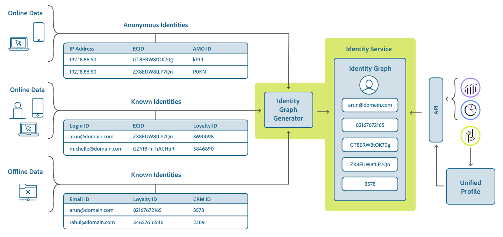

# Présentation du  d&#39;identité 

Les d&#39;identité  sont un composant du service [d&#39;](./home.md) identité qui sert d&#39;indicateur du contexte auquel une identité se rapporte. Par exemple, ils distinguent une valeur de &quot;name@email.com&quot; comme adresse électronique ou &quot;443522&quot; comme identifiant CRM numérique.

## Prise en main

L’utilisation des  d’identité  nécessite une compréhension des différents services Adobe Experience Platform impliqués. Avant de commencer à travailler avec  , veuillez consulter la documentation des services suivants :

- du client en temps réel : Fournit un client unifié en temps réel basé sur des données agrégées provenant de plusieurs sources.
- [Service](./home.md)d&#39;identité : Obtenez un meilleur des clients individuels et de leur comportement en rapprochant les identités entre les périphériques et les systèmes.
- [Privacy Service](../privacy-service/home.md): Les d&#39;identité   sont utilisés pour se conformer au Règlement général sur la protection des données (RDMD), où les demandes de RDMD peuvent être faites par rapport à un de .

## Compréhension des  d&#39;identité 

Une identité pleinement qualifiée comprend une valeur d’ID et un  . Lors de la correspondance des données d’enregistrement entre des fragments de  de, comme lorsque le du client en temps réel fusionne des données de l’, la valeur d’identité et le de l’doivent correspondre.

Par exemple, deux fragments de  de peuvent contenir des identifiants principaux différents mais ils partagent la même valeur pour le de  &quot;E-mail&quot;. Par conséquent, Platform peut voir que ces fragments sont en fait la même personne et rassembler les données dans le graphique d’identité de l’individu.

### Types d’identité

Les données peuvent être identifiées par différents types d’identité. Le type d&#39;identité est spécifié au moment de la création du  d&#39;identité et contrôle si les données sont conservées ou non sur le graphique d&#39;identité et toute instruction spéciale concernant la manière dont ces données doivent être traitées.

Les types d’identité suivants sont disponibles dans Platform :

| Type d’identité | Description |
| --- | --- |
| Cookie | Ces identités sont essentielles à l&#39;expansion et constituent la majorité du graphique d&#39;identité. Cependant, par nature, ils se désintègrent rapidement et perdent de leur valeur au fil du temps. La suppression des cookies est traitée spécialement dans le graphique d’identité. |
| Multipériphérique | Cela indique que le service d’identité doit considérer qu’il s’agit d’un identifiant de personne fort et le conserver pour toujours. Par exemple, un ID de connexion, un ID de gestion de la relation client, un ID de fidélité, etc. |
| Device | Inclut les identifiants IDFA, GAID et autres identifiants IOT. Ceux-ci peuvent être partagés par les ménages. |
| Courriel | Les identités de ce type incluent des informations d’identification personnelle (PII). Il s’agit d’une indication au service d’identité pour qu’il gère la valeur de manière sensible. |
| Mobile | Les identités de ce type incluent les informations d’identification personnelle. Il s’agit d’une indication au service d’identité pour qu’il gère la valeur de manière sensible. |
| Non-personnes | Utilisé pour stocker des identifiants qui ont besoin de  , mais qui ne sont pas liés à une grappe de personnes. Ces identifiants sont ensuite filtrés à partir du graphique d’identité. Les cas d’utilisation possibles incluent les données relatives aux produits, aux organisations, aux magasins, etc. (Par exemple, un SKU de produit.) |
| Téléphone | Les identités de ce type incluent les informations d’identification personnelle. Ceci indique au service d’identité de gérer la valeur de manière sensible. |

###  standard 

Adobe Experience Platform fournit plusieurs  d’identité  disponibles pour toutes les organisations. Elles sont connues sous le nom de  Standard et sont visibles à l’aide de l’API Identity Service ou via l’interface utilisateur de la plateforme.

Pour  Standard   l’interface utilisateur, cliquez sur **Identités** dans le rail de gauche, puis cliquez sur l’onglet *Parcourir* . Tous les d’identité  accessibles à votre organisation seront affichés. Toutefois, ceux dont le &quot;propriétaire&quot; correspond à &quot;Standard&quot; sont les de  Standard fournis par Adobe.

Vous pouvez ensuite cliquer sur l&#39;un des   de la liste pour les détails de l&#39;.

## Gestion   de pour votre organisation

Selon les données de votre organisation et les cas d’utilisation, vous pouvez avoir besoin d’  personnalisés.

Elles sont visibles dans l’interface utilisateur, car elles  les  avec &quot;Personnalisé&quot; comme &quot;Propriétaire&quot;. Les  de  personnalisées peuvent être créées à l’aide de l’API Identity Service ou de l’interface utilisateur.

Pour créer un  personnalisé  à l’aide de l’interface utilisateur, cliquez sur **Créer un** d’identité, puis complétez la boîte de dialogue et cliquez sur **Créer**.

 les  que vous définissez sont propres à votre organisation et nécessitent un &quot;symbole d’identité&quot; unique (ou &quot;code&quot; si vous utilisez l’API) pour être créé avec succès.

Comme pour le  standard, vous pouvez cliquer sur un de  personnalisé à partir de l’onglet *Parcourir* pour enles détails. Toutefois, avec un de personnalisé, vous pouvez également modifier son nom d’affichage et sa description dans la zone de détails.

>[!NOTE] Une fois qu’un   a été créé, il ne peut plus être supprimé et ses &quot;Symbole d’identité&quot; (ou &quot;code&quot; dans l’API) et &quot;Type&quot; ne peuvent plus être modifiés.

##  de  dans les données d&#39;identité

La fourniture de l&#39;  pour une identité dépend de la méthode que vous utilisez pour fournir les données d&#39;identité. Pour plus d&#39;informations sur la fourniture de données d&#39;identité, reportez-vous à la section relative à la [fourniture de données](./home.md#supplying-identity-data-to-identity-service) d&#39;identité dans la présentation du service d&#39;identité.
