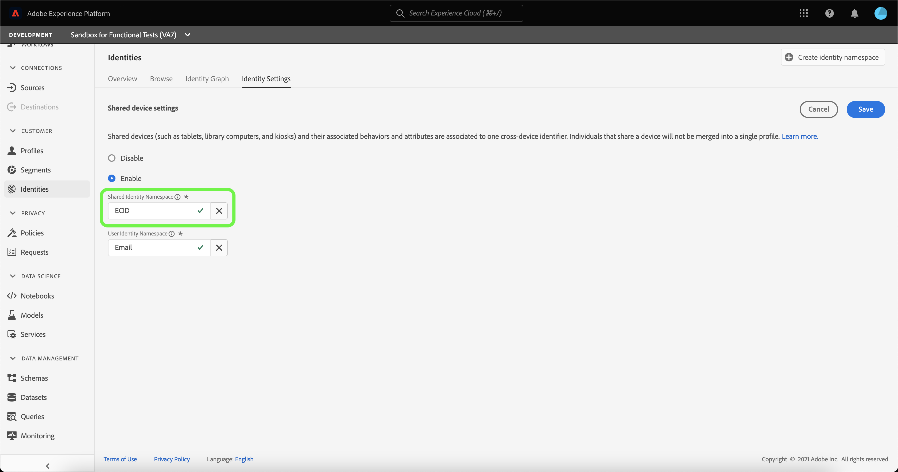
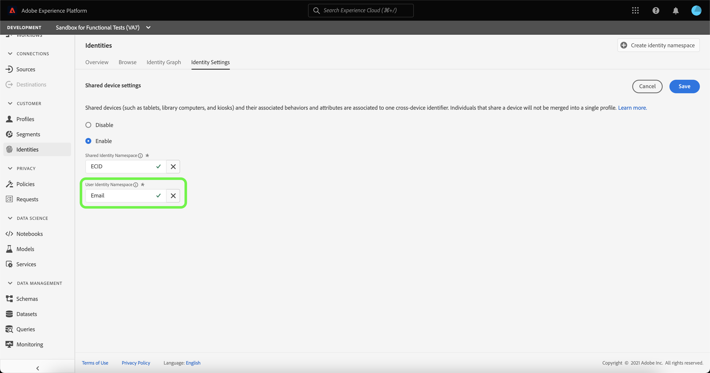

# Présentation de la détection des périphériques partagés (Beta)

>[!IMPORTANT]
>
>La fonctionnalité [!DNL Shared Device Detection] est en version bêta. Les fonctionnalités et la documentation peuvent faire l’objet de changements.

Adobe Experience Platform [!DNL Identity Service] vous permet de mieux connaître vos clients et leurs comportements, en établissant un lien entre les identités des différents appareils et systèmes, ce qui vous permet de proposer des expériences digitales personnelles et percutantes en temps réel.

[!DNL Shared Device] fait référence aux appareils utilisés par plusieurs individus. Les tablettes, les ordinateurs de bibliothèque et les kiosques sont des exemples d’appareils partagés. Grâce à la fonction [!DNL Shared Device Detection], il est possible d’empêcher la fusion de différents utilisateurs d’un même appareil en une seule identité, ce qui permet une représentation plus précise d’un individu.

Avec [!DNL Shared Device Detection], vous pouvez :

* créer des graphiques d’identités distincts pour différents utilisateurs d’un même appareil ;
* empêcher le mélange de données provenant de différentes personnes utilisant le même appareil ;
* Générer une vue plus propre et plus précise de vos clients.

>[!TIP]
>
>Les configurations de [!DNL Shared Device Detection] doivent être terminées avant d’activer Profile pour le jeu de données, car vous ne pouvez plus modifier les paramètres une fois les graphiques générés dans [!DNL Identity Service].

## Prise en main de [!DNL Shared Device Detection]

L’utilisation de [!DNL Shared Device Detection] nécessite une compréhension des différents services Platform impliqués. Avant de commencer à travailler avec [!DNL Shared Device Detection], veuillez consulter la documentation relative aux services suivants :

* [[!DNL Identity Service]](./home.md) : profitez d’une meilleure vue d’ensemble des clients et de leur comportement en rapprochant des identités entre appareils et systèmes.
   * [Visionneuse de graphique d’identités](./features/identity-graph-viewer.md) : visualisez et interagissez avec la visionneuse de graphique d’identités pour mieux comprendre comment les identités de client sont regroupées et de quelles façons.
   * [Espaces de noms d’identité](./features/namespaces.md) : découvrez les composants d’une identité complète et la manière dont les espaces de noms d’identité vous permettent de distinguer le contexte et le type d’une identité.

## Comprendre [!DNL Shared Device Detection]

Il est important de comprendre la terminologie suivante lorsque vous utilisez
[!DNL Shared Device Detection]. Consultez le tableau ci-dessous pour obtenir la liste des termes essentiels à la compréhension de [!DNL Shared Device Detection].

### Terminologie

| Termes | Définition |
| --- | --- |
| Appareil partagé | Un appareil partagé est un appareil utilisé par plusieurs individus. Les tablettes, les ordinateurs de bibliothèque et les kiosques sont des exemples de périphériques partagés. |
| [!DNL Shared Device Detection] | [!DNL Shared Device Detection] fait référence à un paramètre de configuration qui permet de séparer les données de différents utilisateurs d’un même appareil les uns des autres. |
| Espace de noms d’identité partagé | L’espace de noms d’identité partagée représente l’appareil qui peut être utilisé par plusieurs utilisateurs. L’espace de noms d’identité partagée est généralement l’ECID, mais il peut être défini sur d’autres identifiants d’appareil. |
| Espace de noms d’identité de l’utilisateur | L’espace de noms d’identité de l’utilisateur représente l’utilisateur authentifié (connecté) d’un appareil partagé. |
| Dernier utilisateur authentifié | Le dernier utilisateur authentifié représente l’utilisateur qui a été connecté pour la dernière fois à un appareil, si un appareil est connecté par plusieurs comptes. |

{style="table-layout:auto"}

[!DNL Shared Device Detection] fonctionne en établissant deux espaces de noms : **Espace de noms d’identité partagée** et **espace de noms d’identité utilisateur**.

* L’espace de noms d’identité partagée représente l’appareil qui peut être utilisé par plusieurs utilisateurs. Adobe recommande aux clients d’utiliser ECID comme identifiant d’appareil partagé.
* L’espace de noms d’identité de l’utilisateur est mappé à l’espace de noms d’identité qui correspond à l’identifiant de connexion d’un utilisateur. Il peut s’agir du CRMID, de l’adresse électronique, du courrier électronique haché ou du numéro de téléphone d’un utilisateur.

Un appareil partagé, comme une tablette, possède un seul **espace de noms d’identité partagée**. D’un autre côté, chaque utilisateur d’un appareil partagé a son propre **espace de noms d’identité utilisateur** désigné qui correspond à ses identifiants de connexion respectifs. Par exemple, une tablette que Kevin et Nora partagent pour l’utilisation du commerce électronique possède son propre ECID de `1234`, tandis que Kevin possède son propre espace de noms d’identité utilisateur qui est mappé à son compte `kevin@email.com` et Nora son propre espace de noms d’identité utilisateur mappé à son compte `nora@email.com`.

[!DNL Shared Device Detection] peut faire des distinctions entre plusieurs utilisateurs du même appareil en liant l’espace de noms d’identité partagé (par exemple ECID) avec l’espace de noms d’identité du dernier utilisateur authentifié (identifiant de connexion).

### Envoi des données d’identité à un graphique d’identités

Examinez l’exemple suivant pour mieux comprendre le fonctionnement de [!DNL Shared Device Detection] :

>[!NOTE]
>
>Dans ce diagramme, l’espace de noms d’identité partagée est configuré sur ECID et l’espace de noms d’identité utilisateur est configuré sur CRMID.

* Kevin et Nora partagent une tablette pour visiter un site de commerce électronique. Cependant, ils disposent tous deux de leurs propres comptes indépendants qu&#39;ils utilisent chacun pour naviguer et faire des achats en ligne ;
   * En tant qu’appareil partagé, la tablette dispose d’un ECID correspondant, qui représente l’ID de cookie du navigateur web de la tablette ;
* Supposons que Kevin utilise la tablette et **se connecte à son compte de commerce électronique pour rechercher des écouteurs. Cela signifie alors que le CRMID de Kevin (** User Identity Namespace **) est maintenant lié à l’ECID de la tablette (** Shared Identity Namespace **).** Les données de navigation de la tablette sont maintenant intégrées au graphique d&#39;identités de Kevin.
   * Si Kevin **se déconnecte** et que Nora utilise la tablette et **se connecte à** sur son propre compte et achète une caméra, son CRMID est maintenant lié à l’ECID de la tablette. Par conséquent, les données de navigation de la tablette sont désormais intégrées au graphique d’identités de Nora.
   * Si Nora **ne se déconnecte pas** et que Kevin utilise la tablette, mais **ne se connecte pas**, les données de navigation de la tablette sont toujours intégrées à Nora, car elle reste en tant qu’utilisateur authentifié et son CRMID est toujours lié à l’ECID de la tablette.
   * Si Nora **se déconnecte** et que Kevin utilise la tablette, mais **ne se connecte pas**, les données de navigation de la tablette sont toujours intégrées au graphique d’identités de Nora, car en tant que **dernier utilisateur authentifié**, son CRMID reste lié à l’ECID de la tablette.
   * Si Kevin **se connecte à nouveau à**, son CRMID est maintenant associé à l’ECID de la tablette, car il est désormais le dernier utilisateur authentifié et les données de navigation de la tablette sont désormais intégrées à son graphique d’identités.

### Comment [!DNL Profile Service] fusionne les fragments de profil avec [!DNL Shared Device Detection] activé

[!DNL Profile Service] prend note des fragments de profil et des profils fusionnés. Chaque profil client est composé de plusieurs fragments de profil qui ont été fusionnés dans le but de former une vue unique pour ce client. Par exemple, si un client interagit avec votre marque sur plusieurs canaux, votre organisation dispose de plusieurs fragments de profil associés à ce client unique apparaissant dans plusieurs jeux de données. Lorsque ces fragments sont ingérés dans Platform, ils sont fusionnés afin de créer un profil unique pour ce client.

Lorsque [!DNL Shared Device Detection] est activé, [!DNL Profile] définit l’identité principale du fragment de profil selon que l’événement d’expérience est authentifié ou non.

Un **événement d’expérience authentifié** est une action effectuée par un utilisateur lorsqu’il est connecté à un appareil. Pour les événements d’expérience authentifiés, l’identité principale est l’**espace de noms d’identité utilisateur** (ID de connexion). Un **événement d’expérience non authentifié** est une action effectuée par un utilisateur qui n’est pas connecté à un appareil. Pour les événements d’expérience non authentifiés, l’identité principale est l’ **espace de noms d’identité partagée** (ECID).

Pour plus d’informations, consultez la [[!DNL Real-Time Customer Profile] présentation](../profile/home.md).

## Interface utilisateur des périphériques partagés

Dans l’interface utilisateur de Platform, sélectionnez **[!UICONTROL Identités]** dans le volet de navigation de gauche, puis sélectionnez **[!UICONTROL Paramètres d’identité]**.

La page [!UICONTROL  Paramètres d’appareil partagé ] s’affiche, vous fournissant une interface pour configurer les paramètres d’appareil partagé pour vos données. Les paramètres des appareils partagés sont désactivés par défaut.

Lorsqu’ils sont activés, les paramètres d’appareil partagé permettent de séparer les données de différents utilisateurs d’un même appareil les uns des autres. Ce paramètre de configuration permet une représentation plus précise et plus précise des graphiques d’identités, où les identités utilisateur du même appareil ne sont pas combinées.

Sélectionnez **[!UICONTROL Activer]** pour commencer à modifier les paramètres de votre appareil partagé.

Les options de configuration [!UICONTROL  Espace de noms d’identité partagée ] et [!UICONTROL  Espace de noms d’identité utilisateur ] s’affichent, ce qui vous permet de modifier les espaces de noms d’identité que vous souhaitez utiliser.

[!UICONTROL Shared Identity Namespace] représente un appareil unique utilisé par plusieurs utilisateurs différents. Cet espace de noms est toujours défini sur **[!UICONTROL ECID]**, car tous les utilisateurs de Platform utilisent **[!UICONTROL ECID]** comme identifiant du navigateur web.

L’ [!UICONTROL  espace de noms d’identité utilisateur] vous permet d’identifier différents utilisateurs du même appareil et d’empêcher la combinaison des données dans le même graphique d’identités.

Sélectionnez la barre de recherche **[!UICONTROL Espace de noms d’identité utilisateur]** et saisissez un espace de noms d’identité ou sélectionnez un espace de noms d’identité dans le menu déroulant.

>[!TIP]
>
>L’ [!UICONTROL  espace de noms d’identité utilisateur] doit être mappé à l’espace de noms d’identité qui correspond à l’identifiant de connexion de l’utilisateur final. Les options incluent l’ID de client, le courrier électronique et le courrier électronique haché.

Une fois que vous avez configuré les [!UICONTROL  {Shared Device Settings], sélectionnez **[!UICONTROL Save]**.

Une fenêtre contextuelle s’affiche, vous invitant à confirmer votre sélection. Sélectionnez **[!UICONTROL Oui]** pour terminer le paramètre de configuration.

