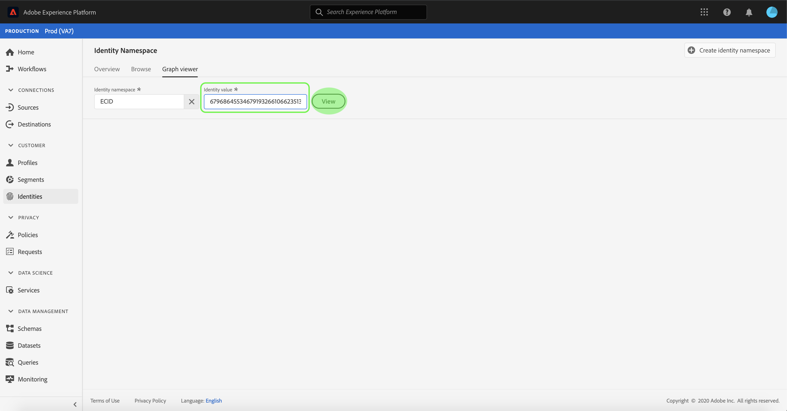

# Présentation du lecteur de graphique d’identité

Un graphique d&#39;identité est une carte des relations entre différentes identités pour un client particulier, qui vous permet de visualiser comment votre client interagit avec votre marque sur différents canaux. Tous les graphiques d&#39;identité des clients sont gérés et mis à jour collectivement par Adobe Experience Platform Identity Service en temps quasi réel, en réponse à l&#39;activité des clients.

La visionneuse de graphiques d’identité de l’interface utilisateur de la plate-forme vous permet de visualiser et de mieux comprendre les identités des clients qui sont assemblées, et de quelles manières. Le lecteur de contenu vous permet de faire glisser et d’interagir différentes parties du graphique, ce qui vous permet d’examiner les relations d’identité complexes, de déboguer plus efficacement et de bénéficier d’une transparence accrue dans la manière dont les informations sont utilisées.

## Tutoriel vidéo

La vidéo suivante est destinée à vous aider à comprendre le lecteur de graphique d&#39;identité.

>[!VIDEO](https://video.tv.adobe.com/v/331030/?quality=12&learn=on)

## Prise en main

L’utilisation du lecteur de graphique d’identité nécessite une compréhension des différents services Adobe Experience Platform impliqués. Avant de commencer à travailler avec la visionneuse de graphiques d&#39;identité, consultez la documentation relative aux services suivants :

- [[!DNL Identity Service]](../home.md) : profitez d’une meilleure compréhension de vos clients et de leurs comportements en rapprochant des identités entre appareils et systèmes.

### Terminologie

- **Identité (noeud) :** Une identité ou un noeud est des données propres à une entité, généralement une personne. Une identité comprend un espace de nommage et une valeur d&#39;identité.
- **Lien (arête) :** Un lien ou un bord représente la connexion entre les identités.
- **Graphique (grappe) :** Un graphique ou une grappe est un groupe d’identités et de liens qui représentent une personne.

## Accès au lecteur de graphique d&#39;identité

Pour utiliser la visionneuse de graphiques d&#39;identité dans l&#39;interface utilisateur, sélectionnez **[!UICONTROL Identités]** dans le volet de navigation de gauche, puis sélectionnez l&#39;onglet **[!UICONTROL Graphique d&#39;identité]**. Dans l&#39;écran **[!UICONTROL Espace de nommage d&#39;identité]**, cliquez sur l&#39;icône **[!UICONTROL Sélectionner l&#39;espace de nommage d&#39;identité]** pour rechercher l&#39;espace de nommage que vous avez l&#39;intention d&#39;utiliser.

Le panneau **[!UICONTROL Sélectionner l&#39;espace de nommage d&#39;identité]** s&#39;affiche. Cet écran contient une liste d&#39;espaces de nommage disponibles pour votre organisation, y compris des informations sur un espace de nommage **[!UICONTROL Nom d&#39;affichage]**, **[!UICONTROL Symbole d&#39;identité]**, **[!UICONTROL Propriétaire]**, **[!UICONTROL Dernière mise à jour]** date et **[!UICONTROL Description]**. Vous pouvez utiliser n’importe quel espace de nommage fourni tant que vous disposez d’une valeur d’identité valide qui lui est connectée.

Sélectionnez l’espace de nommage que vous souhaitez utiliser et cliquez sur **[!UICONTROL Sélectionner]** pour continuer.

Une fois que vous avez sélectionné un espace de nommage, saisissez sa valeur correspondante pour un client particulier dans la zone de texte **[!UICONTROL Valeur d’identité]** et sélectionnez **[!UICONTROL Vue]**.

### Accès à la visionneuse de graphiques d&#39;identité à partir de jeux de données

Vous pouvez également accéder à la visionneuse de graphiques d’identité à l’aide de l’interface des jeux de données. Dans la page Jeu de données [!UICONTROL Parcourir], sélectionnez un jeu de données avec lequel interagir, puis **[!UICONTROL Jeu de données de Prévisualisation]**.

Dans la fenêtre prévisualisation, sélectionnez une icône d&#39;empreinte digitale pour afficher les identités représentées par le biais de la visionneuse de graphiques d&#39;identité.

>[!TIP]
>
>L’icône d’empreinte n’apparaît que si le jeu de données possède plusieurs identités.

La visionneuse de graphiques d&#39;identité s&#39;affiche. Sur le côté gauche de l&#39;écran se trouve le graphique d&#39;identité qui affiche toutes les identités liées à l&#39;espace de nommage sélectionné et la valeur d&#39;identité saisie. Chaque noeud d’identité est constitué d’un espace de nommage et de sa valeur d’ID correspondante. Vous pouvez sélectionner et conserver toute identité pour faire glisser et interagir avec le graphique. Vous pouvez également placer le pointeur de la souris sur une identité pour afficher des informations sur sa valeur d’identifiant. La sortie du graphique s’affiche également sous la forme d’une liste déposée au centre de l’écran.

>[!IMPORTANT]
>
>Un graphique d’identité requiert au moins deux identités liées à générer, ainsi qu’une paire d’espaces de nommage et d’identifiants valide. Le nombre maximal d’identités pouvant être affichées par la visionneuse de graphiques est de 150. Voir la section [annexe](#appendix) ci-dessous pour plus d’informations.

Sélectionnez une identité pour mettre à jour la ligne mise en surbrillance sur la table **[!UICONTROL Identités]** et pour mettre à jour les informations fournies sur le rail de droite, qui comprend la **[!UICONTROL Valeur]** d&#39;une identité, **[!UICONTROL ID du lot]** et sa **[!UICONTROL Date de la dernière mise à jour]**.

Vous pouvez filtrer un graphique et isoler un espace de nommage spécifique à l’aide de l’option de tri située au-dessus du tableau **[!UICONTROL Identités]**. Dans le menu déroulant, sélectionnez l’espace de nommage à mettre en surbrillance.

La visionneuse de graphiques renvoie l’espace de nommage sélectionné en surbrillance. L&#39;option de filtre met également à jour la table **[!UICONTROL Identités]** afin de renvoyer des informations uniquement pour l&#39;espace de nommage sélectionné.

Le coin supérieur droit de la zone de visualisation des graphiques contient des options de zoom. Sélectionnez l’icône **(+)** pour effectuer un zoom avant sur le graphique ou l’icône **(-)** pour effectuer un zoom arrière.

Vous pouvez vue plus d’informations sur les lots en sélectionnant la **[!UICONTROL source de données]** dans l’en-tête. Le tableau **[!UICONTROL Source de données]** affiche une liste **[!UICONTROL ID de lot]** associée au graphique, ainsi que ses **[!UICONTROL ID liés]**, le schéma source et la date d&#39;assimilation.

Vous pouvez sélectionner n’importe quel lien dans un graphique d’identité pour afficher tous les lots source qui ont contribué au lien.

Vous pouvez également sélectionner un lot pour afficher tous les liens auxquels ce lot a contribué.

Les graphiques d’identité avec de plus grands groupes d’identités sont également accessibles par le biais de la visionneuse de graphiques d’identité.

## Annexe

La section suivante fournit des informations supplémentaires sur l’utilisation de la visionneuse de graphiques d’identité.

### Présentation des messages d&#39;erreur

Des erreurs peuvent se produire lors de l&#39;accès à la visionneuse de graphiques d&#39;identité. Voici une liste de conditions préalables et de limites à prendre en compte lors de l’utilisation de la visionneuse de graphiques d’identité.

- Une valeur d&#39;identité doit exister dans l&#39;espace de nommage sélectionné.
- Le lecteur de graphique d&#39;identité requiert au moins deux identités liées à générer. Il est possible qu’il n’y ait qu’une seule valeur d’identité et aucune identité liée, et dans ce cas, la valeur n’existerait que dans le lecteur [!DNL Profile].
- La visionneuse de graphiques d’identité ne peut pas dépasser 150 identités au maximum.

## Étapes suivantes

En lisant ce document, vous avez appris à explorer les graphiques d’identité de vos clients dans l’interface utilisateur de la plate-forme. Pour plus d&#39;informations sur les identités dans Platform, consultez la [Présentation du service d&#39;identité](../home.md).

## Journal des modifications

| Date | Action |
| ---- | ------ |
| 2021-01 | <ul><li>Prise en charge Ajoutée de la diffusion en flux continu des données imbriquées et du sandbox hors production.</li><li>Correction de bogues mineurs.</li></ul> |
| 2021-02 | <ul><li>Le lecteur de graphique d’identité est rendu accessible par le biais de la prévisualisation de jeux de données.</li><li>Correction de bogues mineurs.</li><li>Le lecteur de graphique d’identité est rendu disponible en général.</li></ul> |
