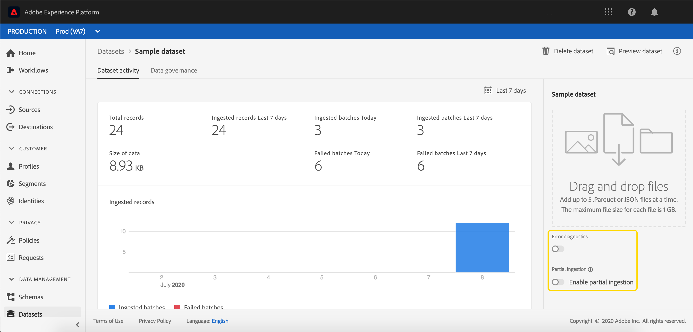

# Ingestion par lots partielle

L’ingestion par lots partielle permet d’ingérer des données contenant des erreurs jusqu’à un certain seuil. Grâce à cette fonctionnalité, les utilisateurs peuvent ingérer toutes leurs données correctes dans Adobe Experience Platform, alors que toutes leurs données incorrectes sont traitées par lots séparément, avec des détails sur les raisons de leur non-validité.

Ce document fournit un tutoriel pour la gestion de l’ingestion par lots partielle.

## Prise en main

Ce tutoriel nécessite une connaissance pratique des différents services Adobe Experience Platform impliqués dans l’ingestion par lots partielle. Avant de commencer ce tutoriel, veuillez consulter la documentation relative aux services suivants :

- [Ingestion par lots](./overview.md) : méthode qui [!DNL Platform] ingère et stocke des données de fichiers de données, tels que CSV et Parquet.
- [[!DNL Experience Data Model (XDM)]](../../xdm/home.md) : cadre normalisé selon lequel [!DNL Platform] organise les données de l’expérience client.

Les sections suivantes contiennent des informations supplémentaires nécessaires pour passer des appels à des API [!DNL Platform].

### Lecture d’exemples d’appels API

Ce guide fournit des exemples d’appels API pour démontrer comment formater vos requêtes. Il s’agit notamment de chemins d’accès, d’en-têtes requis et de payloads de requêtes correctement formatés. L’exemple JSON renvoyé dans les réponses de l’API est également fourni. Pour plus d’informations sur les conventions utilisées dans la documentation pour les exemples d’appels d’API, voir la section concernant la [lecture d’exemples d’appels d’API](../../landing/troubleshooting.md#how-do-i-format-an-api-request) dans le guide de dépannage [!DNL Experience Platform].

### Collecte des valeurs des en-têtes requis

Pour lancer des appels aux API [!DNL Platform], vous devez d’abord suivre le [tutoriel d’authentification](https://experienceleague.adobe.com/docs/experience-platform/landing/platform-apis/api-authentication.html?lang=fr). Le tutoriel d’authentification fournit les valeurs de chacun des en-têtes requis dans tous les appels d’API [!DNL Experience Platform], comme indiqué ci-dessous :

- Authorization: Bearer `{ACCESS_TOKEN}`
- x-api-key : `{API_KEY}`
- x-gw-ims-org-id : `{ORG_ID}`

Dans [!DNL Experience Platform], toutes les ressources sont isolées dans des sandbox virtuels spécifiques. Toutes les requêtes envoyées aux API [!DNL Platform] nécessitent un en-tête spécifiant le nom du sandbox dans lequel l’opération sera effectuée :

- x-sandbox-name : `{SANDBOX_NAME}`

>[!NOTE]
>
>Pour plus d’informations sur les sandbox dans [!DNL Platform], consultez la [documentation de présentation des sandbox](../../sandboxes/home.md).

## Activation d’un lot pour l’ingestion par lots partielle dans l’API {#enable-api}

>[!NOTE]
>
>Cette section décrit l’activation d’un lot pour l’ingestion par lots partielle à l’aide de l’API. Pour plus d’informations sur l’utilisation de l’interface utilisateur, veuillez lire l’étape [Activation d’un lot pour l’ingestion par lots partielle dans l’interface utilisateur](#enable-ui) .

Vous pouvez créer un nouveau lot avec l’ingestion partielle activée.

Pour créer un nouveau lot, suivez les étapes du [guide de développement de l’ingestion par lots](./api-overview.md). Une fois que vous avez atteint l’étape **[!UICONTROL Créer un lot]**, ajoutez le champ suivant dans le corps de la requête :

```json
{
    "enableErrorDiagnostics": true,
    "partialIngestionPercent": 5
}
```

| Propriété | Description |
| -------- | ----------- |
| `enableErrorDiagnostics` | Indicateur qui permet à [!DNL Platform] de générer des messages d’erreur détaillés sur votre lot. |
| `partialIngestionPercent` | Le pourcentage d’erreurs acceptables avant l’échec de l’ensemble du lot. Ainsi, dans cet exemple, un maximum de 5 % du lot peut être des erreurs, avant l’échec. |


## Activation d’un lot pour l’ingestion par lots partielle dans l’interface utilisateur {#enable-ui}

>[!NOTE]
>
>Cette section décrit l’activation d’un lot pour l’ingestion par lots partielle à l’aide de l’interface utilisateur. Si vous avez déjà activé un lot pour l’ingestion par lots partielle à l’aide de l’API, vous pouvez passer à la section suivante.

Pour activer un lot pour l’ingestion partielle par le biais de l’interface utilisateur [!DNL Platform], vous pouvez créer un nouveau lot par le biais des connexions source, créer un nouveau lot dans un jeu de données existant ou créer un nouveau lot par le biais de l’option &quot;[!UICONTROL Mapper CSV au flux XDM]&quot;.

### Création d’une connexion source {#new-source}

Pour créer une connexion source, suivez les étapes répertoriées dans la [Présentation des sources](../../sources/home.md). Une fois que vous avez atteint l’étape **[!UICONTROL Détails du flux de données]**, prenez note des champs **[!UICONTROL Ingestion partielle]** et **[!UICONTROL Diagnostic d’erreur]**.


Le bouton **[!UICONTROL Ingestion partielle]** vous permet d’activer ou de désactiver l’utilisation de l’ingestion par lots partielle.

Le bouton **[!UICONTROL Diagnostic d’erreur]** s’affiche uniquement lorsque le bouton **[!UICONTROL Ingestion partielle]** est désactivé. Cette fonctionnalité permet à [!DNL Platform] de générer des messages d’erreur détaillés sur vos lots ingérés. Si le bouton d’activation **[!UICONTROL Ingestion partielle]** est activé, des diagnostics d’erreur améliorés sont automatiquement appliqués.


Le **[!UICONTROL seuil d’erreur]** vous permet de définir le pourcentage d’erreurs acceptables avant le rejet de l’ensemble du lot. Par défaut, cette valeur est définie sur 5 %.

### Utiliser un jeu de données existant {#existing-dataset}

Pour utiliser un jeu de données existant, commencez par sélectionner un jeu de données. La barre latérale droite contient des informations sur le jeu de données.



Le bouton **[!UICONTROL Ingestion partielle]** vous permet d’activer ou de désactiver l’utilisation de l’ingestion par lots partielle.

Le bouton **[!UICONTROL Diagnostic d’erreur]** s’affiche uniquement lorsque le bouton **[!UICONTROL Ingestion partielle]** est désactivé. Cette fonctionnalité permet à [!DNL Platform] de générer des messages d’erreur détaillés sur vos lots ingérés. Si le bouton d’activation **[!UICONTROL Ingestion partielle]** est activé, des diagnostics d’erreur améliorés sont automatiquement appliqués.


Le **[!UICONTROL seuil d’erreur]** vous permet de définir le pourcentage d’erreurs acceptables avant le rejet de l’ensemble du lot. Par défaut, cette valeur est définie sur 5 %.

Vous pouvez désormais charger des données à l’aide du bouton **Ajouter des données** et elles seront ingérées à l’aide de l’ingestion partielle.

### Utilisation du flux &quot;[!UICONTROL Mapper CSV au schéma XDM]&quot; {#map-flow}

Pour utiliser le flux &quot;[!UICONTROL Mapper CSV au schéma XDM]&quot;, suivez les étapes répertoriées dans le [tutoriel Mappage d’un fichier CSV](../tutorials/map-csv/overview.md)&quot;. Une fois que vous avez atteint l’étape **[!UICONTROL Ajouter des données]**, prenez note des champs **[!UICONTROL Ingestion partielle]** et **[!UICONTROL Diagnostic d’erreur]** .


Le bouton **[!UICONTROL Ingestion partielle]** vous permet d’activer ou de désactiver l’utilisation de l’ingestion par lots partielle.

Le bouton **[!UICONTROL Diagnostic d’erreur]** s’affiche uniquement lorsque le bouton **[!UICONTROL Ingestion partielle]** est désactivé. Cette fonctionnalité permet à [!DNL Platform] de générer des messages d’erreur détaillés sur vos lots ingérés. Si le bouton d’activation **[!UICONTROL Ingestion partielle]** est activé, des diagnostics d’erreur améliorés sont automatiquement appliqués.


**[!UICONTROL Seuil d’erreurs]** vous permet de définir le pourcentage d’erreurs acceptables avant l’échec de l’ensemble du lot. Par défaut, cette valeur est définie sur 5 %.

## Étapes suivantes {#next-steps}

Ce tutoriel explique comment créer ou modifier un jeu de données pour activer l’ingestion par lots partielle. Pour plus d’informations sur l’ingestion par lots, consultez le [guide de développement de l’ingestion par lots](./api-overview.md).

Pour plus d’informations sur la surveillance des erreurs d’ingestion partielle, consultez le [guide de diagnostic des erreurs d’ingestion par lots](../quality/error-diagnostics.md).
