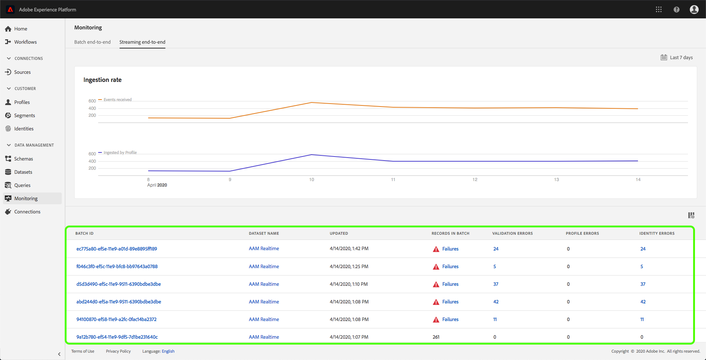
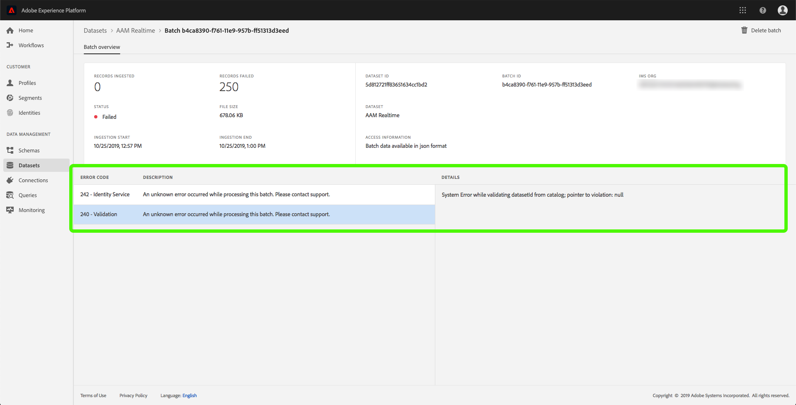

# Analyse de l&#39;assimilation des données

L’assimilation de données vous permet d’assimiler vos données à Adobe Experience Platform. Vous pouvez utiliser l’assimilation par lot, qui vous permet d’insérer vos données à l’aide de différents types de fichiers (tels que les fichiers CSV), ou l’assimilation en flux continu, qui vous permet d’assimiler vos données à la plateforme à l’aide de points de fin de diffusion en temps réel.

Ce guide d’utilisation décrit la procédure à suivre pour surveiller vos données dans l’interface utilisateur d’Adobe Experience Platform. Ce guide nécessite que vous disposiez d’un ID Adobe et que vous ayez accès à Adobe Experience Platform.

## Surveiller l’assimilation des données de bout en bout en flux continu

Dans l’interface utilisateur [de la plateforme](https://platform.adobe.com)d’expérience, cliquez sur **Surveillance** dans le menu de navigation de gauche, puis cliquez sur **Diffusion en flux continu de bout en bout**.

La page de surveillance *en flux continu de bout en bout* s’affiche. Cet espace de travail fournit un graphique qui affiche le taux de messages en flux continu, ainsi qu’un détaillé des données entrantes.

Par défaut, le graphique indique le taux d’ingestion au cours des sept derniers jours. Vous pouvez ajuster cette plage de dates pour afficher diverses périodes en cliquant sur le bouton en surbrillance.

Sous le graphique se trouve un  de tous les enregistrements d’assimilation en flux continu qui correspondent à la plage de dates affichée ci-dessus. Chaque lot répertorié affiche son ID, le nom du jeu de données, la date de sa dernière mise à jour, le nombre d’enregistrements du lot, ainsi que le nombre d’erreurs (le cas échéant). Vous pouvez cliquer sur l’un des enregistrements pour obtenir des informations plus détaillées sur cet enregistrement.

### Affichage des enregistrements en flux continu

Lors de l’affichage des détails d’un enregistrement en flux continu réussi, des informations telles que le nombre d’enregistrements ingérés, la taille du fichier, les  d’importation et les heures de fin s’affichent.

Les détails d’un enregistrement en flux continu en échec affichent les mêmes informations qu’un enregistrement réussi.

En outre, les enregistrements en échec fournissent des détails sur les erreurs survenues lors du traitement du lot. Dans l’exemple ci-dessous, une erreur système s’est produite lors de la validation de datasetId à partir du catalogue.

## Surveiller l&#39;assimilation des données de bout en bout par lot

Dans l’interface utilisateur [de la plateforme](https://platform.adobe.com)d’expérience, cliquez sur **Surveillance** dans le menu de navigation de gauche.

La page de surveillance de bout en bout **du** lot s’affiche, affichant un  des lots précédemment assimilés. Vous pouvez cliquer sur l’un des lots pour obtenir des informations plus détaillées sur cet enregistrement.

### Affichage des lots

Lors de l’affichage des détails d’un lot réussi, des informations telles que le nombre d’enregistrements ingérés, la taille du fichier, les  d’importation et les heures de fin s’affichent.

Les détails d’un lot en échec affichent les mêmes informations qu’un lot réussi, avec l’ajout du nombre d’enregistrements ayant échoué.

En outre, les lots en échec fournissent des détails sur les erreurs survenues lors du traitement du lot. Dans l&#39;exemple ci-dessous, une erreur s&#39;est produite avec le lot assimilé, car il a utilisé un champ inconnu de `_experience`.

